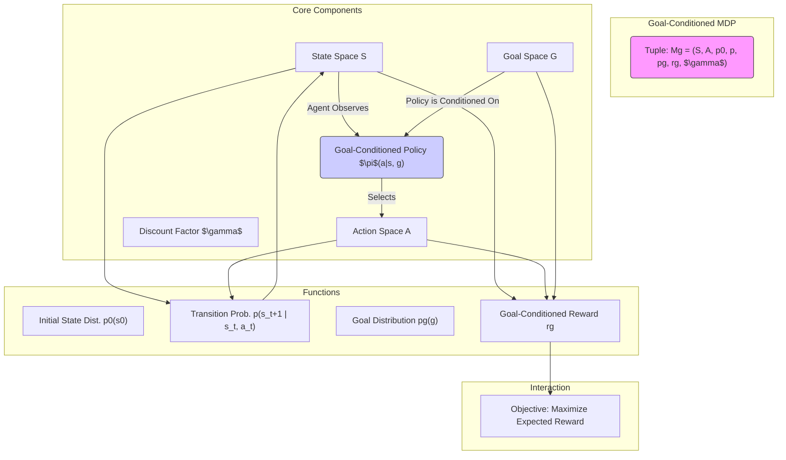
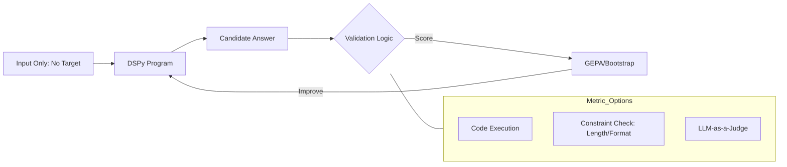

# Goal-Conditioned Markov Decision Processes

## Definition

## What is the Point of $p_g$: Goal Distribution?

### Multiplicity of Goals
The goal distribution arises because the framework is designed to train agents that learn to achieve multiple different goals (multi-goal RL).

### Goal Space
Goals $g$ are elements within a defined goal space G, which is related to the state space S via a mapping $f: S \rightarrow G$. For instance, the goal space G might correspond to a subset of state dimensions.

### Episode Setup
At the start of every episode, the agent is assigned a goal g sampled from the goal distribution $p_g(g)$ (or a state-goal pair from $p(s_0, g)$ in some formulations), and this goal remains fixed for the entire episode.

### Policy and Value Function Input
Because there are multiple possible goals, the policy (π) and the value function (Q) must be universal, meaning they take the goal g as an input in addition to the state s: $\pi(a \mid s, g)$ and $Q_\pi(s, a, g)$.

## Relevance to Learning

The ability to train a universal policy that maximizes reward across a distribution of goals is key to modern goal-conditioned RL techniques:

### Hindsight Experience Replay (HER)
The goal distribution allows methods like HER to work. HER replays failed trajectories by substituting the original goal with a new goal (e.g., the state actually achieved, $m(s_T)$). This effective substitution of the goal g is only possible because the policies and value functions are trained to generalize across the multitude of goals defined by the goal space G.

### Self-Supervised Context
In the context of the work on scaling depth, the approach is conducted in an unsupervised goal-conditioned setting, where the agent must explore and learn how to maximize the likelihood of reaching commanded goals sampled from this goal space.

## Goal vs Reward

The distinction between a **goal** and a **reward** is fundamental in Reinforcement Learning (RL), especially in the Goal-Conditioned MDP framework.

### Goal ($g$)

A **goal ($g$)** is a specific desired outcome or state that the agent is trying to achieve.

- **Definition and Space:** Goals $g$ are elements within a defined **goal space** ($G$). The goal space $G$ is related to the state space $S$ via a mapping $f: S \rightarrow G$. In manipulation tasks, for example, the goal might be the desired position of an object.
- **Conditioning:** The goal is a **fixed input** to the policy ($\pi(a | s, g)$) and the value function ($Q(s, a, g)$) for the duration of an episode, influencing the agent's actions.
- **Multiplicity:** The framework assumes that there are **multiple goals** that can be achieved, leading to the use of a goal distribution ($p_g$) from which specific goals are sampled for episodes.

### Reward ($r_g$)

The **reward ($r_g$)** is the immediate numerical feedback the agent receives from the environment at each time step, and its function is to define the agent's objective.

- **Function:** The agent's overall objective is to **maximize the expected return**, which is the discounted sum of future rewards ($R_t = \sum_{i=t}^\infty \gamma^{i-t} r_i$).
- **Goal-Conditioned:** In this specialized setting, the reward function is explicitly **goal-conditioned** ($r_g$ or $r(s, a, g)$), meaning the reward received depends on the currently pursued goal.
- **Specific Definition in MDP:** The sources define the reward function in the goal-conditioned MDP as the probability density of reaching the goal in the next time step. A common practice, especially in challenging environments, is to use a **sparse and binary reward** signal, such as $r(s, a, g) = -[f_{g}(s) = 0]$, which gives a negative reward (e.g., -1) whenever the goal is *not* achieved, and presumably 0 or a positive value upon success.

### Why the Reward is Necessary

Even when an agent is aiming for a goal, the reward function is crucial because it provides the **signal for optimization**.

- **Defining Success:** The goal defines *what* success is (e.g., placing the box at position $G$); the reward quantifies *how good* an action was towards achieving that goal, allowing the algorithm to learn the optimal policy.
- **Sparse Reward Challenge:** When rewards are sparse and binary (e.g., 0 until the goal is achieved, then +1), standard RL algorithms struggle because they "will never experience any reward other than $-1$" for long trajectories. This is why techniques like Hindsight Experience Replay (HER) or self-supervised methods like Contrastive RL (CRL) are necessary.
- **CRL Approach:** In CRL, the goal is addressed through a **critic function** $f_{\phi,\psi}(s, a, g)$ that measures the $\ell_2$-norm distance between state-action and goal embeddings. While the policy is trained to **maximize this critic**, the learning signal for the policy is effectively derived from this self-supervised classification objective rather than an explicit traditional reward function, thereby overcoming the sparsity problem.

### The Nature of "No Rewards" in the Unsupervised Setting

When we say experiments are conducted in an **unsupervised goal-conditioned setting, where no rewards are provided**, this emphasizes two key difficulties:

- **Absence of External or Dense Rewards:** "No rewards" means the system does not rely on **hand-engineered, dense, or complicated reward shaping** (which is often necessary for complex tasks). The agent is learning from **sparse, binary rewards** (or exploring *from scratch*).
- **RL Challenge:** Learning only from a sparse, binary reward signal is a massive challenge, as traditional RL algorithms often "fail... because they will never experience any reward other than $-1$". This problem is magnified in high-dimensional state spaces.

**Analogy:**

If reaching a distant mountain peak is your **goal** ($g$), the **reward** ($r_g$) is usually just a single cheer (a +1 signal) right at the top. For a typical RL algorithm, this single cheer is almost useless in helping it learn the hundreds of steps leading up the mountain. **Self-supervised goal-conditioned learning**, however, uses the goal internally: it looks back at every failed step and says, "Well, I didn't reach the main peak, but I *did* reach that small hill halfway there. I'll pretend the small hill was my goal, and give myself a huge learning reward for that step." This internal process provides the dense learning signal needed to succeed, even though the original external reward was sparse.

This is an insightful question that hits on the core of what makes **DSPy** different from traditional supervised learning.

The short answer is: **No, you don't necessarily need a target answer, but you must have a way to verify "success."**

In DSPy, there are two types of training data setups based on how your metric works: **Labeled** and **Unlabeled**.

---

### 1. Labeled Data (Traditional)

If your metric is a simple comparison (e.g., "Is the predicted answer exactly the same as the ground truth?"), then you **must** provide the target answer.

* **Example:** Math problems or Fact Retrieval.
* **Metric:** `return example.target == prediction.answer`

### 2. Unlabeled Data (Programmatic/AI-Feedback)

This is where DSPy gets powerful. If your metric can determine if an answer is "good" without knowing the "perfect" answer, you only need the **input** (the question/task).

* **Example:** Coding. Your metric could be: "Does this code run without errors and pass these 3 generic tests?"
* **Example:** Summarization. Your metric could be: "Is the summary under 100 words and does it mention the 3 keywords found in the source text?"
* **Example:** LLM-as-a-Judge. Your metric uses a stronger model (like GPT-4o) to grade the response based on a rubric (e.g., "Is this helpful and polite?").

---

### How the Metric replaces the "Target" in GEPA/DSPy

If you don't provide a target answer, the **Metric** becomes the "Environment" that the program lives in.

### Why you might still want Targets (The "Gold" Standard)

Even if you have a smart metric, providing a few "Gold" target answers is highly beneficial because of **Bootstrapping**:

1. **Trace Quality:** It is much easier for DSPy to "bootstrap" (find a successful path) if it knows exactly where it's trying to go.
2. **Ambiguity:** An LLM-as-a-judge might be inconsistent. A hard-coded "Target Answer" is 100% consistent.
3. **Cost:** Running an LLM to check every answer in your training set is expensive. Checking a string match against a target answer is free.

---

### Summary Table

| Data Type | Needs "Target"? | Metric Type | Best Use Case |
| --- | --- | --- | --- |
| **Labeled** | **Yes** | Exact Match / F1 Score | QA, Extraction, Classification |
| **Unlabeled** | **No** | Programmatic / Heuristic | Formatting, Coding, Writing Style |
| **AI-Feedback** | **No** | LLM-as-a-Judge | Creative writing, Tone, Complex Logic |

**Would you like to see a code example of an "Unlabeled" metric that uses a Python function to grade an LLM response without knowing the answer?**