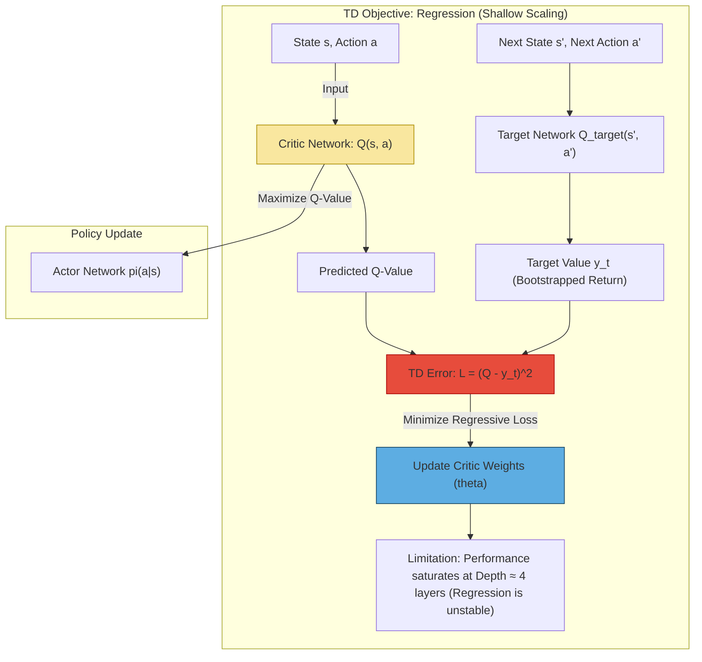

# Temporal Difference (TD) Methods

## Overview

Traditional Temporal Difference (TD) learning methods, such as Deep Q-Networks (DQN) and Deep Deterministic Policy Gradients (DDPG), use a **regression-based** approach to learn the Q-function (action-value function).

## TD-Based Architecture

This method relies on minimizing a squared error (regression) based on the Bellman equation. This approach typically fails to scale depth beyond four layers.

## The Q-Target

In TD learning methods, the **Q-target** ($y_t$) is calculated using the concept of bootstrapping from a network called the **target network**.

### Definition and Role of the Q-Target

The Q-target ($y_t$) is the calculated "target value" used to train the main Q-network (or critic network) in TD learning.

The goal of training the Q-network is to minimize the loss ($L$), which forces the approximated Q-function ($Q(s_t, a_t)$) to satisfy the Bellman equation. This loss is typically defined as the squared difference between the predicted Q-value and the target value:

$$L = E \left(Q(s_t, a_t) - y_t\right)^2$$

### Composition of the Q-Target

The target value $y_t$ represents the discounted sum of the immediate reward received plus the estimated value of the next state ($s_{t+1}$).

In a standard DQN setting, the Q-target is defined as:

$$y_t = r_t + \gamma \max_{a' \in A} Q(s_{t+1}, a')$$

Where:
- $r_t$ is the reward received at time $t$.
- $\gamma$ is the discount factor.
- $\max_{a' \in A} Q(s_{t+1}, a')$ is the estimated value of the subsequent optimal action in the next state $s_{t+1}$.

For DDPG (which handles continuous actions), the Q-target is calculated using the action outputted by the policy (actor) network, $\pi(s_{t+1})$:

$$y_t = r_t + \gamma Q(s_{t+1}, \pi(s_{t+1}))$$

## Target Networks

Crucially, in deep RL algorithms like DQN and DDPG, the targets ($y_t$) are computed using a **separate target network** (denoted as $Q_{\text{target}}$ or $Q_{\bar{\theta}}$) which changes at a slower pace than the main network ($Q$).

The reasons for using a separate target network are to:

- **Stabilize Optimization:** Ignoring the dependency of the targets $y_t$ on the main network parameters during backpropagation helps stabilize the optimization procedure.
- **Decouple Learning:** This separate network prevents the agent from chasing a moving target—if the main network was used to calculate the target, any update would drastically change the target for all other samples, leading to instability.

The weights of this target network are updated periodically. Common practices include periodically setting the target network weights equal to the current weights of the main network, or using a **Polyak-averaged version** (an exponential moving average) of the main network instead.

## Bootstrapping

The term **bootstrapped return** refers to the way the target value ($y_t$) is calculated in Temporal Difference (TD) learning algorithms.

It is called "bootstrapped" because the estimation of the return for the current state-action pair relies on an **estimate of the value of the next state** ($s_{t+1}$), rather than waiting for the full, complete discounted sum of rewards (the actual return, $R_t$).

### The Bootstrapping Process

1. **The Goal:** The agent aims to maximize the expected return ($R_t$), which is the discounted sum of future rewards ($\sum_{\tau=t}^\infty \gamma^{\tau-t} r_\tau$).

2. **The Method (Bootstrapping):** In TD algorithms, instead of using the true, full return from time $t$ onward, the Q-function (the action-value function) is learned by leveraging the Bellman equation. The target value ($y_t$) is computed using the immediate reward ($r_t$) plus the discounted **estimated value of the next state**:

   $$y_t = r_t + \gamma \max_{a'} Q(s_{t+1}, a')$$

   This value, $Q(s_{t+1}, a')$, is itself an approximation (an estimate derived from the current or target neural network).

3. **The "Bootstrapping" Concept:** By using an estimated value ($Q(s_{t+1}, a')$) derived from the learning process itself to update the current value estimate ($Q(s_t, a_t)$), the algorithm is essentially "pulling itself up by its own bootstraps." This means the target for the current step is partially based on the algorithm's current, incomplete knowledge about the future.

To maintain stability during this process, the target values ($y_t$) are typically computed using a **separate target network** ($Q_{\text{target}}$) that changes at a slower pace than the main Q-network.

## Limitations

Previous research consistently found that increasing the depth of TD-based networks beyond four layers yields only **limited or even negative returns** due to instability. This is one of the key motivations for exploring alternative approaches like Contrastive RL.
