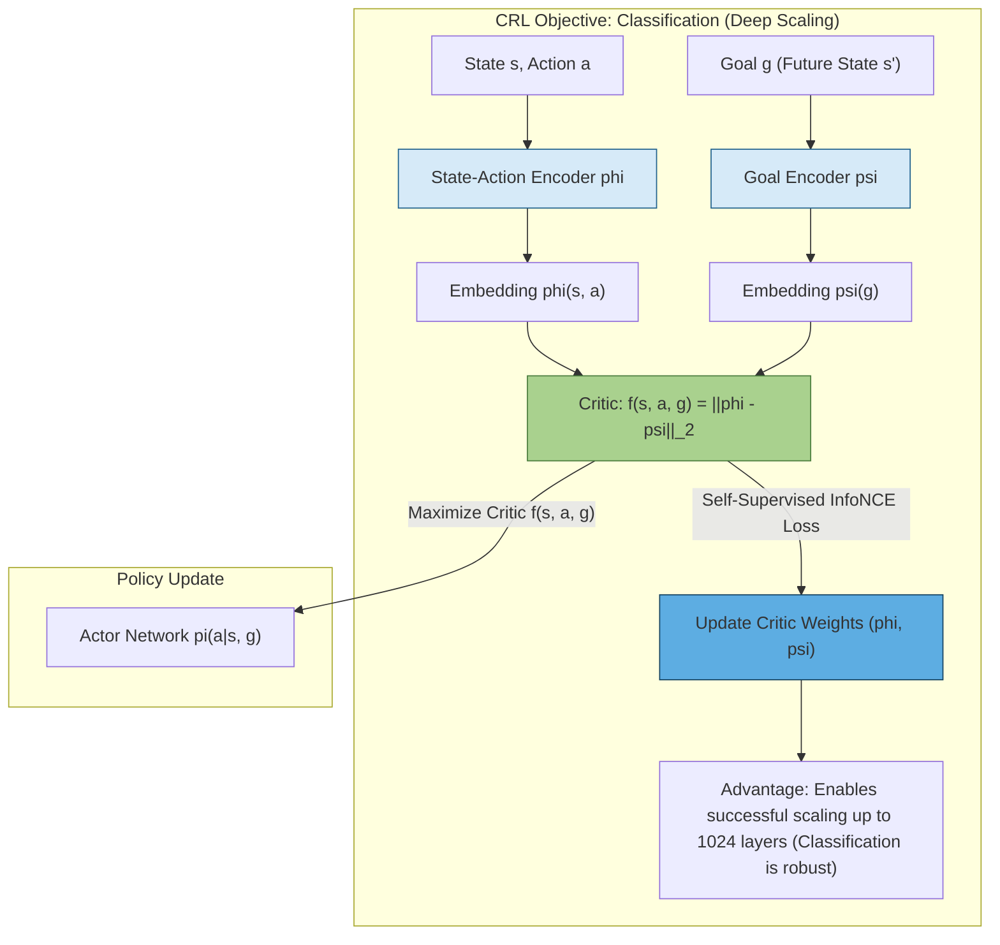

# Contrastive Reinforcement Learning (CRL)

## Why CRL is Essential for Scaling

The integration of **Self-Supervised Reinforcement Learning (SSRL)**, specifically implemented through **Contrastive Reinforcement Learning (CRL)**, is essential for achieving breakthroughs in scaling deep RL networks for unsupervised goal-conditioned tasks because it fundamentally alters the learning objective, providing the necessary robustness that traditional methods lack.

### Overcoming the Sparse Feedback Problem

The core challenge in scaling large RL networks, particularly for unsupervised goal-conditioned tasks, is the **very small ratio of feedback to parameters**. In this setting, the agent must explore from scratch, and even when a formal reward function ($r_g$) exists, it is typically **sparse and binary** (only indicating whether a goal was reached). This sparse signal is insufficient to train massive, deep networks effectively.

Self-supervision is likely a key ingredient for scaling RL methods similarly to breakthroughs in vision and language. CRL provides this ingredient by turning the sparse RL problem into a self-supervised one.

### Shifting from Regression (TD Methods) to Classification (CRL)

The critical reason why CRL (an SSRL algorithm) enables scaling is the nature of its learning objective compared to traditional Temporal Difference (TD)-based methods (like SAC and TD3):

- **TD Methods use Regression:** Traditional TD-based algorithms train the critic (Q-function) by minimizing a **regressive TD objective**. This approach attempts to approximate a continuous value function via bootstrapping. Previous research consistently found that increasing the depth of these networks beyond four layers yields only **limited or even negative returns** due to instability.

- **CRL uses Classification (InfoNCE):** CRL is an actor-critic method where the critic is trained using the **InfoNCE objective**, which is a generalization of cross-entropy loss. This objective effectively frames the RL task as a **classification problem**. The critic, $f_{\phi,\psi}(s, a, g)$, measures the distance between the state-action embedding and the goal embedding. The classification is binary: classifying whether states and actions belong to the same trajectory leading toward a goal state versus a different, random trajectory.

### The Conjectured Robustness of Classification

The success of CRL in scaling deep networks (up to 1024 layers) is attributed to the inherent stability of the classification objective:

- **Robust Scaling:** It is conjectured that **classification-based methods can be more robust and stable**, and thus exhibit better scaling properties than their regressive counterparts.
- **Architectural Success:** The success of scaling deep models in other domains (like vision and NLP) relies primarily on **self-supervised objectives** or **classification**, further supporting the idea that this structure is vital for scaling functional complexity.

Thus, CRL achieves SSRL by providing a dense, self-generated signal based on classifying internal dynamics (trajectories and goals), providing the structural stability necessary to train extremely deep networks where sparse rewards and regression-based TD methods fail.

## CRL Architecture

This method achieves **Self-Supervised RL (SSRL)** by using the **InfoNCE objective**, effectively transforming the problem into a classification task that is more robust and scalable. This enables the training of networks up to 1024 layers deep.

## Why CRL Uses Classification Loss

The reason Contrastive Reinforcement Learning (CRL) uses a classification loss (specifically the InfoNCE objective) based on the relationship between a **goal ($g$) and a state-action pair ($s, a$)** is that this approach provides a **dense, stable, self-supervised learning signal** that is essential for scaling deep networks in goal-conditioned RL tasks, particularly where traditional rewards are sparse.

### Framing RL as a Classification Task

In CRL, the problem of learning the action-value function ($Q$-function) is transformed from a **regression problem** (as in Temporal Difference methods) into a **classification problem**. This re-framing is achieved using the **InfoNCE objective**, which is a generalization of cross-entropy loss.

- **The Goal:** The goal of the critic, denoted $f_{\phi,\psi}(s, a, g)$, is to effectively quantify the likelihood or value of executing action $a$ in state $s$ to reach goal $g$.
- **The Mechanism:** The critic is parametrized by two neural networks: a **state-action pair embedding network $\phi(s, a)$** and a **goal embedding network $\psi(g)$**. The critic's output, $f_{\phi,\psi}(s, a, g)$, is defined as the $\ell_2$-norm (or distance) between these two embeddings: $f_{\phi,\psi}(s, a, g) = \|\phi(s, a) - \psi(g)\|_2$.
- **The Classification:** The InfoNCE loss trains these encoders to classify whether a given state-action pair $(s_i, a_i)$ and a goal $g_i$ (which is typically a future state) **belong together** (i.e., whether the action leads toward the goal) versus a set of goals ($g_j$) sampled from a different, random trajectory (negative examples).

### Achieving Self-Supervision and Stability

This classification approach is central to the method's success because it generates a rich, internal signal, enabling the self-supervised scaling of deep networks.

- **Bypassing Sparse Rewards:** The goal-conditioned RL setting, especially the unsupervised one studied, often relies on **sparse, binary rewards** (e.g., a reward only when the goal is reached). This sparse feedback is insufficient to train large networks effectively, as the ratio of feedback to parameters is very small.
- **Providing Robustness:** It is conjectured that **classification-based methods** (like CRL using InfoNCE) are inherently **more robust and stable** and thus exhibit better scaling properties than regressive counterparts (like TD methods which fail to scale beyond shallow depths). The classification loss provides a strong, dense signal derived from the inherent structure of the goals and trajectories, rather than relying on the weak external reward signal.
- **Learning Representations:** The InfoNCE objective trains the network to learn rich representations that capture the environment's topology. For instance, in maze tasks, the deep CRL critic learns representations that **capture the topology of the maze** and successfully avoid relying on simple Euclidean distance to the goal, unlike shallow networks.

By performing a classification loss between the state-action embedding and the goal embedding, CRL essentially learns a value function ($Q$-function) that estimates the probability of reaching the goal $g$ from state $s$ via action $a$, doing so robustly enough to enable massive network scaling.
