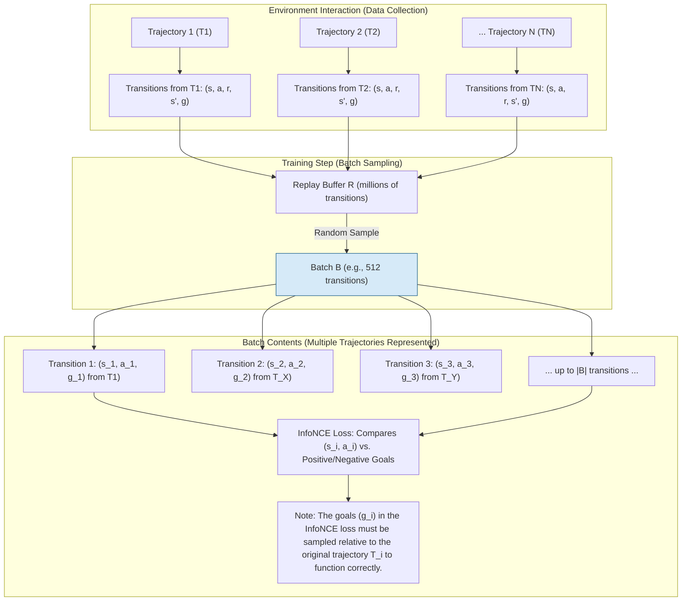

# The InfoNCE Objective

## What is InfoNCE?

The **InfoNCE objective** is a specific type of **loss function** used in **Contrastive Reinforcement Learning (CRL)**, which is a self-supervised RL algorithm.

InfoNCE (or Noise Contrastive Estimation) has the following characteristics:

1. **Nature of the Objective:** The InfoNCE objective is a generalization of the **cross-entropy loss**. It is central to CRL because it transforms the value-learning problem into a **classification task**.

2. **Function in CRL:** In Contrastive RL, the InfoNCE objective is used to train the critic network, $f_{\phi,\psi}(s, a, g)$. This objective guides the critic to determine whether a given state-action pair $(s_i, a_i)$ and a goal ($g_i$, typically a future state) **belong together** (i.e., whether the action leads toward the goal) versus a set of goals ($g_j$) sampled from a different, random trajectory (the "noise" or negative examples).

3. **Mathematical Form:** The objective function minimizes the following loss:

   $$ \min_{\phi,\psi} E_B \left[ - \sum_{i=1}^{|B|} \log \left( \frac{e^{f_{\phi,\psi}(s_i, a_i, g_i)}}{\sum_{j=1}^K e^{f_{\phi,\psi}(s_i, a_i, g_j)}} \right) \right] $$

   where:
   - $f_{\phi,\psi}(s, a, g)$ is the critic's output (defined by the $\ell_2$-norm between the state-action embedding $\phi(s, a)$ and the goal embedding $\psi(g)$).
   - $g_i$ is a goal sampled from the *same* trajectory as $(s_i, a_i)$ (the positive sample).
   - $g_j$ (where $j$ ranges over $K$ samples) includes $g_i$ and goals sampled from *different, random* trajectories (negative samples).

4. **Significance for Scaling:** This classification-based approach yields a learning signal that is conjectured to be **more robust and stable** than traditional regression-based Temporal Difference (TD) methods. This stability is critical because it allows the algorithm to successfully scale up the depth of the neural networks (up to 1024 layers) in the unsupervised goal-conditioned setting, which struggles with sparse feedback.

## Understanding Batch B

In the context of the InfoNCE objective function for Contrastive Reinforcement Learning (CRL), **$B$ represents the set of transitions sampled to form the training batch**.

Specifically:

- **$B$ is the batch of transitions** sampled from the replay buffer used for training the critic networks ($\phi$ and $\psi$).
- The transitions in the batch are denoted by the index $i$, running from $1$ to the size of the batch, $|B|$.
- For each sample $i$ in the batch, $s_i$, $a_i$, and $g_i$ represent the state, action, and goal (future state) sampled from the **same trajectory** (the positive sample).
- $g_j$ represents a goal sampled from a different, random trajectory, acting as a negative sample.

The goal of this loss is to train the critic to effectively classify $g_i$ as the correct goal associated with the state-action pair $(s_i, a_i)$ versus the incorrect goals $g_j$. In the experiments, the `batch_size` (which corresponds to $|B|$) used for training the Contrastive RL algorithm is typically **512**.

## How Transitions and Trajectories Relate to Batches

The phrase "trajectory in a batch" refers to how **transitions, which originally belong to sequences of interaction (trajectories), are sampled and paired together into a batch for optimization.**

A single training batch typically contains transitions sampled from multiple, separate trajectories stored in the replay buffer.

### The Process

1. **Trajectory Collection:** During the agent's interaction with the environment, data is collected in episodes, forming trajectories (sequences of states, actions, and rewards):
   $$\text{Trajectory}_1: (s_0, a_0, r_0, s_1, g), (s_1, a_1, r_1, s_2, g), \dots$$

2. **Replay Buffer Storage:** These individual transitions are stored in a large **replay buffer** ($\mathcal{D}$). In goal-conditioned RL (like CRL, which is based on UVFA), each transition is stored along with the goal it was conditioned on, $g$, resulting in tuples like $(s_t, a_t, r_t, s_{t+1}, g)$.

3. **Batch Sampling:** When the critic (or Q-network) is updated, a **minibatch** ($B$) of a fixed size (e.g., $|B| = 512$) is sampled uniformly from this massive replay buffer.

4. **Batch Composition:** Because the replay buffer is filled with data from thousands of different episodes/trajectories collected over time, **the batch $B$ is heterogenous**, consisting of randomly selected transitions from potentially many different trajectories. The objective function, $E_B[\dots]$, takes the expectation over this sampled batch $B$.

### The Role of Trajectories in the CRL InfoNCE Loss

For CRL specifically, the InfoNCE objective relies on knowing which transitions belong to the *same* trajectory, even though they are sampled in a batch.

The InfoNCE objective requires, for each sampled transition $i$ in the batch $B$:
- The state, action, and positive goal tuple: $(s_i, a_i, g_i)$, where $g_i$ is a goal (future state) sampled from the **same trajectory** as $(s_i, a_i)$.
- Negative goals ($g_j$ where $j \neq i$) which are goals sampled from a **different, random trajectory**.

Therefore, even though the batch itself is a mix of transitions from many trajectories, the algorithm must pull metadata (the original trajectory history) to construct the positive/negative goal pairs needed for the classification loss.

### Batch Composition Diagram

This diagram illustrates how a training batch ($B$) is composed of multiple transitions sampled from multiple trajectories stored in the replay buffer ($R$).

## Why Compare Tuples from Different Trajectories?

The reason you want to compare state-action-goal ($s, a, g$) tuples from different trajectories in Contrastive Reinforcement Learning (CRL) using the **InfoNCE objective** is precisely to create the **classification signal** needed for the network to learn which actions lead toward the intended goal versus those that do not.

This mechanism is fundamental to transforming the difficult RL learning problem (sparse rewards and complex regression) into a robust, self-supervised classification problem.

### Defining Positive and Negative Examples

The InfoNCE objective requires the network to distinguish between positive and negative pairs within a batch of transitions ($B$).

#### Positive Pairs
For a given state-action pair $(s_i, a_i)$ sampled from the batch, the **positive goal ($g_i$)** is a state (usually a future state) that was **actually reached** within the same trajectory as $(s_i, a_i)$. The network must learn that the embedding for $(s_i, a_i)$ is close to the embedding for $g_i$.

#### Negative Examples (The "Contrastive" Element)
The "goals sampled from a different, random trajectory" ($g_j$, where $j \neq i$) serve as **negative examples** (or "noise") against which the positive goal is contrasted.

By including negative goals from different trajectories, the optimization forces the network to push the embedding of the current state-action pair $(s_i, a_i)$ **away** from the embeddings of goals that were *not* achieved from that specific point in time.

### Learning Effective Representations

This contrastive mechanism helps the critic network learn **rich representations** that inherently capture the environment's topology and the utility of specific actions in achieving goals.

- The goal of the critic, $f_{\phi,\psi}(s, a, g)$, is defined as the distance between the **state-action pair embedding $\phi(s, a)$** and the **goal embedding $\psi(g)$**.
- The classification loss encourages the network to minimize the distance between the embedding $\phi(s_i, a_i)$ and the *true* achievable goal $\psi(g_i)$, while simultaneously maximizing the distance between $\phi(s_i, a_i)$ and the *unachieved* goals $\psi(g_j)$ (the negative samples).

This process teaches the model not just what the desired outcome looks like, but effectively carves out boundaries in the embedding space, indicating which actions lead toward one goal and away from others.

### Achieving Stability and Scalability

This "classification-based method" is conjectured to be **more robust and stable** compared to traditional regression-based Temporal Difference (TD) methods, especially when training very deep neural networks. The inclusion of contrasting examples provides a dense, continuous, and self-supervised learning signal that doesn't rely on sparse external rewards. This robustness is critical for successful scaling in unsupervised goal-conditioned RL tasks.

In essence, contrasting against goals from other trajectories provides the necessary challenge—the "contrast"—that enables the network to refine its embeddings, making successful action/goal pairs stand out clearly from random or irrelevant pairings.
