# Empirical Results: Figures and Analysis

This document provides detailed analysis of the key empirical results from the deep RL scaling research. Each figure demonstrates critical aspects of how network depth enables breakthrough performance in self-supervised reinforcement learning.

## Overview

The figures below present empirical evidence across 11 key experiments that demonstrate:
- Performance scaling with network depth (up to 1024 layers)
- Emergence of new capabilities and behaviors
- The synergy between depth and batch size
- Qualitative differences in learned representations
- Generalization improvements with depth

## Navigation

**Quick links to specific figures:**
- [Figure 1: Performance gains across tasks](#figure-1-scaling-network-depth-yields-performance-gains-across-a-suite-of-locomotion-navigation-and-manipulation-tasks)
- [Figure 3: New capabilities](#figure-3-increasing-depth-results-in-new-capabilities)
- [Figure 4: Width vs depth](#figure-4-scaling-network-width-vs-depth)
- [Figure 5: Critical depth and residuals](#figure-5-critical-depth-and-residual-connections)
- [Figure 6: Actor vs critic](#figure-6-actor-vs-critic)
- [Figure 7: Batch size scaling](#figure-7-deeper-networks-unlock-batch-size-scaling)
- [Figure 8: Exploration vs expressivity](#figure-8-disentangling-exploration-and-expressivity)
- [Figure 9: Learned representations](#figure-9-deeper-q-functions-are-qualitatively-different)
- [Figure 10: Embedding space](#figure-10-trajectory-in-embedding-space-depth-4-and-depth-64)
- [Figure 11: Generalization](#figure-11-deeper-networks-exhibit-improved-generalization)
- [Figure 12: Scaling to 1024 layers](#figure-12-testing-the-limits-of-scale)

---

The screenshots correspond to Figures 1, 3, 4, 5, 6, 7, 8, 9, 10, 11, and 12 from the research.

### Figure 1: Scaling network depth yields performance gains across a suite of locomotion, navigation, and manipulation tasks

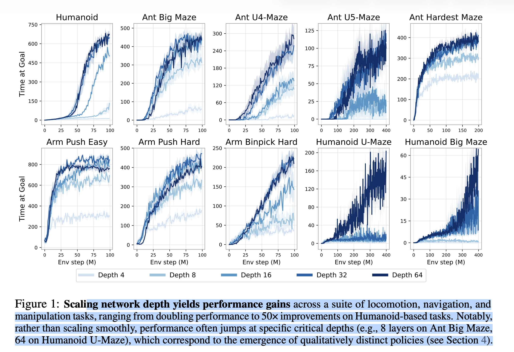

**What is being shown:**
Figure 1 consists of **10 learning curves** organized into two rows of five plots each. These plots display the performance of the **Contrastive Reinforcement Learning (CRL)** algorithm across a diverse set of tasks, including locomotion (Humanoid, Ant mazes), navigation (Ant mazes), and robotic manipulation (Arm Push, Arm Binpick Hard).

*   The **X-axis** (horizontal) represents the "Env step (M)," or the number of environment steps taken in millions.
*   The **Y-axis** (vertical) represents the performance metric, typically "Time at Goal" or "Average Return," which measures the number of time steps (out of 1000) the agent is near the goal during evaluation.
*   Multiple lines show performance based on **network depth**, ranging from the shallow baseline of **Depth 4** up to **Depth 64**.

**What it is trying to say (Key Takeaways):**
The figure serves as the **primary empirical evidence** for the finding that increasing network depth is a critical factor for scaling self-supervised RL performance. The results demonstrate that deeper networks achieve **significant performance improvements** across all tasks, ranging from doubling performance to up to $50\times$ improvements on Humanoid-based tasks compared to the Depth 4 baseline.

The source emphasizes that these performance gains **do not scale smoothly**. Instead, performance often **"jumps at specific critical depths"** (e.g., 8 layers on Ant Big Maze or 64 layers on Humanoid U-Maze), indicating the emergence of qualitatively distinct and more capable policies.

***

### Figure 3: Increasing depth results in new capabilities

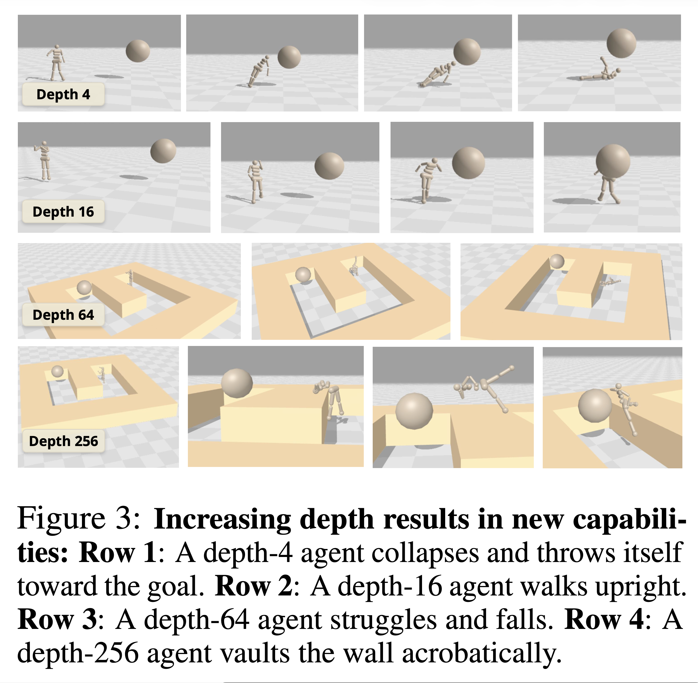

**What is being shown:**
Figure 3 presents **visualizations** of the learned policies in humanoid-based tasks achieved by CRL agents trained with **different network depths**. The figure contains four rows of images demonstrating distinct behaviors corresponding to depths 4, 16, 64, and 256.

*   **Row 1 (Depth 4):** Shows a rudimentary policy where the agent **collapses and throws itself** toward the goal.
*   **Row 2 (Depth 16):** Shows the agent developing the ability to **walk upright** into the goal.
*   **Row 3 (Depth 64):** Shows the agent struggling and **falling** while attempting to navigate around an intermediary wall in the Humanoid U-Maze.
*   **Row 4 (Depth 256):** Shows the agent learning remarkable, unique behaviors, such as **vaulting the wall acrobatically** or shifting into a seated posture to worm its way toward the goal, to overcome the obstacle in the Humanoid U-Maze.

**What it is trying to say (Key Takeaways):**
The figure demonstrates that increasing network depth leads to the **emergence of "qualitatively distinct skills and behaviors"** and "new capabilities". This visual evidence supports the finding that the sudden jumps in the performance curves (Figure 1) are directly linked to the agent acquiring complex, specialized motor skills that shallow networks cannot learn. The behaviors learned at Depth 256, like vaulting, are noted as being the first documented instance of such goal-conditioned policies in the humanoid environment.

***

### Figure 4: Scaling network width vs. depth

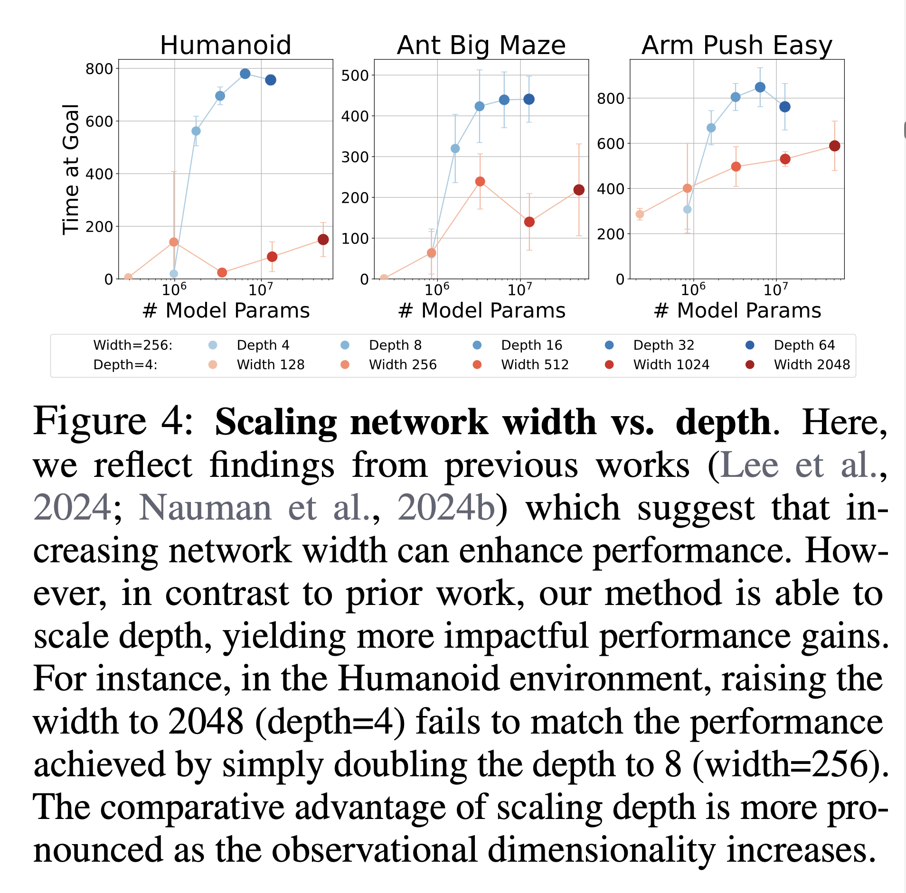

**What is being shown:**
Figure 4 presents plots for three environments (Humanoid, Ant Big Maze, and Arm Push Easy) that compare performance based on scaling the network along two different axes: **network width** (hidden unit size) and **network depth** (number of layers).

*   The **X-axis** is the logarithm of the **number of model parameters**.
*   The **Y-axis** is the performance measured as "Time at Goal".
*   Different colored/shaped markers represent various combinations of fixed depth (Depth=4) with varying widths (Width 128 to 2048) versus varying depths (Depth 4 to 64) with fixed width (Width=256).

**What it is trying to say (Key Takeaways):**
This figure contrasts the effectiveness of scaling depth versus width in deep RL. While scaling width (increasing parameter count horizontally) does enhance performance, **scaling depth proves to be the "more impactful performance gains" axis**.

A crucial example highlighted is that on the **Humanoid environment**, raising the width significantly (up to 2048 units, with depth=4) **fails to match the performance** achieved by simply doubling the network depth to 8 (with a width of 256). The comparative advantage of depth scaling is most pronounced in environments with higher observational dimensionality, such as Humanoid (dimension 268). Furthermore, depth scaling can be a more computationally efficient approach since the parameter count scales linearly with width but quadratically with depth.

***

### Figure 5: Critical depth and residual connections

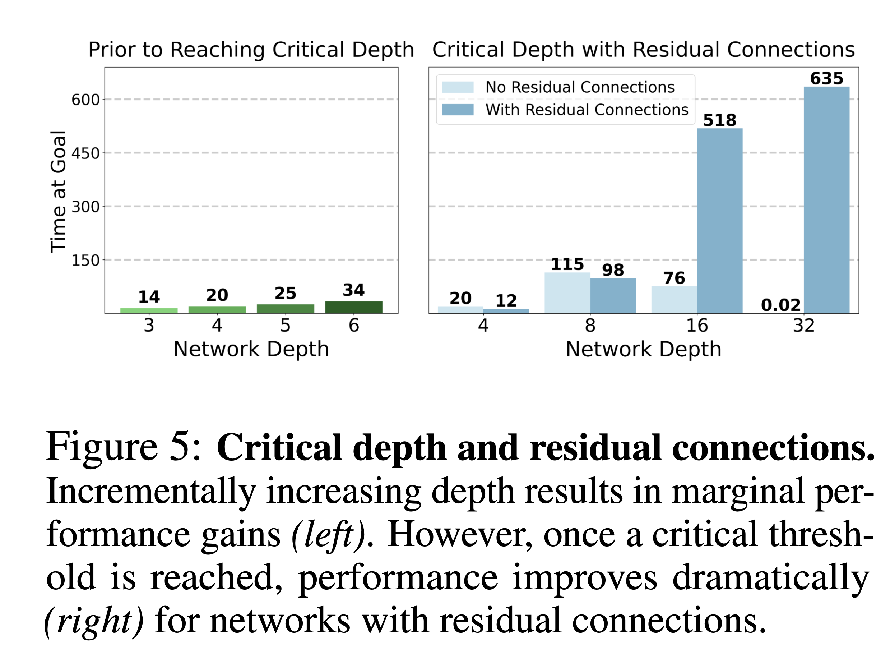

**What is being shown:**
Figure 5 consists of two bar charts comparing performance ("Time at Goal") against network depth, specifically demonstrating the impact of **residual connections** and the concept of a **critical depth**.

*   **Left Chart ("Prior to Reaching Critical Depth"):** Shows small, incremental performance gains as depth increases from 3 to 6.
*   **Right Chart ("Critical Depth with Residual Connections"):** Compares networks with "No Residual Connections" (light blue) against those "With Residual Connections" (dark blue) across depths 4, 8, 16, and 32.

**What it is trying to say (Key Takeaways):**
The figure illustrates two key points about scaling networks for CRL:

1.  **Marginal Gains Below Critical Depth:** Increasing depth slightly (e.g., from 3 to 6 layers) only yields marginal performance gains until a threshold is reached.
2.  **Residual Connections Enable Dramatic Scaling:** Once a **"critical threshold"** is reached (e.g., at depths 16 and 32), performance improves dramatically, but **only for networks incorporating residual connections**. This suggests that residual connections are essential for stabilizing training and allowing the dramatic performance improvements observed with deep networks. For instance, without residual connections, the Depth 32 network's performance effectively collapses (0.02), whereas with residuals, it achieves the highest performance (635).

***

### Figure 6: Actor vs. Critic

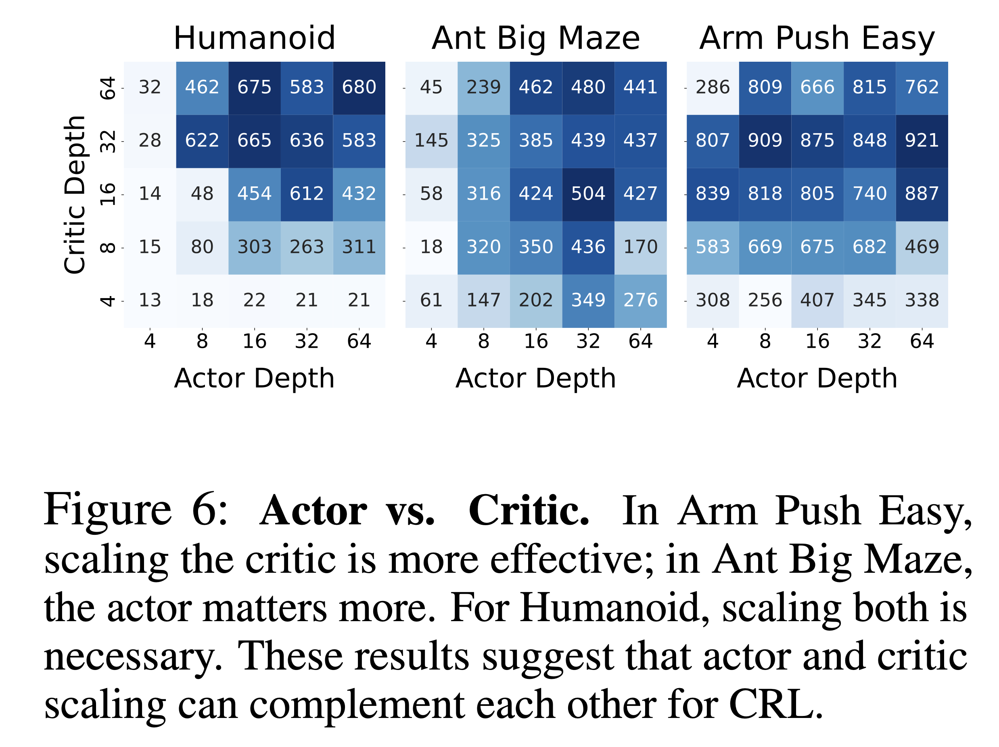

**What is being shown:**
Figure 6 presents three heatmaps for the Humanoid, Ant Big Maze, and Arm Push Easy environments. Each heatmap plots the **final performance ("Time at Goal")** for different combinations of **Actor Depth** (X-axis, 4 to 64) and **Critic Depth** (Y-axis, 4 to 64).

**What it is trying to say (Key Takeaways):**
This figure investigates the relative importance of scaling the actor policy network versus the critic value network in CRL. The results show that:

1.  **Scaling is Complementary:** Scaling both the actor and critic networks **"can complement each other for CRL"**.
2.  **Task Dependency:** The importance of scaling depends on the task.
    *   In **Arm Push Easy** and **Humanoid**, scaling the **critic is generally more effective**.
    *   In **Ant Big Maze**, scaling the **actor matters more**.
3.  **Contrast to Prior Work:** This finding contrasts with some prior work, which focused solely on scaling the critic network or noted that scaling the actor could degrade performance; CRL benefits from scaling both.

***

### Figure 7: Deeper networks unlock batch size scaling

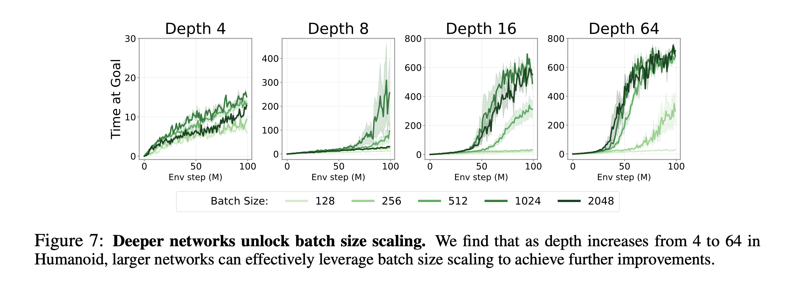

**What is being shown:**
Figure 7 displays four learning curves for the Humanoid environment, corresponding to networks of increasing depth: **Depth 4, Depth 8, Depth 16, and Depth 64**. Within each depth plot, five separate lines illustrate the impact of varying the **batch size** (128 up to 2048).

**What it is trying to say (Key Takeaways):**
The figure tests the hypothesis that benefits from large batch sizes require sufficient network capacity.

*   **Shallow Networks:** In the Depth 4 network (top left), increasing the batch size yields **"only marginal differences in performance"**.
*   **Deep Networks Unlock Scaling:** As the network depth increases (especially at Depth 16 and Depth 64), **"scaling the batch size becomes effective"**. For these deeper networks, larger batch sizes (1024 and 2048) successfully leverage the network's increased capacity to achieve **"further improvements"** in performance. This demonstrates that scaling network depth (capacity) is necessary to unlock the benefits of utilizing a larger batch size in self-supervised RL.

***

### Figure 8: Disentangling exploration and expressivity

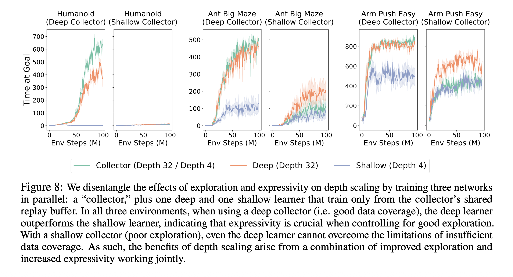

**What is being shown:**
Figure 8 presents five learning curves across three environments (Humanoid, Ant Big Maze, and Arm Push Easy) designed to separate the effects of **exploration capacity** (data collection) from **expressivity** (learning capacity/model size). The experiment involves training three networks in parallel:

1.  A **"Collector"** network that explores and gathers data into a shared buffer (either Depth 32/Deep or Depth 4/Shallow).
2.  A **"Deep Learner"** (Depth 32) that only trains from the shared buffer.
3.  A **"Shallow Learner"** (Depth 4) that only trains from the shared buffer.

**What it is trying to say (Key Takeaways):**
The results indicate that the benefits of depth scaling arise from a **"synergized way"** where improved exploration and increased expressivity work jointly.

*   **Deep Collector (Good Exploration):** When the collector is deep (Depth 32), providing good data coverage, the **deep learner substantially outperforms the shallow learner** in all three environments. This demonstrates that **expressivity is crucial** even when the data quality is held constant.
*   **Shallow Collector (Poor Exploration):** When the collector is shallow (Depth 4), providing poor data coverage, **both the deep and shallow learners struggle** and achieve similarly poor performance. This shows that additional model capacity (expressivity) cannot overcome the fundamental limitations of insufficient data coverage.

***

### Figure 9: Deeper Q-functions are qualitatively different

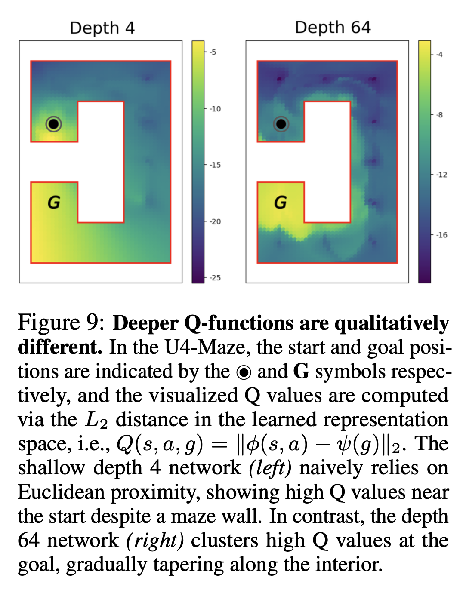

**What is being shown:**
Figure 9 visually compares the learned **Q-values** (computed via the $L_2$ distance in the learned representation space) for a **shallow Depth 4 network** (left) and a **deep Depth 64 network** (right) in the U4-Maze environment.

*   The black circle ($\circledcirc \bullet$) indicates the start position, and **G** marks the goal position.
*   The maze layout requires the agent to navigate around a central wall to reach the goal.
*   The color bar represents the visualized Q-values, with warmer colors generally indicating higher Q-values (i.e., higher value for the state-action pair).

**What it is trying to say (Key Takeaways):**
This figure demonstrates a **"qualitative difference"** in how shallow and deep networks represent the environment's value landscape.

*   **Shallow Network (Depth 4):** The Q-value landscape on the left **"naively relies on Euclidean proximity"** to the goal. High Q-values are shown near the starting point even though a maze wall directly obstructs the path, indicating a failure to understand the actual navigation requirements imposed by the environment's topology.
*   **Deep Network (Depth 64):** The Q-value landscape on the right learns **"richer representations"** that **"effectively capture the topology of the maze"**. The high Q-values cluster around the goal (G) and taper gradually along the inner edge of the maze, correctly valuing the path that requires navigating around the wall. This suggests that depth allows the network to learn global understanding essential for long-horizon tasks.

***

### Figure 10: Trajectory in Embedding Space (Depth 4) and (Depth 64)

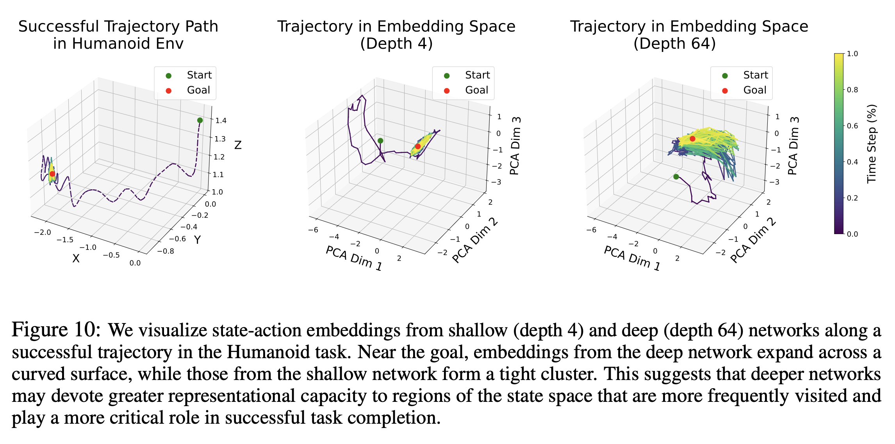

**What is being shown:**
Figure 10 presents a visualization of the **state-action embeddings** along a successful trajectory in the Humanoid environment.

*   The leftmost panel shows the **Successful Trajectory Path** in 3D space (X, Y, Z coordinates) with the Start (green dot) and Goal (red dot) indicated. The color along the trajectory shifts from purple (start) to yellow (end/goal) to show time progression.
*   The middle and right panels show the embeddings for the same trajectory projected onto three principal components (PCA Dim 1, 2, 3), illustrating how a **shallow network (Depth 4)** (middle) and a **deep network (Depth 64)** (right) map the states to their internal representation space.

**What it is trying to say (Key Takeaways):**
The visualization reveals how deep networks allocate representational capacity differently compared to shallow networks.

*   **Shallow Network (Depth 4):** Embeddings near the goal state **"form a tight cluster"**.
*   **Deep Network (Depth 64):** Embeddings near the goal state are **"more 'spread out'"** and **"expand across a curved surface"**.

This contrast suggests that **deeper networks devote greater representational capacity to state regions that matter most** for task completion, particularly future or goal-relevant states. By spreading out these crucial near-goal states, the deep network's representations gain the separation needed for the self-supervised contrastive learning objective (InfoNCE) to effectively distinguish important states from others.

***

### Figure 11: Deeper networks exhibit improved generalization

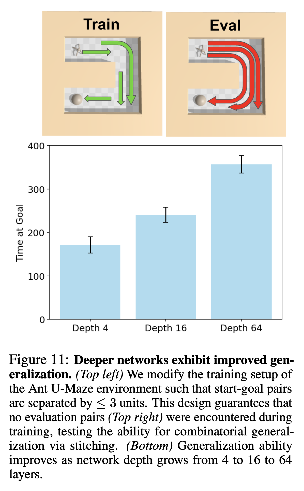

**What is being shown:**
Figure 11 examines the generalization ability of networks of different depths (Depth 4, 16, and 64) in the Ant U-Maze environment.

*   **Top Panels:** Illustrate a modified experimental setup where agents are trained only on start-goal pairs that are relatively close (separated by $\leq 3$ units, **Train**, top left). The generalization test, or **Eval** (top right), uses goal pairs that were **never encountered during training**. This tests the ability to solve the full task by "stitching" together partial knowledge.
*   **Bottom Bar Chart:** Compares the performance ("Time at Goal") of Depth 4, Depth 16, and Depth 64 networks in this generalization setting.

**What it is trying to say (Key Takeaways):**
This figure demonstrates that **generalization ability improves with network depth**.

*   The **Depth 4** network shows **"limited generalization,"** solving only the easiest generalization goal.
*   The **Depth 64** network **"excels,"** indicating that increasing depth enables **"some degree of stitching,"** allowing the agent to combine policies learned for short-range goals ($\leq 3$-unit pairs) to solve the long-range, unseen 6-unit span of the U-Maze. This highlights the deeper network's capability for combinatorial generalization.

***

### Figure 12: Testing the limits of scale

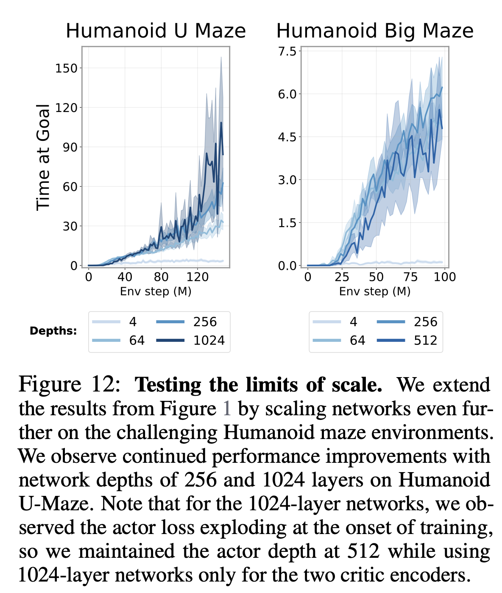

**What is being shown:**
Figure 12 presents learning curves for two of the most challenging environments (Humanoid U-Maze and Humanoid Big Maze), extending the scale study from Figure 1 by showing results for networks up to **Depth 1024**.

*   The **X-axis** is Environment Steps (M), and the **Y-axis** is "Time at Goal".
*   The curves compare depths 4, 64, 256, and 1024 (or 512 for Humanoid Big Maze).

**What it is trying to say (Key Takeaways):**
The figure tests the upper limits of depth scaling and confirms that performance continues to improve significantly even beyond the depths typically studied in RL papers (Depth 4 or 8).

*   On the **Humanoid U-Maze**, performance **"continues to substantially improve"** as depth reaches **256 and 1024 layers**.
*   This suggests that network performance in complex tasks is not saturating at intermediate depths and that further scaling offers continued benefits. For the 1024-layer experiment, note that due to stability issues (actor loss exploding), only the two critic encoders used 1024 layers, while the actor depth was maintained at 512.