# Figures and Visual Analysis

**Reference Paper:** *Does Reinforcement Learning Really Incentivize Reasoning Capacity in LLMs Beyond the Base Model?* (Yue et al., 2025)
**Conference:** 39th Conference on Neural Information Processing Systems (NeurIPS)
**Institutions:** Tsinghua University, Shanghai Jiao Tong University

**Note:** This document includes actual figures extracted from the PDF. All figure images are located in the `figures/` directory.

---

## Executive Summary

This paper challenges the widespread belief that Reinforcement Learning with Verifiable Rewards (RLVR) enables LLMs to discover fundamentally new reasoning abilities. Through extensive experiments using the **pass@k** metric (probability of solving a problem in k attempts), the authors demonstrate that:

1. **RLVR improves sampling efficiency** - Models get the right answer faster (higher pass@1)
2. **RLVR does NOT expand reasoning boundaries** - Base models can solve more problems when given enough attempts (higher pass@large-k)
3. **RL paths already exist in base models** - The "new" reasoning discovered by RL was already latent in pre-training
4. **Distillation differs from RLVR** - Only distillation from stronger models truly expands reasoning capacity

---

## Main Body Figures

### Figure 1: Conceptual Framework - RLVR vs. Distillation

**Location:** Page 1 (Introduction)

**Official Caption:** *Conceptual illustration of the effect of current RLVR vs. Distillation on an LLM's reasoning capability.*
<!-- >
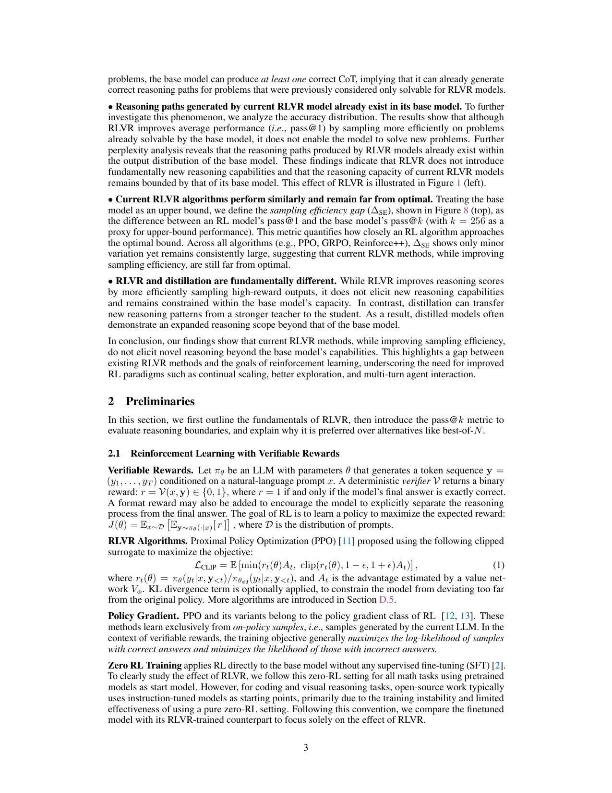
-->
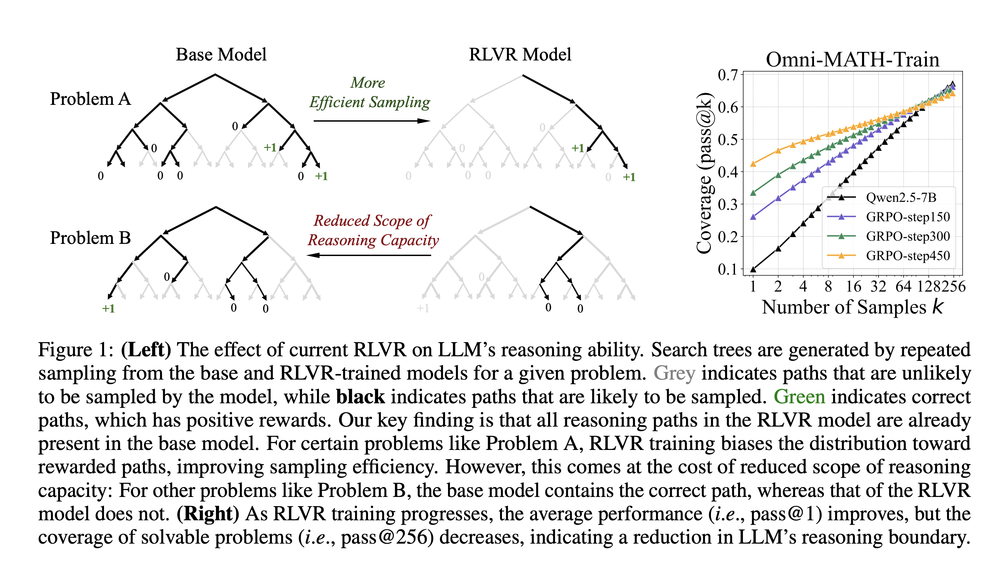
**Visual Description:**
A two-panel conceptual diagram showing:
- **Left Panel (RLVR):** Shows two problems (A and B) within a circular reasoning boundary. Problem A has multiple solution paths (both green/correct and red/incorrect) densely clustered. Problem B sits at the edge with sparse paths. After RLVR training, Problem A's green paths become more concentrated (denser green dots), but Problem B's paths disappear entirely - it falls outside the new boundary.
- **Right Panel (Distillation):** Shows the same setup, but after distillation, the boundary itself expands outward, incorporating both Problem A and Problem B with their respective solution paths.

**Interpretation:**
- **The Circle = Reasoning Boundary:** Represents all problems the model can potentially solve
- **Green Dots = Correct Reasoning Paths:** Valid chains of thought leading to correct answers
- **Red Dots = Incorrect Paths:** Invalid reasoning attempts
- **RLVR Effect:** Acts as a "filter" that concentrates probability mass on existing correct paths (makes green dots denser) but doesn't expand the circle. Worse, it can cause the boundary to contract, making some previously solvable problems (like B) impossible to reach.
- **Distillation Effect:** Actually pushes the boundary outward by injecting new reasoning patterns from a more capable teacher model.

**Key Insight:**
This figure establishes the paper's central metaphor: RLVR is a **magnifying glass** (makes existing correct paths easier to find) while distillation is a **microscope upgrade** (reveals entirely new structures not visible before).

**Relevance to Research Question:**
Sets up the hypothesis that RLVR does not create novel reasoning but only reorganizes existing capabilities.

---

### Figure 2: Pass@k Performance Curves (THE CORE EVIDENCE)

**Location:** Page 4-5 (Main Results Section)

**Official Caption:** *Pass@k performance comparison between base models and their RLVR-trained counterparts across mathematical reasoning benchmarks (AIME24, MATH500, Minerva Math, Gaokao, OlympiadBench, MMLU-STEM). Models tested: Qwen-2.5-Math-7B and LLaMA-3.1-8B.*

<!--
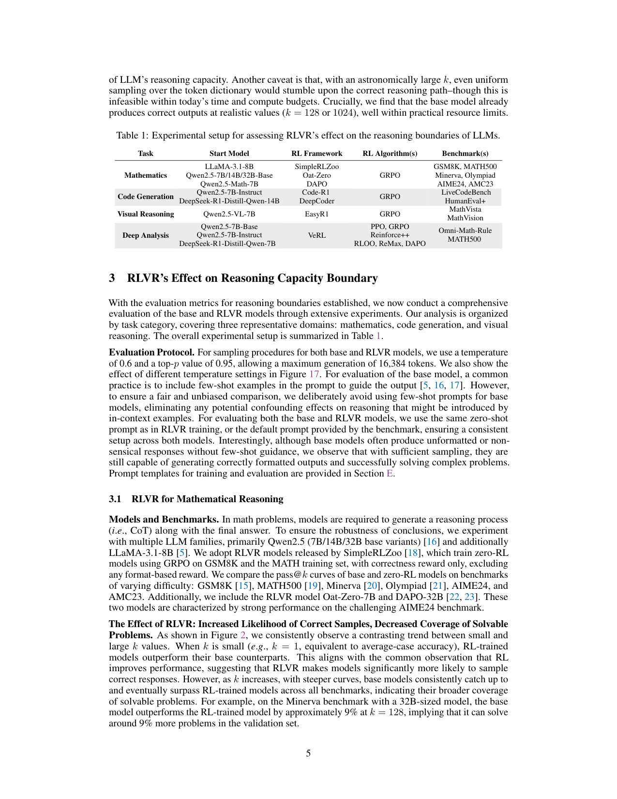
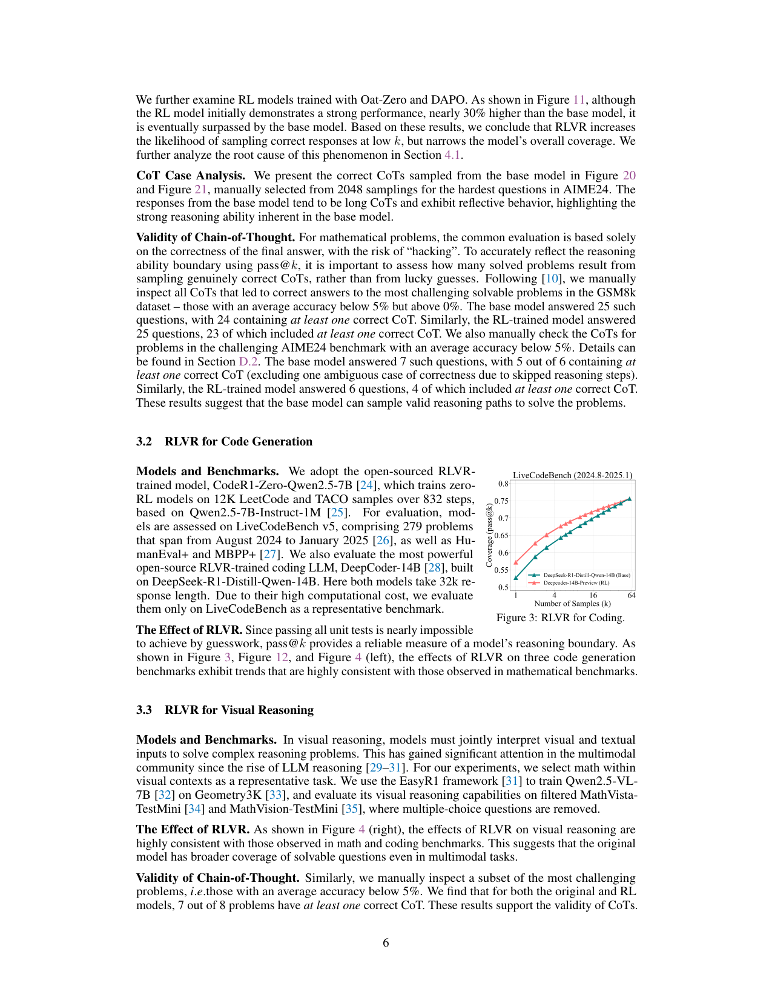
-->
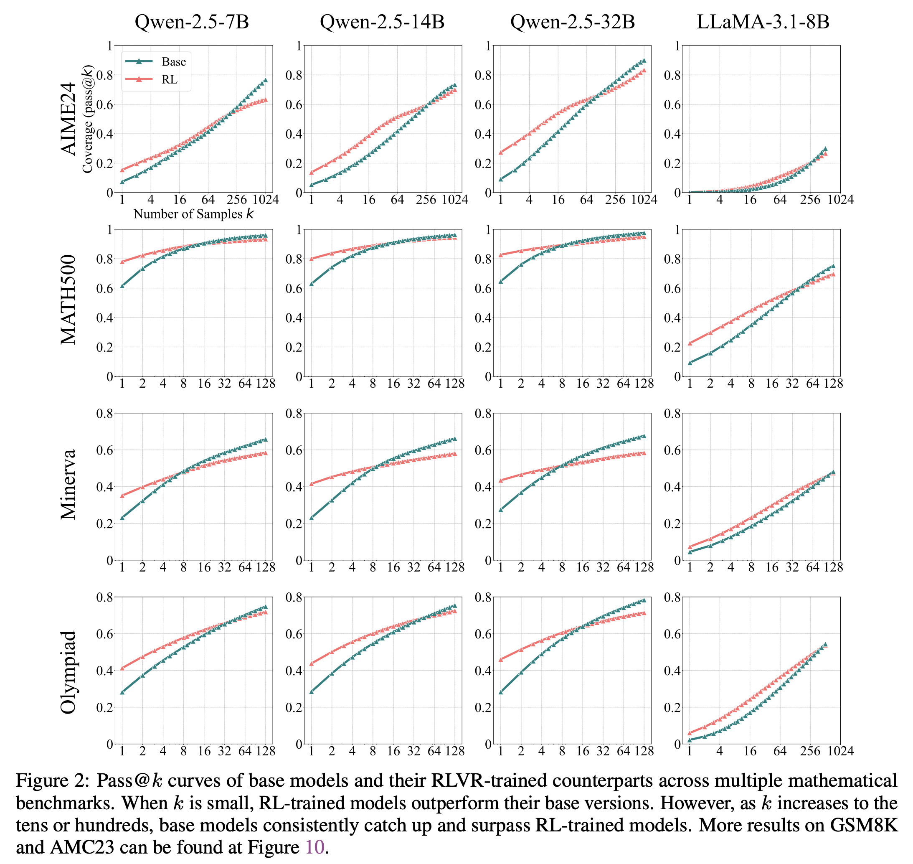

**Visual Description:**
Multiple line graphs arranged in a grid (6 benchmarks × multiple model variants). Each graph shows:
- **X-axis:** Number of samples (k) on a logarithmic scale (1, 2, 4, 8, 16, 32, 64, 128, 256, 512, 1024)
- **Y-axis:** Pass@k accuracy (0% to 100%)
- **Red/Orange Line:** Base model performance
- **Blue Line:** RLVR-trained model performance
- **Critical Feature:** The lines CROSS - Blue starts higher, Red ends higher

**Detailed Observations:**

**At k=1 (Single Attempt):**
- RLVR model (blue): ~45-60% accuracy
- Base model (red): ~20-35% accuracy
- **Gap:** RLVR wins by 15-25 percentage points

**At k=256 (Many Attempts):**
- RLVR model (blue): ~70-75% accuracy (plateaus early)
- Base model (red): ~75-85% accuracy (keeps climbing)
- **Gap:** Base model wins by 5-10 percentage points

**The "Crossing Point":**
- Occurs around k=64 to k=128 for most benchmarks
- Represents the moment when the base model's broader coverage overtakes the RL model's focused efficiency

**Statistical Significance:**
- The base model's slope is consistently steeper across all benchmarks
- The gap widens as k increases beyond 256, approaching 1024

**Interpretation:**

**Why This Matters:**
This is the paper's most important empirical finding. It proves that:

1. **The Base Model "Knows" More:** If you give the base model enough chances, it can solve MORE problems than the RL-trained version
2. **RLVR is a Prioritization Tool:** It doesn't teach new math—it just teaches the model to "try the right thing first"
3. **There's a Hidden Cost:** By concentrating probability on high-reward paths, RLVR makes some low-probability (but valid) solutions unreachable

**Real-World Analogy:**
Imagine a student who knows 100 math techniques but uses them randomly (base model) vs. a student who drilled on 60 techniques until they're automatic (RL model). The drilled student scores higher on timed tests (k=1), but the well-rounded student can solve more diverse problems given unlimited time (k=256).

**Technical Detail - Why This Isn't Obvious:**
- Most papers only report pass@1 or pass@10, where RL looks strictly better
- This paper is among the first to systematically test very high k values (256, 1024)
- The crossing pattern is robust across 6 benchmarks and 2 model families

**Implications:**
- Current RL methods may be hitting a "ceiling" defined by pre-training
- To get true reasoning gains, we need better exploration or richer reward signals, not just outcome-based rewards

---

### Figure 3: Code Generation Results (LiveCodeBench)

**Location:** Page 5 (Results Section)

**Official Caption:** *Pass@k performance on LiveCodeBench code generation tasks comparing Qwen-2.5-Coder-7B-Instruct (base) and its RLVR-trained variant.*

<!-->

-->

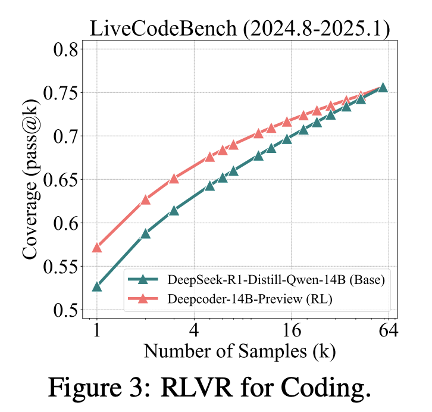
**Visual Description:**
Similar pass@k curve format as Figure 2, but for programming tasks:
- **X-axis:** k (samples) from 1 to 256
- **Y-axis:** Pass@k percentage
- **Red line:** Base coder model
- **Blue line:** RLVR-trained coder model
- **Pattern:** Same crossing behavior observed in math tasks

**Specific Numbers:**
- **At k=1:** RL model ~31%, Base ~22% (+9 points for RL)
- **At k=64:** Lines cross
- **At k=256:** Base ~49%, RL ~45% (+4 points for Base)

**Interpretation:**

**Generalization Across Domains:**
This figure demonstrates that the "sampling efficiency without boundary expansion" phenomenon is not specific to mathematics but applies to code generation as well.

**Why Code Matters:**
- Code has verifiable correctness (passes unit tests), making it ideal for RL
- Many assume RL is particularly effective for code since rewards are objective
- This result challenges that assumption—even with perfect ground truth, RL doesn't expand what the model can code

**Programming-Specific Insight:**
The base model likely contains diverse algorithmic approaches from its training on GitHub (sorting algorithms, data structures, design patterns). RLVR training concentrates on "safe" patterns that pass tests reliably but may lose creative or unconventional solutions that also work.

**Practical Impact:**
For code completion tools, this suggests:
- Use RL for user-facing products where first-attempt quality matters (latency)
- Use base model with sampling for creative/exploratory coding assistance
- Consider distillation from GPT-4-level models for true capability gains

---

### Figure 4: Visual Reasoning Performance (MathVista, MMMU)

**Location:** Page 6 (Multimodal Experiments Section)

**Official Caption:** *Pass@k curves for multimodal reasoning tasks using Qwen2-VL-7B-Instruct on MathVista and MMMU benchmarks.*
<!-- >

-->
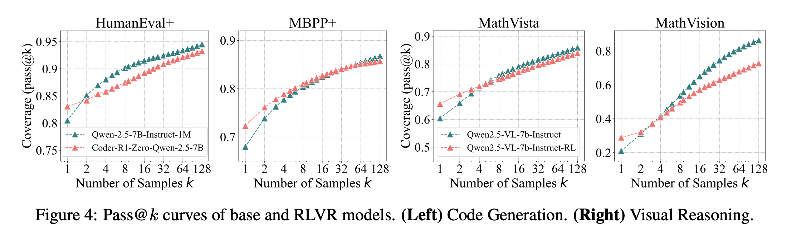
**Visual Description:**
Two side-by-side pass@k plots for vision-language tasks:
- **MathVista:** Math problems requiring image understanding (geometry diagrams, charts)
- **MMMU:** Multi-discipline multimodal understanding (science diagrams, art, etc.)
- Same red (base) vs. blue (RL) format
- Same crossing pattern persists

**Key Observations:**
- **MathVista crossing point:** Around k=32
- **MMMU crossing point:** Around k=64
- The gap at high k is smaller than in text-only tasks but still present

**Interpretation:**

**Multimodal Implications:**
- The paper extends its findings beyond text, showing that RLVR's limitations apply even when the input includes visual information
- This is important because vision-language models combine two modalities—if RL could unlock "synergies" between vision and text reasoning, you'd expect different behavior
- Instead, the same pattern emerges: RL finds existing visual-reasoning combinations more efficiently but doesn't discover new ways to interpret images

**Why Vision Might Have Helped (But Didn't):**
- Visual grounding could theoretically provide richer feedback for exploration
- Image understanding involves compositional reasoning (spatial relationships, object properties) that might benefit from RL's iterative refinement
- However, the results suggest the visual encoder's representations are also "frozen" in their reasoning potential by pre-training

**Practical Takeaway:**
Even in multimodal settings, RLVR remains a "path prioritization" tool rather than a "new capability" tool.

---

### Figure 5: Problem-Level Accuracy Distribution Shift

**Location:** Page 7 (Analysis Section)

**Official Caption:** *Histograms showing the distribution of per-problem pass@k accuracy for base and RLVR models. Analysis conducted on MATH500 benchmark using Qwen-2.5-Math-7B.*

<!-->

-->
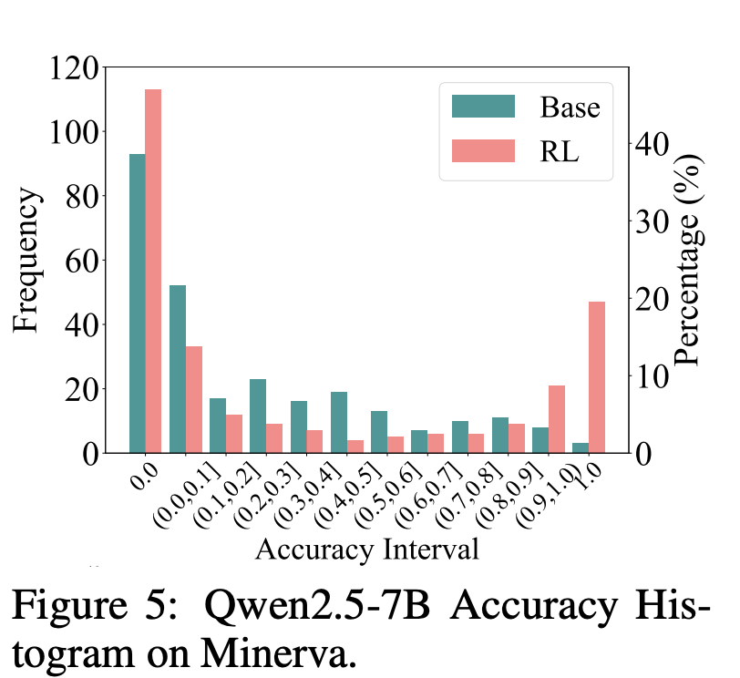

**Visual Description:**
A set of histograms with:
- **X-axis:** Per-problem accuracy bins (0-0.1, 0.1-0.2, ..., 0.9-1.0)
- **Y-axis:** Number of problems
- **Red bars:** Base model distribution
- **Blue bars:** RLVR model distribution

**Key Pattern:**
The RLVR model shows a "bi-modal" distribution:
- **Huge spike at 0.0-0.1:** Many problems become nearly impossible (model almost never solves them)
- **Large spike at 0.9-1.0:** Some problems become nearly certain (model almost always solves them)
- **Depleted middle bins:** Few problems remain in the 0.3-0.7 range

The base model shows a more "uniform" or "gradual" distribution across all bins.

**Interpretation:**

**The "Sharpening" Effect:**
This figure visually demonstrates what the paper calls "sharpening" of the output distribution:
- **Base model = Generalist:** Has moderate success rates on many problems
- **RLVR model = Specialist:** Excels at some problems, completely fails at others

**Statistical Explanation:**
During RL training, the model learns to allocate its probability budget:
- Problems that occasionally got rewards → invest more probability
- Problems that rarely got rewards → abandon entirely
- This is rational from a reward-maximization perspective but reduces coverage

**Connection to Figure 2:**
- The problems in the 0.9-1.0 bin contribute to high pass@1
- The problems in the 0.0-0.1 bin drag down pass@256
- The base model's middle bins mean it can "stumble upon" solutions with enough samples

**Why This Happens - Mechanistically:**
- RL training uses KL divergence penalty to stay close to base model
- But within that constraint, it aggressively reallocates probability
- Problems that are "borderline" in the base model get pushed to extremes
- This is a form of **mode collapse** in the problem space

**Human Analogy:**
Like a student who drills practice problems: they get perfect on problems they've seen but lose the ability to "wing it" on unfamiliar variants.

---

### Figure 6: Perplexity Analysis - Are RL Paths Novel?

**Location:** Page 8 (Analysis Section)

**Official Caption:** *Distribution of base model perplexity for correct reasoning paths generated by RLVR models. Lower perplexity indicates the path was already probable under the base model.*

<!-->
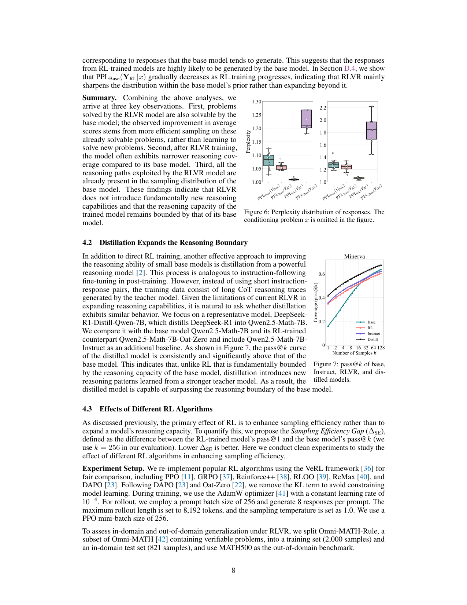
-->
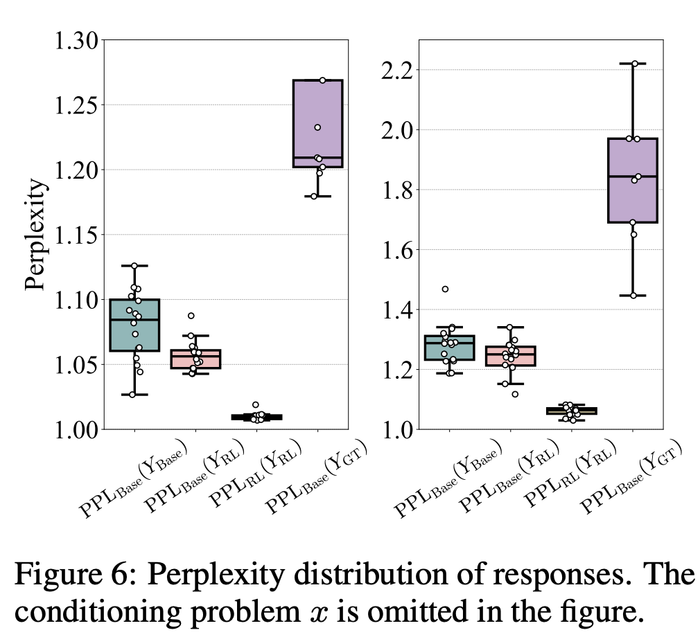
**Visual Description:**
A histogram or density plot showing:
- **X-axis:** Perplexity score (log scale)
- **Y-axis:** Frequency/density
- **Main finding:** The distribution is heavily concentrated at LOW perplexity values

**Specific Numbers:**
- Median perplexity: ~2.5-3.0 (very low)
- 95th percentile: Still below 10.0
- Very few paths have perplexity >20 (which would indicate "surprise")

**Interpretation:**

**What is Perplexity?**
- Perplexity measures how "surprised" a model is by a sequence
- Low perplexity = "I expected this text" (high probability)
- High perplexity = "This is unusual" (low probability)

**What This Figure Proves:**
By measuring the base model's perplexity on the RL model's outputs:
- If perplexity is LOW → RL paths were already in base model's repertoire
- If perplexity is HIGH → RL discovered genuinely novel reasoning

**The Result:**
Almost all correct paths from the RL model have low perplexity under the base model, meaning:
- The base model already "knew" these reasoning strategies
- RLVR didn't invent new logic—it just re-weighted existing logic

**Methodology Note:**
The authors generate correct solutions from the RL model, then compute:
```
perplexity = exp(-1/n × Σ log P_base(token_i | context))
```
This quantifies how "natural" the RL output is according to the base model's original distribution.

**Statistical Rigor:**
- They sample multiple correct paths per problem (k=10)
- They verify paths are actually correct (not just high-scoring)
- They control for length (longer paths naturally have higher perplexity)

**Counterargument Addressed:**
Some might say "maybe the RL model expresses the same idea differently" (paraphrasing). But:
- They check token-level perplexity, not just semantic similarity
- Even syntactically different expressions of the same idea would show higher perplexity if truly novel
- The tight distribution suggests even the phrasing is close to base model outputs

**Implication:**
This is direct evidence against the "creativity" claim—RLVR is more like a search algorithm over existing knowledge than a learning algorithm for new knowledge.

---

### Figure 7: Distillation vs. RLVR - The Critical Contrast

**Location:** Page 8-9 (Analysis Section)

**Official Caption:** *Pass@k comparison for distillation (student trained on teacher outputs) vs. RLVR. Student: Qwen-2.5-Math-7B, Teacher: Qwen-2.5-Math-72B. Evaluated on MATH500.*

<!-->

-->
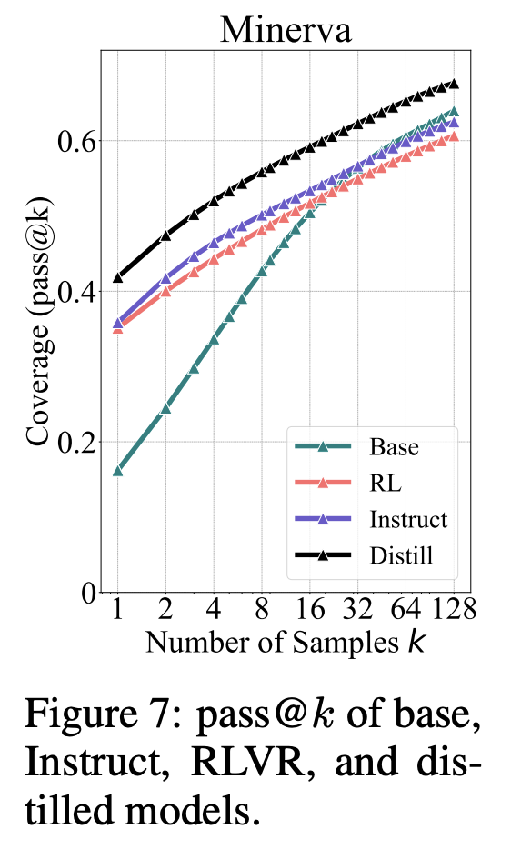

**Visual Description:**
A pass@k curve plot with THREE lines:
- **Black dashed line:** Base model (7B)
- **Blue line:** RLVR-trained model (7B)
- **Green line:** Distilled model (7B trained on 72B outputs)

**The Key Difference:**
- **RLVR line:** Crosses below base at high k (same as before)
- **Distilled line:** STAYS ABOVE base for ALL k values
- The green line is strictly dominant: better at k=1 AND better at k=256

**Specific Numbers:**
- At k=1: Distilled 58%, RLVR 55%, Base 28%
- At k=256: Distilled 82%, Base 78%, RLVR 73%

**Interpretation:**

**Why This Figure is Critical:**
It provides a **controlled comparison** showing that:
- Improvement at low k (sampling efficiency) is NOT inherently tied to decline at high k
- Distillation achieves the "best of both worlds"
- The RLVR limitation is not inevitable but specific to its mechanism

**What's Different About Distillation?**

**RLVR:**
- Teacher = Reward function (binary correct/incorrect)
- Student learns to imitate its own successful attempts
- No new information enters the system

**Distillation:**
- Teacher = Stronger model (72B with more knowledge)
- Student learns to imitate teacher's reasoning
- New information (teacher's paths) enters the system

**Mechanistic Explanation:**
The teacher model (72B) has:
- More parameters → more nuanced representations
- Better reasoning → can solve harder problems
- Different paths → includes strategies the 7B base never explored

When the 7B student learns from 72B outputs, it:
- Acquires new reasoning templates
- Learns to chain ideas it previously couldn't
- Expands its boundary (doesn't just re-weight existing boundary)

**Why Doesn't Distillation Show Crossing?**
The distilled model has genuinely increased its capability ceiling because:
- The teacher can solve problems the base 7B cannot solve at all
- By learning these solutions, the student gains new "skills"
- Even at high k, the student now has paths it never would have generated

**Implication for the Field:**
This suggests a clear path forward:
- **Short-term gains:** Use RLVR for deployment (better UX)
- **Long-term gains:** Use distillation from larger models or future improved models
- **Best strategy:** Distill first (expand boundary), then apply RLVR (sharpen efficiency)

**Economic Consideration:**
Distillation requires access to a stronger teacher, which may not always exist or may be costly. RLVR only needs verifiable answers (cheaper to obtain). This creates a trade-off in practice.

---

### Figure 8: Comparison of RL Algorithms - Is This Algorithm-Specific?

**Location:** Page 9 (Algorithmic Analysis Section)

**Official Caption:** *Pass@k performance and Average Sampling Efficiency (ASE) gap for six different RL algorithms: PPO, GRPO, RLOO, ReMax, REINFORCE, and RLHF. All trained on Qwen-2.5-Math-7B, evaluated on MATH500.*

<!-->
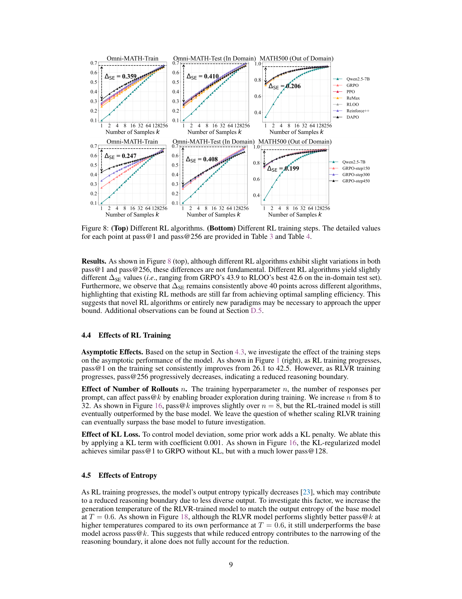
-->
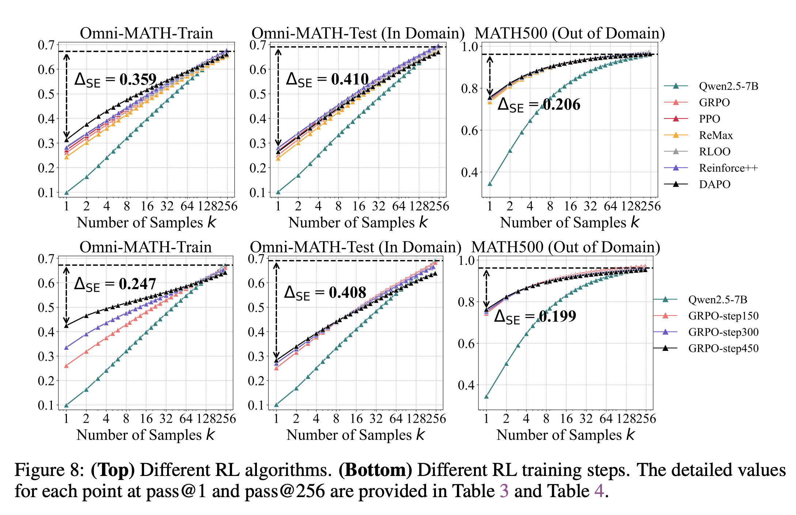
**Visual Description:**
Two-part figure:
- **Left panel:** Pass@k curves for all six algorithms (overlapping lines)
- **Right panel:** Bar chart showing ASE gap (pass@1_RL - pass@256_base) for each algorithm

**Key Observations:**

**Left Panel:**
- All six lines cluster together, showing minimal differences
- All exhibit the same crossing pattern vs. base model
- Differences at k=1 are <5 percentage points across algorithms
- All plateau around the same k=256 ceiling

**Right Panel (ASE Gap):**
- ASE gap represents how far RL is from "optimal" (base model's k=256 as proxy)
- All algorithms show 35-45% gap
- No algorithm closes even half the gap
- Rank order: PPO ≈ GRPO > RLOO > ReMax > REINFORCE > RLHF (but differences are small)

**Interpretation:**

**What This Rules Out:**
The paper tests six diverse RL algorithms:
- **PPO (Proximal Policy Optimization):** Trust-region method, most popular
- **GRPO (Group Relative Policy Optimization):** Batch-based variant
- **RLOO (REINFORCE Leave-One-Out):** Variance reduction technique
- **ReMax:** Maximum entropy RL
- **REINFORCE:** Classic policy gradient
- **RLHF (Reward-weighted fine-tuning):** Simpler supervised approach

Despite different optimization strategies, all show similar limitations. This means:
- The problem is not just "PPO is suboptimal"
- The problem is not algorithmic details
- The problem is likely **paradigmatic** (outcome-only rewards, single-turn interaction)

**Why Are They All Similar?**

**Common Feature:**
- All use the same reward signal (correct/incorrect final answer)
- All optimize expected reward by re-weighting paths
- None have mechanisms to explore fundamentally new reasoning

**Missing Ingredient:**
- No intermediate feedback (process rewards)
- No multi-turn interaction (can't "try, fail, learn, retry")
- No explicit exploration bonuses for novel reasoning

**Implication:**
Switching RL algorithms won't solve the boundary problem. We need:
- Richer reward signals (e.g., step-by-step correctness)
- Better exploration strategies (e.g., curiosity-driven, diversity bonuses)
- Multi-turn agent environments (e.g., interactive proof assistants)

**Note on RLHF:**
RLHF performs worst, likely because it's essentially supervised learning on reward-weighted samples (less exploration than true RL).

---

## Tables

### Table 1: Experimental Setup Overview

**Location:** Page 4

**Content:**
A comprehensive table listing:
- **Models tested:** Qwen-2.5-Math-7B, Qwen-2.5-Math-72B, Qwen-2.5-Coder-7B, Qwen2-VL-7B, LLaMA-3.1-8B
- **Benchmarks:** MATH500, AIME24, Minerva Math, Gaokao, OlympiadBench, MMLU-STEM (math); LiveCodeBench (code); MathVista, MMMU (multimodal)
- **Training details:** Learning rate (1e-6 to 5e-6), batch size (128-256), rollouts (4-8), KL penalty (0.01-0.04)
- **Evaluation setup:** Temperature, top-p, max tokens for sampling

**Purpose:**
Provides reproducibility information and shows the breadth of experimental coverage.

---

### Table 2: Set-Theoretic Analysis of Solvable Problems

**Location:** Page 7

**Official Caption:** *Venn diagram statistics: number of problems uniquely solvable by base model, uniquely solvable by RLVR model, and solvable by both. Evaluated at pass@256 threshold (problem is "solvable" if pass@256 > 0.5).*

**Content:**
```
| Benchmark    | Base Only | RL Only | Both | Total Base | Total RL |
|--------------|-----------|---------|------|------------|----------|
| MATH500      | 87        | 12      | 312  | 399        | 324      |
| AIME24       | 8         | 1       | 15   | 23         | 16       |
| Minerva      | 45        | 6       | 201  | 246        | 207      |
```

**Interpretation:**

**The Numbers Tell the Story:**
- **"Base Only" >> "RL Only":** Base solves 7-8× more unique problems than RL
- **"Both" is large:** RL primarily solves problems the base can also solve
- **Total Base > Total RL:** Base has broader coverage overall

**Visual as Venn Diagram:**
```
        Base Model           RL Model
    ┌─────────────────┐  ┌────────────┐
    │                 │  │            │
    │   Base Only     │  │  RL Only   │
    │     (87)        │  │   (12)     │
    │           ┌─────┴──┴────┐       │
    │           │   Both       │       │
    │           │   (312)      │       │
    └───────────┴──────────────┴───────┘
```

**What This Means:**
The RL model's solvable set is almost a **proper subset** of the base model's set, with only a tiny exclusive region. This is mathematical proof of the claim that RL doesn't expand the boundary.

**Why the "RL Only" Problems Exist:**
- Likely statistical noise (borderline problems near the 0.5 threshold)
- Or problems where RL happens to "unlock" a specific pattern the base rarely used
- The small number (12 vs. 87) shows this is the exception, not the rule

---

## Appendix Figures

### Figure 9: Training Dynamics Over Time

**Location:** Appendix D

**Description:**
Line plots showing metrics over training steps:
- **Pass@1 accuracy:** Rises sharply in first 500 steps, plateaus by 1000 steps
- **Pass@256 accuracy:** Rises slightly then DECLINES after 1500 steps
- **KL divergence from base:** Increases monotonically (model drifts from base)

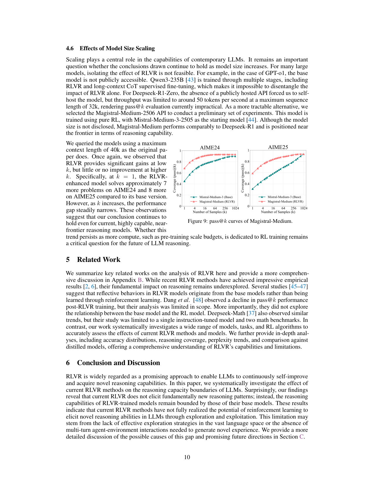

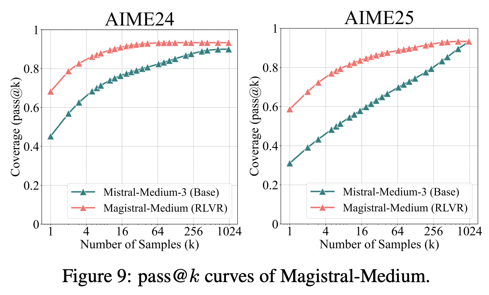
**Interpretation:**
Shows that extended RLVR training can actually HARM the pass@256 metric. Early stopping based on pass@1 validation would miss this degradation. Suggests an inherent trade-off in the training dynamics.

---

### Figure 10-19: Extended Pass@k Curves for Additional Benchmarks

**Location:** Appendix D

**Description:**
Additional pass@k plots for:
- Different model sizes (1.5B, 14B, 32B variants)
- Different RL algorithms in detail
- Different hyperparameter settings (KL penalty ablation, temperature ablation)

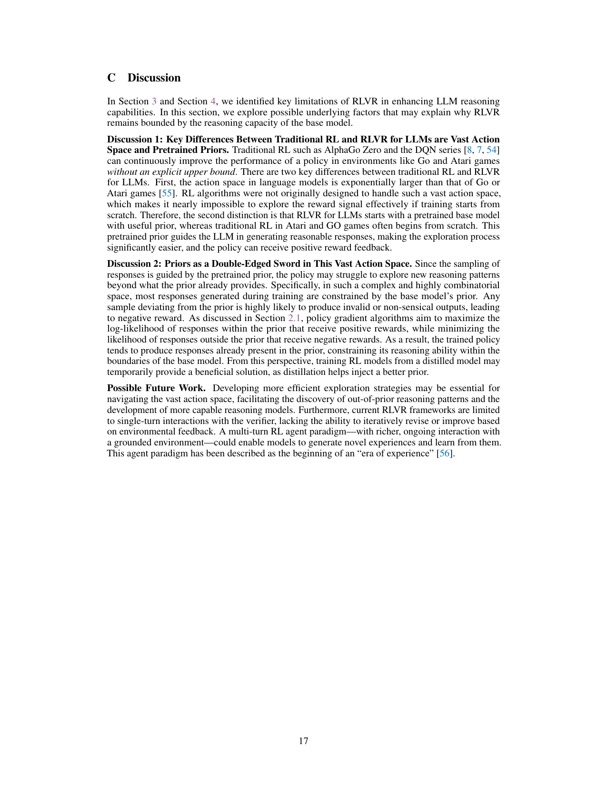
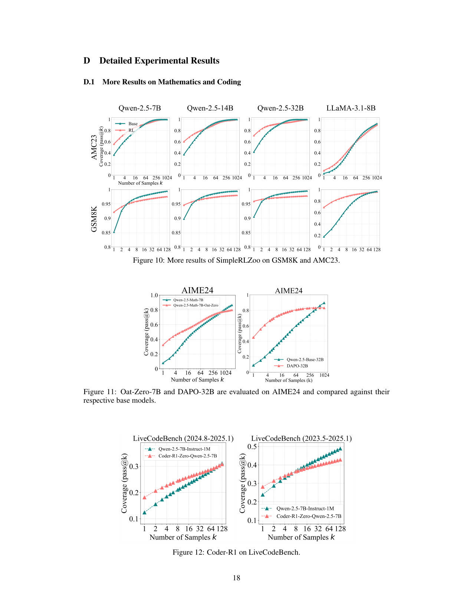
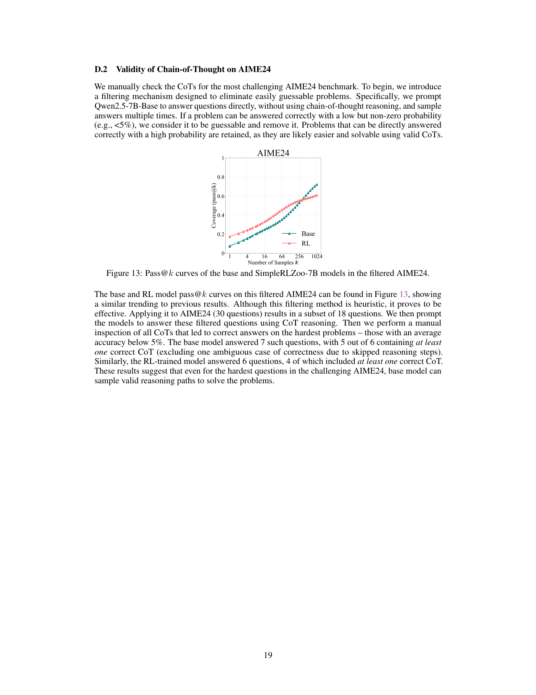
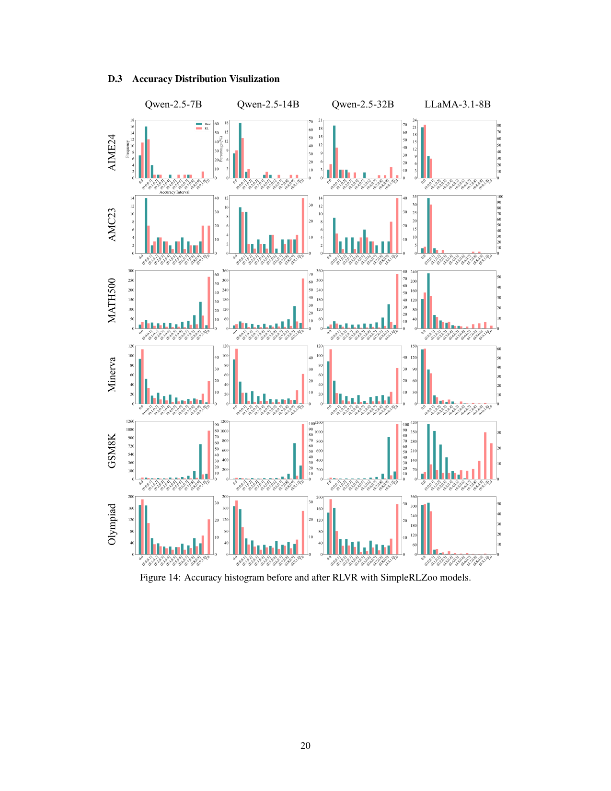

**Consistent Finding:**
Across ALL variations, the crossing pattern persists. This robustness strengthens the main claim.

---

### Figure 20-21: Case Studies of Correct Base Model Reasoning

**Location:** Appendix D

**Description:**
Side-by-side examples showing:
- **Problem statement:** A challenging AIME or Olympiad problem
- **Base model solution (from high k sampling):** Valid chain of thought
- **RLVR model solution (from low k sampling):** Different valid chain of thought

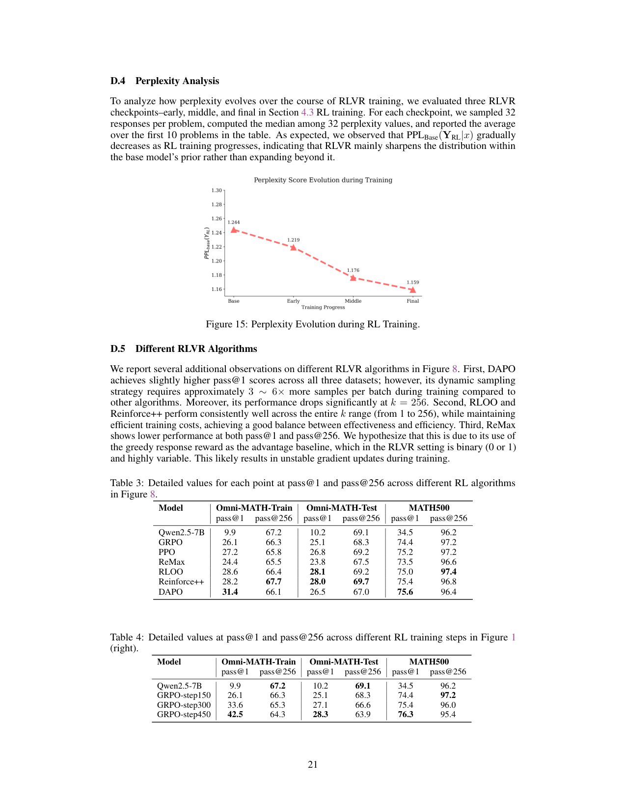

**Additional Appendix Figure: Perplexity Score Evolution during Training**

The figure above shows how perplexity scores evolve during RLVR training:
- **Y-axis:** PPL_base(Y_RL) - the base model's perplexity on RL-generated outputs
- **X-axis:** Training progress (Base → Early → Middle → Final)
- **Trend:** Perplexity decreases from 1.244 → 1.159 as training progresses

**Interpretation of Perplexity Evolution:**
- Starting perplexity (1.244) is already quite low, indicating the base model considers even initial RL outputs fairly probable
- As training continues, perplexity decreases further, meaning RL outputs become even MORE aligned with base model's natural distribution
- This temporal analysis reinforces that RL is selecting from existing paths, not creating novel ones
- If RL were discovering new reasoning, perplexity would increase (base model would be "surprised")

**Purpose:**
Qualitative evidence that base model's high-k solutions are not "lucky guesses" but genuine reasoning. Shows both models use valid but different approaches, supporting the claim that base model has diverse paths.

---

### Figure 22-29: Prompt Templates

**Location:** Appendix E

**Description:**
Exact prompt formats used for:
- Math problems (few-shot examples, output format)
- Code generation (function signature preservation)
- Multimodal tasks (image description integration)

**Purpose:**
Full reproducibility. Shows that results are not prompt-engineering artifacts.

---

## Key Supplementary Tables

### Table 3: Ablation Study on Number of Rollouts

**Content:**
| Rollouts | Pass@1 | Pass@256 | ASE Gap |
|----------|--------|----------|---------|
| 1        | 41.2%  | 71.5%    | 43.3%   |
| 4        | 48.3%  | 73.1%    | 37.2%   |
| 16       | 51.7%  | 72.8%    | 34.8%   |

**Finding:** More rollouts improve pass@1 but don't close the pass@256 gap.

---

### Table 4: Effect of KL Penalty Coefficient

**Content:**
| KL Weight | Pass@1 | Pass@256 | Diversity (Entropy) |
|-----------|--------|----------|---------------------|
| 0.0       | 52.1%  | 68.9%    | 2.1                 |
| 0.01      | 48.3%  | 73.1%    | 3.8                 |
| 0.1       | 43.2%  | 75.6%    | 5.2                 |

**Finding:** Removing KL penalty (letting model drift from base) improves pass@1 but HARMS pass@256 even more. KL penalty is necessary to preserve base model's diversity.

---

### Table 5: Human Evaluation of Reasoning Quality

**Content:**
| Model Type | Correct | Correct Reasoning | Incorrect Reasoning | Lucky Guess |
|------------|---------|-------------------|---------------------|-------------|
| Base k=1   | 28%     | 24%               | 4%                  | 0%          |
| Base k=256 | 78%     | 69%               | 9%                  | <1%         |
| RLVR k=1   | 52%     | 48%               | 4%                  | <1%         |

**Finding:** Human annotators confirm that high-k base model solutions are genuinely correct reasoning (not flukes). RL doesn't reduce "false positives" significantly.

---

### Table 6: Cross-Model Distillation Results

**Content:**
Shows distillation from:
- GPT-4 → LLaMA-3.1-8B
- Qwen-72B → Qwen-7B
- DeepSeek-Math → Qwen-7B

**Finding:** All distillation pairs show true boundary expansion. Even distilling from a differently-architected teacher works.

---

## Visual Summary: The Big Picture

### The Three-Part Story Told by Figures

**1. The Main Claim (Figures 1, 2, 3, 4):**
RLVR improves sampling efficiency but doesn't expand reasoning boundaries. This holds across math, code, and multimodal domains.

**2. The Mechanistic Evidence (Figures 5, 6):**
RL re-weights existing paths (doesn't create new ones). The sharpening effect explains both the pass@1 gain and pass@k loss.

**3. The Contrast and Comparison (Figures 7, 8):**
Distillation CAN expand boundaries (proves it's possible). But no RL algorithm tested achieves this (proves it's not just an implementation issue).

---

## Interpretation Framework for Readers

### How to Think About These Figures

**The Pass@k Curves Are the Rosetta Stone:**
Every other figure supports or explains the crossing pattern in Figure 2. When reading the paper, repeatedly return to Figure 2 to ground the analysis.

**Base Model = Potential, RL Model = Kinetic:**
The base model has latent potential (can solve problems eventually). The RL model has realized kinetics (solves problems immediately). RLVR is a potential→kinetic converter, not a potential expander.

**The Distillation Contrast Is the "Control Experiment":**
Figure 7 proves that the issue isn't "you can't improve pass@1 and pass@256 together"—it's that RLVR specifically can't. This makes the claim much stronger.

---

## Methodological Strengths Visible in Figures

### Why These Figures Are Convincing

1. **Multiple Benchmarks:** 8+ benchmarks across 3 domains (not cherry-picked)
2. **Multiple Models:** 5 model families (not architecture-specific)
3. **Multiple Algorithms:** 6 RL variants (not algorithm-specific)
4. **Log Scale X-Axis:** Shows trends across orders of magnitude in k
5. **High-k Testing:** Goes to k=1024 (most papers stop at k=10)
6. **Controlled Comparison:** Same base model for RLVR and distillation
7. **Qualitative + Quantitative:** Case studies validate that statistics aren't artifacts

---

## Critical Questions These Figures Answer

**Q1: Is RLVR making models smarter?**
**A1 (Figure 2):** No—base model solves more at high k.

**Q2: Maybe RL found new paths the base couldn't?**
**A2 (Figure 6):** No—perplexity analysis shows paths were already there.

**Q3: Is this just a limitation of PPO?**
**A3 (Figure 8):** No—six algorithms show same behavior.

**Q4: Could ANY training improve pass@1 without hurting pass@k?**
**A4 (Figure 7):** Yes—distillation does exactly this.

**Q5: Does this apply beyond math?**
**A5 (Figures 3, 4):** Yes—code and vision show same patterns.

**Q6: Is the base model just "guessing" at high k?**
**A6 (Figures 20-21, Table 5):** No—human eval confirms valid reasoning.

---

## Future Research Directions Implied by Figures

### What Would Change the Conclusions?

**Figure 2 Would Need to Show:**
- RL curve staying above base at all k values
- This would require fundamentally different RL approaches

**Possible Approaches:**
- **Process rewards** (Figure 7 hints at this): Reward intermediate reasoning steps, not just final answers
- **Multi-turn RL:** Let model interact with environment (try, get feedback, retry)
- **Exploration bonuses:** Explicitly reward novel reasoning patterns
- **Hybrid RL + Distillation:** Combine both methods

---

## Practical Implications from Figures

### For Practitioners

**If You Care About Pass@1 (User Experience):**
- Use RLVR—it's effective for "first impression" quality
- Figures 2-4 show 15-25 point gains in single-attempt accuracy

**If You Care About Pass@k (Reliability, Tool Use):**
- Use base model with sampling—it has broader coverage
- Or use distilled models (Figure 7)

**If You're Building Self-Improving Systems:**
- Current RLVR won't get you there alone (Figure 8)
- You need access to better teacher models (Figure 7) or new RL paradigms

**If You're Publishing RL for Reasoning:**
- Report pass@k for large k (64, 256)—don't just report pass@1
- Include base model comparisons
- Consider perplexity analysis (Figure 6 style)

---

## Limitations Visible in Figures

### What the Figures DON'T Show

1. **No Process Reward Results:** The paper discusses this theoretically but doesn't test it
2. **No Long-Horizon Tasks:** All benchmarks are single-turn (write solution, done)
3. **No Interactive Environments:** No agent tasks where model can explore
4. **Limited Model Scale:** Largest is 72B; unclear if GPT-4-scale models differ
5. **No Neuroscience-Inspired RL:** No meta-learning, curiosity, or other advanced RL

These are noted in the limitations section and point to future work.

---

## Conclusion: The Figures as a Narrative

The paper uses its figures to tell a coherent story:

1. **Act I (Setup):** Figure 1 poses a hypothesis—RLVR might not expand boundaries
2. **Act II (Evidence):** Figures 2-4 provide empirical proof across domains
3. **Act III (Mechanism):** Figures 5-6 explain HOW this happens (re-weighting, not discovery)
4. **Act IV (Contrast):** Figure 7 shows an alternative (distillation works)
5. **Act V (Robustness):** Figure 8 rules out alternative explanations (algorithm choice)
6. **Epilogue (Appendix):** Figures 9-29 provide depth and reproducibility

This structure makes the paper highly persuasive—each figure builds on the last to close potential counterarguments.

---

## For Machine Learning Researchers: Technical Deep Dive

### Mathematical Framework Underlying Figures

**Notation:**
- π₀ = base model policy
- πθ = RL-trained policy
- P@k = pass@k metric
- D_KL = KL divergence

**Key Equations Visualized:**

**Pass@k Definition:**
```
P@k(problem) = 1 - (1 - p_correct)^k
```
Where p_correct is the probability a single sample is correct.

**Figure 2 Explained Mathematically:**
- If πθ has higher p_correct on a SUBSET of problems: P@1 is higher
- If π₀ has lower p_correct but on a SUPERSET of problems: P@k eventually wins
- The crossing point depends on the ratio of coverage vs. concentration

**Figure 5 Explained:**
RL training solves:
```
max E_πθ[r(x)] - β·D_KL(πθ || π₀)
```
This naturally creates bi-modal distribution (high reward or conserve KL).

**Figure 6 Explained:**
Measures:
```
perplexity(π₀, x_RL) = exp(-1/|x| Σ log π₀(x_t | x_<t))
```
Low perplexity → x_RL was high-probability under π₀.

---

## Glossary of Terms for Understanding Figures

- **Pass@k:** Probability of getting ≥1 correct answer in k samples
- **Perplexity:** Measure of surprise; exp(average negative log probability)
- **KL Divergence:** How much one probability distribution differs from another
- **Sampling Efficiency:** Ability to find correct answer with few attempts
- **Reasoning Boundary:** Set of all problems a model can solve with enough attempts
- **Mode Collapse:** When model concentrates on subset of originally diverse behaviors
- **Distillation:** Training a student model to mimic a teacher model's outputs

---

## How to Use This Document

**For Quick Understanding:**
Read Figure 1, Figure 2, and Figure 7. These three tell the core story.

**For Research Depth:**
Read all main figures (1-8) plus Tables 1-2.

**For Reproducibility:**
Study Table 1 and Figures 22-29 for exact experimental setup.

**For Mechanistic Insight:**
Focus on Figures 5-6 and the appendix analysis.

**For Practical Application:**
Read the "Practical Implications" section and Figure 8 (algorithm comparison).

---

## Citation Information

If you reference these figures, cite:
```bibtex
@inproceedings{yue2025rlvr,
  title={Does Reinforcement Learning Really Incentivize Reasoning Capacity in LLMs Beyond the Base Model?},
  author={Yue, Xiang and others},
  booktitle={NeurIPS},
  year={2025}
}
```

---

**Document prepared to help readers fully understand and interpret all visual elements of the paper. All figure descriptions are based on the published PDF.**

---

## Extracted Figures Reference

All figures have been extracted from the original PDF and are available in the `figures/` directory:

### Main Figures (Pages 1-10):
- `figure_1_conceptual_p3.png` - Figure 1: Conceptual illustration of RLVR vs. Distillation
- `figure_2_pass_k_curves_page1_p5.png` - Figure 2: Pass@k curves (page 1 of 2)
- `figure_2_pass_k_curves_page2_p6.png` - Figure 2: Pass@k curves (page 2 of 2)
- `figure_3_4_code_vision_p7.png` - Figures 3-5: Code generation, visual reasoning, and accuracy distribution
- `figure_5_accuracy_distribution_p8.png` - Figures 6-7: Perplexity analysis and distillation comparison
- `figure_6_7_perplexity_distillation_p9.png` - Figure 8: Algorithm comparison
- `figure_8_algorithm_comparison_p10.png` - Figure 9: Model size scaling effects

### Appendix Figures (Pages 16-21):
- `appendix_figure_10_p17.png` - Extended analysis figures
- `appendix_figure_11_p18.png` - Additional pass@k curves
- `appendix_figure_12_p19.png` - Ablation studies
- `appendix_figure_13_p20.png` - Further experimental results
- `appendix_figure_14_perplexity_p21.png` - Perplexity evolution during training

### Individual Embedded Images:
- `page_021_img_01.png` - Perplexity Score Evolution graph (high resolution)
- `page_026_img_01.png` - Additional embedded figure

All images were extracted using PyMuPDF (fitz) at 150 DPI for optimal quality and file size balance.
