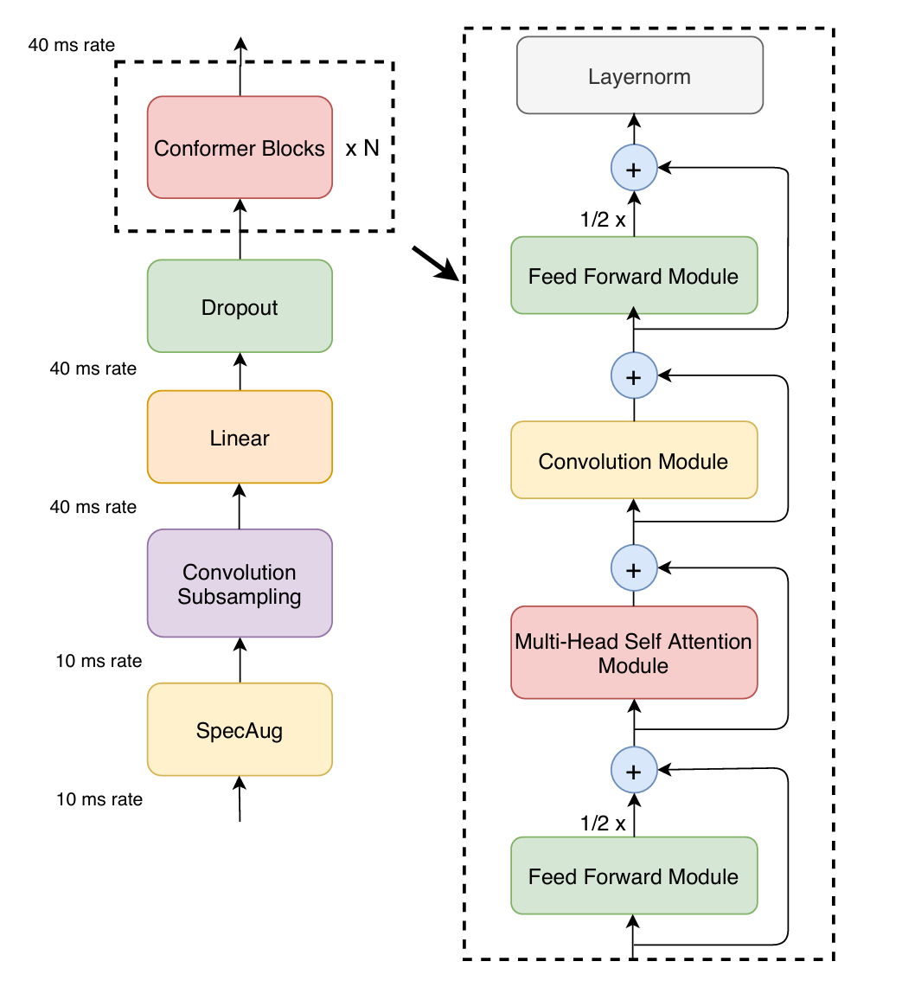

[FastConformer](https://arxiv.org/abs/2305.05084)

FastConformer: optimized Conformer model with 8x depthwise-separable convolutional downsampling and other modifications

Efficient Subsampling:
Reduce the size of the input data while preserving important features, enabling efficient processing of long audio segments.

Long Audio: 11 hours of speech on a single A100 80GB

Achieving RTFx (real time factor) values of 3380 processing 10 minutes of audio in less than 0.2 seconds

# Conformer

## Problem
1. Transformer good at picking up long-range interactions, and less capable at fine grained local patterns
1. CNN - the opposite
