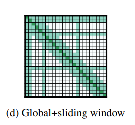
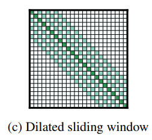
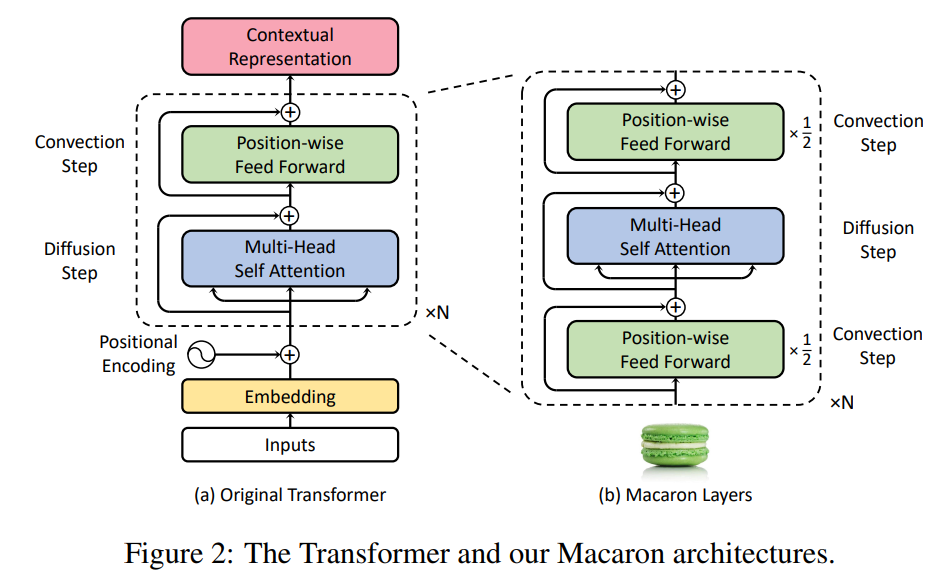

<!-- Use this with copyURLs to open all URLs
https://arxiv.org/pdf/2304.06795
https://arxiv.org/pdf/1211.3711
https://proceedings.mlr.press/v32/graves14.pdf
https://arxiv.org/pdf/2305.05084
https://arxiv.org/pdf/2005.08100
-->
<!--
rxv/2304 - Token Duration Transducer (Nvidia)
rxv/1211 - Sequence Transduction with RNN (Graves)
graves14 - End to End Speech Recognition with RNN (Graves)
rxv/2305 - Fast Conformer (Nvidia)
rxv/2005 - Conformer (Google)
-->

# TDT

FastConformer: optimized Conformer model with 8x depthwise-separable convolutional downsampling and other modifications

Token-and-Duration Transducer: generalization of conventional Transducers, decouples token and duration predicitions.  Allows model to skip blank frames during inference, accelerating processing and enhancing noise robustness.

Efficient Subsampling:
Reduce the size of the input data while preserving important features, enabling efficient processing of long audio segments.

Long Audio: 11 hours of speech on a single A100 80GB

Achieving RTFx (real time factor) values of 3380 processing 10 minutes of audio in less than 0.2 seconds

# Longformer: The Long-Document Transformer

## Problem
How can LLM answer over long context window, example: question + huge document:
- long context window => $n^2$ scaling 

## Expensive
$O(n^2)$

## Global + local info
$O(n \times w)$

## Dilated sliding window

## Receptive field
Receptive field $O(l \times w)$

## Global tokens:
eg. [CLS] for classification task
eg. Question + Document, let the question tokens attend to all of the document and vice versa

## Implementation
Two set of projections:
1. $Q_g, K_g, V_g$ - global
1. $Q_s, K_s, V_s$ - sliding window

## Window sizes
1. lower layers have smaller window size
2. larger window sizes at upper layers

# Conformer

## Problem
1. Transformer good at picking up long-range interactions, and less capable at fine grained local patterns
1. CNN - the opposite

# Macaron

## Euler method
$\frac{dx}{dt} = f(x,t)$
$x_{l+1} = x_{l} + \gamma f(x_l, t_l)$

## Diffusion and Convection

$\frac{dx}{dt} = F_{diff} + G_{conv}$
$\tilde{x(t)} = x(t) + \gamma F(x(t))$
$x(t+\gamma) = \tilde{x}(t) + \gamma G(\tilde{x}(t))$

## Equivalence to Transformer
$\tilde{x_i} = x_i + {\rm MHAttn}(x_i, [...x_j...])$
$x_{next} = \tilde{x} + {\rm FFN}(\tilde{x})$

## Break up convection step

