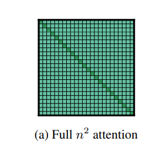
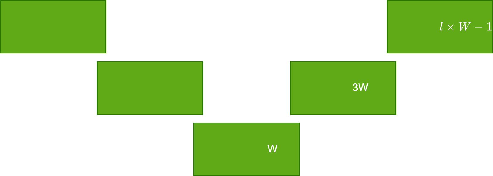

# Longformer: The Long-Document Transformer

## Problem
How can LLM answer over long context window, example: question + huge document:
- long context window => $n^2$ scaling 

## Expensive
$O(n^2)$

## Global + local info
$O(n \times w)$

## Dilated sliding window

## Receptive field
Receptive field $O(l \times w)$

## Global tokens:
eg. [CLS] for classification task
eg. Question + Document, let the question tokens attend to all of the document and vice versa

## Implementation
Two set of projections:
1. $Q_g, K_g, V_g$ - global
1. $Q_s, K_s, V_s$ - sliding window

## Window sizes
1. lower layers have smaller window size
2. larger window sizes at upper layers
