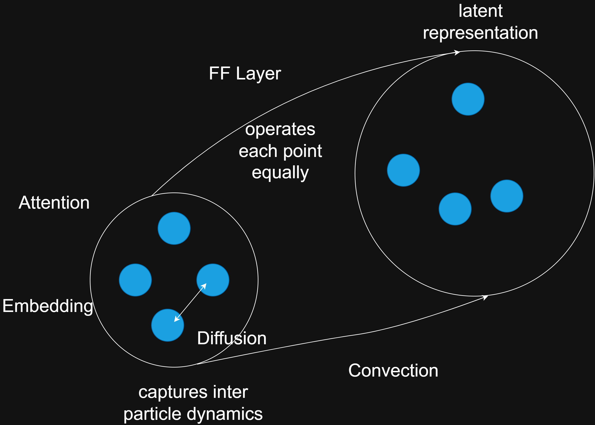

# Macaron

## Euler method
$\frac{dx}{dt} = f(x,t)$
$x_{l+1} = x_{l} + \gamma f(x_l, t_l)$

## Diffusion and Convection

$\frac{dx}{dt} = F_{diff} + G_{conv}$
$\tilde{x(t)} = x(t) + \gamma F(x(t))$
$x(t+\gamma) = \tilde{x}(t) + \gamma G(\tilde{x}(t))$

## Equivalence to Transformer
$\tilde{x_i} = x_i + {\rm MHAttn}(x_i, [...x_j...])$
$x_{next} = \tilde{x} + {\rm FFN}(\tilde{x})$

## Break up convection step
