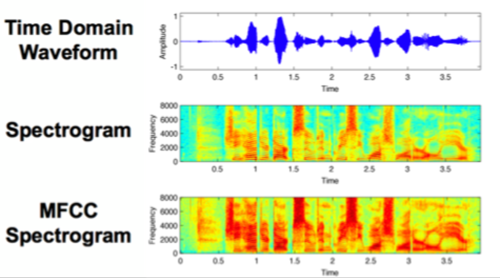

# MFCC

Vector of MFC coefficients, basically power/frequency (spectrogram) as a function of time.  But with added
- variable freq bucket widths
- attenuation factor related to human hearing

<!-->
https://vitalcapacities.com/7613/
<-->

MFCC has about 40 coefficients per unit of time.

### **Difference Between MFCC and Power Spectrogram**  

Both **MFCC (Mel-Frequency Cepstral Coefficients)** and **Power Spectrogram** are time-frequency representations of audio signals, but they serve different purposes and are computed differently. Here’s a breakdown:

---

## **1. Power Spectrogram**  
### **What It Represents**  
- A **Power Spectrogram** is a 2D representation of how the **energy (power)** of an audio signal is distributed across frequencies over time.  
- It is derived directly from the **Short-Time Fourier Transform (STFT)**.  

### **Key Features**  
- **Computation Steps**:  
  1. **STFT**: Split audio into short frames (e.g., 25ms) and compute the Fourier Transform for each.  
  2. **Magnitude Squared**: Convert complex STFT values to power (energy) by taking the squared magnitude:  
     \[
     \text{Power Spectrogram} = |STFT(x)|^2
     \]  
- **Interpretation**:  
  - **X-axis**: Time  
  - **Y-axis**: Frequency (linear scale)  
  - **Color intensity**: Power (dB or log-scaled)  

### **Pros & Cons**  
| Pros | Cons |
|------|------|
| ✔ Preserves all frequency information | ✖ Less compact (high-dimensional) |
| ✔ Simple to compute | ✖ Not perceptually aligned (human hearing is non-linear) |

**Use Cases**:  
- General audio analysis (e.g., music, environmental sounds).  
- Input for neural networks (e.g., CNNs for audio classification).  

---

## **2. MFCC (Mel-Frequency Cepstral Coefficients)**  
### **What It Represents**  
- **MFCCs** are a compact, perceptually motivated representation that mimics how humans perceive sound.  
- They are derived from the **log power spectrogram** but further processed to emphasize speech-relevant features.  

### **Key Features**  
- **Computation Steps**:  
  1. **Compute Power Spectrogram** (as above).  
  2. **Apply Mel Filterbank**:  
     - Convert linear-frequency spectrogram to **Mel scale** (logarithmic, aligned with human hearing).  
     - Smoothes and reduces dimensionality (e.g., 40 Mel bands instead of 512 STFT bins).  
  3. **Take Logarithm**: Compress dynamic range (log of Mel energies).  
  4. **Discrete Cosine Transform (DCT)**:  
     - Extracts **cepstral coefficients** (decorrelates features, similar to PCA).  
     - The first 12–20 coefficients are kept (discarding higher ones as noise).  

- **Interpretation**:  
  - **X-axis**: Time  
  - **Y-axis**: MFCC coefficients (each represents a "spectral shape" component)  
  - **Coefficient 0**: Log energy (often discarded for normalization)  
  - **Coefficients 1–12**: Spectral envelope (most important for speech)  

### **Pros & Cons**  
| Pros | Cons |
|------|------|
| ✔ Compact (low-dimensional) | ✖ Loses phase information |
| ✔ Perceptually relevant (good for speech) | ✖ More complex to compute |
| ✔ Robust to noise (DCT discards fine details) | ✖ Less interpretable than spectrograms |

**Use Cases**:  
- Speech recognition (ASR), speaker identification.  
- Traditional ML models (HMMs, GMMs).  

---

## **Key Differences Summary**  
| Feature | Power Spectrogram | MFCC |
|---------|------------------|------|
| **Basis** | Raw STFT magnitudes | Processed Mel cepstral coefficients |
| **Frequency Scale** | Linear | Mel (logarithmic, human-like) |
| **Dimensionality** | High (all frequency bins) | Low (12–20 coefficients) |
| **Perceptual Alignment** | No | Yes |
| **Phase Info** | Discarded (magnitude only) | Discarded (DCT removes it) |
| **Typical Use** | General audio tasks | Speech-specific tasks |

---

## **Visual Comparison**  
| Power Spectrogram | MFCC |
|------------------|------|
|  |  |
| Shows energy at all frequencies | Shows compact spectral "shapes" |

---

## **When to Use Which?**  
- **Use Power Spectrogram if**:  
  - You need **full frequency resolution** (e.g., music, environmental sounds).  
  - You’re using **deep learning models** (CNNs/Transformers can learn features directly).  

- **Use MFCC if**:  
  - You’re working with **speech** (ASR, speaker recognition).  
  - You need **lightweight features** (e.g., for edge devices).  

---

### **Modern Trends**  
- **Neural Networks** (e.g., Wav2Vec2, HuBERT) often use **raw waveforms** or **learned filterbanks** instead of handcrafted features like MFCC.  
- **Log-Mel Spectrograms** (intermediate step of MFCC) are now more common in deep learning than full MFCC.  

Would you like a **code example** comparing the two?
