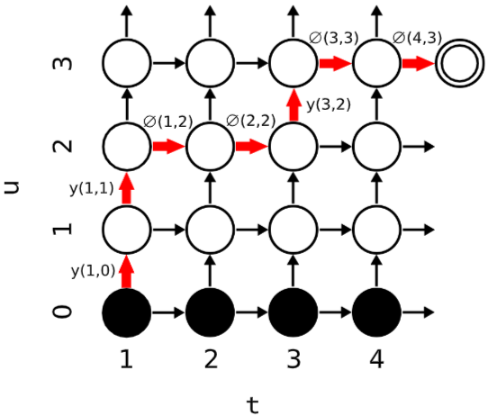

# Graves (2012)
${\bf x} = (x_1, x_2, . . . , x_T)$

Output sequence:
${\bf y} =
(y_1, y_2, . . . , y_U )$

Consider an extended output space:

${\bf {\bar y}} =
(y_1, \empty, y_2, . ..\empty....\empty.. . , y_U )$

Goal NN, that approximates:

$Pr(y ∈ Y^∗
|x) = \sum_{
a \in B^{−1}(y)}
Pr(a|x)$

https://www.reddit.com/r/MachineLearning/comments/2yvnb0/lecture_on_sequence_generation_by_alex_graves/

# Transcription layer

Input: $(x_1, x_2, \cdots, x_T)$

Output: $(f_1, f_2, \cdots, f_T)$

Length: $T$ long.

You can think of these as the encoder in a transformer.

# Prediction layer

Input: $\hat{y} = (\emptyset, y_1, \cdots, y_u)$

Output: $(g_0, g_1, \cdots, g_u)$

Inputs are encoded as one-hot vectors (for $K$ labels).  Empty is encoded with all 0's.

Output layer is size $K+1$ one for each element of $\hat{y}$.

# Joint 

$t,u$ is a particular alignment

$
h(k, t, u) = \exp(f_t^k + g_u^k)
$

$h$ is *probability* of a particular label, given a $t,u$.

$
y(t, u) \equiv \Pr(y_{u+1} | t, u)
$

$y$ is the transition probability for the *next* token output given a particular alignment.

$
\alpha(t, u) = \alpha(t - 1, u) \emptyset(t - 1, u) + \alpha(t, u - 1)y(t, u - 1)
$

$\alpha$ is probability $\Pr(y_{[1:u]} | f_{[1:t]})$, i.e. probability of $u$ tokens, given transcriptions up to $t$.

Probability that I have seen $y_{[1:u-1]}$ given $t$ times the transition probability of seeing a $y_u$

It is confusing that we are not using $\alpha(t-1,u)$, transition of seeing an empty set ...

# Backward probability
$
\beta(t, u) = \beta(t + 1, u) \emptyset(t, u) + \beta(t, u + 1) y(t, u) 
$

$\beta$ is the probability of seeing the remainder of the sequence $[u+1,U]$
given that transcriptions steps $[t,T]$, i.e. $\Pr(y_{[u+1:U]}|f_{[t:T]})$

The product of $\alpha(u,t)\beta(u,t)$ corresponds to the probability of emitting the complete sequence if $y_u$ is emitted during transcription $f_t$.
