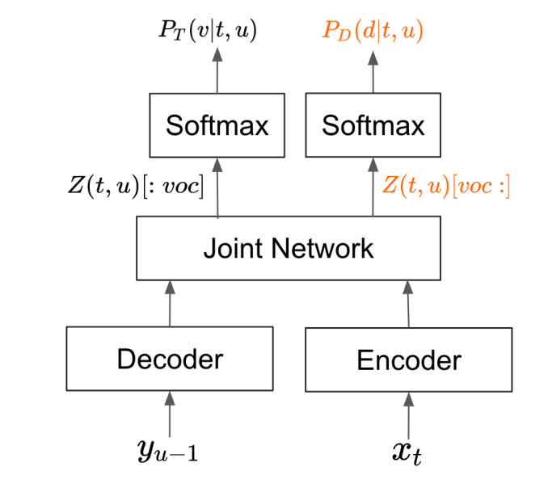

# Token and Duration Transducer

Token-and-Duration Transducer: generalization of conventional Transducers, decouples token and duration predicitions.  Allows model to skip blank frames during inference, accelerating processing and enhancing noise robustness.

# TDT

[TDT](https://arxiv.org/pdf/2304.06795)

