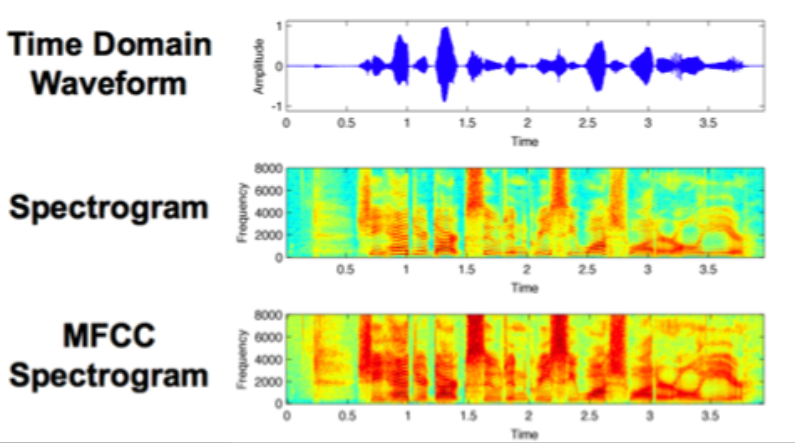

# Token and Duration Transducer

# Graves (2012)
${\bf x} = (x_1, x_2, . . . , x_T)$

Vector of MFC coefficients, basically power/frequency (spectrogram) as a function of time.

<!-->
https://vitalcapacities.com/7613/
<-->

MFCC has about 40 coefficients per unit of time.

Output sequence:
${\bf y} =
(y_1, y_2, . . . , y_U )$

Consider an extended output space:

${\bf {\bar y}} =
(y_1, \empty, y_2, . ..\empty....\empty.. . , y_U )$

Goal NN, that approximates:

$Pr(y ∈ Y^∗
|x) = \sum_{
a \in B^{−1}(y)}
Pr(a|x)$

https://www.reddit.com/r/MachineLearning/comments/2yvnb0/lecture_on_sequence_generation_by_alex_graves/ 