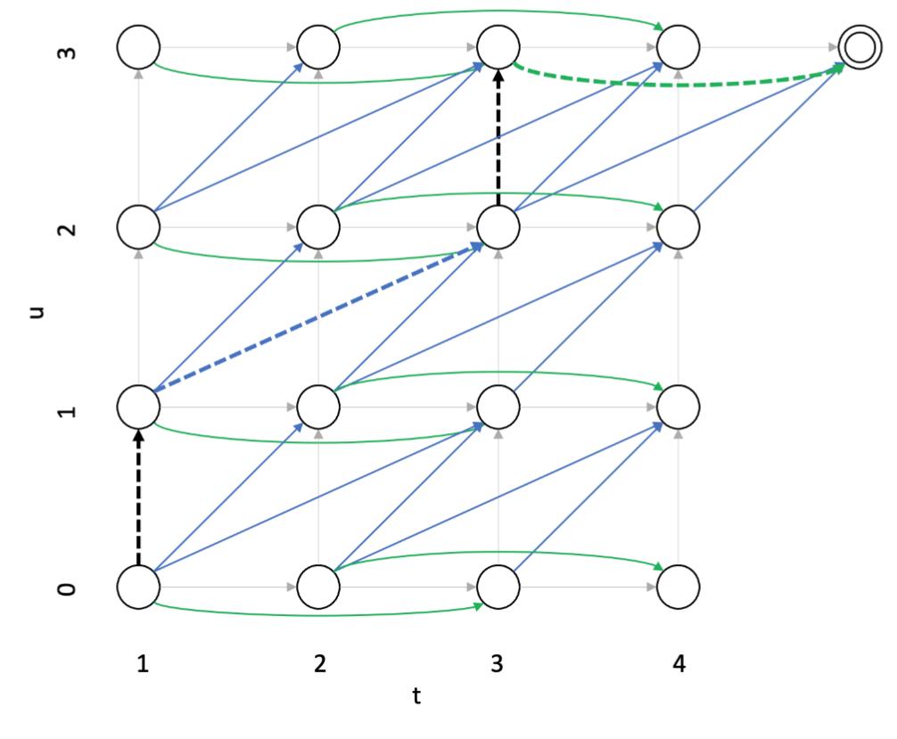

# Transducer

- seq2seq task
  - audio signal in, text out

- encoder/decoder
  - useful when there is a large discrepancy between input length and output length
  - e.g. 2 seconds of speech "hello" translates to 2s * 100 (frames/sec) = 200 frames of features, 200:5 = 40:1 ratio 

- reframe the problem:
  - how to translate/transduce a long sequence (audio) into a much shorter sequence (letters/words)

# Goal
\[
p(y_1, \dots, y_n | X) = \prod_{i=1}^n p(y_i|y_1, \dots, y_{i-1}, X)
\]

Key take away, transform the
\[
\text{Pr}(y^* \in \mathcal{Y}^* | x^*) = \sum_{a^* \in \mathcal{B}^{-1}(y^*)} \text{Pr}(a^* | x^*)
\]

Network will model a distribution over *alignment* space.

## notation

$y \in \mathcal{Y}$ : single phoneme

$y^* \in \mathcal{Y}^*$: sequence of phonemes

${\bar y} \in \bar{\mathcal{Y}}$: phoneme and null token

${\bar y}^* \in \bar{\mathcal{Y}}^*$: sequence version

# RNN-T (Graves 2012)

- over 2400 citations
- two networks
  - **Transcription network**: $x_0,x_1,\cdots x_t \rightarrow f_0, f_1, \cdots f_t$
    - *input*: audio samples (dimension 80 vector for each time step)
    - *output*: transcription sequence over token space of size $K+1$
      - $K = |y|$ cardinality of the output, e.g. number of phonemes
      - $K+1$ include $\varnothing$ - null token

  - **Prediction network**:
    - input: 
      - $\{\varnothing, y^*\}$
      - $\varnothing$ is like the \<SOS\> token
      - encoded as 1-hot (1 label for each phoneme), and all 0's for $\varnothing$
    - output:
      - $g^*$
      - each $g_u$ has size $K+1$, i.e. can output a null token
      - like LLM, $g_u$ is the causal next token prediction given $g_{<u}$

- **joint** network:  
    - combines $f^*$ and $g^*$ (outputs from transcription and prediction network)
    - outputs a probability distribution
      - $\Pr(k \in \mathcal{Y}|t,u)$
    - uses a simple softmax on
    $h(k,t,u) = \exp(f_t^k + g_u^k)$
    - $\Pr(k,t,u) = \frac{h(k,t,u)}{\sum_k' h(k',t,u)}$

# Training
- Given $x^*$, a sequence of audio samples and a target label
$y^*$ = ['h','e','l','l','o']
  - How do we take the *alignment* output and relate to the loss function
  \[
    \mathcal{L} = -\ln \Pr(y^* | x^*)
  \]

- \[
\text{Pr}(y^* \in \mathcal{Y}^* | x^*) = \sum_{a^* \in \mathcal{B}^{-1}(y^*)} \text{Pr}(a^* | x^*)
\]

- Marginalize over all possible alignments $a^*$

# Lattice

Each point in this lattice corresponds to one $(t,u)$ pair.

Recall that $f_t$ can use a bidirectional network, like transformer or bi-directional LTSM, so information is leaked from future.

$g_u$ on the other hand is causal, i.e. its output is only affected by $g_{<u}$.

Each $(t,u)$ pair corresponds to the probability of model's output at audio sequence $t$ and prediction at position $u$.

A *trajectory* in this lattice corresponds to a particular *alignment* sequence (note: go over this sequence).

# Forward and Backward

- forward $\alpha$ corresponds to all possible paths starting at $(1,0)$ and landing at $(t,u)$.  There is nothing special about the "1", it is just the first encoded audio.

\[
\alpha(t, u) = \alpha(t - 1, u) \varnothing(t - 1, u) + \alpha(t, u - 1)y(t, u - 1)
\]

\[
    \alpha(1,0) = 1
\]

- backward $\beta$ corresponds to all possible paths going backwards from (T,U) 

\[ \beta(t, u) = \beta(t + 1, u) \varnothing(t, u) + \beta(t, u + 1) y(t, u) \]

- the product
\[ \alpha(t,u) \beta(t,u)
    \]
  is equal to the probability of emitting the **total** output sequence if $y_u$ is emitted at time transcription step $t$.

- $\alpha$ is the probability of outputing $y_{[1:u]}$ during $f_{[1:t]}$ and $\beta$ is the probability of outputing $y_{[u+1:U]}$ during $f_{[t:T]}$.

# Lattice back to loss

- Assuming a lattice of $\alpha(t,u)\beta(t,u)$

- Use any diagonal cut that completely separates the bottom left and top right
  - the output sequence must be obtained from one of the nodes in this cut
  - i.e. 

\[
\text{Pr}(y^* | x) = \sum_{(t,u):t+u=n} \alpha(t, u)\beta(t, u)
\]

# Why is this tractable?
- $\alpha$ and $\beta$ are completely calculated from the $\Pr(k|t,u)$ which the output from **joint** network
- Thus we can backpropagate from the loss, and update the the weights in the **joint** (e.g. one can combine $f$ and $g$ with a linear layer), the **prediction** and **transcription** networks.

# Duration

- very similar network
- added a softmax to predict the duration

\[
P(v, d | t, u) = P_T(v | t, u)P_D(d | t, u)
\]

- $P_T$ : token distribution
- $P_D$ : duration distribution

# Forward and backward

\[
\alpha(t, u) = \sum_{d \in D \setminus \{0\}} \alpha(t - d, u) P(\varnothing, d | t - d, u) + \sum_{d \in D} \alpha(t - d, u - 1) P(y_u, d | t - d, u - 1)
\]

\[
\beta(t, u) = \sum_{d \in D \setminus \{0\}} \beta(t + d, u) P(\varnothing, d | t, u) + \sum_{d \in D} \beta(t + d, u + 1) P(y_{u+1}, d | t, u)
\]

# Longer skips 

# Duration histogram

The baseline corresponds to RNN-T, either duration is 0 or duration is 1.

# Conformer optimizations

1. SqueezeFormer

- Macaron is more evenly spread out
- Downsampling
  - there is a lot of redundancy in audio

- Upsampling needed
  - audio samples are becoming too long compared with single characters

# FastConformer

- Using BPE, ie. two-three character long sequences, don't need to upsample

- Use depth-wise separation
  - channel correlations are separate/decoupled from spatial correlations

- use global attention tokens
  - increase 15m to 675m (45x) in context 

# references
[blue](blue.md)
[bpe](bpe.md)
[conformer](conformer.md)
[intent_classification](intent_classification_slot_filling_task.md)
[longformer](longformer.md)
[lstm](lstm.md)
[macaron](macaron.md)
[mfcc](mfcc.md)
[rnnt](rnnt.md)
[squeezeFormer](squeezeFormer.md)
[swish](swish_glu.md)
[tdt](tdt.md)
[wer](wer.md)