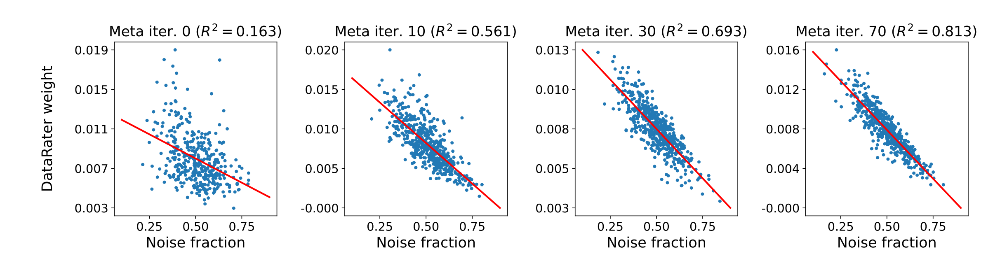
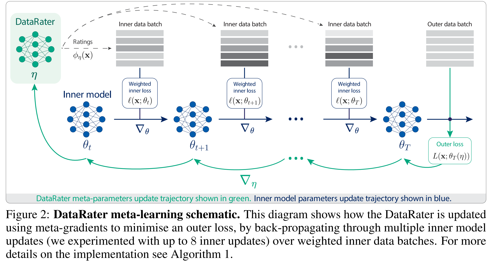
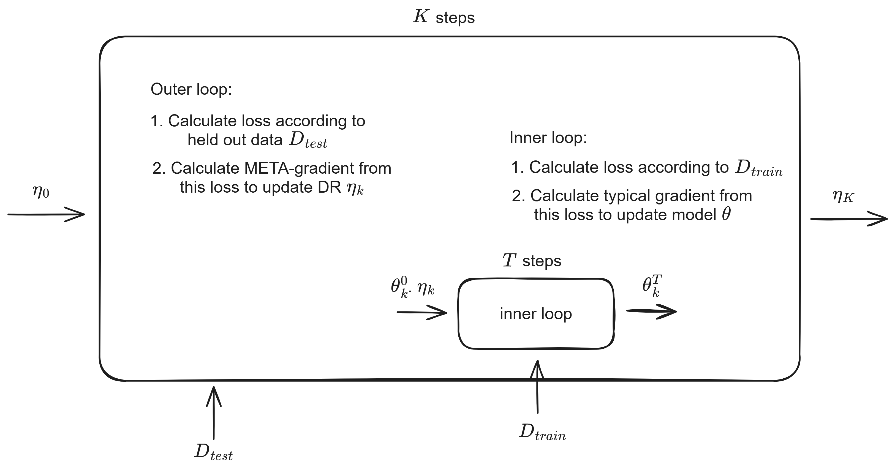
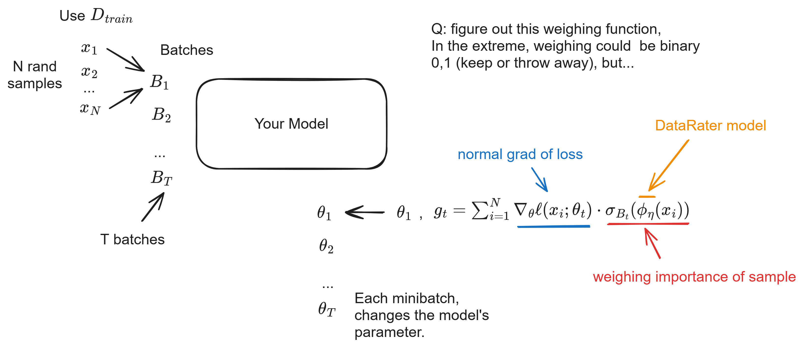
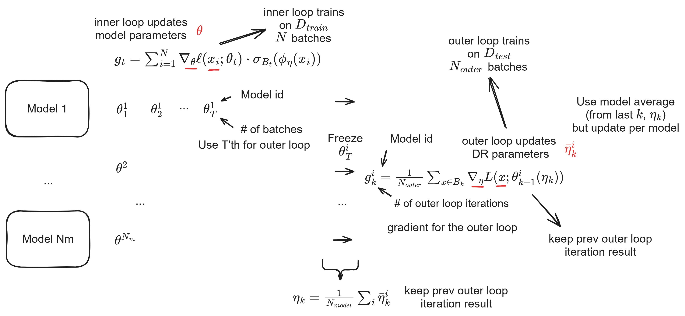
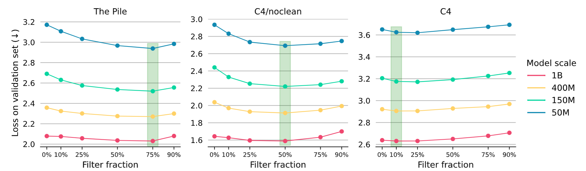
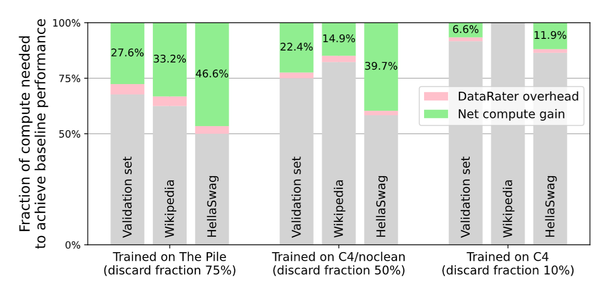
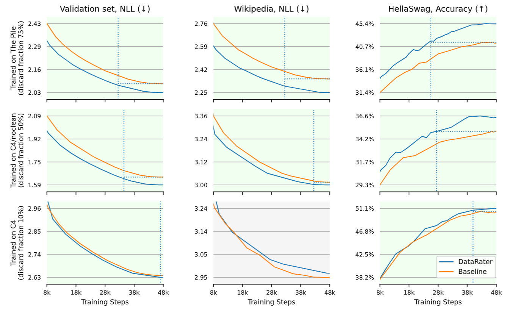
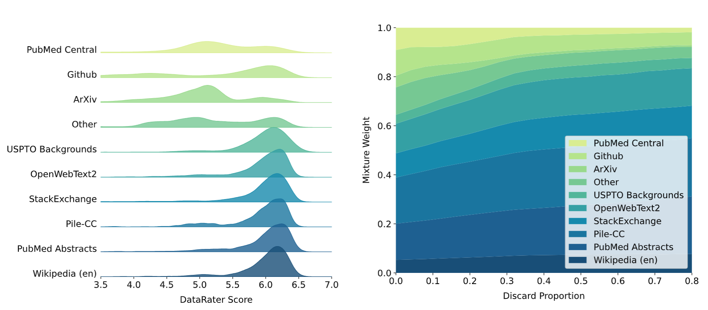

# DataRater

## Motivation

Plot shows weighing done by DR from noise free to noisy data.  Sequence shows successive outer loop refinements for the weighing function.

## DR Framework

Overall training recipe for DR.

DR tries to reduce loss of a held out test set (Outer loss), via rating/weighing of data points.

### Rating function

Learn $\phi_\eta$: rating/weighing function.  Usage of rating function in overall training of a model.

\[g_t = \sum_{x \in B_t} \nabla_\theta \ell(x; \theta_t) \cdot \sigma_{B_t}(\phi_\eta(x))\]

## Simplified view

Note: think of this a regularization technique, how to prevent model from overfitting on noisy data.

Note: the hope is that the DR model itself is able to generalize

## Inner and outer loops

### Inner loop

### Outer loop

## Bag of tricks

1. discrete vs continuous
2. MixedFlow - gradient of a gradient 
3. stabilization of meta-gradient

### Discrete vs Continuous Relaxation

- Original goal: remove fraction of training data, so that you just train on the "important" subset of the data

- To selectively choose the subset is a non-deterministic polynomial-time hard problem.  😫
  
- Instead use relaxation: don't entirely get rid of data, but use weighing/rating function.

### Gradient of a gradient

"Gradient of a gradient" is required in **bilevel optimization** problems.

- common in meta-learning and other machine learning applications. 
- needed to optimize an outer-loop objective by differentiating through an inner-loop optimization process.

#### Bilevel Optimization

* **Inner Loop:** This is the primary optimization process:
  - model's parameters are updated to minimize a specific loss function. 
  - For example, in meta-learning, a model adapts to a new task using a small number of gradient descent steps.

* **Outer Loop:** This is the meta-level optimization:
  - find the best "meta-parameters" that control the inner-loop learning process.
  - These meta-parameters could be the initial weights of the model, a learning rate, or a regularization parameter.

#### Why the "Gradient of a Gradient"?

To optimize the outer loop:
- need to calculate the gradient of the outer-loop objective function with respect to the meta-parameters.
- challenge: the outer-loop objective depends on the result of the inner-loop optimization.

Inner-loop optimization:
- series of gradient descent steps
- the final parameters of the inner loop are a function of the meta-parameters.

Outer-loop gradient:
- differentiate through the entire sequence of inner-loop gradient calculations.
- leads to a second-order derivative, or "gradient of a gradient"
- represents how a change in the meta-parameters affects the final adapted parameters, and thus, the outer-loop loss.

### Mixed-Flow Meta-Gradients (MixFlow-MG)

Reparameterization of inner-loop learning dynamics:
- don't backpropagate through sequence of inner loop updates
- traditionally: use Truncated BPTT
- 😂 We just had a paper, HRM, which truncated BPTT (just use the last / equilibrium point)
- Instead: use forward-over-reverse mode differentiation

#### Forward-over-reverse mode differentiation

Maybe subject for another paper review:
https://arxiv.org/pdf/2505.00793

Scalable Meta-Learning via Mixed-Mode Differentiation

- another paper from Google DeepMind

The gist:
- use usual reverse mode (standard backpropagation, vector-Jacobian) in the inner loop
- use forward mode (Jacobian-vector products) for the outer loop

- vector-Jacobian useful when there are many inputs and few outputs
  - represents the gradient of the loss (single output) with respect to layer's inputs.
 
- Jacobian-vector useful when there are many outputs and few inputs
  - useful for sensitivity analysis
  - in this case the meta-parameters are much fewer in number (hmm, really?)

### Stabilize meta-gradient

1. Use population of inner models
2. Separate the meta-gradient for each model
3. Average meta-gradient updates

# How to use DR (Data Curation)

1. Use rating function to remove data
2. Given a target discard fraction, upsample the batch and filter -- retain the batch size
3. Alternatively remove data points from training (not at the batch level)

# Results

1. C4 - cleanest data (pre-filtered)
2. C4/no clean - less filtered C4
3. the Pile - least filtered

DR is a 50M non-causal transformer, trained on 400M model.

## Optimum amount of filtering

Use the smalled Model scale to determine the discard filter fraction.

- filter fraction is a function of the data, not the model

## Efficiency in training

Grey signifies the amount of training steps required to reach the same amount of performance as the baseline.

## Beyond baseline

Shows improved final performance!

## Amortized Cost

Training of DR model takes 58.4% of the resources wrt training a single 1B model.

But cost is amortized since same DR model can be used to train models at different scales (50M, 150M, 400M, 1B).

## Study of data quality

😂 PubMed and ArXiv have poor scores

But if you discard the bad data, the remaining samples are very good samples for generalization!  But maybe I am misinterpreting.

# Extra / Appendix (Skip)

*   **The DataRater Meta-Learning Process:** A diagram (similar to Figure 2 in the paper) showing how the DataRater model (ϕη) interacts with the inner language model (fθ). This would illustrate the flow of information from data batches, through the DataRater's scoring, the weighted gradient computation, the inner model updates, and finally, the meta-gradient update to the DataRater itself.

*   **Experimental Results:** Graphs or charts (like Figures 1, 4, 5, or 6) comparing the performance of models trained with DataRater-filtered data versus baseline models. These might highlight:
    *   **Compute efficiency gains:** Showing the reduction in computational resources (e.g., FLOPS) needed to achieve a certain performance level.
    *   **Improved final performance:** Demonstrating lower validation loss or higher accuracy on downstream tasks.
    *   **Data discard proportions:** Illustrating how different filtering levels impact model performance.
    *   **DataRater scores distribution:** Visualizing how the DataRater assigns value to different types of data (as in Figure 7).
*   **Qualitative Examples:** Showcase examples of data points that the DataRater rates as high or low quality (as in Figure 8), helping to build intuition about what the system learns.

### DataRater's Core Mechanism: Weighted Gradient

DataRater's operation: the **weighted gradient calculation** in the inner loop (Algorithm 1, line 16).

The DataRater introduces a function \(\phi_\eta(x)\) that assigns a value to each data point \(x\), parameterized by \(\eta\). These values are then normalized using a softmax function within a batch \(B_t\) to produce a continuous weight \(\sigma_{B_t}(\phi_\eta(x)) \in [0, 1]\) for each data point. This weight is used to scale the gradient contribution of each data point during the inner model update.

The weighted gradient \(g_t\) for a mini-batch \(B_t\) is calculated as:

\[g_t = \sum_{x \in B_t} \nabla_\theta \ell(x; \theta_t) \cdot \sigma_{B_t}(\phi_\eta(x))\]

Let's break down this formula:

*   \(g_t\): This is the **weighted gradient** computed at step \(t\) of the inner loop. Instead of simply averaging gradients, each gradient is scaled by a weight.
*   \(\sum_{x \in B_t}\): This denotes a **summation over all data points \(x\)** within the current mini-batch \(B_t\).
*   \(\nabla_\theta \ell(x; \theta_t)\): This is the **gradient of the inner loss function \(\ell\)** with respect to the inner model's parameters \(\theta_t\), for a specific data point \(x\). This term indicates how a small change in \(\theta_t\) affects the loss for that data point.
*   \(\sigma_{B_t}(\phi_\eta(x))\): This is the **normalized preference weight** assigned to data point \(x\) by the DataRater \(\phi_\eta\), within the context of the batch \(B_t\). It is computed using a softmax function:
    \[\sigma_{B_t}(\phi_\eta(x)) = \frac{e^{\phi_\eta(x)}}{\sum_{x' \in B_t} e^{\phi_\eta(x')}}\]
    *   \(\phi_\eta(x)\): The **raw score (value)** assigned to data point \(x\) by the DataRater model, parameterized by \(\eta\). A higher score implies a higher perceived value for training.
    *   \(e^{\phi_\eta(x)}\): The exponential of the raw score, ensuring positive values.
    *   \(\sum_{x' \in B_t} e^{\phi_\eta(x')}\): The sum of exponential raw scores for all data points \(x'\) in the batch, used for normalization.

In essence, the DataRater learns to assign higher weights to more "valuable" data points, ensuring that their gradients contribute more significantly to the inner model's parameter updates. This selective weighting is what allows the system to improve training efficiency by effectively prioritizing data.

### Research Progress Connection

The paper emphasizes that DataRater's meta-learning approach, especially the computation of "meta-gradients," is made feasible by advances in scalable bilevel optimization. Specifically, they credit Scalable Meta-Learning via Mixed-Mode Differentiation (MixFlow-MG) by Kemaev et al. [2025].

*   **Building upon:** Previous meta-gradient methods, such as those relying on the implicit function theorem Optimizing Millions of Hyperparameters by Implicit Differentiation or reverse-mode differentiation through unrolled optimization Gradient-based Hyperparameter Optimization through Reversible Learning, often faced significant computational challenges, particularly with memory (HBM) and the calculation of second-order derivatives (Hessian matrices) when applied to large models or many inner updates.
*   **Diverging/Addressing Unresolved Issues:** MixFlow-MG tackles these scalability issues by exploiting symmetries in bilevel optimization problems and using mixed-mode differentiation. This innovation directly addresses the computational bottleneck of meta-gradient calculations, enabling DataRater to be applied to larger "inner models" (e.g., 400M parameters) and through multiple inner updates (e.g., 2, 4, or 8), which would otherwise be prohibitive. This makes meta-learning approaches for data curation much more practical for the era of large foundation models.
*   **Inspiring Further Investigation:** The success of MixFlow-MG in this context opens doors for exploring more complex meta-learning objectives or applying meta-gradients to even larger-scale foundation models where traditional methods might fail. For example, the paper notes experimenting with using LoRA LoRA: Low-Rank Adaptation of Large Language Models for inner model updates to handle even larger models, suggesting that continued work on efficient meta-gradient computation is crucial for the field.

### Follow-up Questions

1.  💬 How might the DataRater's "meta-objective" be modified to prioritize specific model capabilities (e.g., robustness, fairness) rather than just training efficiency, and what challenges might arise?
2.  💬 The paper uses a fixed inner model size for meta-training the DataRater. How might using a dynamic or adaptively sized inner model during meta-training affect the DataRater's ability to generalize across various target model scales?
3.  💬 Considering the DataRater's ability to identify "low quality" data, what potential ethical implications or biases could emerge if this system were used to curate data for models deployed in sensitive real-world applications?

# Formula 1
# Weighted Gradient

The **weighted gradient** is calculated for a mini-batch during the inner loop training of the language model, incorporating the data valuation learned by the DataRater. This gradient, \(g_t\), is then used to update the inner model's parameters.

Let's break down the formula:

### Formula
\(g_t = \sum_{i=1}^{N} \nabla_{\theta} \ell(x_i; \theta_t) \cdot \sigma_{B_t}(\phi_{\eta}(x_i))\)

### Term-by-Term Explanation

*   \(g_t\): This represents the **weighted gradient** computed at training step \(t\). It is the aggregated gradient that will be used to update the inner model's parameters (\(\theta_t\)). Instead of each data point contributing equally to the gradient, their contributions are scaled by their learned "value."

*   \(N\): This is the **number of data points** (or samples) in the current mini-batch, denoted as \(B_t\).

*   \(\sum_{i=1}^{N}\): This indicates a **summation** over all individual data points \(x_i\) within the current mini-batch \(B_t\).

*   \(\nabla_{\theta} \ell(x_i; \theta_t)\): This is the **gradient of the inner loss function** (\(\ell\)) with respect to the inner model's parameters (\(\theta\)) for a single data point \(x_i\), at training step \(t\).
    *   \(\ell(x_i; \theta_t)\): The loss incurred by the inner model on data point \(x_i\) with its current parameters \(\theta_t\). For language models, this is typically the cross-entropy loss for next-token prediction.
    *   \(\nabla_{\theta}\): The gradient operator, indicating the direction and magnitude in which the model parameters \(\theta\) should change to reduce the loss \(\ell\) for \(x_i\).

*   \(\sigma_{B_t}(\phi_{\eta}(x_i))\): This is the **weighting factor** assigned to the gradient of data point \(x_i\). It quantifies the "value" of \(x_i\) as estimated by the DataRater.
    *   \(\phi_{\eta}(x_i)\): This is the **DataRater model's output (score)** for data point \(x_i\). The DataRater, parameterized by \(\eta\), learns to assign a real-valued score to each data point, reflecting its estimated utility for training. A higher score means the DataRater considers that data point more valuable.
    *   \(\sigma_{B_t}(\cdot)\): This denotes a **softmax preference function** applied over the DataRater scores of all data points in the current batch \(B_t\). Its formula is \(\sigma_{B_t} (\phi_{\eta} (x)) = \frac{e^{\phi_{\eta} (x)}}{\sum_{x' \in B_t} e^{\phi_{\eta} (x')}}\).
        *   **Purpose of Softmax**: This function normalizes the DataRater scores within the batch, converting them into probabilities (weights between 0 and 1) that sum up to 1 for the entire batch. This ensures that the overall magnitude of the gradient remains consistent across batches, while allowing valuable data points to contribute more significantly than less valuable ones.

### How it Works
In essence, this formula modifies the standard gradient descent update. Instead of simply averaging the gradients of all data points in a batch, it first scales each individual gradient by a weight determined by the DataRater. Data points that the DataRater deems more valuable (higher \(\phi_{\eta}(x_i)\) score) will receive a larger weight \(\sigma_{B_t}(\phi_{\eta}(x_i))\), and thus their gradients will have a stronger influence on the parameter update of the inner model. Conversely, less valuable data points will have their gradients down-weighted, effectively reducing their impact. This mechanism allows the inner model to learn more efficiently by focusing on the most relevant and high-quality data, as meta-learned by the DataRater.

### Connecting to Research Progress
The sophisticated computation of this weighted gradient, especially the back-propagation through multiple inner model updates to update the DataRater's meta-parameters (\(\eta\)), is computationally intensive. The paper highlights the use of MixFlow-MG to make this feasible. MixFlow-MG specifically addresses the challenge of **scalable bilevel optimization** by exploiting symmetries and using mixed-mode differentiation, significantly reducing RAM usage. This means that the ability to effectively compute these meta-gradients, which are crucial for the DataRater to learn its valuation policy, relies heavily on advancements in optimization techniques like MixFlow-MG. Without such methods, applying meta-learning to data curation for large foundation models (with their immense parameter counts and training data) would be prohibitively expensive. This illustrates how progress in meta-optimization algorithms directly enables more advanced applications of meta-learning, such as the DataRater.

### Follow-up Questions
1.  💬 How would the training dynamics of the inner model change if DataRater used binary filtering (keeping or discarding data) instead of continuous re-weighting via softmax?
2.  💬 The DataRater learns data valuation by observing training efficiency on held-out data. What are the potential challenges or biases in defining this "held-out data" and how might they impact the learned data valuation policy?
3.  💬 Beyond improving training efficiency, how could the DataRater's meta-objective be adapted to achieve other goals, such as enhancing model robustness to adversarial examples or improving fairness across different demographic groups?

# Return optimized DataRater meta-parameters

Algorithm 1, "Meta-learning a DataRater (\(\phi_\eta\))".

Here's a detailed explanation:

*   **\(\eta\) (eta)**: This symbol represents the **meta-parameters** of the DataRater model, denoted as \(\phi_\eta\). The DataRater is a score function that learns to assign a "value" to each individual data point. These meta-parameters determine how the DataRater evaluates data.
*   **\(K\)**: This variable indicates the total number of **outer update steps** performed during the meta-learning process (as defined in line 1 of Algorithm 1: `K outer update steps`). The outer loop (lines 5-11 in Algorithm 1) is where the DataRater's meta-parameters \(\eta\) are iteratively updated.
*   **\(\eta_K\)**: Therefore, \(\eta_K\) represents the **final, optimized set of meta-parameters** for the DataRater after \(K\) iterations of the meta-learning algorithm have been completed.
*   **"Return \(\eta_K\)"**: This statement means that the algorithm concludes by outputting these optimized meta-parameters. These parameters embody the learned data valuation policy.

**In essence, this line concludes the learning phase of the DataRater itself:**

*   The goal of Algorithm 1 is to find the best possible \(\eta\) that enables the DataRater to effectively filter or re-weight training data, ultimately improving the training efficiency of the main (inner) models.
*   After \(K\) iterations, the DataRater has learned how to assign preference weights to data points by minimizing an outer loss (e.g., improving training efficiency on held-out data).
*   The returned \(\eta_K\) is then used to define the final DataRater model, \(\phi_{\eta_K}\). This model will be employed for actual data curation, either by filtering out low-value data points or by re-weighting them during the training of foundation models.

**Connecting to Research Progress:**

The paper highlights the challenge of "Scalability of Meta-Gradient Computation" (Page 18) for large models, noting that back-propagating through multiple inner model updates to compute meta-gradients (which is essential for updating \(\eta\)) can be computationally intensive. To make this feasible, the authors leverage techniques from Scalable Meta-Learning via Mixed-Mode Differentiation (MixFlow-MG). This means that the ability to efficiently compute and return a well-optimized \(\eta_K\) is heavily reliant on these advanced computational methods, allowing the DataRater framework to be applied to larger-scale problems and ultimately contribute to "significantly improved compute efficiency" (Abstract) for foundation models.

**Further Reading:**

*   💬 How is the returned \(\eta_K\) practically used to perform data curation, specifically for filtering or re-weighting data, after the meta-learning process is complete?
*   💬 The paper states that the DataRater is "highly sample-efficient compared to black box methods". What specifically about meta-gradients contributes to this efficiency?
*   💬 The meta-learning process requires a held-out dataset for the outer loss. What are the potential implications if this held-out dataset is not representative of the desired downstream tasks or contains biases?

# DataRater Meta-Learning
Algorithm 1 outlines the meta-learning process used to train the DataRater, which in turn learns to assign "value" to individual data points. This is achieved through a bilevel optimization framework, consisting of an outer loop that updates the DataRater's parameters and an inner loop that trains a foundation model using data weighted by the DataRater.

Here's a detailed breakdown of Algorithm 1:

*   **Overall Goal:** To optimize the DataRater's meta-parameters (\(\eta\)) such that the inner models, when trained on data weighted by this DataRater, achieve better performance (specifically, improved training efficiency) on a held-out test dataset (\(D_{test}\)).

### Outer Loop: Optimizing the DataRater (Lines 5-11)

This loop focuses on updating the DataRater's parameters (\(\eta\)). It's called the "outer loop" because it encapsulates the training of the inner models.

*   **Line 5: `for k = 0 ... K - 1 do`**
    *   This initiates the outer loop, running for `K` meta-update steps. `K` is the total number of times the DataRater's parameters will be updated.

*   **Line 6: `for i = 0 ... N_models - 1 do`**
    *   The authors use a population of `N_models` inner models. This means that at each outer step `k`, `N_models` separate inner models are trained. This population-based approach helps stabilize the meta-gradient computation.

*   **Line 7: `θ^i_{k+1} = UPDATEINNERMODEL(θ^i_k, η_k)`**
    *   For each inner model `i`, its parameters `θ^i` are updated by calling the `UPDATEINNERMODEL` function (explained below).
    *   Crucially, this update uses the current DataRater parameters `η_k` to weight the training data. The output `θ^i_{k+1}` represents the inner model's parameters after training for `T` steps with the DataRater's guidance.

*   **Line 8: `B_k ~ P_{N_outer}(D_test)`**
    *   An "outer batch" `B_k` of size `N_outer` is sampled from the `D_test` dataset. This `D_test` is the held-out data used to evaluate the *quality* of the DataRater's learned data valuation policy.

*   **Line 9: `g^i_k = \frac{1}{N_{outer}} \sum_{x \in B_k} \nabla_\eta L(x; \theta^i_{k+1}(\eta_k))`**
    *   This is the core of the meta-gradient calculation.
    *   `L(x; \theta^i_{k+1}(\eta_k))`: The outer loss (e.g., validation loss) on a sample `x` from `D_test`, evaluated using the inner model `θ^i_{k+1}`. The inner model `θ^i_{k+1}` implicitly depends on `η_k` because `η_k` determined how `θ^i` was trained.
    *   `∇_η L(...)`: This term represents the gradient of the outer loss with respect to the DataRater parameters `η`. Computing this requires differentiating through the entire inner model training process, which is complex and involves "back-propagating through multiple optimiser updates for θ," as mentioned in the paper (Page 5). This is why techniques like MixFlow-MG are essential for scalability.
    *   `\frac{1}{N_{outer}} \sum_{x \in B_k}`: This averages the meta-gradients computed for each sample in the outer batch.

*   **Line 10: `η̄^i = H(η_k, g^i_k)`**
    *   `H` represents a meta-optimizer (e.g., Adam). It takes the current DataRater parameters `η_k` and the computed meta-gradient `g^i_k` (from inner model `i`) to propose an update `η̄^i` for the DataRater parameters *based on that single inner model's performance*.

*   **Line 11: `η_{k+1} = \frac{1}{N_{models}} \sum_i η̄^i`**
    *   The proposed updates `η̄^i` from all `N_models` inner models are averaged to form the final update for the DataRater parameters `η`, which become `η_{k+1}` for the next outer loop iteration. This averaging further stabilizes the meta-learning process.

*   **Line 12: `Return η_K`**
    *   After `K` outer loop iterations, the optimized DataRater meta-parameters `η_K` are returned. This `η_K` now defines the data valuation policy.

### Inner Loop: Training an Inner Model (Lines 13-18)

This function, `UPDATEINNERMODEL`, is called by the outer loop to train a single foundation model using data weighted by the current DataRater.

*   **Line 13: `function UPDATEINNERMODEL(θ0, η)`**
    *   Takes initial inner model parameters `θ0` and the current DataRater parameters `η` as input.

*   **Line 14: `for t = 0 ... T - 1 do`**
    *   This is the inner training loop for the foundation model, running for `T` steps.

*   **Line 15: `B_t ~ P_{N_inner}(D_train)`**
    *   An "inner batch" `B_t` of size `N_inner` is sampled from the `D_train` dataset (the dataset being curated).

*   **Line 16: `g_t = \sum_{x \in B_t} \nabla_\theta \ell(x; \theta_t) \cdot \sigma_{B_t}(\phi_\eta(x))`**
    *   This is the weighted gradient calculation for the inner model.
    *   `∇_θ \ell(x; \theta_t)`: The standard gradient of the inner model's loss function `ℓ` (e.g., cross-entropy loss) with respect to its parameters `θ_t`, for a specific training sample `x`.
    *   `\phi_\eta(x)`: The raw score assigned to data point `x` by the DataRater model `ϕ` (parameterized by `η`). This score reflects the DataRater's learned "value" of `x`.
    *   `\sigma_{B_t}(\phi_\eta(x)) = \frac{e^{\phi_\eta(x)}}{\sum_{x' \in B_t} e^{\phi_\eta(x')}}`: This is the softmax preference function. It normalizes the raw DataRater scores within the current batch `B_t` to produce continuous weights between 0 and 1. These weights sum to 1 across the batch, ensuring that data points deemed more valuable by the DataRater contribute more to the gradient.
    *   The term `\nabla_\theta \ell(x; \theta_t) \cdot \sigma_{B_t}(\phi_\eta(x))` means that the gradient for each sample `x` is scaled by its normalized weight `\sigma_{B_t}(\phi_\eta(x))`.

*   **Line 17: `θ_{t+1} = \Theta(\theta_t, g_t)`**
    *   The inner model's parameters `θ` are updated using an optimizer `Θ` (e.g., Adam), applying the weighted gradient `g_t`.

*   **Line 18: `Return θ_T`**
    *   After `T` steps, the function returns the final updated parameters `θ_T` of the inner model.

In essence, DataRater learns *how* to weight or filter data by observing how different weighting strategies (encoded by \(\eta\)) impact the final performance of a model trained with that data (measured by \(L\)). This "learning to learn" approach allows for more sophisticated and automated data curation.

### Connections to Research Progress:

This work builds upon the broader field of **bilevel optimization** and **meta-learning** in deep learning, which gained traction with works like Gradient-based Hyperparameter Optimization through Reversible Learning (Maclaurin et al., 2015) and Optimizing Millions of Hyperparameters by Implicit Differentiation (Lorraine et al., 2020), which demonstrated how to compute gradients through optimization processes. The DataRater extends this by applying it specifically to data curation.

A key challenge addressed by DataRater is the **scalability of meta-gradient computation**, especially when dealing with large foundation models. The paper explicitly mentions using techniques from Scalable Meta-Learning via Mixed-Mode Differentiation (Kemaev et al., 2025) to make this feasible. This highlights an ongoing research frontier: developing more efficient algorithms for computing second-order derivatives or approximations thereof, which are often required in bilevel optimization.

Contemporaneous work like SEAL (Shen et al., 2025) and Optimizing ML training with metagradient descent (Engstrom et al., 2025) also apply meta-gradients to data selection, showing this is a rapidly evolving area. DataRater differentiates itself by focusing on function approximation for data scoring (learning a generalizable valuation policy) rather than tracking a meta-parameter per data point (as in Engstrom et al.), making it potentially more scalable to truly unbounded datasets. The choice of specific meta-objectives (e.g., improving training efficiency vs. enhancing safety, as in SEAL) also defines distinct research directions within this meta-learning paradigm.

### Follow-up questions:

1.  💬 How would the DataRater's learned valuation policy change if the meta-objective (outer loss) was set to optimize for a specific downstream task's accuracy instead of general training efficiency?
2.  💬 What are the practical implications and challenges of performing the "back-propagation through multiple inner model updates" for extremely large inner models (e.g., hundreds of billions of parameters)?
3.  💬 How might the DataRater framework be adapted or extended to handle synthetic data generation, where the goal is to learn to *create* valuable data rather than just filter existing data?