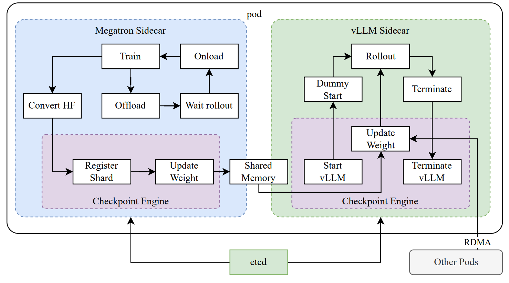

# from Gemini
The paper "KIMI K1.5: Scaling Reinforcement Learning with LLMs" introduces Kimi k1.5, a new multi-modal Large Language Model (LLM) trained using **Reinforcement Learning (RL)**. The Kimi team aims to overcome the data limitations of traditional LLM pretraining by allowing the model to generate its own training data through exploration with rewards.

---

### Key Contributions and Techniques

The paper highlights several core ingredients in the development of Kimi k1.5:

* **Long Context Scaling:** Kimi k1.5 scales the context window for RL training to 128k tokens. The research indicates that increased context length leads to continuous performance improvements. A key innovation here is the use of **partial rollouts** for improved training efficiency, which involves reusing large portions of previous trajectories to sample new ones, reducing the cost of re-generating from scratch.
* **Improved Policy Optimization:** The model uses a variant of **online mirror descent** for robust policy optimization, specifically formulated for long-Chain of Thought (CoT) scenarios. This is further enhanced by effective sampling strategies, the introduction of a **length penalty**, and optimized data recipes.

* **Simplistic Framework:** Unlike prior approaches that often rely on complex techniques like Monte Carlo tree search, value functions, or process reward models, Kimi k1.5 achieves strong performance with a more straightforward RL framework. The ability to scale context length allows the learned CoTs to exhibit properties of planning, reflection, and correction.
* **Multimodality:** Kimi k1.5 is trained on both text and vision data, enabling it to reason jointly across these modalities.
* **Long2short Methods:** The paper also presents "long2short" methods, which leverage techniques developed for long-CoT models to enhance the performance of short-CoT models. These methods include **model merging**, **shortest rejection sampling**, **Direct Preference Optimization (DPO)**, and a dedicated **long2short RL** phase.

---

### RL Training Details

The RL training process for Kimi k1.5 involves:

* **RL Prompt Set Curation:** The team emphasizes the importance of a high-quality, diverse, balanced, and accurately evaluable prompt set to prevent reward hacking and overfitting. They use automatic filters, a model-based difficulty assessment, and methods to identify and remove "easy-to-hack" prompts.
* **Long-CoT Supervised Fine-Tuning (SFT):** A small, high-quality long-CoT warm-up dataset is created through prompt engineering, focusing on human-like reasoning processes such as planning, evaluation, reflection, and exploration. This SFT primes the model for generating detailed and logically coherent responses.
* **Policy Optimization (Detailed):** The core RL objective is to maximize the reward for correct answers. The training algorithm is a variant of online policy mirror descent. Notably, the system *excludes a value network* from its training. The authors hypothesize that traditional value functions might not be suitable for encouraging exploration of diverse reasoning paths, which is crucial for developing robust problem-solving strategies.
* **Length Penalty:** To counteract "overthinking" (excessive response length) during RL training, a length reward is introduced. This reward promotes shorter, correct responses and penalizes longer, incorrect ones, with a warm-up phase to avoid hindering initial training.
* **Sampling Strategies:** To improve training efficiency, Kimi k1.5 employs **curriculum sampling** (starting with easier tasks and progressing to harder ones) and **prioritized sampling** (focusing on problems where the model underperforms based on its success rate).
* **Test Case Generation for Coding:** For coding problems without available test cases, the paper describes an automated method to generate high-quality test cases using the CYaRon library and leveraging ground truth solutions.
* **Reward Modeling for Math:** To accurately evaluate mathematical solutions, the paper discusses two approaches: a classic value-head based reward model and a more accurate **Chain-of-Thought (CoT) Reward Model**, which explicitly generates a step-by-step reasoning process before providing a correctness judgment. The CoT Reward Model achieved significantly higher accuracy.
* **Vision Data:** The vision RL data is sourced from real-world data (science, location guessing, data analysis), synthetic visual reasoning data (spatial relationships, patterns), and text-rendered data (converting text to images to ensure consistency).

---

### Performance

Kimi k1.5 demonstrates **state-of-the-art reasoning performance** across multiple benchmarks and modalities:

* **Long-CoT results:** It achieves scores like 77.5 on AIME, 96.2 on MATH 500, 94th percentile on Codeforces, and 74.9 on MathVista, matching or exceeding models like OpenAI's o1.
* **Short-CoT results:** Through its long2short methods, Kimi k1.5 also achieves state-of-the-art short-CoT reasoning performance, including 60.8 on AIME, 94.6 on MATH500, and 47.3 on LiveCodeBench, significantly outperforming existing short-CoT models such as GPT-4o and Claude Sonnet 3.5 (up to +550%).

---

### Training Stages

The overall development of Kimi k1.5 consists of several stages:

1.  **Pretraining:** A multi-stage process involving vision-language pretraining, cooldown for consolidating capabilities, and long-context activation up to 131,072 tokens.
2.  **Vanilla Supervised Fine-tuning (SFT):** Building a corpus for non-reasoning tasks.
3.  **Long-CoT Supervised Fine-tuning.**
4.  **Reinforcement Learning.**

---

The paper concludes that Kimi k1.5 establishes a simplistic yet effective RL framework by leveraging long context scaling and improved policy optimization, demonstrating that LLMs can effectively scale their training data through learning to explore with rewards, leading to significant advancements in reasoning capabilities.

---

Kimi:

# Long context scaling
- 128k token context window
- expensive to do a single rollout
- partial rollout reuse significant portion from previously generated sequence

# Mirror Descent  
- optimizing over probablity distributions
  - values are non-negative and sum up to one
- instead, perform updates in dual space and map it back to primal space
- transformation via a mirror map
  - aka distance generating function
  - aka potential function

## Advantages
- faster convergence
- implicit regularization
- avoid value functions

## Steps
1. map parameters to dual space
2. gradient step in dual space
3. map back to primal space
4. projection if constrained

## Example mapping
1. $\phi(x)  = x \log x$
1. $\grad \phi = \log x + 1$
1. Can think of $\log$ as mapping probabilities to log probability

## LLM
1. policy \pi(y,z|x) represent the probability of generating a z (CoT) and final answer y, given input x.

# Problem statement
- Need more data to scale models "intelligence"

# Features
- 128k token context length
- online mirror gradient descent
- sampling strategy, length penalty
- simple framework
  - no Monte Carlo tree search
  - value functions
  - process rewards
- multimodality

# Explicit Tree Search vs Implicit Search
- Explicit
  - build tree/graph of nodes
  - planning algorithm MCTS, A*, BFS, DFS to traverse
    tree and select best path
  - LLM is a sub-module that generates candidate moves
- Implicit Search
  - LLM does not explicitly branch
  - "decision-making" for reasoning path is encoded
    in the model weights
    - there is no external algorithm that evaluates them
      and picks the best one to continue

# Kimi similarities

## Multi-stage Training Paradigm
1. Pre-training
   - learn language
   - world knowledge
   - basic reasoning
2. SFT
   - instruction following to align with desired behaviors and formats
3. RL
   - use of a reward signal

## Reward model
- human-generated (RLHF)
- ai-generated (RLAIF)
- specilized correctness checker (Kimi CoT RM)

## Use of policy gradients

# Kimi differences

## Specialized CoT RM
- RM performs CoT style reasoning to evaluate policy model's intermediate steps and final answer

## Focus on Long-CoT
- Explicitly designed to generate long, coherent, and implict planning CoT.
- context window scaled to 128k
- model internalizes long reasoning patterns
- model learns to generate its own search process

## Online policy mirror descent
- vs. PPO complex to tune and less stable
- Kimi uses a variant of online policy mirror descnt
  - suited for optimizing probability distributions
  - uses non-Euclidean metric
  - more stable and natural updates
    - "loss" doesn't oscillate as much
    - "natural" - operates in log space (presumably)
  - more robust and faster convergence
    - paper: "extension of a usual on-policy regularized policy gradient algorithm to the off-policy case"

## Direct integration of length penalty (long2short method)
- adds length penalty in the reward funciton
- long2short RL: distinct RL phase with
  - strong length penalties and re
  - reduced max generation lengths
  - training for conciseness AFTER initial reasoning capabilities are established

## Sampling strategies and data curation
- Shortest rejection sampling - during SFT data creation
- DPO (Direct Preference Optimization) for Long2Short 
- Curriculum sampling - begin with easier tasks then go into harder taks

## Summary
- Sophisticated CoT RM
- Online Policy Mirror Descent
- Direct integration of length penalties with long2short methods

# Derivation of the grad of the surrogate loss
You're asking about the core of how policies are updated in RL algorithms that incorporate KL regularization, like the one used in the Kimi paper. The "surrogate loss" is a common term for the objective function that we optimize iteratively to update the policy.

Let's derive the gradient of the surrogate loss. We start with the objective function we discussed:

$$L(\pi) = \mathbb{E}_{(y,z) \sim \pi} [r(x, y, y^*)] - \tau \text{KL}(\pi(\cdot|x) || \pi_{\theta_i}(\cdot|x))$$

We want to find the gradient of $L(\pi)$ with respect to the policy parameters $\theta$ (assuming $\pi$ is parameterized by $\theta$). For simplicity, let's denote $\pi(y, z|x)$ as $\pi_\theta(a)$ and $r(x, y, y^*)$ as $R(a)$, where $a$ represents a trajectory $(y,z)$. The reference policy is $\pi_{\theta_i}(a)$.

The objective can be written in summation form (for discrete action spaces, generalizes to integral for continuous):

$$L(\theta) = \sum_a \pi_\theta(a) R(a) - \tau \sum_a \pi_\theta(a) \log \left( \frac{\pi_\theta(a)}{\pi_{\theta_i}(a)} \right)$$

Now, let's take the gradient with respect to $\theta$:

$$\nabla_\theta L(\theta) = \nabla_\theta \left( \sum_a \pi_\theta(a) R(a) - \tau \sum_a \pi_\theta(a) \log \left( \frac{\pi_\theta(a)}{\pi_{\theta_i}(a)} \right) \right)$$

We can separate this into two terms:

**Term 1: Gradient of Expected Reward**

This is the standard policy gradient term (REINFORCE-like):

$$\nabla_\theta \sum_a \pi_\theta(a) R(a) = \sum_a \nabla_\theta \pi_\theta(a) R(a)$$

Using the log-derivative trick: $\nabla_\theta \pi_\theta(a) = \pi_\theta(a) \frac{\nabla_\theta \pi_\theta(a)}{\pi_\theta(a)} = \pi_\theta(a) \nabla_\theta \log \pi_\theta(a)$.

So, Term 1 becomes:
$$\sum_a \pi_\theta(a) \nabla_\theta \log \pi_\theta(a) R(a) = \mathbb{E}_{a \sim \pi_\theta} [\nabla_\theta \log \pi_\theta(a) R(a)]$$

**Term 2: Gradient of KL Divergence Regularization**

Now, let's look at the second term:
$$\nabla_\theta \left( - \tau \sum_a \pi_\theta(a) \log \left( \frac{\pi_\theta(a)}{\pi_{\theta_i}(a)} \right) \right) = - \tau \nabla_\theta \sum_a \pi_\theta(a) (\log \pi_\theta(a) - \log \pi_{\theta_i}(a))$$

Let's apply the product rule and linearity of gradient:
$$ - \tau \sum_a \left[ \nabla_\theta \pi_\theta(a) (\log \pi_\theta(a) - \log \pi_{\theta_i}(a)) + \pi_\theta(a) \nabla_\theta (\log \pi_\theta(a) - \log \pi_{\theta_i}(a)) \right]$$

$$ = - \tau \sum_a \left[ \pi_\theta(a) \nabla_\theta \log \pi_\theta(a) \log \left( \frac{\pi_\theta(a)}{\pi_{\theta_i}(a)} \right) + \pi_\theta(a) \left( \frac{\nabla_\theta \pi_\theta(a)}{\pi_\theta(a)} - \frac{\nabla_\theta \pi_{\theta_i}(a)}{\pi_{\theta_i}(a)} \right) \right]$$

$$ = - \tau \sum_a \left[ \pi_\theta(a) \nabla_\theta \log \pi_\theta(a) \log \left( \frac{\pi_\theta(a)}{\pi_{\theta_i}(a)} \right) + \pi_\theta(a) \nabla_\theta \log \pi_\theta(a) - \pi_\theta(a) \nabla_\theta \log \pi_{\theta_i}(a) \right]$$

Now, let's use the property that $\mathbb{E}_{a \sim \pi_\theta} [\nabla_\theta \log \pi_\theta(a)] = \sum_a \pi_\theta(a) \nabla_\theta \log \pi_\theta(a) = \nabla_\theta \sum_a \pi_\theta(a) = \nabla_\theta (1) = 0$. This is a crucial identity in policy gradients.

So the second term simplifies:
$$= - \tau \sum_a \pi_\theta(a) \nabla_\theta \log \pi_\theta(a) \log \left( \frac{\pi_\theta(a)}{\pi_{\theta_i}(a)} \right) - \tau \underbrace{\sum_a \pi_\theta(a) \nabla_\theta \log \pi_\theta(a)}_{=0} + \tau \sum_a \pi_\theta(a) \nabla_\theta \log \pi_{\theta_i}(a)$$

$$= - \tau \mathbb{E}_{a \sim \pi_\theta} \left[ \nabla_\theta \log \pi_\theta(a) \log \left( \frac{\pi_\theta(a)}{\pi_{\theta_i}(a)} \right) \right] + \tau \mathbb{E}_{a \sim \pi_\theta} \left[ \nabla_\theta \log \pi_{\theta_i}(a) \right]$$

**Combining Both Terms:**

Now, combine Term 1 and the simplified Term 2:

$$\nabla_\theta L(\theta) = \mathbb{E}_{a \sim \pi_\theta} [\nabla_\theta \log \pi_\theta(a) R(a)] - \tau \mathbb{E}_{a \sim \pi_\theta} \left[ \nabla_\theta \log \pi_\theta(a) \log \left( \frac{\pi_\theta(a)}{\pi_{\theta_i}(a)} \right) \right] + \tau \mathbb{E}_{a \sim \pi_\theta} \left[ \nabla_\theta \log \pi_{\theta_i}(a) \right]$$

Factor out the expectation and $\nabla_\theta \log \pi_\theta(a)$ where possible:

$$\nabla_\theta L(\theta) = \mathbb{E}_{a \sim \pi_\theta} \left[ \nabla_\theta \log \pi_\theta(a) \left( R(a) - \tau \log \left( \frac{\pi_\theta(a)}{\pi_{\theta_i}(a)} \right) \right) \right] + \tau \mathbb{E}_{a \sim \pi_\theta} \left[ \nabla_\theta \log \pi_{\theta_i}(a) \right]$$

This is the general form of the gradient. In practice, the last term $\tau \mathbb{E}_{a \sim \pi_\theta} \left[ \nabla_\theta \log \pi_{\theta_i}(a) \right]$ is often zero or approximately zero if $\pi_{\theta_i}$ is fixed with respect to $\theta$ (as it is the old policy). If $\pi_{\theta_i}$ has some dependence on shared parameters that are being updated, this term might be kept.

**Simplification for Practical Algorithms (e.g., PPO-KL, Trust Region Methods):**

Many algorithms, including those related to Policy Mirror Descent, focus on the first term because the second term's expectation often cancels or is very small for small steps. The core idea is to sample trajectories from the *current* policy $\pi_\theta$ and then update $\theta$ based on this gradient.

The most common form of the policy gradient with KL regularization is often approximated by:

$$\nabla_\theta L(\theta) \approx \mathbb{E}_{a \sim \pi_\theta} \left[ \nabla_\theta \log \pi_\theta(a) \left( R(a) - \tau \log \left( \frac{\pi_\theta(a)}{\pi_{\theta_i}(a)} \right) \right) \right]$$

This is the form that often appears in algorithms like PPO (Proximal Policy Optimization) with a KL penalty, where the ratio $\frac{\pi_\theta(a)}{\pi_{\theta_i}(a)}$ is directly optimized. The `log-ratio` term penalizes deviations from the old policy.

**Connection to Kimi's Equation 3:**

The Kimi paper's Equation 3 is:

$$g = \mathbb{E}_{y,z \sim \pi_{\theta_i}} \left[ \alpha \nabla_{\theta} \log \pi_{\theta}(y,z|x) \left( r(x, y, y^*) - \tau \log \frac{\pi_{\theta}(y,z|x)}{\pi_{\theta_i}(y,z|x)} \right) \right]$$

Notice some differences:
1.  **Sampling from $\pi_{\theta_i}$ (Off-Policy):** Kimi's gradient is sampled from the *old* policy $\pi_{\theta_i}$, making it an off-policy gradient. This is common in DPO and similar methods. My derivation above assumed on-policy sampling from $\pi_\theta$.
    To get the off-policy version, you would use the importance sampling trick: $\mathbb{E}_{a \sim \pi_\theta} [f(a)] = \mathbb{E}_{a \sim \pi_{\theta_i}} [\frac{\pi_\theta(a)}{\pi_{\theta_i}(a)} f(a)]$. Applying this to the first term in our combined gradient:
    $$\mathbb{E}_{a \sim \pi_{\theta_i}} \left[ \frac{\pi_\theta(a)}{\pi_{\theta_i}(a)} \nabla_\theta \log \pi_\theta(a) \left( R(a) - \tau \log \left( \frac{\pi_\theta(a)}{\pi_{\theta_i}(a)} \right) \right) \right]$$
    However, Kimi's Equation 3 doesn't have the $\frac{\pi_\theta}{\pi_{\theta_i}}$ ratio in front of the gradient term itself. This implies they might be using a specific form of Mirror Descent or a different re-parametrization trick, possibly related to the natural gradient.

2.  **Lack of Second KL Term:** The Kimi gradient **doesn't include the second KL term** $\tau \mathbb{E}_{a \sim \pi_{\theta_i}} \left[ \nabla_\theta \log \pi_{\theta_i}(a) \right]$ that I derived. This is often because $\nabla_\theta \log \pi_{\theta_i}(a)$ is zero if $\pi_{\theta_i}$ is treated as fixed with respect to the current parameters $\theta$ during the gradient calculation. In practice, $\pi_{\theta_i}$ is often a frozen copy of the policy from the previous iteration.

3.  **Coefficient $\alpha$:** The $\alpha$ is a learning rate or step-size parameter.

The Kimi paper's gradient formulation (Equation 3) aligns with what's often seen in **Direct Preference Optimization (DPO)** or similar **implicit policy gradient methods**, where the target policy is explicitly defined by the exponential weighting of the reference policy. The DPO loss function, for instance, can be derived by directly taking the logarithm of the optimal policy $\pi^*$ (the one that maximizes the KL-regularized reward objective) and optimizing to match it.

While the full derivation can be complex for Online Policy Mirror Descent, the given gradient `g` is essentially trying to push the current policy $\pi_\theta$ towards the optimal policy $\pi^*$ that we derived earlier. The $R(a) - \tau \log \left( \frac{\pi_\theta(a)}{\pi_{\theta_i}(a)} \right)$ term acts as an effective "advantage" or "Q-value" that the policy gradient is trying to optimize.

# System

# side cars

## Megatron
1. 3D parallelism
   1. tensor
   2. pipeline
   3. data

## vLLM
### Paged Attention
- KV cache is 60-80% unused because sequences have varying lengths
- break KV cache into blocks, allocate on demand rather than one contiguous block of memory
- need to maintain a block table
- different sequences can share blocks that are the same prefix - useful in beam search

### Continuous Batching
- static batching, barrier to wait until all sequences finish
- dynamic batching, continuous add new incoming requests, when a particular sequence finishes, release resources