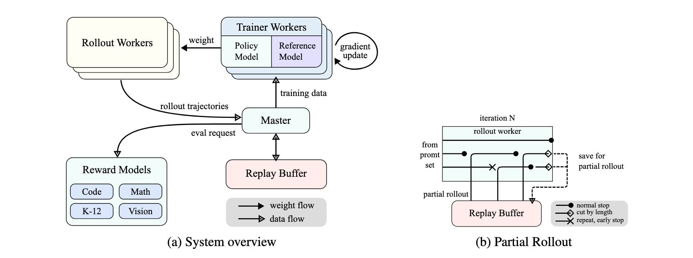

The paper "KIMI K1.5: Scaling Reinforcement Learning with LLMs" introduces Kimi k1.5, a new multi-modal Large Language Model (LLM) trained using **Reinforcement Learning (RL)**. The Kimi team aims to overcome the data limitations of traditional LLM pretraining by allowing the model to generate its own training data through exploration with rewards.

---

### Key Contributions and Techniques

The paper highlights several core ingredients in the development of Kimi k1.5:

* **Long Context Scaling:** Kimi k1.5 scales the context window for RL training to 128k tokens. The research indicates that increased context length leads to continuous performance improvements. A key innovation here is the use of **partial rollouts** for improved training efficiency, which involves reusing large portions of previous trajectories to sample new ones, reducing the cost of re-generating from scratch.

* **Improved Policy Optimization:** The model uses a variant of **online mirror descent** for robust policy optimization, specifically formulated for long-Chain of Thought (CoT) scenarios. This is further enhanced by effective sampling strategies, the introduction of a **length penalty**, and optimized data recipes.

* **Simplistic Framework:** Unlike prior approaches that often rely on complex techniques like Monte Carlo tree search, value functions, or process reward models, Kimi k1.5 achieves strong performance with a more straightforward RL framework. The ability to scale context length allows the learned CoTs to exhibit properties of planning, reflection, and correction.

* **Multimodality:** Kimi k1.5 is trained on both text and vision data, enabling it to reason jointly across these modalities.

* **Long2short Methods:** The paper also presents "long2short" methods, which leverage techniques developed for long-CoT models to enhance the performance of short-CoT models. These methods include **model merging**, **shortest rejection sampling**, **Direct Preference Optimization (DPO)**, and a dedicated **long2short RL** phase.

---

### RL Training Details

The RL training process for Kimi k1.5 involves:

* **RL Prompt Set Curation:** The team emphasizes the importance of a high-quality, diverse, balanced, and accurately evaluable prompt set to prevent reward hacking and overfitting. They use automatic filters, a model-based difficulty assessment, and methods to identify and remove "easy-to-hack" prompts.
* **Long-CoT Supervised Fine-Tuning (SFT):** A small, high-quality long-CoT warm-up dataset is created through prompt engineering, focusing on human-like reasoning processes such as planning, evaluation, reflection, and exploration. This SFT primes the model for generating detailed and logically coherent responses.
* **Policy Optimization (Detailed):** The core RL objective is to maximize the reward for correct answers. The training algorithm is a variant of online policy mirror descent. Notably, the system *excludes a value network* from its training. The authors hypothesize that traditional value functions might not be suitable for encouraging exploration of diverse reasoning paths, which is crucial for developing robust problem-solving strategies.
* **Length Penalty:** To counteract "overthinking" (excessive response length) during RL training, a length reward is introduced. This reward promotes shorter, correct responses and penalizes longer, incorrect ones, with a warm-up phase to avoid hindering initial training.
* **Sampling Strategies:** To improve training efficiency, Kimi k1.5 employs **curriculum sampling** (starting with easier tasks and progressing to harder ones) and **prioritized sampling** (focusing on problems where the model underperforms based on its success rate).
* **Test Case Generation for Coding:** For coding problems without available test cases, the paper describes an automated method to generate high-quality test cases using the CYaRon library and leveraging ground truth solutions.
* **Reward Modeling for Math:** To accurately evaluate mathematical solutions, the paper discusses two approaches: a classic value-head based reward model and a more accurate **Chain-of-Thought (CoT) Reward Model**, which explicitly generates a step-by-step reasoning process before providing a correctness judgment. The CoT Reward Model achieved significantly higher accuracy.
* **Vision Data:** The vision RL data is sourced from real-world data (science, location guessing, data analysis), synthetic visual reasoning data (spatial relationships, patterns), and text-rendered data (converting text to images to ensure consistency).

---

### Performance

Kimi k1.5 demonstrates **state-of-the-art reasoning performance** across multiple benchmarks and modalities:

* **Long-CoT results:** It achieves scores like 77.5 on AIME, 96.2 on MATH 500, 94th percentile on Codeforces, and 74.9 on MathVista, matching or exceeding models like OpenAI's o1.
* **Short-CoT results:** Through its long2short methods, Kimi k1.5 also achieves state-of-the-art short-CoT reasoning performance, including 60.8 on AIME, 94.6 on MATH500, and 47.3 on LiveCodeBench, significantly outperforming existing short-CoT models such as GPT-4o and Claude Sonnet 3.5 (up to +550%).

---

### Training Stages

The overall development of Kimi k1.5 consists of several stages:

1.  **Pretraining:** A multi-stage process involving     
    1. vision-language pretraining
       1. first text
       1. interleaves image and text
       1. only visual tower weights are updated
       1. both visual and language models unfrozen
    1. cooldown for consolidating capabilities
       1. introduce synthetic data
       1. augment synthetic code/math 
    1. long-context activation up to 131,072 tokens.
       1. upsampled with longer context training data
2.  **Vanilla Supervised Fine-tuning (SFT):** Building a corpus for non-reasoning tasks.
    1.500k Q&A, 200k coding, 200k math and sci, 5k creative, 20k long context summarization, 1m text-vision
3.  **Long-CoT Supervised Fine-tuning.**
4.  **Reinforcement Learning.**

---

The paper concludes that Kimi k1.5 establishes a simplistic yet effective RL framework by leveraging long context scaling and improved policy optimization, demonstrating that LLMs can effectively scale their training data through learning to explore with rewards, leading to significant advancements in reasoning capabilities.

---
[SKIP TO SYSTEM](#system)

# Long context scaling
- 128k token context window
- expensive to do a single rollout
- partial rollout reuse significant portion from previously generated sequence

# Mirror Descent  
- optimizing over probablity distributions
  - values are non-negative and sum up to one
- instead, perform updates in dual space and map it back to primal space
- transformation via a mirror map
  - aka distance generating function
  - aka potential function

## Advantages
- faster convergence
- implicit regularization
- avoid value functions

## Steps
1. map parameters to dual space
2. gradient step in dual space
3. map back to primal space
4. projection if constrained

## Example mapping
1. $\phi(x)  = x \log x$
1. $\nabla \phi = \log x + 1$
1. Can think of $\log$ as mapping probabilities to log probability

## LLM
1. policy $\pi(y,z|x)$ represent the probability of generating a $z$ (CoT) and final answer $y$, given input $x$.

# Problem statement
- Need more data to scale models "intelligence"

# Features
- 128k token context length
- online mirror gradient descent
- sampling strategy, length penalty
- simple framework
  - no Monte Carlo tree search
  - value functions
  - process rewards
- multimodality

# Explicit Tree Search vs Implicit Search
- Explicit
  - build tree/graph of nodes
  - planning algorithm MCTS, A*, BFS, DFS to traverse
    tree and select best path
  - LLM is a sub-module that generates candidate moves
- Implicit Search
  - LLM does not explicitly branch
  - "decision-making" for reasoning path is encoded
    in the model weights
    - there is no external algorithm that evaluates them
      and picks the best one to continue

# Kimi similarities

## Multi-stage Training Paradigm
1. Pre-training
   - learn language
   - world knowledge
   - basic reasoning
2. SFT
   - instruction following to align with desired behaviors and formats
3. RL
   - use of a reward signal

## Reward model
- human-generated (RLHF)
- ai-generated (RLAIF)
- specilized correctness checker (Kimi CoT RM)

## Use of policy gradients

# Kimi differences

## Specialized CoT RM
- RM performs CoT style reasoning to evaluate policy model's intermediate steps and final answer

## Focus on Long-CoT
- Explicitly designed to generate long, coherent, and implict planning CoT.
- context window scaled to 128k
- model internalizes long reasoning patterns
- model learns to generate its own search process

## Online policy mirror descent
- vs. PPO complex to tune and less stable
- Kimi uses a variant of online policy mirror descnt
  - suited for optimizing probability distributions
  - uses non-Euclidean metric
  - more stable and natural updates
    - "loss" doesn't oscillate as much
    - "natural" - operates in log space (presumably)
  - more robust and faster convergence
    - paper: "extension of a usual on-policy regularized policy gradient algorithm to the off-policy case"

## Direct integration of length penalty (long2short method)
- adds length penalty in the reward funciton
- long2short RL: distinct RL phase with
  - strong length penalties 
  - reduced max generation lengths
  - training for conciseness AFTER initial reasoning capabilities are established

## Sampling strategies and data curation
- Shortest rejection sampling - during SFT data creation
- DPO (Direct Preference Optimization) for Long2Short 
- Curriculum sampling - begin with easier tasks then go into harder taks

## Summary
- Sophisticated CoT RM
- Online Policy Mirror Descent
- Direct integration of length penalties with long2short methods

# Derivation of the grad of the surrogate loss
You're asking about the core of how policies are updated in RL algorithms that incorporate KL regularization, like the one used in the Kimi paper. The "surrogate loss" is a common term for the objective function that we optimize iteratively to update the policy.

Let's derive the gradient of the surrogate loss. We start with the objective function we discussed:

$$L(\pi) = \mathbb{E}_{(y,z) \sim \pi} [r(x, y, y^*)] - \tau \text{KL}(\pi(\cdot|x) || \pi_{\theta_i}(\cdot|x))$$

We want to find the gradient of $L(\pi)$ with respect to the policy parameters $\theta$ (assuming $\pi$ is parameterized by $\theta$). For simplicity, let's denote $\pi(y, z|x)$ as $\pi_\theta(a)$ and $r(x, y, y^*)$ as $R(a)$, where $a$ represents a trajectory $(y,z)$. The reference policy is $\pi_{\theta_i}(a)$.

The objective can be written in summation form (for discrete action spaces, generalizes to integral for continuous):

$$L(\theta) = \sum_a \pi_\theta(a) R(a) - \tau \sum_a \pi_\theta(a) \log \left( \frac{\pi_\theta(a)}{\pi_{\theta_i}(a)} \right)$$

Now, let's take the gradient with respect to $\theta$:

$$\nabla_\theta L(\theta) = \nabla_\theta \left( \sum_a \pi_\theta(a) R(a) - \tau \sum_a \pi_\theta(a) \log \left( \frac{\pi_\theta(a)}{\pi_{\theta_i}(a)} \right) \right)$$

We can separate this into two terms:

**Term 1: Gradient of Expected Reward**

This is the standard policy gradient term (REINFORCE-like):

$$\nabla_\theta \sum_a \pi_\theta(a) R(a) = \sum_a \nabla_\theta \pi_\theta(a) R(a)$$

Using the log-derivative trick: $\nabla_\theta \pi_\theta(a) = \pi_\theta(a) \frac{\nabla_\theta \pi_\theta(a)}{\pi_\theta(a)} = \pi_\theta(a) \nabla_\theta \log \pi_\theta(a)$.

So, Term 1 becomes:
$$\sum_a \pi_\theta(a) \nabla_\theta \log \pi_\theta(a) R(a) = \mathbb{E}_{a \sim \pi_\theta} [\nabla_\theta \log \pi_\theta(a) R(a)]$$

**Term 2: Gradient of KL Divergence Regularization**

Now, let's look at the second term:
$$\nabla_\theta \left( - \tau \sum_a \pi_\theta(a) \log \left( \frac{\pi_\theta(a)}{\pi_{\theta_i}(a)} \right) \right) = - \tau \nabla_\theta \sum_a \pi_\theta(a) (\log \pi_\theta(a) - \log \pi_{\theta_i}(a))$$

Let's apply the product rule and linearity of gradient:
$$ - \tau \sum_a \left[ \nabla_\theta \pi_\theta(a) (\log \pi_\theta(a) - \log \pi_{\theta_i}(a)) + \pi_\theta(a) \nabla_\theta (\log \pi_\theta(a) - \log \pi_{\theta_i}(a)) \right]$$

$$ = - \tau \sum_a \left[ \pi_\theta(a) \nabla_\theta \log \pi_\theta(a) \log \left( \frac{\pi_\theta(a)}{\pi_{\theta_i}(a)} \right) + \pi_\theta(a) \left( \frac{\nabla_\theta \pi_\theta(a)}{\pi_\theta(a)} - \frac{\nabla_\theta \pi_{\theta_i}(a)}{\pi_{\theta_i}(a)} \right) \right]$$

$$ = - \tau \sum_a \left[ \pi_\theta(a) \nabla_\theta \log \pi_\theta(a) \log \left( \frac{\pi_\theta(a)}{\pi_{\theta_i}(a)} \right) + \pi_\theta(a) \nabla_\theta \log \pi_\theta(a) - \pi_\theta(a) \nabla_\theta \log \pi_{\theta_i}(a) \right]$$

Now, let's use the property that $\mathbb{E}_{a \sim \pi_\theta} [\nabla_\theta \log \pi_\theta(a)] = \sum_a \pi_\theta(a) \nabla_\theta \log \pi_\theta(a) = \nabla_\theta \sum_a \pi_\theta(a) = \nabla_\theta (1) = 0$. This is a crucial identity in policy gradients.

So the second term simplifies:
$$= - \tau \sum_a \pi_\theta(a) \nabla_\theta \log \pi_\theta(a) \log \left( \frac{\pi_\theta(a)}{\pi_{\theta_i}(a)} \right) - \tau \underbrace{\sum_a \pi_\theta(a) \nabla_\theta \log \pi_\theta(a)}_{=0} + \tau \sum_a \pi_\theta(a) \nabla_\theta \log \pi_{\theta_i}(a)$$

$$= - \tau \mathbb{E}_{a \sim \pi_\theta} \left[ \nabla_\theta \log \pi_\theta(a) \log \left( \frac{\pi_\theta(a)}{\pi_{\theta_i}(a)} \right) \right] + \tau \mathbb{E}_{a \sim \pi_\theta} \left[ \nabla_\theta \log \pi_{\theta_i}(a) \right]$$

**Combining Both Terms:**

Now, combine Term 1 and the simplified Term 2:

$$\nabla_\theta L(\theta) = \mathbb{E}_{a \sim \pi_\theta} [\nabla_\theta \log \pi_\theta(a) R(a)] - \tau \mathbb{E}_{a \sim \pi_\theta} \left[ \nabla_\theta \log \pi_\theta(a) \log \left( \frac{\pi_\theta(a)}{\pi_{\theta_i}(a)} \right) \right] + \tau \mathbb{E}_{a \sim \pi_\theta} \left[ \nabla_\theta \log \pi_{\theta_i}(a) \right]$$

Factor out the expectation and $\nabla_\theta \log \pi_\theta(a)$ where possible:

$$\nabla_\theta L(\theta) = \mathbb{E}_{a \sim \pi_\theta} \left[ \nabla_\theta \log \pi_\theta(a) \left( R(a) - \tau \log \left( \frac{\pi_\theta(a)}{\pi_{\theta_i}(a)} \right) \right) \right] + \tau \mathbb{E}_{a \sim \pi_\theta} \left[ \nabla_\theta \log \pi_{\theta_i}(a) \right]$$

This is the general form of the gradient. In practice, the last term $\tau \mathbb{E}_{a \sim \pi_\theta} \left[ \nabla_\theta \log \pi_{\theta_i}(a) \right]$ is often zero or approximately zero if $\pi_{\theta_i}$ is fixed with respect to $\theta$ (as it is the old policy). If $\pi_{\theta_i}$ has some dependence on shared parameters that are being updated, this term might be kept.

**Simplification for Practical Algorithms (e.g., PPO-KL, Trust Region Methods):**

Many algorithms, including those related to Policy Mirror Descent, focus on the first term because the second term's expectation often cancels or is very small for small steps. The core idea is to sample trajectories from the *current* policy $\pi_\theta$ and then update $\theta$ based on this gradient.

The most common form of the policy gradient with KL regularization is often approximated by:

$$\nabla_\theta L(\theta) \approx \mathbb{E}_{a \sim \pi_\theta} \left[ \nabla_\theta \log \pi_\theta(a) \left( R(a) - \tau \log \left( \frac{\pi_\theta(a)}{\pi_{\theta_i}(a)} \right) \right) \right]$$

This is the form that often appears in algorithms like PPO (Proximal Policy Optimization) with a KL penalty, where the ratio $\frac{\pi_\theta(a)}{\pi_{\theta_i}(a)}$ is directly optimized. The `log-ratio` term penalizes deviations from the old policy.

**Connection to Kimi's Equation 3:**

The Kimi paper's Equation 3 is:

$$g = \mathbb{E}_{y,z \sim \pi_{\theta_i}} \left[ \alpha \nabla_{\theta} \log \pi_{\theta}(y,z|x) \left( r(x, y, y^*) - \tau \log \frac{\pi_{\theta}(y,z|x)}{\pi_{\theta_i}(y,z|x)} \right) \right]$$

Notice some differences:
1.  **Sampling from $\pi_{\theta_i}$ (Off-Policy):** Kimi's gradient is sampled from the *old* policy $\pi_{\theta_i}$, making it an off-policy gradient. This is common in DPO and similar methods. My derivation above assumed on-policy sampling from $\pi_\theta$.
    To get the off-policy version, you would use the importance sampling trick: $\mathbb{E}_{a \sim \pi_\theta} [f(a)] = \mathbb{E}_{a \sim \pi_{\theta_i}} [\frac{\pi_\theta(a)}{\pi_{\theta_i}(a)} f(a)]$. Applying this to the first term in our combined gradient:
    $$\mathbb{E}_{a \sim \pi_{\theta_i}} \left[ \frac{\pi_\theta(a)}{\pi_{\theta_i}(a)} \nabla_\theta \log \pi_\theta(a) \left( R(a) - \tau \log \left( \frac{\pi_\theta(a)}{\pi_{\theta_i}(a)} \right) \right) \right]$$
    However, Kimi's Equation 3 doesn't have the $\frac{\pi_\theta}{\pi_{\theta_i}}$ ratio in front of the gradient term itself. This implies they might be using a specific form of Mirror Descent or a different re-parametrization trick, possibly related to the natural gradient.

2.  **Lack of Second KL Term:** The Kimi gradient **doesn't include the second KL term** $\tau \mathbb{E}_{a \sim \pi_{\theta_i}} \left[ \nabla_\theta \log \pi_{\theta_i}(a) \right]$ that I derived. This is often because $\nabla_\theta \log \pi_{\theta_i}(a)$ is zero if $\pi_{\theta_i}$ is treated as fixed with respect to the current parameters $\theta$ during the gradient calculation. In practice, $\pi_{\theta_i}$ is often a frozen copy of the policy from the previous iteration.

3.  **Coefficient $\alpha$:** The $\alpha$ is a learning rate or step-size parameter.

The Kimi paper's gradient formulation (Equation 3) aligns with what's often seen in **Direct Preference Optimization (DPO)** or similar **implicit policy gradient methods**, where the target policy is explicitly defined by the exponential weighting of the reference policy. The DPO loss function, for instance, can be derived by directly taking the logarithm of the optimal policy $\pi^*$ (the one that maximizes the KL-regularized reward objective) and optimizing to match it.

While the full derivation can be complex for Online Policy Mirror Descent, the given gradient `g` is essentially trying to push the current policy $\pi_\theta$ towards the optimal policy $\pi^*$ that we derived earlier. The $R(a) - \tau \log \left( \frac{\pi_\theta(a)}{\pi_{\theta_i}(a)} \right)$ term acts as an effective "advantage" or "Q-value" that the policy gradient is trying to optimize.

# System

1. high level
   1. rollout phase
      1. generate trajectories store in replay buffer
   1. training phase
      1. takes trajectories from replay buffer
      1. compute gradients
      1. use RM and code execution service
1. partial rollouts
   1. caps length of trajectories
   1. unfinished trajectories continued on next iteration
   1. only current iteration requires online computation
   1. training workers can exclude certain segments can be excluded from loss computation
   1. stop repeated generation by adding penalty

# side cars

1. high level
   1. megatron - training phase
   1. vLLM - rollout phase

## Megatron
1. 3D parallelism
   1. tensor
   2. pipeline
   3. data

## vLLM
### Paged Attention
- KV cache is 60-80% unused because sequences have varying lengths
- break KV cache into blocks, allocate on demand rather than one contiguous block of memory
- need to maintain a block table
- different sequences can share blocks that are the same prefix - useful in beam search

### Continuous Batching
- static batching, barrier to wait until all sequences finish
- dynamic batching, continuous add new incoming requests, when a particular sequence finishes, release resources

## mooncake

1. Problems with LLM serving:

   1. diverse workloads:
      1. input/output length variation
      1. arrival frequecy
      1. TTFT and TBT SLO
   1. maximize throughput
   1. resource utilization
      1. make sure GPU/CPU/DRAM/SSD are not idle
   1. overload scenario
      1. mooncake freq. overloaded, need to reject requests
   1. KV cache management (main problem)
      1. Reuse / Transfer / Storage

1. KV cache stored in paged blocks in CPU memory
   1. dedup with hashes

1. Terminology
   1. TTFT - time to first token
   1. TBT - time between token
   1. MFU - model flop utilization

1. Principles
   1. Reuse KV cache as much as possible - inc. TTFT
   1. Maximize number of token in each batch - inc. TBT

1. For each request, Conductor:
   1. select a prefill and decoder
   1. transfer as much of the KV external to prefill
   1. prefill in blocks, stream to decoder
   1. load KV cache, add request to cont. batching

1. Selection process is complex
   1. main objective is to reuse KV
   1. TTFT is a constraint
   1. conductor needs to predict usage
      1. replicate hot blocks to avoid congestion
      1. swap out cold blocks
   1. also constrained by available DRAM in prefill

1. Decoding stage has separate goal
   1. main goal is to aggregate as many tokens
   1. constrained by the TBT
   1. contraineed by amount of VRAM available

1. Purpose of Prefill node:
   1. compute the KV cache
   1. i.e. given a prefix compute the first token
   1. SLO is the TTFT
   1. Compute bound
   1. Use tensor / pipeline parallelism for heavy compute
1. Purpose of Decoder node:
   1. given a KV cache
   1. autoregressive compute the rest of the tokens
   1. Memory bound - need to use KV Cache in GPU global memory to compute contribution for newly generated tokens
   1. optimize fetching from KVCache
      1. KVCache blocks are loaded asynchroniously into VRAM

1. Disaggregated functionality
   1. 
# kimi 2.0
## Muon

1. Apply newton-schulz to normalize the gradient matrix

1. In the example below, began with symmetric matrix
   1. eigenvalues are positive
   1. in general, will be both + and - 
   1. normalization will take them to +1, -1
   1. 

1. why is this *desirable*
   1. a regularization technique
      1. not just going steepest descent 
      1. allowing other weights to adjust
      1. reduce exploding and vanishing gradient
   1.  approximates second order methods, normalized matrix is an approximation to the hessian
   1. smaller singular values "inflate" faster
      1. less training time

1. doesn't this make things *unstable*?
   1. only take 5-6 steps in Newton-Schulz
      1. "partial" orthogonalization
   1. prior to N-S, $G/|G|_F$ (normalize)
   1. only applies to 2D matrices
      1. not biases, embeddings, classifier heads
      1. still on AdamW

# RL
1. $\underset{\theta}{\max}\ ⁡ \mathbb{E}_{\left(x , y^{*}\right) \sim \mathcal{D},\ \left( y , z \right) \sim \pi_{\theta}} ⁢ \left[ r ⁢ \left( x , y , y^{*} \right) \right]$
   1. Draw $y,z$ and use reward to $r$ to guide training.
   1. Emphasis on $z$, CoT.
   1. Note there is no $r(..z..)$, i.e. rewards are not a function of intermediate steps
1. $z$ can be long, kimi targets 128k tokens
1. $\underset{\theta}{\max} \ \mathbb{E}_{\left(\right. x , y^{*} \left.\right) \sim \mathcal{D}} \left[\right. \mathbb{E}_{\left(\right. y , z \left.\right) \sim \pi_{\theta}} \left[\right. r \left(\right. x , y , y^{*} \left.\right) \left]\right. - \tau\ \text{KL}\left(\right. \pi_{\theta} \left(\right. x \left.\right) \left|\right. \left|\right. \pi_{\theta_{i}} \left(\right. x \left.\right) \left.\right) \left]\right.$
   1. KL term keeps $\pi_\theta$ close to $\pi_{\theta_i}$
      1. Note this process is iterative, so don't let the
         current model deviate too much from previous model
1. There is a closed form solution:
$\pi^{*} ⁢ \left(\right. y , z \left|\right. x \left.\right) = \pi_{\theta_{i}} ⁢ \left(\right. y , z \left|\right. x \left.\right) ⁢ \exp ⁡ \left(\right. r ⁢ \left(\right. x , y , y^{*} \left.\right) / \tau \left.\right) / Z .$
   1. The optimum policy is the old policy weighed a softmax based on the reward (as compared with other trajectories beginning with the $x$ and not necessarily ending at $y^*$)
   1. If we have this closed form solution aren't we done?  No, partition function $Z$ is usually intractable, and must be calculated anew for each $x$.
1. Surrogate Loss
   1. think of this as the L2 loss, i.e. how far is this from the optimum policy
$L \left(\right. \theta \left.\right) =
 \mathbb{E}_{\left(\right. x , y^{*} \left.\right) \sim \mathcal{D}} ⁢ \left[\right. \mathbb{E}_{\left(\right. y , z \left.\right) \sim \pi_{\theta_{i}}}
  ⁢ \left[\right. \left( r ⁢ \left(\right. x , y , y^{*} \left.\right) - \tau ⁢ \log ⁡ Z - \tau ⁢ \log ⁡ \frac{\pi_{\theta} ⁢ \left(\right. y , z \left|\right. x \left.\right)}{\pi_{\theta_{i}} ⁢ \left(\right. y , z \left|\right. x \left.\right)} \right)^{2} \left]\right. \left]\right. .$
   1. Note that this loss is in mirror space already, not euclidean in probability space, but exponential in gradient space, i.e. you take the log of probabilities
1. Kimi paper claims that the gradient of the loss looks like this:
$\frac{1}{k} \sum_{j = 1}^{k} \left(\right. \nabla_{\theta} \log \pi_{\theta} \left(\right. y_{j} , z_{j} \left|\right. x \left.\right) \left(\right. r \left(\right. x , y_{j} , y^{*} \left.\right) - \bar{r} \left.\right) - 
\frac{\tau}{2} \nabla_{\theta} \left( \log \frac{\pi_{\theta} ⁢ \left(\right. y_{j} , z_{j} \left|\right. x \left.\right)}{\pi_{\theta_{i}} ⁢ \left(\right. y_{j} , z_{j} \left|\right. x \left.\right)} \right)^{2} \left.\right) .$ 
   1. This doesn't seem to be derived from the Surrogate Loss
   1. If one derives directly from the Surrogate Loss it looks like:

   $$g = \mathbb{E}_{y,z \sim \pi_{\theta_i}} \left[ \alpha \nabla_{\theta} \log \pi_{\theta}(y,z|x) \left( r(x, y, y^*) - \tau \log \frac{\pi_{\theta}(y,z|x)}{\pi_{\theta_i}(y,z|x)} \right) \right]$$

   1. In any case, there are familiar terms, $r-\bar{r}$, but this is taken over all sampled trajectories, and there is a regularization term, making sure that the policy doesn't deviate too much from the previous one.
   1. Note that it is off-policy in the sense that the updates are derived from trajectories under $\theta_i$.
1. Kimi paper explicitly does not want to assign any credit to intermediate steps.  
   1. Recall that $V(s)$ tries to assign a value to a partial result, and it will penalize a path that leads to a wrong result
   1. Authors claim that such path is essential for the model to learn how to self correct
1. For fun just compare against DeepSeekMath:
   1. Differences:
      1. DSM gives rewards at each step
      1. Advantage normalized by the group mean and std
         1. kimi only take the mean
      1. There is penalty given to longer sequences
      1. L1 vs L2 of the KL term
      1. Takes importance sampling into consideration
         1. since trajectories come from old policy 
$$
\mathcal{J}_{G ⁢ R ⁢ P ⁢ O}⁢ \left(\right. \theta \left.\right) =
$$

$$ \mathbb{E}
 \left[\right.
   q \sim P⁢ \left(\right. Q \left.\right), \left\{ o_{i} \right\}_{i = 1}^{G} \sim \pi_{\theta_{o ⁢ l ⁢ d}}
⁢   \left(\right. O \left|\right. q \left.\right)
 \left]\right.
 \frac{1}{G} \sum_{i = 1}^{G}
 \frac{1}{\left|\right. o_{i} \left|\right.} \sum_{t = 1}^{\left|\right. o_{i} \left|\right.}
$$ 

$$\left\{\right. \frac{
   \pi_{\theta}⁢ \left(\right. o_{i , t} \left|\right. q , o_{i , < t} \left.\right)
}
{
   \pi_{\theta_{o ⁢ l ⁢ d}} ⁢ \left(\right. o_{i , t} \left|\right. q , o_{i , < t} \left.\right)
}
\hat{A}_{i , t} - \beta \mathbb{D}_{K ⁢ L}
 \left[\right. \pi_{\theta} \left|\right. \left|\right. \pi_{r ⁢ e ⁢ f} \left]\right. \left.\right\}
$$

$$
\hat{A}_{i,t}=\frac{r_i−\mu(𝐫)}{\sigma(r)}
$$
   
# Length penalty

$$r_l \left(\right. i \left.\right) =$$
\[ \begin{align} 
\lambda & \> \> \> \text{If} \> r⁢ \left(\right. x , y_{i} , y^{*} \left.\right) = 1 \\
\min  \left(\right. 0 , \lambda \left.\right) & \> \> \> \text{If} \> r \left(\right. x , y_{i} , y^{*} \left.\right) = 0
\end{align}
\]
\[
\lambda = 0.5 - \frac{len ⁢ \left(\right. i \left.\right) - min ⁢ _ ⁢ len}{max ⁢ _ ⁢ len - min ⁢ _ ⁢ len}
\]
1. if r=1, then -0.5, 0.5 from maxlen, minlen
1. if r=0, then -0.5, 0   

[JUMP TO LONG2SHORT](#long2short)
# Sampling Strategies (skip)
1. Curriculum sampling: easy to hard
1. Prioritized sampling: prioritize where models under performs

# CoT RM (skip)
1. 800K SFT Kimi

# Long2Short
## Model merging
1. average the weights from Long CoT with Short CoT
## Rejection sampling
1. samples N=8 times and keep the shortest correct answer
## DPO
1. Use Long CoT, use DPO shortest (good) vs longest (bad)

   1. $$J(\pi) = \mathbb{E}_{x \sim \mathcal{D}, y \sim \pi(\cdot|x)} [r(x, y)] - \beta \text{KL}(\pi(\cdot|x) || \pi_{ref}(\cdot|x))$$

   1. $$\pi^*(y|x) = \pi_{ref}(y|x) \exp\left(\frac{1}{\beta} r(x, y)\right)/Z$$

   1. $$r(x, y) = \beta \log \frac{\pi^*(y|x)}{\pi_{ref}(y|x)} + \beta \log Z(x)$$

   1. $$P(y_w \succ y_l | x) = \sigma(r(x, y_w) - r(x, y_l))$$

   1. $$r(x, y_w) - r(x, y_l) = \beta \left( \log \frac{\pi^*(y_w|x)}{\pi_{ref}(y_w|x)} - \log \frac{\pi^*(y_l|x)}{\pi_{ref}(y_l|x)} \right)$$

   1. To align $\pi_\theta$ , we maximize the likelihood of the observed preferences in the dataset $\mathcal{D} = \{(x, y_w, y_l)\}$. This leads to a **binary cross-entropy loss function**:

$$L_{DPO}(\theta) = -\mathbb{E}_{(x, y_w, y_l) \sim \mathcal{D}} \left[ \log \sigma\left( r_\theta(y_w|x) - r_\theta(y_l|x) \right) \right]$$

   1. No RM, no V(s), straight forward classification loss

## Long2Short
1. standard RL
1. separate long2short RL phase apply length penalty

# Training data:

$\mathcal{D}=\left\{\left(x_{i}, y_{i}^{*}\right)\right\}_{i=1}^{n}$

problems: $x_{i}$ 
answers: $y_{i}^{*}$

# Goal:

Find policy $\pi_{\theta}$

# CoT to the rescue:
- use a sequence of intermediate steps $z=\left(z_{1}, z_{2}, \ldots, z_{m}\right)$
- bridges $x$ and $y$
- $y, z \sim \pi_{\theta}$

# Planning algorithms

## Tree method
1. Construct a search tree of thoughts guided by value estimations. 

1. Node of the tree is a partial solution $s=\left(x, z_{1:|s|}\right)$

1. Use a critic model $v$ to provide feedback $v\left(x, z_{1:|s|}\right)$

## Algorithmic method

1. Given past search history available at the $t$-th iteration $\left(s_{1}, v\left(s_{1}\right), \ldots, s_{t-1}, v\left(s_{t-1}\right)\right)$

1. a planning algorithm $\mathcal{A}$ iteratively determines the next search direction $\mathcal{A}\left(s_{t} \mid s_{1}, v\left(s_{1}\right), \ldots, s_{t-1}, v\left(s_{t-1}\right)\right)$

1.  and provides feedbacks for the current search progress $\mathcal{A}\left(v\left(s_{t}\right) \mid s_{1}, v\left(s_{1}\right), \ldots, s_{t}\right)$.

1. All information stored in the search tree used by the planning algorithm is flattened into the full context provided to the algorithm.
   1. Rather than explicitly constructing a search tree and implementing a planning algorithm
   1. Train a model to approximate this process.

1. This method enables the model to run an implicit search over the reasoning space directly via auto-regressive predictions.

1. Consequently, the model not only learns to solve a set of training problems but also develops the ability to tackle individual problems effectively, leading to improved generalization to unseen test problems.

## RL
1. Reward Model (RM), $r$ is a reward model that justifies the correctness of the proposed answer $y$ for the given problem $x$ based on the ground truth $y^{*}$, by assigning a value $r\left(x, y, y^{*}\right) \in\{0,1\}$.
1. For verifiable problems, the reward is directly determined by predefined criteria or rules. For example, in coding problems, we assess whether the answer passes the test cases. For problems with free-form ground truth, we train a reward model $r\left(x, y, y^{*}\right)$ that predicts if the answer matches the ground truth. Given a problem $x$, the model $\pi_{\theta}$ generates a CoT and the final answer through the sampling procedure $z \sim \pi_{\theta}(\cdot \mid x)$, $y \sim \pi_{\theta}(\cdot \mid x, z)$. The quality of the generated CoT is evaluated by whether it can lead to a correct final answer. In summary, we consider the following objective to optimize the policy

$$
\begin{equation*}
\max _{\theta} \mathbb{E}_{\left(x, y^{*}\right) \sim \mathcal{D},(y, z) \sim \pi_{\theta}}\left[r\left(x, y, y^{*}\right)\right] . \tag{1}
\end{equation*}
$$

By scaling up RL training, we aim to train a model that harnesses the strengths of both simple prompt-based CoT and planning-augmented CoT. The model still auto-regressively sample language sequence during inference, thereby circumventing the need for the complex parallelization required by advanced planning algorithms during deployment. However, a key distinction from simple prompt-based methods is that the model should not merely follow a series of reasoning steps. Instead, it should also learn critical planning skills including error identification, backtracking and solution refinement by leveraging the entire set of explored thoughts as contextual information.

### 2.3.2 Policy Optimization

We apply a variant of online policy mirror decent as our training algorithm (Abbasi-Yadkori et al. 2019, Mei et al. 2019, Tomar et al. 2020). The algorithm performs iteratively. At the $i$-th iteration, we use the current model $\pi_{\theta_{i}}$ as a reference model and optimize the following relative entropy regularized policy optimization problem,

$$
\begin{equation*}
\max _{\theta} \mathbb{E}_{\left(x, y^{*}\right) \sim \mathcal{D}}\left[\mathbb{E}_{(y, z) \sim \pi_{\theta}}\left[r\left(x, y, y^{*}\right)\right]-\tau \operatorname{KL}\left(\pi_{\theta}(x) \| \pi_{\theta_{i}}(x)\right)\right], \tag{2}
\end{equation*}
$$

where $\tau>0$ is a parameter controlling the degree of regularization. This objective has a closed form solution

$$
\pi^{*}(y, z \mid x)=\pi_{\theta_{i}}(y, z \mid x) \exp \left(r\left(x, y, y^{*}\right) / \tau\right) / Z .
$$

Here $Z=\sum_{y^{\prime}, z^{\prime}} \pi_{\theta_{i}}\left(y^{\prime}, z^{\prime} \mid x\right) \exp \left(r\left(x, y^{\prime}, y^{*}\right) / \tau\right)$ is the normalization factor. Taking logarithm of both sides we have for any ( $y, z$ ) the following constraint is satisfied, which allows us to leverage off-policy data during optimization

$$
r\left(x, y, y^{*}\right)-\tau \log Z=\tau \log \frac{\pi^{*}(y, z \mid x)}{\pi_{\theta_{i}}(y, z \mid x)}
$$

This motivates the following surrogate loss

$$
L(\theta)=\mathbb{E}_{\left(x, y^{*}\right) \sim \mathcal{D}}\left[\mathbb{E}_{(y, z) \sim \pi_{\theta_{i}}}\left[\left(r\left(x, y, y^{*}\right)-\tau \log Z-\tau \log \frac{\pi_{\theta}(y, z \mid x)}{\pi_{\theta_{i}}(y, z \mid x)}\right)^{2}\right]\right] .
$$

To approximate $\tau \log Z$, we use samples $\left(y_{1}, z_{1}\right), \ldots,\left(y_{k}, z_{k}\right) \sim \pi_{\theta_{i}}: \tau \log Z \approx \tau \log \frac{1}{k} \sum_{j=1}^{k} \exp \left(r\left(x, y_{j}, y^{*}\right) / \tau\right)$. We also find that using empirical mean of sampled rewards $\bar{r}=\operatorname{mean}\left(r\left(x, y_{1}, y^{*}\right), \ldots, r\left(x, y_{k}, y^{*}\right)\right)$ yields effective practical results. This is reasonable since $\tau \log Z$ approaches the expected reward under $\pi_{\theta_{i}}$ as $\tau \rightarrow \infty$. Finally, we conclude our learning algorithm by taking the gradient of surrogate loss. For each problem $x, k$ responses are sampled using the reference policy $\pi_{\theta_{i}}$, and the gradient is given by

$$
\begin{equation*}
\frac{1}{k} \sum_{j=1}^{k}\left(\nabla_{\theta} \log \pi_{\theta}\left(y_{j}, z_{j} \mid x\right)\left(r\left(x, y_{j}, y^{*}\right)-\bar{r}\right)-\frac{\tau}{2} \nabla_{\theta}\left(\log \frac{\pi_{\theta}\left(y_{j}, z_{j} \mid x\right)}{\pi_{\theta_{i}}\left(y_{j}, z_{j} \mid x\right)}\right)^{2}\right) . \tag{3}
\end{equation*}
$$

To those familiar with policy gradient methods, this gradient resembles the policy gradient of (2) using the mean of sampled rewards as the baseline (Kool et al. 2019, Ahmadian et al. 2024). The main differences are that the responses are sampled from $\pi_{\theta_{i}}$ rather than on-policy, and an $l_{2}$-regularization is applied. Thus we could see this as the natural extension of a usual on-policy regularized policy gradient algorithm to the off-policy case (Nachum et al. 2017). We sample a batch of problems from $\mathcal{D}$ and update the parameters to $\theta_{i+1}$, which subsequently serves as the reference policy for the next iteration. Since each iteration considers a different optimization problem due to the changing reference policy, we also reset the optimizer at the start of each iteration.
We exclude the value network in our training system which has also been exploited in previous studies (Ahmadian et al. 2024). While this design choice significantly improves training efficiency, we also hypothesize that the conventional use of value functions for credit assignment in classical RL may not be suitable for our context. Consider a scenario where the model has generated a partial $\mathrm{CoT}\left(z_{1}, z_{2}, \ldots, z_{t}\right)$ and there are two potential next reasoning steps: $z_{t+1}$ and $z_{t+1}^{\prime}$. Assume that $z_{t+1}$ directly leads to the correct answer, while $z_{t+1}^{\prime}$ contains some errors. If an oracle value function were accessible, it would indicate that $z_{t+1}$ preserves a higher value compared to $z_{t+1}^{\prime}$. According to the standard credit assignment principle, selecting $z_{t+1}^{\prime}$ would be penalized as it has a negative advantages relative to the current policy. However, exploring $z_{t+1}^{\prime}$ is extremely valuable for training the model to generate long CoT. By using the justification of the final answer derived from a long CoT as the reward signal, the model can learn the pattern of trial and error from taking $z_{t+1}^{\prime}$ as long as it successfully recovers and reaches the correct answer. The key takeaway from this example is that we should encourage the model to explore diverse reasoning paths to enhance its capability in solving complex problems. This exploratory approach generates a wealth of experience that supports the development of critical planning skills. Our primary goal is not confined to attaining high accuracy on training problems but focuses on equipping the model with effective problem-solving strategies, ultimately improving its performance on test problems.

### 2.3.3 Length Penalty

We observe an overthinking phenomenon that the model's response length significantly increases during RL training. Although this leads to better performance, an excessively lengthy reasoning process is costly during training and inference, and overthinking is often not preferred by humans. To address this issue, we introduce a length reward to restrain the rapid growth of token length, thereby improving the model's token efficiency. Given $k$ sampled responses
$\left(y_{1}, z_{1}\right), \ldots,\left(y_{k}, z_{k}\right)$ of problem $x$ with true answer $y^{*}$, let len $(i)$ be the length of $\left(y_{i}, z_{i}\right)$, min_len $=\min _{i}$ len $(i)$ and max_len $=\max _{i}$ len $(i)$. If max_len $=$ min_len, we set length reward zero for all responses, as they have the same length. Otherwise the length reward is given by

$
\text { lenreward }(\mathrm{i})=\left\{\begin{array}{rl}
\lambda & \text { If } r\left(x, y_{i}, y^{*}\right)=1 \\
\min (0, \lambda) & \text { If } r\left(x, y_{i}, y^{*}\right)=0
\end{array}, \quad \text { where } \lambda=0.5-\frac{\text { len }(i)-\text { minlen }}{\text { maxlen }- \text { minlen }} .\right.
$
