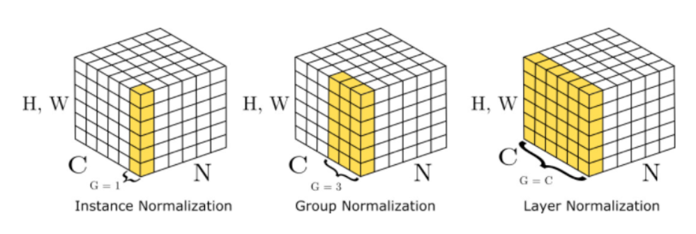

```python
import torch


num_groups = 4


# MNIST Classifier
net = torch.nn.Sequential(
    torch.nn.Conv2d(1, 32, kernel_size=5, stride=1, padding=2),
    # GroupNorm takes number of groups to divide the
    # channels in and the number of channels to expect
    # in the input
    torch.nn.GroupNorm(num_groups, 32),
    torch.nn.ReLU(),
    torch.nn.MaxPool2d(kernel_size=2, stride=2),


    torch.nn.Conv2d(32, 64, kernel_size=5, stride=1, padding=2),
    torch.nn.GroupNorm(num_groups, 64),
    torch.nn.ReLU(),
    torch.nn.MaxPool2d(kernel_size=2, stride=2),


    torch.nn.Flatten(),
    torch.nn.Linear(7 * 7 * 64, 10),
)
```