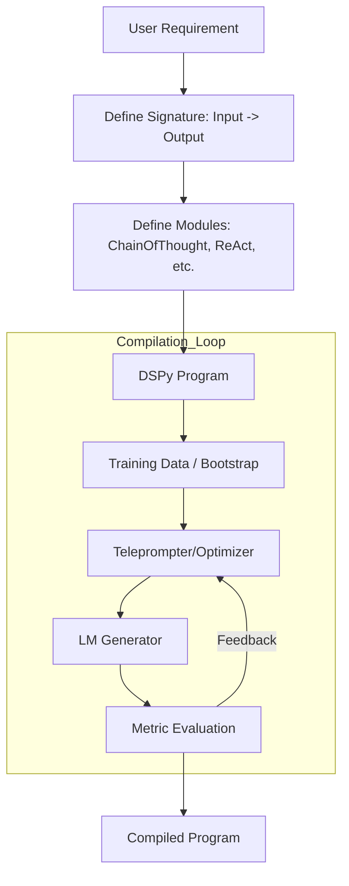
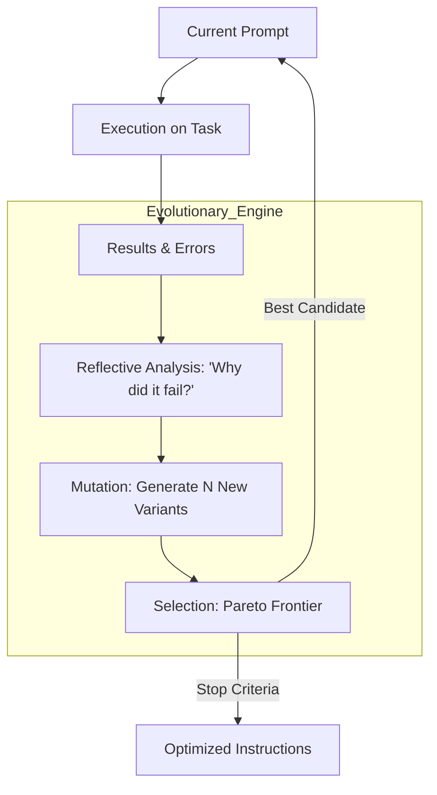
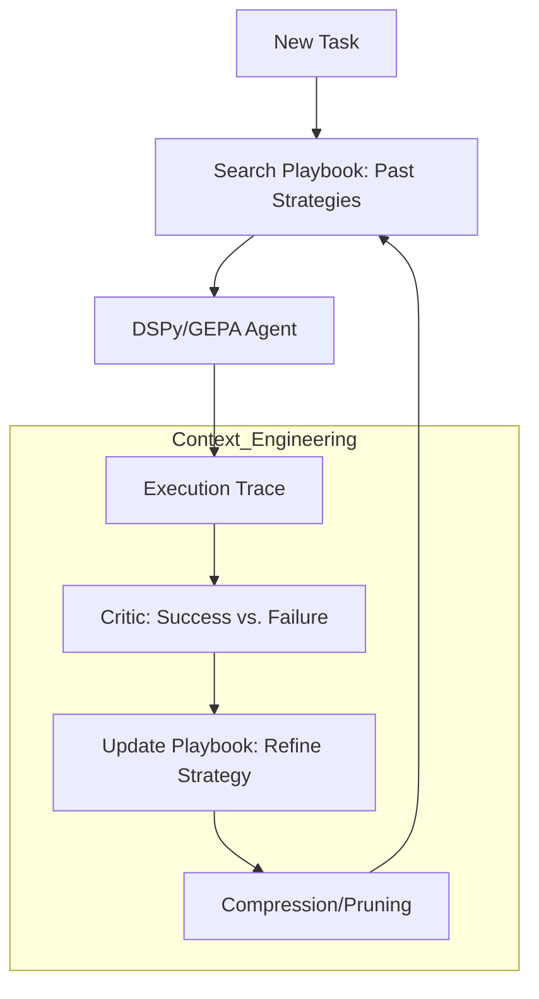
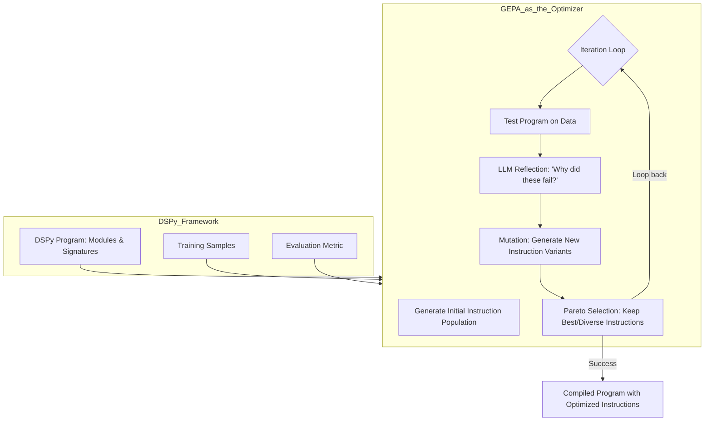
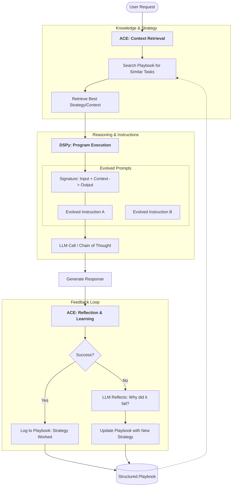

# Part 1: Framework Overview

> **Navigation:** [Part 2: DSPy Modules →](02-dspy-modules.md)

## Table of Contents
- [1.1 Introduction to the Three Frameworks](#11-introduction-to-the-three-frameworks)
- [1.2 Integration Architecture](#12-integration-architecture)

---

## 1.1 Introduction to the Three Frameworks

This section visualizes how the flow moves from static programming (DSPy) to evolutionary instructions (GEPA) and finally to dynamic context management (ACE).

### DSPy: The Structural Framework

DSPy replaces manual prompting with a **Compile** loop. It treats the LM call as a modular function (Signature) that can be automatically filled with the best examples.

---

### GEPA: The Evolutionary Optimizer

GEPA acts as a "brain" inside or above the DSPy loop. It doesn't just pick examples; it **reflects** on errors to rewrite the instructions using genetic algorithms.

---

### ACE: The Knowledge Manager

ACE operates at the **Context** level. It builds a "Playbook" so that even if the instructions (GEPA) and structure (DSPy) stay the same, the agent's strategy improves based on past experience.

---

### Key Differences at a Glance

| Feature | **DSPy** | **GEPA** | **ACE** |
| --- | --- | --- | --- |
| **Primary Goal** | Modularity & Reproducibility | Instruction Optimization | Strategic Memory Management |
| **What it Changes** | Code structure & Examples | The text of the Prompt | The Context/Knowledge provided |
| **Philosophy** | LM as a Compiler | LM as an Evolver | LM as a Knowledge Engineer |

---

## 1.2 Integration Architecture

### Where GEPA Sits in the DSPy Pipeline

In a standard DSPy workflow, **GEPA** serves as a specific type of **Optimizer** (formerly called a Teleprompter).

While basic DSPy optimizers like `BootstrapFewShot` focus on finding the best *examples* to put in a prompt, GEPA focuses on rewriting the *instructions* themselves through evolution and reflection.

#### Step-by-Step Integration

1. **The Signature:** You define what the model should do (e.g., `question -> answer`).
2. **The Population (GEPA specific):** Unlike standard DSPy which starts with one prompt, GEPA generates a "population" of different ways to phrase the instructions for that signature.
3. **The Evaluation:** DSPy runs your program using these different instructions against your `Training Samples`.
4. **The Reflection (The "GE" in GEPA):** GEPA asks an "Observer LLM" to look at the failures. Instead of just picking a new example, it says: *"The model is being too wordy; rewrite the instruction to be more concise."*
5. **The Pareto Frontier:** GEPA keeps a set of instructions that are not just high-performing, but also diverse (e.g., one prompt might be very fast/short, another more accurate/long).

#### Why use GEPA instead of standard DSPy optimizers?

Standard DSPy optimizers (like `MIPROv2`) are great at picking examples, but they can struggle if the core instruction in your Signature is fundamentally flawed. GEPA is "explicit" because it treats the **text of the instruction as a genetic trait** that needs to evolve based on evidence of failure.

---

### Combined Flow: DSPy + GEPA + ACE

**Key Concept:** **DSPy + GEPA** creates a high-performance "Engine" (how the agent thinks and follows instructions). **ACE** creates a "Library" or "Playbook" (what the agent knows and what strategies it should use).

This diagram shows a single user request moving through the "Playbook" (ACE), into the "Optimized Structure" (DSPy), using "Evolved Instructions" (GEPA).

---

### Uncoupling & Independence

**Is ACE uncoupled?** Yes, ACE is technically uncoupled. You can use a DSPy agent without ACE, but ACE provides the "agentic memory" that allows a DSPy agent to get smarter through experience rather than just through pre-training or compilation.

| Framework | Role | Can it work alone? |
| --- | --- | --- |
| **DSPy** | **The Skeleton (Structure)** | **Yes.** You can build a DSPy program and manually write prompts without GEPA or ACE. |
| **GEPA** | **The Muscle (Optimization)** | **No.** It is specifically an optimizer *for* a prompt-based system. It needs a framework like DSPy to have something to optimize. |
| **ACE** | **The Brain (Memory/Experience)** | **Yes.** You could use ACE with a standard Python script and raw OpenAI calls. It manages the "Playbook" of how to solve problems, regardless of how the code is written. |

---

### The "Golden Stack" Integration

When you use them together:

1. **ACE** picks the best "play" from the book for the specific user request.
2. **DSPy** provides the reliable pipeline (e.g., Search → Summarize → Answer).
3. **GEPA** ensures the instructions inside that pipeline are the most effective ones possible, evolved over thousands of previous trials.

---

> **Navigation:** [Part 2: DSPy Modules →](02-dspy-modules.md)
