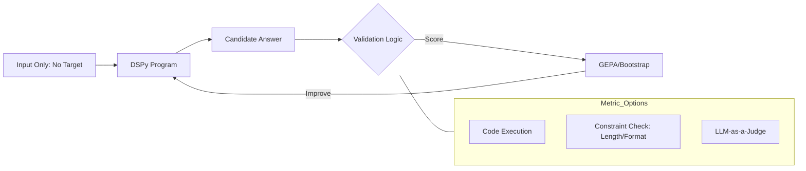

# Part 4: Metrics & Validation

> **Navigation:** [← Part 3: Training & Optimization](03-training-optimization.md) | [Part 1: Framework Overview →](01-framework-overview.md)

## Table of Contents
- [4.1 Labeled vs Unlabeled Data](#41-labeled-vs-unlabeled-data)
- [4.2 Metric Design](#42-metric-design)

---

## 4.1 Labeled vs Unlabeled Data

A common question is: **Do you necessarily need a target answer for training data?**

The short answer is: **No, you don't necessarily need a target answer, but you must have a way to verify "success."**

In DSPy, there are two types of training data setups based on how your metric works: **Labeled** and **Unlabeled**.

---

### Type 1: Labeled Data (Traditional)

If your metric is a simple comparison (e.g., "Is the predicted answer exactly the same as the ground truth?"), then you **must** provide the target answer.

* **Example:** Math problems or Fact Retrieval.
* **Metric:** `return example.target == prediction.answer`

**When to use:**
- QA systems with known correct answers
- Classification tasks with clear labels
- Extraction tasks with ground truth data

---

### Type 2: Unlabeled Data (Programmatic/AI-Feedback)

This is where DSPy gets powerful. If your metric can determine if an answer is "good" without knowing the "perfect" answer, you only need the **input** (the question/task).

#### Examples of Unlabeled Metrics:

* **Coding:** Your metric could be: "Does this code run without errors and pass these 3 generic tests?"
* **Summarization:** Your metric could be: "Is the summary under 100 words and does it mention the 3 keywords found in the source text?"
* **LLM-as-a-Judge:** Your metric uses a stronger model (like GPT-4o) to grade the response based on a rubric (e.g., "Is this helpful and polite?").

---

## 4.2 Metric Design

### How the Metric Replaces the "Target"

If you don't provide a target answer, the **Metric** becomes the "Environment" that the program lives in.



---

### Metric Options

#### 1. Code Execution
Test whether generated code runs and produces correct output.

```python
def code_metric(example, pred, trace=None):
    try:
        exec(pred.code)
        return test_suite_passes(pred.code)
    except:
        return False
```

#### 2. Constraint Checking
Verify that output meets specific requirements without knowing the exact answer.

```python
def summary_metric(example, pred, trace=None):
    word_count = len(pred.summary.split())
    has_keywords = all(kw in pred.summary for kw in example.required_keywords)
    return word_count <= 100 and has_keywords
```

#### 3. LLM-as-a-Judge
Use a more powerful model to evaluate quality.

```python
def llm_judge_metric(example, pred, trace=None):
    judge_prompt = f"Rate this answer on helpfulness (0-10): {pred.answer}"
    score = judge_llm(judge_prompt)
    return score >= 7
```

---

### Why You Might Still Want Target Answers

Even if you have a smart metric, providing a few "Gold" target answers is highly beneficial because of **Bootstrapping**:

1. **Trace Quality:** It is much easier for DSPy to "bootstrap" (find a successful path) if it knows exactly where it's trying to go.
2. **Ambiguity:** An LLM-as-a-judge might be inconsistent. A hard-coded "Target Answer" is 100% consistent.
3. **Cost:** Running an LLM to check every answer in your training set is expensive. Checking a string match against a target answer is free.

---

### Summary Table: Choosing Your Data Type

| Data Type | Needs "Target"? | Metric Type | Best Use Case |
| --- | --- | --- | --- |
| **Labeled** | **Yes** | Exact Match / F1 Score | QA, Extraction, Classification |
| **Unlabeled** | **No** | Programmatic / Heuristic | Formatting, Coding, Writing Style |
| **AI-Feedback** | **No** | LLM-as-a-Judge | Creative writing, Tone, Complex Logic |

---

### Example: Unlabeled Metric Without Target Answer

Here's a practical example of an unlabeled metric that uses a Python function to grade an LLM response without knowing the exact answer:

```python
def creative_writing_metric(example, pred, trace=None):
    """
    Evaluate creative writing without a target answer.
    Checks multiple quality dimensions.
    """
    response = pred.story

    # Constraint 1: Length requirements
    word_count = len(response.split())
    if word_count < 200 or word_count > 500:
        return False

    # Constraint 2: Must include required elements
    if example.protagonist not in response:
        return False

    # Constraint 3: No repetitive phrases
    sentences = response.split('.')
    if len(sentences) != len(set(sentences)):
        return False

    # Constraint 4: Readability check
    avg_sentence_length = word_count / len(sentences)
    if avg_sentence_length > 30:  # Too complex
        return False

    return True
```

This metric evaluates quality through multiple programmatic checks without needing a "correct" story to compare against.

---

## Key Takeaways

1. **Metrics are flexible:** You can use exact matches, programmatic checks, or AI judges depending on your task.
2. **Unlabeled data is powerful:** For creative or open-ended tasks, you don't always need target answers.
3. **Consider cost vs. consistency:** Hard-coded metrics are free and consistent; LLM judges are flexible but expensive.
4. **Bootstrapping benefits from targets:** Even with good metrics, a few gold standard examples help guide the optimization process.

---

> **Navigation:** [← Part 3: Training & Optimization](03-training-optimization.md) | [Part 1: Framework Overview →](01-framework-overview.md)
