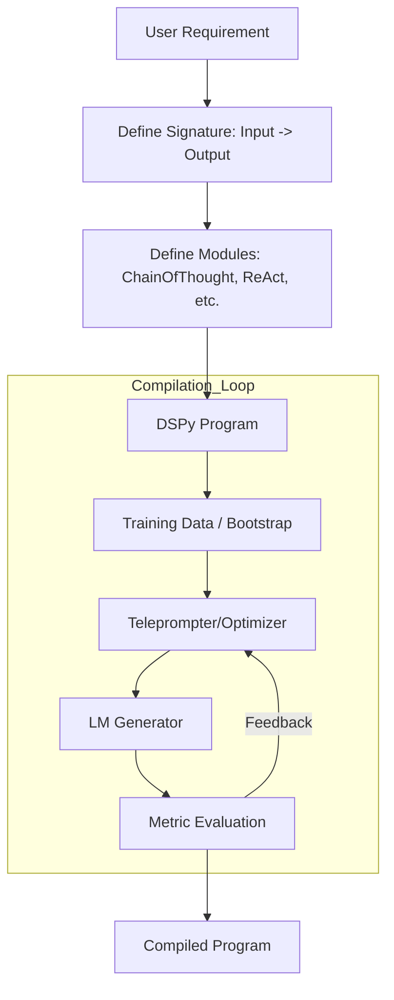
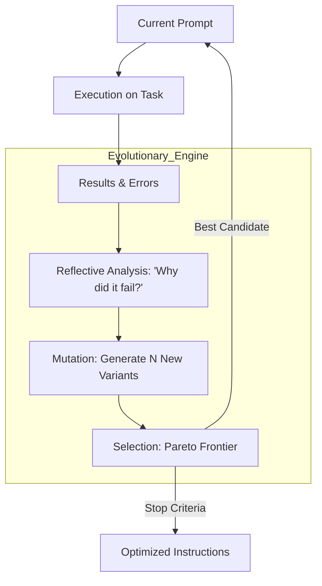
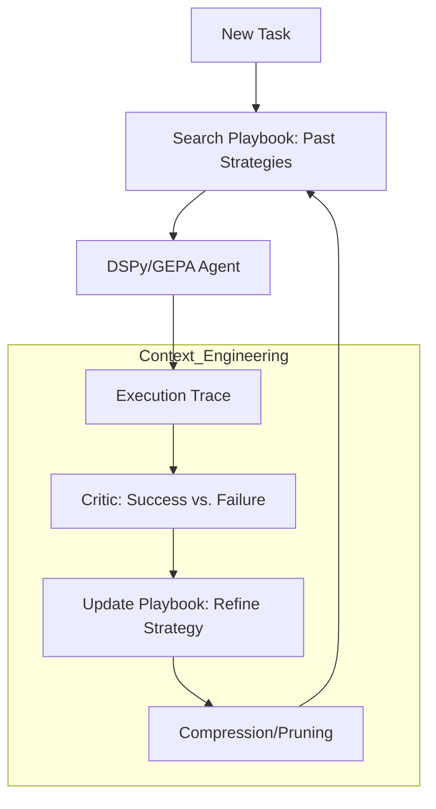
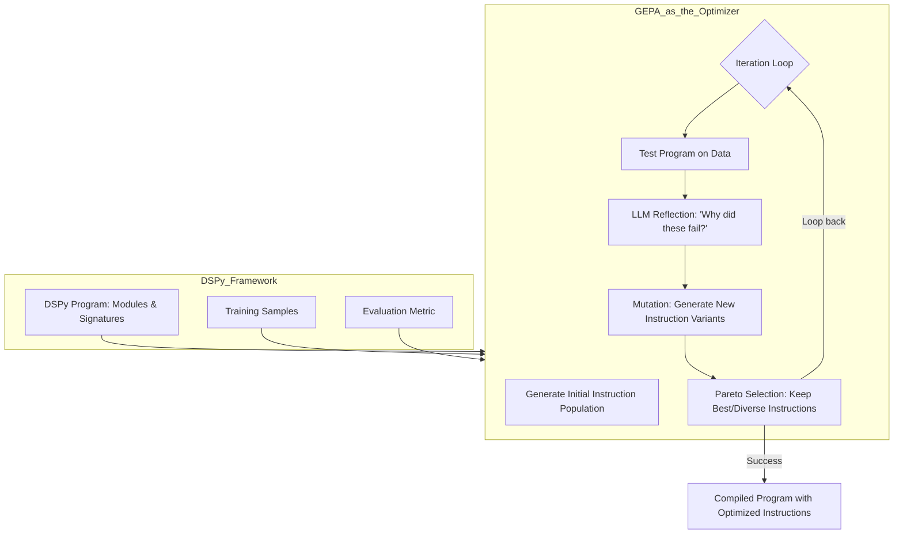
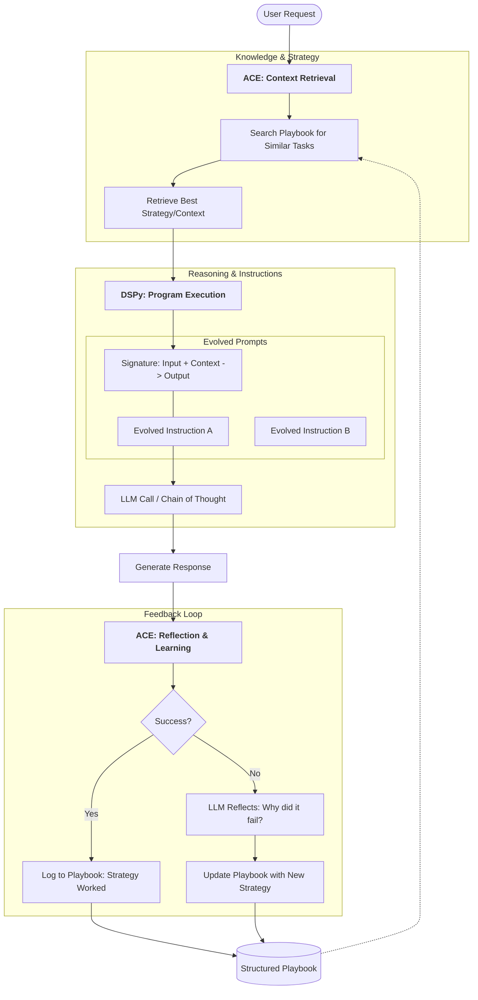
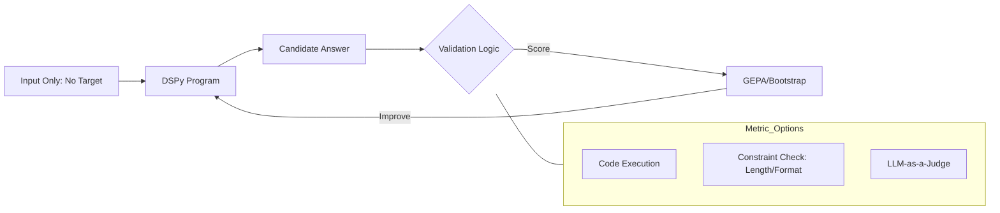

Here are the Mermaid diagrams for each framework. These visualize how the flow moves from static programming (DSPy) to evolutionary instructions (GEPA) and finally to dynamic context management (ACE).

### 1. DSPy: The Structural Framework

DSPy replaces manual prompting with a **Compile** loop. It treats the LM call as a modular function (Signature) that can be automatically filled with the best examples.



---

### 2. GEPA: The Evolutionary Optimizer

GEPA acts as a "brain" inside or above the DSPy loop. It doesn't just pick examples; it **reflects** on errors to rewrite the instructions using genetic algorithms.



---

### 3. ACE: The Knowledge Manager

ACE operates at the **Context** level. It builds a "Playbook" so that even if the instructions (GEPA) and structure (DSPy) stay the same, the agent's strategy improves based on past experience.



---

### Key Differences at a Glance

| Feature | **DSPy** | **GEPA** | **ACE** |
| --- | --- | --- | --- |
| **Primary Goal** | Modularity & Reproducibility | Instruction Optimization | Strategic Memory Management |
| **What it Changes** | Code structure & Examples | The text of the Prompt | The Context/Knowledge provided |
| **Philosophy** | LM as a Compiler | LM as an Evolver | LM as a Knowledge Engineer |

**Would you like me to generate a combined diagram showing how a single request flows through all three systems simultaneously?**


In a standard DSPy workflow, **GEPA** serves as a specific type of **Optimizer** (formerly called a Teleprompter).

While basic DSPy optimizers like `BootstrapFewShot` focus on finding the best *examples* to put in a prompt, GEPA focuses on rewriting the *instructions* themselves through evolution and reflection.

### Where GEPA Sits in the DSPy Pipeline

In the DSPy "Compile" phase, the framework iterates through your program to improve performance. GEPA replaces the standard selection logic with a more sophisticated evolutionary loop.



---

### Step-by-Step Integration

1. **The Signature:** You define what the model should do (e.g., `question -> answer`).
2. **The Population (GEPA specific):** Unlike standard DSPy which starts with one prompt, GEPA generates a "population" of different ways to phrase the instructions for that signature.
3. **The Evaluation:** DSPy runs your program using these different instructions against your `Training Samples`.
4. **The Reflection (The "GE" in GEPA):** GEPA asks an "Observer LLM" to look at the failures. Instead of just picking a new example, it says: *"The model is being too wordy; rewrite the instruction to be more concise."*
5. **The Pareto Frontier:** GEPA keeps a set of instructions that are not just high-performing, but also diverse (e.g., one prompt might be very fast/short, another more accurate/long).

### Why use GEPA instead of standard DSPy optimizers?

Standard DSPy optimizers (like `MIPROv2`) are great at picking examples, but they can struggle if the core instruction in your Signature is fundamentally flawed. GEPA is "explicit" because it treats the **text of the instruction as a genetic trait** that needs to evolve based on evidence of failure.

**Would you like to see a pseudo-code example of how you would call a GEPA-style optimizer in a DSPy script?**

To answer your second question first: **Yes, ACE is technically uncoupled.** Think of it this way: **DSPy + GEPA** creates a high-performance "Engine" (how the agent thinks and follows instructions). **ACE** creates a "Library" or "Playbook" (what the agent knows and what strategies it should use). You can use a DSPy agent without ACE, but ACE provides the "agentic memory" that allows a DSPy agent to get smarter through experience rather than just through pre-training or compilation.

---

### Combined Flow: DSPy + GEPA + ACE

This diagram shows a single user request moving through the "Playbook" (ACE), into the "Optimized Structure" (DSPy), using "Evolved Instructions" (GEPA).



---

### Uncoupling Explained: The "Who, How, and What"

To clarify how they relate or stand alone:

| Framework | Role | Can it work alone? |
| --- | --- | --- |
| **DSPy** | **The Skeleton (Structure)** | **Yes.** You can build a DSPy program and manually write prompts without GEPA or ACE. |
| **GEPA** | **The Muscle (Optimization)** | **No.** It is specifically an optimizer *for* a prompt-based system. It needs a framework like DSPy to have something to optimize. |
| **ACE** | **The Brain (Memory/Experience)** | **Yes.** You could use ACE with a standard Python script and raw OpenAI calls. It manages the "Playbook" of how to solve problems, regardless of how the code is written. |

### The "Golden Stack" Integration

When you use them together:

1. **ACE** picks the best "play" from the book for the specific user request.
2. **DSPy** provides the reliable pipeline (e.g., Search -> Summarize -> Answer).
3. **GEPA** ensures the instructions inside that pipeline are the most effective ones possible, evolved over thousands of previous trials.

**Would you like to see the pseudo-code for how the ACE "Playbook" is structured to interact with a DSPy signature?**

In DSPy, these three modules define **how** the model processes your Signature. While the Signature defines the "contract" (Inputs and Outputs), these modules define the "thinking strategy."

Think of them as different levels of mental effort for the model:

---

### 1. `dspy.Predict` (The Direct Responder)

This is the most basic module. It takes the input and asks the model for the output immediately, without any intermediate steps.

* **Behavior:** Direct Input → Output.
* **Prompting Style:** Standard zero-shot or few-shot instruction.
* **Best For:** Simple, deterministic tasks like sentiment analysis, translation, or entity extraction.
* **Analogy:** Asking someone a trivia question where they either know the answer or they don't.

### 2. `dspy.ChainOfThought` (The Deliberator)

This module automatically modifies your Signature to include a `rationale` (reasoning) field before the final answer.

* **Behavior:** Input → **Reasoning** → Output.
* **Prompting Style:** It injects a "Let's think step-by-step" instruction into the background prompt.
* **Best For:** Tasks requiring logic, math, or multi-step common sense. Even if you didn't define a "reasoning" field in your Signature, `ChainOfThought` will add one and return it in the result.
* **Analogy:** Asking someone to solve a math word problem and requiring them to show their work.

### 3. `dspy.ReAct` (The Agentic Solver)

"ReAct" stands for **Reasoning + Acting**. This is the most complex module and turns your Signature into an iterative agent loop.

* **Behavior:** Input → [ **Thought** → **Action** (Tool Call) → **Observation** ] (Repeat) → Final Answer.
* **Prompting Style:** It forces the model to use a loop: it thinks about what to do, calls a tool (like a search engine or calculator), looks at the result, and repeats until it has the answer.
* **Best For:** Complex tasks that require external data or multiple steps of information gathering (e.g., "Find the age of the current President's spouse and calculate their birth year").
* **Analogy:** Giving someone a research task and a laptop to look things up until they are finished.

---

### Comparison Summary

| Module | Strategy | Output Fields | External Tools? | Complexity |
| --- | --- | --- | --- | --- |
| **`Predict`** | Direct | Just your Signature fields | No | Low |
| **`ChainOfThought`** | Step-by-step | Signature + **`rationale`** | No | Medium |
| **`ReAct`** | Loop | Signature + **`trace`** | **Yes** | High |

### Why this matters for GEPA and ACE

* **GEPA** is most powerful when used with **`ChainOfThought`** or **`ReAct`**. Since GEPA optimizes by *reflecting* on failures, it needs to see the model's "thinking" to suggest better instructions.
* **ACE** often manages the "tools" and "past strategies" that a **`ReAct`** agent uses to decide which Action to take next.

**Would you like to see how a single Signature looks different when processed by each of these three modules?**

To see the difference, let’s take one simple Signature and look at how DSPy transforms it under the hood for each module.

### The Base Signature

```python
class SimpleQA(dspy.Signature):
    """Answer the question based on facts."""
    question = dspy.InputField()
    answer = dspy.OutputField()

```

---

### 1. `dspy.Predict(SimpleQA)`

This is the "Zero-Complexity" version. It translates the signature directly into a prompt template.

**The Internal Prompt Logic:**

> **Context:** Answer the question based on facts.
> **Question:** {question}
> **Answer:** [Model generates answer here]

* **Result:** You get just the answer.
* **Failure Mode:** If the question is hard, the model might "hallucinate" or guess because it wasn't forced to think first.

---

### 2. `dspy.ChainOfThought(SimpleQA)`

DSPy **intercepts** your signature and dynamically adds a `rationale` field. It tells the model that the reasoning is a prerequisite for the answer.

**The Internal Prompt Logic:**

> **Context:** Answer the question based on facts.
> **Question:** {question}
> **Reasoning:** Let's think step by step. [Model generates reasoning here]
> **Answer:** [Model generates answer here]

* **Result:** The output object contains `prediction.rationale` and `prediction.answer`.
* **Why it's better:** By verbalizing the logic, the model's accuracy on complex tasks increases significantly.

---

### 3. `dspy.ReAct(SimpleQA, tools=[search])`

This is the "Iterative" version. It turns the signature into a loop. It doesn't just add a field; it changes the model's entire operational mode into **Thought -> Action -> Observation.**

**The Internal Prompt Logic (Simplified Loop):**

> **Task:** Answer the question based on facts.
> **Question:** {question}
> **Thought 1:** I need to find the current height of the Eiffel Tower.
> **Action 1:** Search[Eiffel Tower height 2025]
> **Observation 1:** The Eiffel Tower is 330 meters tall after a new antenna was added.
> **Thought 2:** I have the information needed.
> **Answer:** 330 meters.

* **Result:** The output object contains the full `trace` of the thoughts and actions.
* **Why it's better:** It can correct itself. If the "Observation" reveals the first "Thought" was wrong, the agent can pivot.

---

### Side-by-Side Structural Comparison

| Feature | `Predict` | `ChainOfThought` | `ReAct` |
| --- | --- | --- | --- |
| **Logic Type** | Linear / Instant | Linear / Deliberative | Recursive / Agentic |
| **Field Injection** | None | Adds `rationale` | Adds `thought`, `action`, `observation` |
| **Compute Cost** | Lowest (1 LLM call) | Low (1 LLM call, more tokens) | High (Multiple LLM calls) |
| **Best Used With** | Basic Classification | Logical Reasoning | External Research/Tools |

### How GEPA interacts with these

If you use **GEPA** to optimize these:

* In `Predict`, GEPA evolves the **instruction text**.
* In `ChainOfThought`, GEPA evolves the **reasoning style** (e.g., "Think like a scientist").
* In `ReAct`, GEPA evolves the **decision-making strategy** (e.g., "Search twice before concluding").

**Would you like me to provide a code snippet showing how to define a `ReAct` agent in DSPy and connect it to a tool?**

In traditional Machine Learning, training data consists of thousands of labeled examples. In **DSPy**, "training data" is much lighter, and **Bootstrapping** is the clever process that turns a few examples into a high-performing program.

---

### 1. What is "Training Data" in DSPy?

You don't need a massive dataset. DSPy typically works with:

* **Small Sample Size:** Usually between **10 and 100 examples**.
* **Example Structure:** A set of `dspy.Example` objects containing the inputs (e.g., a question) and the target outputs (e.g., the answer).
* **Labels:** You only need to label the *final* output. You do **not** need to write out the "Chain of Thought" or the "Intermediate Steps"—DSPy will figure those out for you.

```python
# A simple DSPy Training Set
trainset = [
    dspy.Example(question="What is the capital of France?", answer="Paris").with_inputs('question'),
    dspy.Example(question="What is 2+2?", answer="4").with_inputs('question')
]

```

---

### 2. What is "Bootstrapping"?

This is the core "learning" mechanism. Since your training data only has the *Question* and the *Answer*, the model doesn't know what the "Reasoning" (Chain of Thought) should look like.

**Bootstrapping is the process where DSPy "self-generates" the intermediate reasoning steps.**

#### How the Bootstrap Process Works:

1. **Teacher-Student Interaction:** DSPy uses a "Teacher" (usually a more powerful model like GPT-4) to try and solve your training examples using your program's structure.
2. **Trace Collection:** If the Teacher gets the answer right (matches your label), DSPy saves the *entire trace* (the reasoning, the search steps, and the final answer).
3. **Few-Shot Assembly:** These successful "traces" are then compiled into a highly optimized prompt that is given to the "Student" (your actual production model).

---

### 3. The "BootstrapFewShot" Optimizer

The most common way to do this is using the `BootstrapFewShot` optimizer. It essentially "searches" for the best examples to put into your prompt.

* **Standard Few-Shot:** You manually pick 3 examples and hope they work.
* **DSPy Bootstrapping:** DSPy tries 50 examples, sees which 5 produced the most accurate "Chain of Thought" logic, and uses those as the permanent prompt.

---

### 4. How GEPA evolves this

While `BootstrapFewShot` just picks the best **examples** (the data), **GEPA** takes it a step further. GEPA looks at the "failed" bootstrapped traces and says:

> "The model failed these examples because the instructions were too vague. Let me mutate the **Instruction Text** and try bootstrapping again."

---

### Summary Table: Data vs. Bootstrap

| Feature | Training Data | Bootstrapping |
| --- | --- | --- |
| **Input** | Question + Answer pairs | Training Data + Program Logic |
| **Output** | A static list of examples | A "Compiled" prompt with reasoning |
| **Effort** | Low (You just provide the final answer) | High (DSPy runs multiple LLM calls to find success) |
| **Goal** | To define the target | To find the best "path" to that target |

**Would you like to see how to define a validation metric so that the Bootstrap optimizer knows which "traces" are actually successful?**

In traditional prompting, you are the "optimizer"—you look at a model's mistake, manually tweak a sentence in the prompt, and try again.

In **DSPy**, the machine is the optimizer. For a machine to optimize a program, it needs a **success criterion** and **examples** of what "good" looks like. Providing training data allows DSPy to move from "guessing" to "compiling."

Here are the three specific reasons why training data is mandatory for the DSPy/GEPA/ACE stack:

---

### 1. To Automate "Few-Shot" Selection

LLMs perform significantly better when given 3–5 examples of a task (Few-Shot).

* **Without Data:** You have to manually write these examples, which is tedious and often biased.
* **With Data:** DSPy's optimizers (like `BootstrapFewShot`) search through your training data to find the most effective examples to "plug in" to your prompt. It tries different combinations to see which specific examples lead to the highest accuracy.

### 2. To Generate "Reasoning Traces" (The Rationale)

As we discussed with `ChainOfThought`, the model needs to "think" before it answers.

* DSPy uses your training data to perform **Bootstrapping**.
* It takes a question from your data, tries to solve it, and if it gets the answer right, it **saves the reasoning steps** it used.
* These saved steps become the "gold standard" reasoning examples that guide the model in the future.

### 3. To Provide a Feedback Signal for GEPA

If you are using **GEPA**, the training data acts as the "Environment" for evolution.

* GEPA generates multiple versions of a prompt (Mutations).
* To know which mutation is the "fittest," it must test them against the **Training Data**.
* Without data, GEPA has no way to calculate a **Pareto Frontier** or determine which instructions actually improved performance.

---

### How much data do you actually need?

Unlike Deep Learning, which requires thousands of rows, DSPy is "Data-Efficient."

| Data Amount | Result |
| --- | --- |
| **0 Examples** | You are just doing standard "Zero-Shot" prompting (No optimization possible). |
| **5–10 Examples** | Enough for **BootstrapFewShot** to find a few good examples. |
| **20–50 Examples** | The "Sweet Spot" for **GEPA** to evolve high-quality instructions. |
| **100+ Examples** | Allows for rigorous testing and high-confidence "Compilation." |

---

### The "Metric": The partner to your data

Providing data is only half the battle. You also provide a **Metric function**. The training data provides the *input*, and the metric provides the *score*.

```python
def validate_answer(example, pred, trace=None):
    # Does the predicted answer match the gold label in our training data?
    return example.answer.lower() == pred.answer.lower()

```

**Would you like to see how a Metric and Training Data work together during the `compile()` process in a code example?**

This is an insightful question that hits on the core of what makes **DSPy** different from traditional supervised learning.

The short answer is: **No, you don't necessarily need a target answer, but you must have a way to verify "success."**

In DSPy, there are two types of training data setups based on how your metric works: **Labeled** and **Unlabeled**.

---

### 1. Labeled Data (Traditional)

If your metric is a simple comparison (e.g., "Is the predicted answer exactly the same as the ground truth?"), then you **must** provide the target answer.

* **Example:** Math problems or Fact Retrieval.
* **Metric:** `return example.target == prediction.answer`

### 2. Unlabeled Data (Programmatic/AI-Feedback)

This is where DSPy gets powerful. If your metric can determine if an answer is "good" without knowing the "perfect" answer, you only need the **input** (the question/task).

* **Example:** Coding. Your metric could be: "Does this code run without errors and pass these 3 generic tests?"
* **Example:** Summarization. Your metric could be: "Is the summary under 100 words and does it mention the 3 keywords found in the source text?"
* **Example:** LLM-as-a-Judge. Your metric uses a stronger model (like GPT-4o) to grade the response based on a rubric (e.g., "Is this helpful and polite?").

---

### How the Metric replaces the "Target" in GEPA/DSPy

If you don't provide a target answer, the **Metric** becomes the "Environment" that the program lives in.



### Why you might still want Targets (The "Gold" Standard)

Even if you have a smart metric, providing a few "Gold" target answers is highly beneficial because of **Bootstrapping**:

1. **Trace Quality:** It is much easier for DSPy to "bootstrap" (find a successful path) if it knows exactly where it's trying to go.
2. **Ambiguity:** An LLM-as-a-judge might be inconsistent. A hard-coded "Target Answer" is 100% consistent.
3. **Cost:** Running an LLM to check every answer in your training set is expensive. Checking a string match against a target answer is free.

---

### Summary Table

| Data Type | Needs "Target"? | Metric Type | Best Use Case |
| --- | --- | --- | --- |
| **Labeled** | **Yes** | Exact Match / F1 Score | QA, Extraction, Classification |
| **Unlabeled** | **No** | Programmatic / Heuristic | Formatting, Coding, Writing Style |
| **AI-Feedback** | **No** | LLM-as-a-Judge | Creative writing, Tone, Complex Logic |

**Would you like to see a code example of an "Unlabeled" metric that uses a Python function to grade an LLM response without knowing the answer?**