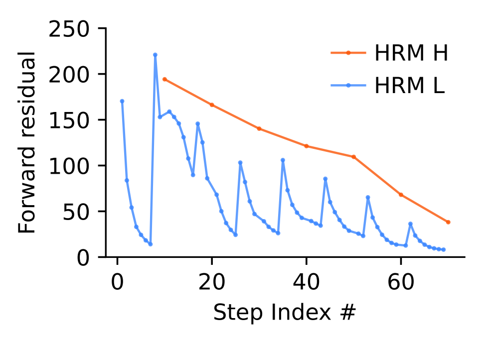
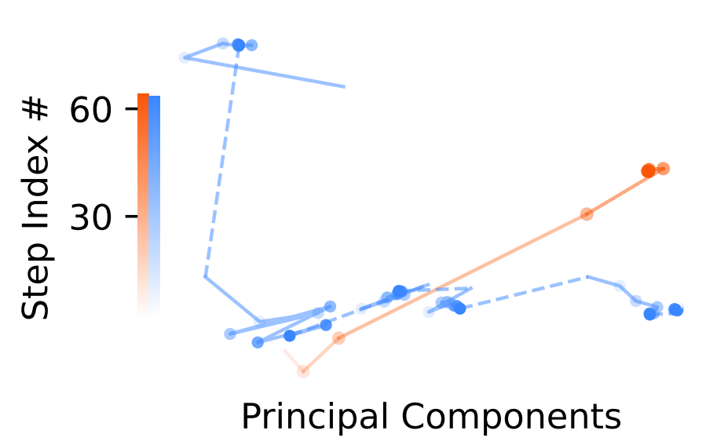

# AC0

- Network of interconnected gates that perform logical operations.
- properties:
  - constant depth: longest path from any input to any output is a constant number of gates, regardless of the size of the input
  - polynomial size: number of gates grows with polynomial wrt input size
  - unbounded fan-in: gates can take any number of inputs
  - AC0 cannot solve a counting problem
    - example: determining the parity of a binary number

# TC0
Same as AC0, but can include a majority gate, can count the number of '1's.
- can solve the parity problem
- cannot solve boolean inner product, take inner product of two binary vectors - sum of the element-wise products modulo 2

# Turing Complete
Most computers are not turing complete, since they require infinite memory and time.  So what is the argument that LLM's are not Turing complete?
- computation model is different

# claim from paper
- generation of tokens expensive
- can you use internal state
- power of latent reasoning still constrained by model's effective computational depth...

# PCA

claim mngr scott 
522 715 - 715 
9/2
does support an overturn or approval 
716-814
411 715
511 723
723 8