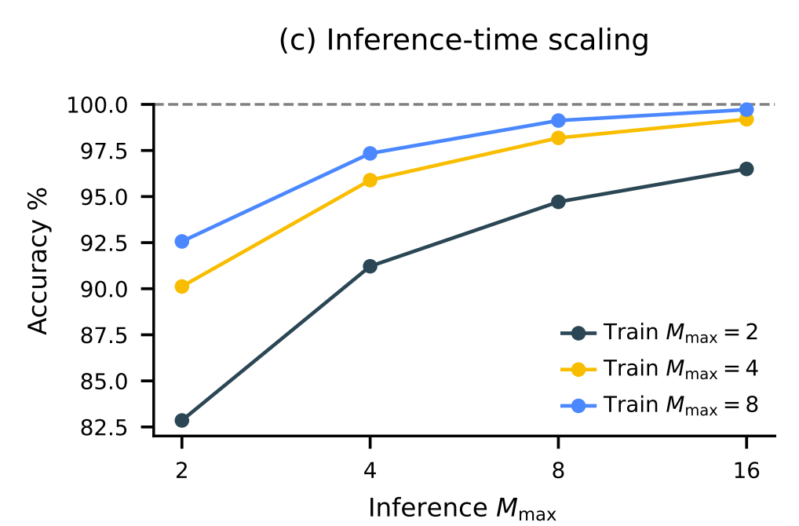
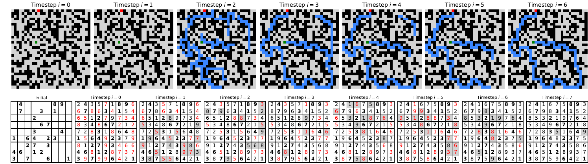

# HRM paper

## Depth vs Width

- Top line 
  - scaling depth
  - keep the hidden dimension at 512
  - Logarithmic scale 8 layers, 16, 32, 64, 128, 256 layers
  - Q: why does this saturate

- Bottom line 
  - fixed 8 layers
  - scaling the hidden dimension

- Note:
  - No talk about the context length dimension...

## Transformer vs HRM

- comparing architecture for same depth variation
- not clear what is x-axis
- refers to a computational depth / number of Xformer layers

[Skip](#rnn-architecture)

## AC0

- Network of interconnected gates that perform logical operations.
- properties:
  - constant depth: longest path from any input to any output is a constant number of gates, regardless of the size of the input
  - polynomial size: number of gates grows with polynomial wrt input size
  - unbounded fan-in: gates can take any number of inputs
  - AC0 cannot solve a counting problem
    - example: determining the parity of a binary number

## TC0
Same as AC0, but can include a majority gate, can count the number of '1's.
- can solve the parity problem
- cannot solve boolean inner product, take inner product of two binary vectors - sum of the element-wise products modulo 2

## Turing Complete
Most computers are not turing complete, since they require infinite memory and time.  So what is the argument that LLM's are not Turing complete?
- computation model is different

## claim from paper
- generation of tokens expensive
- can you use internal state
- power of latent reasoning still constrained by model's effective computational depth...

## Backpropagation Through Time
Backpropagation Through Time (BPTT) is the algorithm used to train recurrent neural networks (RNNs). It's an extension of the standard backpropagation algorithm, adapted for the sequential nature of RNNs. BPTT works by unrolling the RNN in time, creating a deep feedforward neural network where each layer corresponds to a time step.

Here are the key equations involved in BPTT, broken down into the forward and backward passes.

### **Forward Pass**

First, we need to compute the activations and outputs of the network for each time step. Let's define the following variables:

* $x_t$: The input at time step $t$.
* $h_t$: The hidden state at time step $t$.
* $\hat{y}_t$: The predicted output at time step $t$.
* $W_{xh}$: The weight matrix connecting the input to the hidden layer.
* $W_{hh}$: The weight matrix connecting the previous hidden state to the current hidden state.
* $W_{hy}$: The weight matrix connecting the hidden layer to the output layer.
* $b_h$: The bias for the hidden layer.
* $b_y$: The bias for the output layer.
* $\sigma_h$: The activation function for the hidden layer (often `tanh` or `ReLU`).
* $\sigma_y$: The activation function for the output layer (often `softmax` for classification).

The forward pass equations are as follows:

1.  **Hidden State Calculation:**
    $$
    h_t = \sigma_h(W_{xh}x_t + W_{hh}h_{t-1} + b_h)
    $$
    Here, $h_{t-1}$ is the hidden state from the previous time step. For the first time step ($t=0$), $h_{-1}$ is typically initialized as a vector of zeros.

2.  **Output Prediction:**
    $$
    \hat{y}_t = \sigma_y(W_{hy}h_t + b_y)
    $$

This process is repeated for each time step in the input sequence.

---

### **Backward Pass**

The backward pass involves calculating the gradients of the loss function with respect to the model's parameters. The total loss $L$ for a sequence is typically the sum of the losses at each time step: $L = \sum_{t} L_t$.

The core of BPTT is applying the chain rule to propagate the error backward through the unrolled network. The gradients are calculated as follows:

1.  **Gradient of the Loss with respect to the Output:**
    The gradient of the loss at time step $t$ with respect to the predicted output $\hat{y}_t$ depends on the specific loss function used. For example, with cross-entropy loss, this would be:
    $$
    \frac{\partial L_t}{\partial \hat{y}_t}
    $$

2.  **Gradient of the Loss with respect to the Output Weights ($W_{hy}$) and Bias ($b_y$):**
    $$
    \frac{\partial L_t}{\partial W_{hy}} = \frac{\partial L_t}{\partial \hat{y}_t} \frac{\partial \hat{y}_t}{\partial z_y} \frac{\partial z_y}{\partial W_{hy}} = (\hat{y}_t - y_t)h_t^T
    $$   $$
    \frac{\partial L_t}{\partial b_y} = \frac{\partial L_t}{\partial \hat{y}_t} \frac{\partial \hat{y}_t}{\partial z_y} \frac{\partial z_y}{\partial b_y} = (\hat{y}_t - y_t)
    $$
    Where $z_y = W_{hy}h_t + b_y$, and $y_t$ is the true output at time step $t$. The total gradients for $W_{hy}$ and $b_y$ are summed over all time steps:
    $$
    \frac{\partial L}{\partial W_{hy}} = \sum_t \frac{\partial L_t}{\partial W_{hy}} \quad \text{and} \quad \frac{\partial L}{\partial b_y} = \sum_t \frac{\partial L_t}{\partial b_y}
    $$

3.  **Gradient of the Loss with respect to the Hidden State ($h_t$):**
    This is where the "through time" part comes in. The gradient at a given hidden state $h_t$ has two components: the influence of $h_t$ on the output at the current time step ($L_t$) and its influence on the hidden state at the next time step ($h_{t+1}$), which in turn affects future losses.
    $$
    \frac{\partial L}{\partial h_t} = \frac{\partial L_t}{\partial h_t} + \frac{\partial L}{\partial h_{t+1}} \frac{\partial h_{t+1}}{\partial h_t}
    $$
    The first term is:
    $$
    \frac{\partial L_t}{\partial h_t} = \frac{\partial L_t}{\partial \hat{y}_t} \frac{\partial \hat{y}_t}{\partial z_y} \frac{\partial z_y}{\partial h_t} = W_{hy}^T(\hat{y}_t - y_t)
    $$
    The second term propagates the gradient from the future:
    $$
    \frac{\partial h_{t+1}}{\partial h_t} = W_{hh}^T \text{diag}(1 - h_{t+1}^2)
    $$
    (assuming a `tanh` activation function).

4.  **Gradient of the Loss with respect to the Recurrent Weights ($W_{hh}$), Input Weights ($W_{xh}$), and Hidden Bias ($b_h$):**
    These gradients are calculated by applying the chain rule through the hidden state and summing the contributions from each time step.
    $$
    \frac{\partial L}{\partial W_{hh}} = \sum_t \frac{\partial L}{\partial h_t} \frac{\partial h_t}{\partial W_{hh}} = \sum_t \text{diag}(1 - h_t^2) \frac{\partial L}{\partial h_t} h_{t-1}^T
    $$   $$
    \frac{\partial L}{\partial W_{xh}} = \sum_t \frac{\partial L}{\partial h_t} \frac{\partial h_t}{\partial W_{xh}} = \sum_t \text{diag}(1 - h_t^2) \frac{\partial L}{\partial h_t} x_t^T
    $$   $$
    \frac{\partial L}{\partial b_h} = \sum_t \frac{\partial L}{\partial h_t} \frac{\partial h_t}{\partial b_h} = \sum_t \text{diag}(1 - h_t^2) \frac{\partial L}{\partial h_t}
    $$

Once these gradients are calculated, a standard optimization algorithm like stochastic gradient descent (SGD) is used to update the weights and biases. Due to the potential for vanishing or exploding gradients in deep unrolled networks, techniques like gradient clipping are often employed.

To provide a visual and more detailed walkthrough, this video explains the process of backpropagation through time.
[Video explainer about Backpropagation through time.](https://www.youtube.com/watch?v=0XdPIqi0qpg)
http://googleusercontent.com/youtube_content/0

## RNN architecture

- Issues:
  - hard to train
  - vanishing/exploding gradients
  - early convergence
    - Updates shrink
  - actually want to converge very slowly
    - cause instability
  - BPTT

## HRM architecture

## HRM dynamics

### Residual

### PCA

- 2D PC1 vs PC2 trajectories
- Color labeled by saturation for step index

## RNN dynamics

### Residual

### PCA

## Deep neural network

### Residual

- vanishing gradients
- gradient doesn't make all the way back to first layers

### PCA

## BPTT and BP at Equilibrium

- Recall BPTT take O(T) memory, since need to keep activations and gradients for all T steps
- For HRM, only apply BP at equilibrium point
- Update the H-module (high) at its equil
- Update the L-module (low) at its equil
  

  $
    z^\star = f_\theta(z^\star, x)
  $

Imagine you have reached a fixed point, then this point represents an infinite-depth model.

[skip](#deep-supervision)

## Deep Equilibrim Model (DEQ)
Here’s a clear, high-level explanation of the **Deep Equilibrium Models (DEQ)** paper by Bai, Kolter, and Koltun (NeurIPS 2019) — with key insights and context:

---

### What Is a Deep Equilibrium Model (DEQ)?

At its core, DEQ is an **implicit-depth model** that treats the network’s output as a **fixed point** of a transformation, rather than an explicit activation after a stack of layers.

* Traditional deep networks apply $L$ layers sequentially and must store intermediate activations for backpropagation.
* DEQ instead defines an equilibrium $z^\star$ satisfying:

  $
    z^\star = f_\theta(z^\star, x)
  $

  In essence, this simulates an **infinite-depth, weight-tied network** that converges to a fixed point.([arXiv][1])

---

### Key Advantages

1. **Constant Memory Usage**
   Since it doesn't store all intermediate activations, DEQ uses only $O(1)$ memory regardless of its “effective depth.”([arXiv][1])

2. **Competitive Performance**
   Applied to sequence models like Transformers and Trellis Networks, DEQs match or even exceed performance of explicitly deep architectures, often with reduced memory.([arXiv][1])

3. **Analytical Backpropagation via Implicit Differentiation**
   Instead of backprop through each iteration, DEQ uses the **implicit function theorem** to compute gradients efficiently:

   $$
     \frac{\partial\mathcal{L}}{\partial \theta} = -\frac{\partial \mathcal{L}}{\partial z^\star} (I - \frac{\partial f}{\partial z^\star})^{-1} \frac{\partial f}{\partial \theta}
   $$

   This avoids storing the entire computational graph.([implicit-layers-tutorial.org][2], [arXiv][1], [NeurIPS Papers][3])

---

### How DEQ Works: Forward & Backward

* **Forward Pass**
  Use root-finding algorithms (e.g., Broyden’s method or Anderson acceleration) to solve for the fixed point $z^\star$.([GeeksforGeeks][4], [NeurIPS Papers][3])

* **Backward Pass**
  Apply the implicit function theorem to compute gradients, requiring only the final equilibrium state—not the entire solver trajectory.([NeurIPS Papers][3], [GeeksforGeeks][4])

---

### Extensions and Improvements

Several follow-up works build on and address limitations of the original DEQ:

* **Multiscale DEQ (MDEQ)**
  Applies equilibrium modeling across **multiple feature resolutions** simultaneously, supporting tasks like image classification and segmentation with implicit models while maintaining $O(1)$ memory and matching explicit network performance.([arXiv][5])

* **Neural Deep Equilibrium Solvers (HyperDEQ)**
  Introduces a **learned solver** that improves inference speed using a neural network to initialize and accelerate fixed-point convergence—achieving \~2× faster inference with minimal extra computation and parameters.([vladlen.info][6], [OpenReview][7])

* **Jacobian Regularization for Stability**
  Regularizes the Jacobian of the fixed-point update to improve model stability and convergence, allowing DEQs to match ResNet-level speed and performance on tasks like language modeling and image classification.([arXiv][8])

---

### Summary Table

| Feature         | DEQ / Extensions                                               |
| --------------- | -------------------------------------------------------------- |
| Memory Usage    | Constant $O(1)$, no stacking of explicit layers                |
| Performance     | Matches or outperforms explicit models                         |
| Backpropagation | Via implicit differentiation, not backprop through layers      |
| Extensions      | Multiscale DEQ, neural solvers, Jacobian regularization        |
| Use Cases       | NLP (language modeling), Vision (classification, segmentation) |

---

### TL;DR

* DEQ models define outputs as **fixed points** of a learned transformation, simulating infinite-depth, weight-tied networks.
* They enable **constant-memory** training and efficient backprop using the implicit function theorem.
* Performance is on par with standard deep networks, and subsequent improvements address speed, stability, and applicability across modalities.

---

Later:
- Deeper explanation of root-finding methods like Broyden’s acceleration work
- Walkthrough of the implicit differentiation steps?

[1]: https://arxiv.org/abs/1909.01377?utm_source=chatgpt.com "Deep Equilibrium Models"
[2]: https://implicit-layers-tutorial.org/deep_equilibrium_models/?utm_source=chatgpt.com "Chapter 4: Deep Equilibrium Models"
[3]: https://papers.neurips.cc/paper/8358-deep-equilibrium-models.pdf?utm_source=chatgpt.com "Deep Equilibrium Models"
[4]: https://www.geeksforgeeks.org/deep-learning/deep-equilibrium-models/?utm_source=chatgpt.com "Deep Equilibrium Models"
[5]: https://arxiv.org/abs/2006.08656?utm_source=chatgpt.com "Multiscale Deep Equilibrium Models"
[6]: https://vladlen.info/papers/hyperdeq.pdf?utm_source=chatgpt.com "NEURAL DEEP EQUILIBRIUM SOLVERS"
[7]: https://openreview.net/forum?id=B0oHOwT5ENL&utm_source=chatgpt.com "Neural Deep Equilibrium Solvers"
[8]: https://arxiv.org/abs/2106.14342?utm_source=chatgpt.com "Stabilizing Equilibrium Models by Jacobian Regularization"

## Deep Supervision

For a single sample $(x,y)$ run multiple forward passes (segments), only backpropagate through the current segment, even through hidden state is shared across segments.

## Adaptive Computation Time (ACT)

Brain alternates:
1. Automatic thinking (fast)
2. Deliberate reasoning (slow)

Use Q-learning to select number of segments.

Main idea, you don't always need to use a fixed number of segments.

Train a neural network to estimate $Q_{halt}$ and $Q_{continue}$.  These are the value functions given action to halt or continue.

The input to $Q$ is the current hidden $z_H$ state of the model.

The model decides to halt:
1. reach max number of segments ($M_{max}$)
2. $Q_{halt} > Q_{continue}$ and reached minimum number of segments ($M_{min}$)

$M_{min}$ is chosen with probability $\epsilon$ as $[2, M_{max}]$ and with probability $1-\epsilon$ as $1$.  Encourage to more thinking.

Overall loss function also takes into account how far away from $\hat{y}$ is from $y$.

## ACT on Sudoku extreme

## Inference time scaling

1. Train with fewer segments
1. Scale inference $M_{max}$ 

## Q-learning stability

1. normally have stability problems
2. use RMSNorm (layer normalization) and AdamW

## Architectural details

$f_I$ embedding layer

$f_L$ $f_H$ encoder transformer blocks -- use element wise addition.

See papers for other details on optimizer, and normalization blocks.

## Visualization

1. Take internal state $z_H, z_L$ and compute the output

1. Maze problem, HRM seems to explore multiple paths and prune blocked routes

1. Sudoku problem, HRM seems to do a DFS and backtrack

1. ARC problem, hill climbing...

## Participation Ratio

PR close to 1 means that eigenvalue is spread well across dimensions.  PR small => concentrated in a few dimensions.

Trajectories correspond to different Sudoku's examples.

PR of untrained shows no hierarchy.

## 