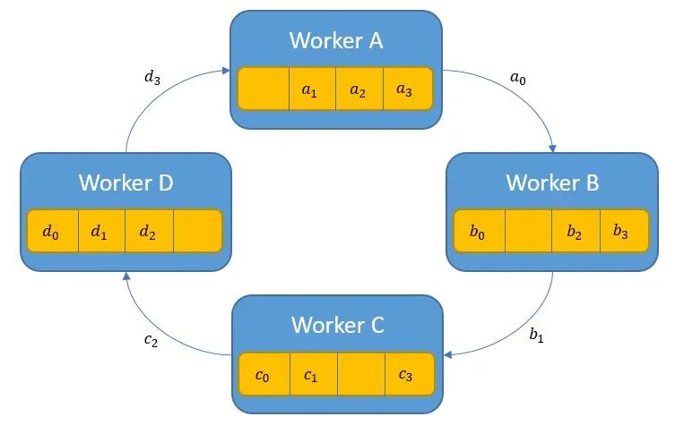
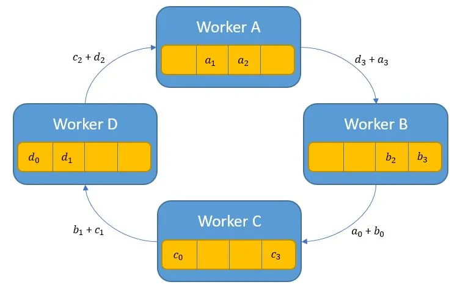

HPC 
Deep dive
Partner foundation model
Everyone 
Value for the job
Partnership with different companies

Team is pretty new
- part of a reorg
- On-device
- consolidate into
  - distributed PyTorch
  - tensor / model implementation
  - more challenging
  - three people
  - six people
  - senior + / team of experts
    - work ownership
    - connection with partners
    - innovation
    - context switch
- tomorrow presentation
  - troubleshoot
  - build RDMA - root cause analysis
  - automatic root cause
  - spread in a spectrum
  - big context switch
  - long term 
  - model optimization - 50-60%

Siri
Apple inteligen
foundation model teeam

- Batch service team
training team
classic
cloud
aws gcp
k8s
to bring cluster up
scheduling and fleet management

- PaaS service
submit
API service
pre-scheduling
micro-service team

- Runtime and HPC component
inside the container
on the runtime
K8s - operator
1000s
Job controller 
manage all the GPU resources
pytorch
job runtime 
error happens
monitor
runtime has to make right decision
recovery
user error system time
distributed training
realibility and performance
hyperpar training
running training model
tuning algorithms hook up
training jobs to hyperparameter 
tuning service
search algorithms
bring popular
Spark and Ray
run batch inference job
serve a deepseek model
what is the right tool to use
provide system level runtime
application runtime
fleet management
HPC computing
accelerator and network
GPU different vendors
AMD Google GPU
which one should we use
prepare accelerator to consume
optimize
driver, image to provide
run benchmark
rdma cuda
fleet management
inboard new instance time

jax has crashed
worked close with the user
many teams 
contributing to these libraries
checkpointing
distributed algorithm optimization
serving how to tune VLM

Not yet, dedicated team on framework
Training framework
Triton kernel
Partner teams contribute to partner framework
Improve efficiency

Troubleshooting
All Reduce on the roadmap
Fork put more logs 
NCCL is hanging
Reability tool hanging

RoCE
How different 
Write own 

Ray openAI - device
JAX one area
Ray control the communication

Orchestration at high level

Airflow

Shared cluster and sometime on device nodes
Apple internal 
Shared Ray cluster

Provide the tooling
Reinforcement learning
Model architecture
Distrubited
SFT troubleshoot jobs

---
vehicle hit vhicle failed right of way
rough;y castro central mtv bi
21225
1130pm 
caas211002391
2015 prius 7pgf915
100000 / person 300000/ac
file no 262238
Qualifications

- Experience building large-scale deep learning infrastructure or platforms for distributed model training

  - RDMA over Converged Ethernet (RoCE)

  - MODEL TRAINING

  - High BW
    - Frequent gradient synchronization (AllReduce operations)
      - requiring 100-800 Gbps links
      - NVIDIA DGX systems use NVLink (900GB/s) InfiniBand (400Gbps)
        - GPU-to-GPU communication
        - Operates at Layer 1 and Layer 2 (Physical and Link)
        - Link Layer
          - FRAMING / FLOW CONTROL / ERROR DETECTION / VIRTUAL LANES
          - SUPPORTS SWITCH FABRIC
        - NVLink
          - POINT TO POINT LINKS
        - IB
          - From L2- Link Layer, L3- Network Layer, L4- Transport Layer

  - Low Latency
    - Distributed training
      - require sub-microsecond latency
    - RDMA (Remote Direct Memory Access) protocols like InfiniBand to min CPU overhead

  - Scalability
    - Meta 16000 GPUs with InfiniBand
    - Topologies Fat-Tree, Dragonfly and Hypercube to reduce congestion

  - Reliability and Fault Tolerance
    - lossless networking 

  - Technology
    - IB 200-800 Gbps
    - RoCE 100-400 Gbps
    - NVLink/NVSwitch - 600-900 GB/s

  - Fat Tree - Google TPU pods - keep bandwidth constant across switch layers, n
  - Dragonfly - reduce hop count, optical fast, less bandwidth between optical groups
  - 3D Torus

  - INFERENCE
  - BW 10-100Gpbs
  - Low Latency
    - <1ms latency
    - TCP/IP sufficient

  - Scalability & Load Balancing
    - 1e6 million requests/sec
    - K8s + Service Mesh (Istrio/Envoy)

  - Cost Efficiency
    - Ethernet (25G/100G) not IB

  - Technologies
    - Ethernet: TCP/IP 10-100Gbps 50us-1ms
    - RoCE:     25-100Gbps        5-20us
    - SmartNIC: -200Gbps          10us
    
  - RoCE
    - RDMA over converged Ethernet
    - v1 works at the link layer (between mac addresses)
    - v2 works at the IP/network layer (allows routing)
      - uses ECN and CNP (Explicit Congestion Notification Packets)
      - endpoints must throttle to prevent buffer overflow
      - uses UDP, but may require retransmission in case of loss
    - 100-400Gbps

- Experience with large-scale AI training infra components, such as accelerators, network fabrics, CUDA, NCCL, RDMA

  - GPU
    - Memory hierarcy GLOBAL / SHARED / REGISTERS
    - Tensore Cores - FP16, BF16, Matrix Multiplications
      - 1b sign, 5b exponent, 10b fraction
      - 1b sign, 8b exponent, 7b fraction
    - CUDA kernel basics
      - THREAD BLOCKS / GRIDS / WARPS
      - THREAD:
        - smallest unit of execution
        - private register for fast access to local variables
        - access to slow global memory
      - THREAD BLOCK:
        - share data through SHARED MEMORY
        - SYNCTHREADS()
        - 1024 threads per block
        - On one STREAMING MICROPROCESSOR
      - GRID:
        - collection of ThreadBlocks
        - Blocks cannot SYNC with each other
          - Write results to Global Memory
        - Multiple SMs
      - THREAD BLOCK -> Assembly line
      - GRID -> Factory Floor
      - WARP
        - Fundamental Execution Unit
        - 32 Threads - execute the same instruction in
          LOCKSTEP (Single instruction, Multiple Threads)
        - THREAD BLOCK divides threads into WARPS
        - WARP divergence (if-then-else)
          - ALL THREAD OPERATE BOTH PATHS
        - WARP schedules by the SM
          - example waiting for global memory
        - WARP shuffle
          - exchange data between threads without using
            shared memory
      - REGISTERS
        - private to each thread
      - SHARED
        - shared in same THREAD BLOCK (SM)
        - can be used for CACHING
        - if multiple threads need to access different data from the same BANK of shared memory simultaneously get BANK CONFLICT
      - LOCAL MEMORY
        - still tied to a thread but reside in GM
      - CONSTANT
        - read only
      - GLOBAL
        - DRAM accessible by all threads
        - MEMORY COALESING
          - threads in a warp should access contiguous locations in GM to achieve optimal BW
      - WHY 32 THREADS IN A WARP?
        - large enough to keep SM fully unitilized
        - small enough to handle control flow
          - too large cause more WARP DIVERGENCE
        - MEMORY COASLESINCE
          - 128 byte cache lines, each 32 thread can get a 4 byte chunk from the cache line
        - SCHEDULING and LATENCY HIDING
          - If one warp is stalled, schedule can switch to another ready warp
        - THREAD BLOCK SIZE
          - 32 divides in 1024
        - WARP SHUFFLE OPERATIONS

    - Streaming and events
      - ASYNC Execution and overlap compute/mem copy
    - P2P memory access across GPUs

  - NCCL - Collective Communication Library
    - AllReduce, AllGather, ReduceScatter, Broadcast
    - AllReduce
      - GRADIENT SYNCHRONIZATION
        - COMBINE MINI-BATCH
    - AllGather
      - MODEL/TENSOR ||
      - Single model split across multiple GPUs
      - Reconstruct full tensor from sharded parts
      - eg. FULLY SHARDED DATA PARALLEL or ZeRO
        - model parameters sharded across GPUs
      - When a particular layer needs its complete
        parameters for a forward or backward pass
      - BATCH NORMALIZATION 
    - ReduceScatter
      - EFFICIENT GRADIENT SYNC in DATA PARALLEL
        - RING ALL-REDUCE
          - GPU sends chunk to NEIGHBOR
          - GPU receies chuck from NEIGHBOR
          - partial sum
          - AllGather - distribute partial sums
          
          
      - FSDP - ReduceScatter used to gather gradients 
        for ITS PARAMETER (since parameters are sharded)
    - Broadcast
      - INITIAL MODEL DISTRIBUTION
      - OPTIMIZER STATE SYNCHRONIZATION
      - HYPERPARAMETER SYNC
      - SHARED BUFFERS / AUXILIARY DATA
  - NVLink / NVSwitch
    - Low latency, high-bw
  - IB
    - RDMA
  - RoCE
    - Ethernet based RDMA
  - Distributed Training Patterns
    - Most large-scale models use SYNCHRONOUS DATA PARALLELISM
    - MODEL PARALLELISM
    - PIPELINE PARALLELISM
    - ZeRO (Sharded Optimzer State)
  
  - PyTorch DDP
  - Ray Train

  - Storage and Data Pipeline
    - Fast input pipelines (DALI, TFRecord, WebDataset)
    - High-throughput storage (GPUDirect Storage, NVMe, Lustre)
    - Data prefecting, caching, and sharing across nodes

  - Cluster Scheduling and Orchestration
    - SLURM, K8s, Ray
    - GPU partitioning, pod/node affinity, topology aware scheduling

  - Debug / Perf tools
    - nvprof
    - NCCL debug logs
    - ibstat

  - Learning path
    - CUDA fundamentals
    - NCCL basics + PyTorch DDP
    - RDMA concepts
    - DeepSpeed of FSDP for advanced model partitioning
    - topologies nvidia-smi topo -m

- Strong programming skills in Python or Go

- Understanding of data structures, software design principles, and algorithms

- Experience building large-scale distributed systems with tools such as Kubernetes, Kafka, Prometheus, etc.
  - KAFKA
    - 
  - PROMETHEUS
    - time series database
      - APPEND ONLY model
      - handles DOWNSAMPLING and COMPACTION
    - SCRAPES and stores metrics
    - RULES for alerting
      - grouping / silencing / routing
    - GRAPHANA
    - MONITORING for INFRA or APPS
    - e.g. KUBERNETES / DASHBOARDS
  - KUBERNETES
    - POD - smallest deployable unit
      - shares NETWORK and STORAGE
    - SERVICE - exposes a set of PODS as a network service
    - INJECT CONFIGURATION
    - INGRESS - layer http 7 (API gateway) 
    - NODE - runs workloads
    - CLUSTER - set of nodes managed by control plane
    - SCHEDULER - assing pods to NODE
    - HIGH AVAILABILITY - scale pods based on CPU/memory
    - CLUSTER AUTOSCALER - scale number of node
    - READINESS & LIVELINESS probes
    - ROLLING UPDATES and ROLLBACKS
    - NODE
      - accepts PODS from Control plane / scheduler
      - pull container images and run containers
      - monitor health of container
      - attach volumes
      - report to Control plane
    - POD
      - DEPLOYMENT - runs N replicas of a pod
      - JOB - run job until completion
      - CRONJOB
      - StatefulSet - sticky identities 
      - Contains:
        - CONTAINER image
        - Command + args
        - Config (ConfigMap, Secret)
        - Resource limits
        - Volume mounts
        - Network policies
        - Health checks 
      - CLUSTER
        - use kubectl
        - send deployment/job/cronjob/specs
        - Scheduler picks nodes to load balancer
      - NODE
        - gets pods from CLUSTER/Scheduler
        - assign pods
        - run pods based on capacity
      - POD
        - started by NODE/Kubelet
        - runs container image + config + volume + resource specs
    - INGRESS
      - K8s object that manages external HTTP access
      - manages configuration
    - INGRESS CONTROLLER
      - NGINX / ISTIO - implement logic
    - LAYER 7
      - routing based on:
        - URL paths
        - HTTP headers
        - Hostnames
        - Query parameters / Cookies
    - API GATEWAY
      - LAYER 7 routing
      - Authenticate users
      - Rate limit / throttle
      - Log and monitor traffic
      - Transform requests JSON / XML
    - INGRESS CONTROLLER
      - Runs as a pod in the cluster
    - STATEFUL WORKLOADS
      - Uses StatefulSet like databases
        - Pods get predictable STICKY NAMES
        - Pods get stable DNS name: pod-0.my-service
      - Has Persistent Volume and Persistent Volume Claim
        - retain even if pod is deleted
      - ORDERED deployment - one at a time
      - PVC - request for storage, binds PV to your pod
    - SERVICE
      - Abstraction exposes a set of PODS as a single stable
        network endpoint
        - Pods can die and restart with a different IPs
        - POD IPs CHANGE FREQUENTLY
        - Load Balance across multiple Pod replicas
        - Stable DNS
      - K8s - keeps SERVICE SPECS
        - Label selectors determine with pods are endpoints
        - KUBE CONTROLLER MANAGER - keeps list of matching Pods
        - KUBE-PROXY runs on each node
          - keeps iptables maps Service's ClusterIP to pod IPs (endpoints)
        - CoreDNS - updates DNS records
          - e.g. backend-service -> CoreDNS -> ClusterIP -> kube-proxy -> Pod
- Experience with deep learning frameworks, such as PyTorch, or JAX

- With minimum of 7+ years of industry experience

- Bachelors degree in the area of Computer Science or equivalent, or a related domain

---

Experience working with public cloud vendors such as AWS, GCP, Azure.

Experience developing model parallel and data parallel training solutions and other training optimizations

Familiarity with recent developments in foundation model architectures for language and multimodal

Publication record at ML conferences such as MLSys, NeurIPS, etc.

Advance degree in the area of Computer Science or equivalent, or a related

---

https://www.interconnects.ai/p/the-state-of-post-training-2025
