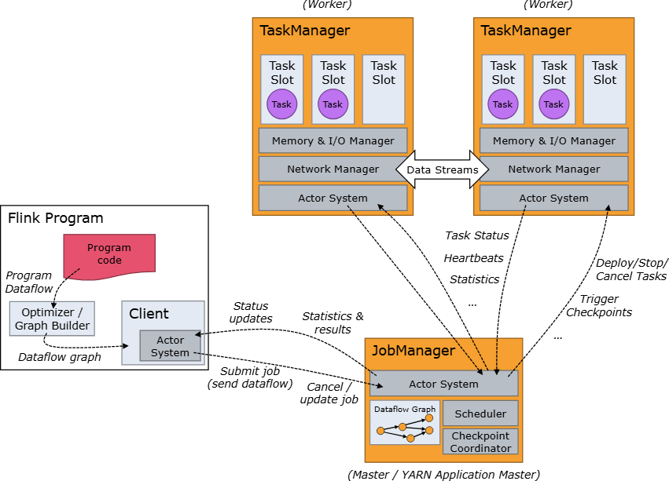

1. Two process
   1. Job Managers
   1. Task Managers

1. Startup
   1. Task Manager connect to Job Manager announcing as available
   1. Job Manager assign tasks

1. Job Manager
   1. Coordinates distributed execution
      1. Schedules next task(s)
      1. Reacts to finished tasks and failures
      1. Coordinates checkpoints
      1. Coordinates recovery
   1. Components
      1. ResourceManager
         1. de- allocate and provision task slots (units of resource scheduling)
      1. Dispatcher API interface
         1. submit Flink applications
         1. start new JobMaster for each job
    1.          
# Flink Architecture [#](https://nightlies.apache.org/flink/flink-docs-release-2.0/docs/concepts/flink-architecture/#flink-architecture)

Flink is a distributed system and requires effective allocation and management of compute resources in order to execute streaming applications. It integrates with all common cluster resource managers such as [Hadoop YARN](https://hadoop.apache.org/docs/stable/hadoop-yarn/hadoop-yarn-site/YARN.html) and [Kubernetes](https://kubernetes.io/), but can also be set up to run as a standalone cluster or even as a library.

This section contains an overview of Flink’s architecture and describes how its main components interact to execute applications and recover from failures.

## Anatomy of a Flink Cluster [#](https://nightlies.apache.org/flink/flink-docs-release-2.0/docs/concepts/flink-architecture/#anatomy-of-a-flink-cluster)

The Flink runtime consists of two types of processes: a _JobManager_ and one or more _TaskManagers_.

The _Client_ is not part of the runtime and program execution, but is used to prepare and send a dataflow to the JobManager. After that, the client can disconnect (_detached mode_), or stay connected to receive progress reports (_attached mode_). The client runs either as part of the Java program that triggers the execution, or in the command line process `./bin/flink run ...`.

The JobManager and TaskManagers can be started in various ways: directly on the machines as a [standalone cluster](https://nightlies.apache.org/flink/flink-docs-release-2.0/docs/deployment/resource-providers/standalone/overview/), in containers, or managed by resource frameworks like [YARN](https://nightlies.apache.org/flink/flink-docs-release-2.0/docs/deployment/resource-providers/yarn/). TaskManagers connect to JobManagers, announcing themselves as available, and are assigned work.

### JobManager [#](https://nightlies.apache.org/flink/flink-docs-release-2.0/docs/concepts/flink-architecture/#jobmanager)

The _JobManager_ has a number of responsibilities related to coordinating the distributed execution of Flink Applications: it decides when to schedule the next task (or set of tasks), reacts to finished tasks or execution failures, coordinates checkpoints, and coordinates recovery on failures, among others. This process consists of three different components:

- **ResourceManager**
    
    The _ResourceManager_ is responsible for resource de-/allocation and provisioning in a Flink cluster — it manages **task slots**, which are the unit of resource scheduling in a Flink cluster (see [TaskManagers](https://nightlies.apache.org/flink/flink-docs-release-2.0/docs/concepts/flink-architecture/#taskmanagers)). Flink implements multiple ResourceManagers for different environments and resource providers such as YARN, Kubernetes and standalone deployments. In a standalone setup, the ResourceManager can only distribute the slots of available TaskManagers and cannot start new TaskManagers on its own.
    
- **Dispatcher**
    
    The _Dispatcher_ provides a REST interface to submit Flink applications for execution and starts a new JobMaster for each submitted job. It also runs the Flink WebUI to provide information about job executions.
    
- **JobMaster**
    
    A _JobMaster_ is responsible for managing the execution of a single [JobGraph](https://nightlies.apache.org/flink/flink-docs-release-2.0/docs/concepts/glossary/#logical-graph). Multiple jobs can run simultaneously in a Flink cluster, each having its own JobMaster.
    

There is always at least one JobManager. A high-availability setup might have multiple JobManagers, one of which is always the _leader_, and the others are _standby_ (see [High Availability (HA)](https://nightlies.apache.org/flink/flink-docs-release-2.0/docs/deployment/ha/overview/)).

### TaskManagers [#](https://nightlies.apache.org/flink/flink-docs-release-2.0/docs/concepts/flink-architecture/#taskmanagers)

The _TaskManagers_ (also called _workers_) execute the tasks of a dataflow, and buffer and exchange the data streams.

There must always be at least one TaskManager. The smallest unit of resource scheduling in a TaskManager is a task _slot_. The number of task slots in a TaskManager indicates the number of concurrent processing tasks. Note that multiple operators may execute in a task slot (see [Tasks and Operator Chains](https://nightlies.apache.org/flink/flink-docs-release-2.0/docs/concepts/flink-architecture/#tasks-and-operator-chains)).

[Back to top](https://nightlies.apache.org/flink/flink-docs-release-2.0/docs/concepts/flink-architecture/#top)

## Tasks and Operator Chains [#](https://nightlies.apache.org/flink/flink-docs-release-2.0/docs/concepts/flink-architecture/#tasks-and-operator-chains)

For distributed execution, Flink _chains_ operator subtasks together into _tasks_. Each task is executed by one thread. Chaining operators together into tasks is a useful optimization: it reduces the overhead of thread-to-thread handover and buffering, and increases overall throughput while decreasing latency. The chaining behavior can be configured; see the [chaining docs](https://nightlies.apache.org/flink/flink-docs-release-2.0/docs/dev/datastream/operators/overview/#task-chaining-and-resource-groups) for details.

The sample dataflow in the figure below is executed with five subtasks, and hence with five parallel threads.

[Back to top](https://nightlies.apache.org/flink/flink-docs-release-2.0/docs/concepts/flink-architecture/#top)

## Task Slots and Resources [#](https://nightlies.apache.org/flink/flink-docs-release-2.0/docs/concepts/flink-architecture/#task-slots-and-resources)

Each worker (TaskManager) is a _JVM process_, and may execute one or more subtasks in separate threads. To control how many tasks a TaskManager accepts, it has so called **task slots** (at least one).

Each _task slot_ represents a fixed subset of resources of the TaskManager. A TaskManager with three slots, for example, will dedicate 1/3 of its managed memory to each slot. Slotting the resources means that a subtask will not compete with subtasks from other jobs for managed memory, but instead has a certain amount of reserved managed memory. Note that no CPU isolation happens here; currently slots only separate the managed memory of tasks.

By adjusting the number of task slots, users can define how subtasks are isolated from each other. Having one slot per TaskManager means that each task group runs in a separate JVM (which can be started in a separate container, for example). Having multiple slots means more subtasks share the same JVM. Tasks in the same JVM share TCP connections (via multiplexing) and heartbeat messages. They may also share data sets and data structures, thus reducing the per-task overhead.

By default, Flink allows subtasks to share slots even if they are subtasks of different tasks, so long as they are from the same job. The result is that one slot may hold an entire pipeline of the job. Allowing this _slot sharing_ has two main benefits:

- A Flink cluster needs exactly as many task slots as the highest parallelism used in the job. No need to calculate how many tasks (with varying parallelism) a program contains in total.
    
- It is easier to get better resource utilization. Without slot sharing, the non-intensive _source/map()_ subtasks would block as many resources as the resource intensive _window_ subtasks. With slot sharing, increasing the base parallelism in our example from two to six yields full utilization of the slotted resources, while making sure that the heavy subtasks are fairly distributed among the TaskManagers.
    

## Flink Application Execution [#](https://nightlies.apache.org/flink/flink-docs-release-2.0/docs/concepts/flink-architecture/#flink-application-execution)

A _Flink Application_ is any user program that spawns one or multiple Flink jobs from its `main()` method. The execution of these jobs can happen in a local JVM (`LocalEnvironment`) or on a remote setup of clusters with multiple machines (`RemoteEnvironment`). For each program, the `ExecutionEnvironment` provides methods to control the job execution (e.g. setting the parallelism) and to interact with the outside world (see [Anatomy of a Flink Program](https://nightlies.apache.org/flink/flink-docs-release-2.0/docs/dev/datastream/overview/#anatomy-of-a-flink-program)).

The jobs of a Flink Application can either be submitted to a long-running [Flink Session Cluster](https://nightlies.apache.org/flink/flink-docs-release-2.0/docs/concepts/glossary/#flink-session-cluster), a dedicated [Flink Job Cluster (deprecated)](https://nightlies.apache.org/flink/flink-docs-release-2.0/docs/concepts/glossary/#flink-job-cluster), or a [Flink Application Cluster](https://nightlies.apache.org/flink/flink-docs-release-2.0/docs/concepts/glossary/#flink-application-cluster). The difference between these options is mainly related to the cluster’s lifecycle and to resource isolation guarantees.

### Flink Application Cluster [#](https://nightlies.apache.org/flink/flink-docs-release-2.0/docs/concepts/flink-architecture/#flink-application-cluster)

- **Cluster Lifecycle**: a Flink Application Cluster is a dedicated Flink cluster that only executes jobs from one Flink Application and where the `main()` method runs on the cluster rather than the client. The job submission is a one-step process: you don’t need to start a Flink cluster first and then submit a job to the existing cluster session; instead, you package your application logic and dependencies into a executable job JAR and the cluster entrypoint (`ApplicationClusterEntryPoint`) is responsible for calling the `main()` method to extract the JobGraph. This allows you to deploy a Flink Application like any other application on Kubernetes, for example. The lifetime of a Flink Application Cluster is therefore bound to the lifetime of the Flink Application.
    
- **Resource Isolation**: in a Flink Application Cluster, the ResourceManager and Dispatcher are scoped to a single Flink Application, which provides a better separation of concerns than the Flink Session Cluster.
    

### Flink Session Cluster [#](https://nightlies.apache.org/flink/flink-docs-release-2.0/docs/concepts/flink-architecture/#flink-session-cluster)

- **Cluster Lifecycle**: in a Flink Session Cluster, the client connects to a pre-existing, long-running cluster that can accept multiple job submissions. Even after all jobs are finished, the cluster (and the JobManager) will keep running until the session is manually stopped. The lifetime of a Flink Session Cluster is therefore not bound to the lifetime of any Flink Job.
    
- **Resource Isolation**: TaskManager slots are allocated by the ResourceManager on job submission and released once the job is finished. Because all jobs are sharing the same cluster, there is some competition for cluster resources — like network bandwidth in the submit-job phase. One limitation of this shared setup is that if one TaskManager crashes, then all jobs that have tasks running on this TaskManager will fail; in a similar way, if some fatal error occurs on the JobManager, it will affect all jobs running in the cluster.
    
- **Other considerations**: having a pre-existing cluster saves a considerable amount of time applying for resources and starting TaskManagers. This is important in scenarios where the execution time of jobs is very short and a high startup time would negatively impact the end-to-end user experience — as is the case with interactive analysis of short queries, where it is desirable that jobs can quickly perform computations using existing resources.
    

> Formerly, a Flink Session Cluster was also known as a Flink Cluster in `session mode`.

Designing a High-Performance Streaming Framework: Lessons from Apache Flink
I. Introduction to Streaming Data Processing
Streaming data processing has become an indispensable capability for modern enterprises, driven by the continuous generation of data from diverse sources such as Internet of Things (IoT) devices, web applications, and security logs. Unlike traditional batch processing, which processes finite datasets at discrete intervals, streaming data is characterized by its unbounded, continuous nature, demanding real-time analysis and action. This paradigm shift enables organizations to detect anomalies and respond to events instantaneously, enhance customer experiences through personalized recommendations, improve operational efficiency via real-time monitoring, and gain a competitive advantage through timely insights and decision-making.   

Designing a robust streaming framework necessitates addressing several inherent challenges. These include effectively handling high-volume and high-velocity data streams, ensuring consistently low-latency and high-throughput processing, providing robust fault-tolerance and scalability, and facilitating seamless integration with a wide array of data sources and sinks. Frameworks engineered to meet these demands, such as Apache Flink, are specifically designed to process and analyze massive data streams with minimal latency. The architectural features underpinning these capabilities typically involve distributed execution, built-in fault-tolerance mechanisms, and optimizations geared towards high-throughput data processing.   

Apache Flink stands out as a premier open-source streaming data processing framework, renowned for its high performance and fault tolerance. A primary differentiator for Flink is its exceptional versatility in handling unbounded data streams, making it particularly well-suited for continuous processing applications. A significant architectural principle in Flink is its unified approach to data processing. It offers a single programming interface and execution engine that seamlessly supports both batch and stream processing. This design allows applications to process both continuous, infinite data streams and finite datasets, simplifying development by enabling a single codebase for diverse analytical needs, from historical analysis to real-time insights. This unification represents a fundamental advancement in data processing paradigms. Historically, batch and stream processing were often treated as distinct domains, frequently requiring separate tools and leading to complex, often inconsistent "Lambda Architectures." Flink's integrated model reduces operational overhead and ensures consistent results regardless of data boundedness, offering a substantial advantage over systems that extend batch processing with micro-batching for "near real-time" results, rather than true continuous streaming.   

Compared to other prominent frameworks in the streaming ecosystem, Flink presents distinct advantages. Apache Kafka Streams, for instance, is deeply integrated with Apache Kafka and provides stateful processing with built-in windowing capabilities. Apache Spark Streaming extends Apache Spark's batch processing model to real-time data streams through micro-batch processing, leveraging the broader Spark ecosystem. Apache Storm, an early pioneer in distributed stream processing, is known for its simplicity and low-latency, tuple-based processing, though it has largely been superseded by newer frameworks like Flink and Kafka Streams in terms of advanced features and comprehensive capabilities. Flink's explicit and integrated state management, a core aspect of its design, is what truly enables it to support advanced, reliable, and complex real-time applications such as fraud detection, real-time aggregations (e.g., windowed sums), or complex event processing. This capability is not an optional add-on but a foundational requirement for providing strong consistency guarantees and supporting the sophisticated analytical workloads that drive the adoption of streaming technologies. Consequently, Flink is particularly well-suited for applications demanding low-latency processing, high throughput, and robust state management.   

II. Apache Flink's Core Architecture
Apache Flink's operational efficiency stems from its distributed architecture, which comprises several interconnected components working in concert. At its core, a Flink cluster consists of a JobManager, multiple TaskManagers, and a Client that facilitates job submission.   

The Client serves as the user's interface to the Flink cluster. It is responsible for compiling the user's Flink program, which can be written in languages such as Java, Scala, Python, or SQL, into a logical representation known as a JobGraph. This JobGraph is then submitted to the JobManager for execution. Typically, the client interacts with the cluster via a command-line interface or a programmatic API.   

The JobManager (JM) acts as the central orchestrator of a Flink application. Upon receiving a job submission, the JobManager performs several critical functions. It first transforms the logical JobGraph into a detailed physical execution plan called a Task Execution Graph. Subsequently, it parallelizes the job's operations and distributes the resulting subtasks across the available TaskManagers. Throughout the job's lifecycle, the JobManager coordinates all cluster activities, including managing job submission, scheduling tasks to available task slots, orchestrating checkpointing operations for fault tolerance, and initiating recovery processes in the event of TaskManager failures. Although only one JobManager is active at any given time (a potential single point of failure in basic setups, mitigated by High Availability configurations), it is designed to restart quickly by leveraging checkpoint data.   

The TaskManagers (TMs) are the worker nodes within the Flink cluster. These distributed processes execute the actual stream processing logic. A typical Flink cluster will have multiple TaskManagers running concurrently. Each TaskManager registers its available "task slots" with the ResourceManager, effectively declaring its capacity for executing tasks.   

Complementing these core components are the Dispatcher and the ResourceManager. The Dispatcher exposes the REST API for submitting Flink applications and also hosts the Flink Web User Interface, serving as the primary entry point for job submissions. The ResourceManager is responsible for managing the allocation and de-allocation of Task Slots across the entire cluster. It interfaces with underlying cluster orchestrators, such as Kubernetes or YARN, to acquire and release computational resources as needed. A    

Task Slot represents the smallest unit of resource scheduling within a TaskManager. Each task slot is a fixed subset of a TaskManager's overall resources, encompassing a fraction of its CPU and memory, and is capable of executing one task. The number of slots configured for a TaskManager directly determines its maximum concurrent execution capacity. Defining a clear and granular unit of resource allocation, such as the Task Slot, is essential for a distributed processing engine. This primitive enables effective scheduling, provides a level of resource isolation, and supports advanced optimizations like slot sharing, which are crucial for predictable performance and efficient resource utilization in multi-tenant or complex job environments.   

The Dataflow Model: JobGraph, ExecutionGraph, and their Relationship
At its core, Flink operates as a distributed dataflow engine, executing programs that are conceptually expressed as dataflows. A Flink runtime program is fundamentally represented as a Directed Acyclic Graph (DAG) where nodes represent stateful operators and edges signify data streams connecting these operators.   

The initial, high-level, logical representation of a Flink program is the JobGraph. This graph is generated by the client from the user's application code. It depicts the logical operators as nodes and the data dependencies or streams/datasets as edges, capturing the user's intended computation without delving into the specifics of physical execution.   

For actual execution, the JobManager transforms the JobGraph into an ExecutionGraph. This graph provides a highly detailed physical execution plan, specifying precisely how the program will be executed across the distributed cluster. Its nodes represent "tasks," which are parallel instances of operators or chains of operators, and its edges denote the data communication channels between them. The ExecutionGraph includes comprehensive representations of each parallel task, intermediate data streams, and the communication patterns that govern data flow. A critical aspect of the ExecutionGraph is that its structure can often deviate from the sequential order in which transforms were specified in the original JobGraph. This divergence occurs because the Flink service performs various internal optimizations and "fusions," such as operator chaining, on the execution graph before deploying it to managed resources. The distinction between the high-level JobGraph and the detailed ExecutionGraph is more than a mere translation; it is where Flink's intelligence for performance and fault tolerance is embedded. The fact that the ExecutionGraph can be optimized and fused highlights that the JobManager acts not just as a scheduler but as a sophisticated optimizer. It takes the user's declarative intent and translates it into the most efficient physical execution plan, considering parallelism, data dependencies, and internal optimizations. Furthermore, the granular representation within the ExecutionGraph, including    

ExecutionJobVertex, ExecutionVertex, and Execution, provides the necessary mechanisms for fine-grained state management, fault recovery (e.g., restarting specific execution attempts), and precise communication tracking, which are all essential for Flink's robust "exactly-once" guarantees. This level of abstraction and control over the execution graph is critical for achieving high performance and reliability in complex distributed stream processing.

Within the ExecutionGraph, several hierarchical constructs are defined:

An ExecutionJobVertex represents a single logical operator from the JobGraph (e.g., a "map" or "join" operation) during its execution phase. It aggregates the state of all its parallel subtasks.   

An ExecutionVertex represents one parallel subtask of an ExecutionJobVertex. The number of ExecutionVertices for a given ExecutionJobVertex is equal to its configured parallelism.   

An Execution represents a single attempt to execute an ExecutionVertex. Multiple Executions may occur for an ExecutionVertex in scenarios involving failures or when data needs to be recomputed due to unavailability. Each Execution is uniquely identified by an ExecutionAttemptID, which is used for all messages exchanged between the JobManager and TaskManager regarding task deployment and status updates.   

Pipelined Execution and Parallelism
Flink's design philosophy is predicated on expressing and executing data processing applications as pipelined, fault-tolerant dataflows. This fundamental approach means that data flows continuously through the operators without being fully materialized between each processing step, thereby enabling exceptionally low latency. Processing within Flink is inherently parallelized, with computations distributed across potentially thousands of tasks running concurrently on multiple machines.   

Two primary forms of parallelism are leveraged:

Data Parallelism: This strategy involves dividing the input data into subsets, with multiple tasks of the same operation executing on these different data subsets in parallel. This approach is crucial for handling large volumes of data efficiently and distributing the computational load across numerous processing nodes.   

Task Parallelism: This refers to the concurrent execution of tasks from different operators, which may operate on the same or different data. This form of parallelism is vital for maximizing the utilization of computing resources within the cluster, ensuring that various stages of the data pipeline are actively processing data simultaneously.   

The Flink service automatically parallelizes and distributes the processing logic of a pipeline to the assigned worker TaskManagers. However, it is important to acknowledge that certain input sources may inherently limit parallelism. For instance, ingesting data from a single compressed text file, which cannot be arbitrarily divided into shards, can become a bottleneck, thereby constraining the overall throughput of the pipeline.   

III. Optimizing Performance: Operator Chaining and Slot Sharing
To achieve its high-performance characteristics, Flink incorporates sophisticated optimization techniques, most notably operator chaining and slot sharing. These mechanisms are designed to reduce overhead, increase throughput, and decrease latency within a distributed streaming application.

Operator Chaining: Mechanism and Benefits
Operator chaining is a key optimization technique employed by Flink to enhance execution efficiency.

Mechanism: This technique involves fusing multiple operator subtasks together into a single "task," which is then executed within a single thread. For example, a common sequence like source() -> map() -> filter() can be chained, meaning these operations are performed sequentially within the same thread, rather than each operator running in a separate thread requiring inter-thread communication.   

Benefits:

Reduced Overhead: By fusing operators, Flink significantly reduces the overhead associated with thread-to-thread data handovers and intermediate buffering. This minimizes context switching and internal data movement, leading to more efficient CPU utilization.   

Increased Throughput: Eliminating the need for serialization and deserialization of data when passing between chained operators, and avoiding frequent context switches, directly results in a substantial increase in overall data throughput.   

Decreased Latency: The direct function calls between chained operators, as opposed to inter-thread communication or network transfers, lead to lower processing latency for individual records as they flow through the chained operations.   

Important Considerations: Flink enables operator chaining by default where possible, automatically identifying sequences of operators that can be efficiently fused. Chained operators consistently execute within the same thread. However, certain operations inherently break chaining because they necessitate data redistribution or a change in parallelism, thereby forcing network communication. Examples include keyBy() operations, rebalance transformations, or any scenario where the parallelism of an upstream operator differs from that of a downstream operator (e.g., a source() with a parallelism of 2 followed by a map() with a parallelism of 3).   

Slot Sharing: Mechanism and Benefits
Slot sharing is another crucial optimization that complements operator chaining, focusing on efficient resource utilization.

Mechanism: This technique allows multiple operator subtasks to share a single task slot, even if these subtasks belong to different logical tasks within the same Flink job. This implies that a single task slot can effectively host an entire pipeline of the job, from source to sink, or significant portions thereof.   

Benefits:

Better Resource Utilization: Slot sharing significantly improves resource utilization within TaskManagers. It is particularly advantageous when some operators in a pipeline are not continuously resource-intensive. Instead of dedicating an entire slot to a lightly loaded operator, multiple operators can share the slot, ensuring that resources (CPU, memory) are more fully utilized. For instance, if a source() operator performs minimal work while a map() operator is computationally heavy, slot sharing allows other operator instances to run in the less busy slot, preventing resource waste.   

Reduced Task Slot Requirement: When slot sharing is enabled, the total number of task slots required by a Flink job is determined by the maximum parallelism of any single operator in that job, rather than the sum of all operators' parallelisms. For example, if a job comprises a source with parallelism 5, a map with 4, and a sink with 6, the job would only necessitate 6 task slots (the maximum parallelism), as opposed to 15 if slot sharing were disabled (5+4+6=15). This reduces the overall cluster resources needed.   

Relative Load Balancing: Flink leverages slot sharing as an integral part of its resource management strategy to control the number of slots and achieve more balanced load distribution across the cluster.   

Important Considerations: Slot sharing is enabled by default in Flink. The system automatically determines which operators should share the same task slot, though developers retain the ability to manually specify slot sharing groups for fine-grained control. While generally beneficial, for operators performing extremely heavy processing, it might be advantageous to isolate them in dedicated task slots or allocate more resources to their shared slots to prevent resource contention.   

The synergistic relationship between operator chaining and slot sharing is a hallmark of Flink's performance engineering. Operator chaining focuses on intra-thread efficiency, reducing overhead within a single execution thread by fusing logical operators. This aims to make individual computational units as fast as possible. Slot sharing, conversely, addresses inter-task and resource utilization efficiency, enabling multiple tasks (which may themselves contain chained operators) to share the resources of a single Task Slot. This maximizes the utilization of allocated cluster resources. This dual approach, addressing both fine-grained execution efficiency and coarse-grained resource packing, demonstrates a holistic design that considers performance at multiple layers of the execution stack. This combination of intra-process and inter-process/resource optimizations is crucial for achieving both low latency and high throughput while efficiently utilizing cluster resources.

Furthermore, Flink's design, which enables both operator chaining and slot sharing by default, provides excellent ease of use and a strong baseline performance. However, the framework also acknowledges scenarios where these optimizations are inherently broken (e.g., by keyBy() or parallelism changes for chaining) or where manual intervention might be beneficial (e.g., isolating heavy operators in dedicated slots). This reflects a common principle in distributed systems design: providing intelligent defaults for common cases while offering granular control for advanced users to fine-tune performance for specific, often complex, production workloads. The provision of explicit control mechanisms, such as the ability to disable chaining or define custom slot sharing groups, highlights that while automation simplifies operations, it may not always yield optimal results for every unique scenario. A mature streaming framework, therefore, provides robust automatic optimizations but also exposes configuration mechanisms for advanced users. This flexibility allows developers and operators to override defaults and fine-tune resource allocation and execution patterns based on their specific workload characteristics, performance requirements, and cost considerations, which is vital for achieving peak efficiency in production environments.

IV. Robustness and Reliability: State Management and Fault Tolerance
The ability to maintain and recover application state is paramount for complex streaming applications. Many real-world use cases extend beyond simple message-by-message transformations; they are inherently stateful. This means their business logic must "remember" past events, maintain intermediate results (e.g., counts, sums, averages over time windows), or track complex patterns across a sequence of events. Flink provides a comprehensive set of state primitives that enable applications to manage very large volumes of data, potentially up to several terabytes, while guaranteeing exactly-once consistency for this internal state.   

Checkpointing Mechanism: Consistent Snapshots and Stream Barriers
Fault tolerance in Flink is primarily achieved through its robust checkpointing mechanism, which is complemented by savepointing for planned operations and upgrades. Checkpointing forms the backbone of Flink's exactly-once processing capabilities, ensuring data integrity even in the face of failures.   

A Flink checkpoint is a consistent snapshot of two critical elements: the current state of the application's operators and the precise position in the input streams (e.g., Kafka offsets). Flink periodically takes these snapshots of the entire stream processing application's state. These snapshots capture the state of all operators and the data streams at a specific point in time, allowing the system to recover from failures without data loss or duplication.   

The checkpointing process is orchestrated by the JobManager and involves injecting special markers called stream barriers into the data streams. These barriers flow through the data processing pipeline, logically separating records that belong to the current checkpoint from those that belong to the next. When an operator receives a barrier, it triggers the snapshotting of its current state. The barrier ensures that all operators reach a consistent state before their individual snapshots are taken, thereby guaranteeing a globally consistent snapshot of the entire distributed application. The underlying state snapshotting mechanism is coordinated and pipelined, drawing inspiration from the classical Chandy-Lamport's protocol for distributed snapshots. Flink employs a "tailored" asynchronous snapshot algorithm based on Chandy-Lamport, specifically optimized for Directed Acyclic Graph (DAG) scenarios by eliminating the need to store channel state. This optimization significantly reduces the storage space required for snapshots. These consistent snapshots are designed to be lightweight and distributed, created progressively without significantly impacting the continuous execution of the dataflow. Application state is explicitly declared to the system, enabling efficient partitioning and transparent commits to persistent storage. The explicit mention of Flink's checkpointing mechanism being similar to the classical Chandy-Lamport's protocol and using a "tailored" version is a critical technical detail. It signifies that Flink's approach to consistent distributed snapshots is not an ad-hoc invention but is rooted in a well-established theoretical foundation of distributed systems. The "tailored" aspect, specifically not needing to store channel state in DAG scenarios, is a practical optimization that demonstrates Flink's engineering prowess in adapting theoretical concepts to the specific characteristics of stream processing (e.g., directed dataflows, pipelined execution) to reduce overhead and improve efficiency. This shows a deep understanding of distributed consistency models and their real-world application.   

Exactly-Once Semantics: Internal Guarantees and End-to-End Consistency
"Exactly-once processing" is a critical guarantee in stream processing, ensuring that each data record in a stream is processed and affects the final results precisely one time, preventing both duplicate processing and data loss. Within a Flink application, "exactly-once" means that each incoming event affects the state exactly once, even in the event of machine or software failures. This guarantee applies to the processing    

inside Flink, excluding the source and sink interactions initially. Flink has historically provided strong internal exactly-once semantics, primarily through its robust checkpointing mechanism.   

Extending this guarantee to external systems (data sources and sinks) that Flink interacts with is a more complex undertaking. To achieve end-to-end exactly-once semantics, external systems must provide mechanisms to commit or roll back writes that are coordinated with Flink's checkpoints. Flink achieves this by utilizing the    

two-phase commit protocol, particularly when interacting with transactional sinks like Apache Kafka (version 0.11 and later).   

The Two-Phase Commit Protocol for Sinks operates as follows:

Transaction Scope: For exactly-once guarantees, all data written to an external system (e.g., Kafka) between two checkpoints must be bundled within a single transaction. If a failure occurs, these writes can be rolled back.   

Distributed Coordination: In a distributed system with multiple concurrent sink tasks, a simple commit or rollback is insufficient. All distributed components must agree on the outcome. Flink addresses this by incorporating a pre-commit phase.   

Pre-commit Phase: This phase is initiated by a checkpoint barrier. Operators snapshot their internal state. For sinks writing to external systems, they must pre-commit their external transactions (e.g., flush data to a temporary location, make it visible to Flink's checkpoint, but not yet publicly accessible). This phase concludes when the checkpoint is successfully completed, including pre-committed external state. If a failure occurs, the application can recover from this consistent checkpoint.   

Commit Phase: After the JobManager confirms a successful checkpoint, it notifies all operators. Sinks with external state then atomically commit their transactions, making the data permanently visible in the external system.   

Flink's ability to provide exactly-once semantics within a Flink application is a significant achievement due to its integrated state management and checkpointing. However, the complexity escalates dramatically when extending this to end-to-end exactly-once, which explicitly requires external systems to participate in a distributed transaction protocol. This highlights a crucial architectural reality: the overall consistency guarantee of a distributed data pipeline is limited by the weakest link in the chain. The necessity for external systems to be transactional or for sinks to be idempotent underscores the challenges of distributed consistency, where operations might be retried, and external components must be designed to handle this gracefully without introducing duplicates or data loss. This shifts the complexity beyond the core processing engine to the entire data ecosystem. When designing a system with end-to-end consistency requirements, it is paramount to recognize that achieving strong guarantees depends on the transactional capabilities and idempotency of all integrated components, not just the stream processing engine itself. The framework must provide robust coordination mechanisms, but external systems also bear a significant responsibility in upholding the desired consistency level.

Flink provides a TwoPhaseCommitSinkFunction to abstract the common logic of this protocol. When implementing this, the commit method must be idempotent. Idempotency ensures that performing the commit operation multiple times has the same effect as performing it once. This is crucial for recovery scenarios where an operator might restart and attempt to commit a transaction that was already successfully committed just before the failure, preventing duplicate writes to the external system.   

State Backends: MemoryStateBackend, FsStateBackend, RocksDBStateBackend
Flink offers a variety of state backends to manage the state of stream processing applications, each presenting different trade-offs between performance and durability. The selection of a state backend is a critical architectural decision based on the application's specific requirements. The availability of multiple state backends with distinct performance and durability profiles is a deliberate design choice by Flink. It acknowledges that different streaming applications have varying requirements for state size, access patterns, and recovery objectives. This flexibility allows users to tune the system precisely for their needs, but also implies that the "right" choice is not universal and requires careful consideration of the application's specific workload characteristics and recovery point objectives (RPO). A well-designed streaming framework provides configurable state management options, enabling users to make informed trade-offs between processing performance and data durability. This architectural flexibility is crucial for optimizing resource usage and meeting diverse service level agreements (SLAs) in production deployments.   

The primary state backends available in Flink include:

MemoryStateBackend (In-memory State Backend):

Performance: This backend offers the fastest access times because state is stored directly in the JobManager's or TaskManager's JVM heap memory.

Durability/Suitability: State is volatile and lost upon JobManager or TaskManager failure. It is not suitable for large-scale applications or production environments requiring fault tolerance, as the entire state must fit into memory. Checkpoints are also stored in the JobManager's memory.   

FsStateBackend (Filesystem-based State Backend):

Performance: Introduces some latency compared to in-memory, as state is written to a distributed filesystem (e.g., HDFS, S3).

Durability/Suitability: Provides durability by storing state on a fault-tolerant filesystem. This makes it suitable for larger state sizes and production environments where state persistence is required. Checkpoints are written to the configured filesystem.   

RocksDBStateBackend (RocksDB State Backend):

Performance and Durability: This is a widely used and popular choice, offering an excellent balance between performance and durability. It stores state in RocksDB, an embedded key-value store that operates on local disk (but is checkpointed to a remote, durable filesystem). It leverages an LSM-tree (Log-Structured Merge-tree) architecture, combining in-memory tables/caches with bulk storage on disk, which is optimized for high write performance and minimizing wear on modern SSDs.   

Suitability: Ideal for applications with very large state (potentially exceeding available memory) that still require high throughput and low-latency access.

The following table provides a comparative overview of Flink's state backends:

Feature/Backend	MemoryStateBackend	FsStateBackend	RocksDBStateBackend
Storage Location	TaskManager JVM Heap (state), JobManager JVM Heap (checkpoints)	TaskManager JVM Heap (state), Distributed Filesystem (HDFS/S3) (checkpoints)	Local Disk (RocksDB) (state), Distributed Filesystem (HDFS/S3) (checkpoints)
Performance	Very High (lowest latency)	Moderate (some latency due to network I/O)	High (optimized for writes, good read performance)
Durability	Low (volatile, lost on TM/JM failure)	High (durable on fault-tolerant FS)	Very High (durable on local disk, checkpointed to FS)
State Size Limit	Limited by available JVM heap memory	Limited by available JVM heap memory, but checkpoints to FS	Limited by available local disk space (can exceed memory)
Recovery Time	Fast (if state fits in memory)	Moderate (reloads from FS)	Moderate to Slow (reloads from local disk & FS)
Typical Use Cases	Development, testing, small state, stateless jobs	Production, larger state, less strict latency	Production, very large state, high throughput, complex stateful computations

Export to Sheets
V. Handling Time and Aggregations: Time Semantics and Windowing
Accurate handling of time is a critical aspect of stream processing, especially for analytical applications and aggregations. Flink provides flexible support for different notions of time within its streaming programs, acknowledging that the "time" of an event can be interpreted in various ways, each with its own implications for correctness and performance.   

Understanding Time: Processing Time, Event Time, Ingestion Time
Processing Time:

Definition: Refers to the system time (wall clock) of the machine that is executing a particular operation.   

Characteristics: This is the simplest notion of time and offers the lowest latency and best performance because it requires no coordination between machines or data sources. Time-based operations, such as time windows, use the system clock of the machine running the operator. For example, an hourly processing time window will include all records that arrived at a specific operator between the times when the system clock indicated the full hour.   

Limitations: In distributed and asynchronous environments, processing time does not provide determinism. Results can be susceptible to factors like the speed at which records arrive in the system (e.g., from a message queue), the speed at which records flow between operators, and system outages. This can lead to non-reproducible results, making it less suitable for applications requiring strict correctness over time.   

Event Time:

Definition: The time that each individual event actually occurred on its producing device (e.g., a sensor reading timestamp, a log entry timestamp). This timestamp is typically embedded within the records before they enter Flink and is extracted from each record.   

Characteristics: In event time, the progress of time depends entirely on the data itself, not on any wall clocks. It aims to provide completely consistent and deterministic results, regardless of when events arrive or their ordering. This is crucial for correctly processing out-of-order events, which are common in distributed systems due to network latency or source variations.   

Mechanism: Event time programs must specify how to generate Event Time Watermarks, which are the mechanism Flink uses to signal progress in event time and handle out-of-order data.   

Trade-offs: Unless events are known to arrive strictly in-order, event time processing incurs some latency while the system waits for potentially out-of-order events to arrive (bounded by watermarks). While it can produce correct results even with late or out-of-order events, there is a fundamental trade-off between processing latency and the completeness of results.   

Ingestion Time:

Definition: Refers to the time when an event enters the Flink system, i.e., the timestamp assigned to the record upon its arrival at the Flink source operator.   

Characteristics: This is a hybrid approach that balances the simplicity of Processing Time with some of the accuracy benefits of Event Time. Once an ingestion timestamp is assigned, processing continues with event time semantics based on these attached timestamps.   

Suitability: This time characteristic is useful in scenarios where event timestamps are unavailable or unreliable at the source, but some ordering guarantee is still needed, providing a compromise between performance and correctness.   

Watermarks: Managing Out-of-Order Events and Late Data
A watermark is a fundamental mechanism in Flink for tracking the progress of event time within a data stream. Watermarks are not actual data events; instead, they are metadata markers emitted by Flink into the source data stream to indicate the temporal advancement of the stream as events are processed.   

Critical Purposes of Watermarks:

Event-Time Processing: Watermarks enable Flink to process data streams based on the actual event time rather than the current wall clock time. This is particularly vital for handling events that arrive out of order, ensuring they are processed in the correct temporal sequence based on their timestamps.   

Window Triggering: They are essential for time-based operations like tumbling and sliding windows. Flink uses watermarks to determine precisely when to trigger window calculations and emit their results, ensuring that windows close only after all (or most) relevant events for that time period have arrived.   

Late Event Detection: Watermarks help Flink detect "late events"—events that arrive after a watermark has already passed their timestamp. By tracking watermarks, Flink allows the application to define policies for handling late data, such as deciding whether to "wait" for them (which increases latency) or to process partial results without them.   

Mechanism and Propagation: A watermark carries a timestamp t. When a Watermark(t) is emitted, it declares that event time has reached time t in that stream, implying that no more elements with a timestamp t' <= t (i.e., events older than or equal to the watermark) are expected from that specific stream partition. Watermarks are generated at or immediately after source functions. Each parallel subtask of a source typically generates its watermarks independently. As watermarks flow through the streaming program, they advance the event time at the operators they reach. Operators consuming multiple input streams (e.g., after a    

union or keyBy() operation) determine their current event time as the minimum of their input streams' event times, ensuring consistency across merged streams. Flink provides pre-implemented timestamp assigners and watermark generators, such as    

forBoundedOutOfOrderness() (used when the maximum expected lateness in a stream is known) and forMonotonousTimestamps() (for streams where event timestamps are strictly ascending).   

Challenges: Key challenges in using watermarks include choosing the optimal watermark strategy, ensuring watermark accuracy (overestimated watermarks can lead to premature results, underestimated ones to unnecessary latency), managing event-time skew across distributed sources, and balancing the trade-off between processing latency and result completeness. Handling "idling sources," where no events arrive and thus prevent watermark progression, also requires specific strategies to ensure timely window triggering.   

Windowing Types: Tumbling, Sliding, Session, and Global Windows
Windowing is a powerful concept in Flink's DataStream API that enables grouping a continuous, unbounded stream of data into finite "chunks" or sets based on specific conditions, typically time or element count. This capability is particularly useful for calculating metrics (e.g., sums, averages, counts) over specific durations, detecting patterns or trends in real-time data, and aggregating results for reporting or monitoring purposes. Windows can operate on partitioned streams (keyed streams, where data is grouped by keys before windowing, using    

keyBy()) or on entire, non-partitioned streams (windowAll()).   

The main types of windows in Flink include:

Tumbling Windows:

Description: These windows divide the stream into non-overlapping, contiguous chunks of fixed size (either time-based or count-based). Each element belongs to exactly one window.   

Example: Counting the number of events in fixed 10-second intervals.   

Sliding Windows:

Description: These windows have a fixed size but can overlap. Users specify both the window size and a "slide interval." An event can, therefore, belong to multiple windows.   

Example: Counting events in 10-second windows that slide every 5 seconds, often used for smoothed aggregates.   

Session Windows:

Description: Session windows group events into a single window based on periods of inactivity, defined by a "session gap." The window starts when input begins and closes when there is no input for a specified duration. These windows are dynamic and do not have a fixed size.   

Example: Counting user activity during a session, where a session ends after 15 seconds of inactivity.   

Global Windows:

Description: Global windows collect all elements in a single, overarching window. They require an explicit trigger condition (such as a count or a specific time) to process the aggregated data, as they do not have inherent boundaries.   

Example: Processing data after every 100 elements, where a trigger explicitly sums the data once 100 records are accumulated.   

Each window in Flink is associated with a Trigger that dictates when the window is evaluated or purged. For Tumbling, Sliding, and Session windows, Flink provides inbuilt triggers that activate once the specified time or count conditions are met. However, for Global windows, an explicit trigger condition is mandatory to process the aggregated data. A trigger is invoked for every element inserted into the window and when a registered timer expires. A trigger can decide to "fire" (evaluate the window), "purge" (remove the window and discard its content), or "fire and then purge" the window. Windows consume memory until they are purged. Optionally, an    

Evictor can be used to remove elements from a window before its evaluation function is applied, providing further control over the data processed within a window.   

VI. Deployment and Operations Considerations
Deploying and operating a streaming framework like Apache Flink in production requires careful consideration of various factors, including deployment models, high availability, scalability, monitoring, upgrades, and security.

Deployment Models
Flink supports several deployment models, offering flexibility to integrate with different infrastructure environments and operational strategies. These models can be broadly categorized by their resource management approach:   

Standalone Mode: This is the most basic deployment method, where Flink services (JobManager and TaskManagers) are launched as processes directly on the operating system. It runs on UNIX-like systems and requires Java 1.8.x or higher. While simple and flexible, suitable for development, testing, and even smaller-scale production, it necessitates manual resource management and lacks the inherent resource isolation and multi-tenancy capabilities found in other options. For production, high availability (HA) can be enabled using ZooKeeper for distributed coordination among JobManager instances.   

YARN Mode: YARN (Yet Another Resource Negotiator) is a popular resource manager within the Hadoop ecosystem. Flink integrates with YARN by deploying its JobManager and TaskManagers within YARN containers. This allows for dynamic allocation and de-allocation of TaskManager resources based on job demands. YARN offers centralized resource management, scheduling, resource isolation via cgroups, and automatic failover. It supports both Application Mode and Session Mode deployments for Flink, making it a strong choice for environments already invested in the Hadoop ecosystem, though it presents a steeper learning curve for newcomers.   

Kubernetes Mode: Kubernetes (K8s) is a widely adopted container orchestration platform, and Flink has native integration with it. Similar to YARN, Kubernetes allows dynamic allocation and de-allocation of TaskManager resources. This integration simplifies running Flink jobs by abstracting Kubernetes complexity while providing benefits like auto-healing and resource orchestration. Flink supports High Availability when deployed with native Kubernetes integration. The Flink Kubernetes Operator, introduced in 2022, is the recommended cloud-native approach, managing Flink jobs as Custom Resources Definitions (CRDs) and handling their lifecycle, upgrades, autoscaling, HA, and savepoints.   

Within these cluster frameworks, Flink supports two primary deployment patterns:

Application Mode: This mode creates a dedicated Flink cluster for each submitted application. A JobManager is started specifically for that job and exits once the job is complete. The Flink application itself runs on the JobManager, providing strong resource isolation and load balancing at the granularity of a whole application. This is suitable for time-consuming jobs not sensitive to startup time, as all resources are released after job completion.   

Session Mode: Session mode assumes an already running Flink cluster and shares its resources among multiple submitted applications. While applications in the same session cluster compete for resources, this mode avoids the overhead of spinning up a new cluster for every job. This is ideal for jobs with short runtimes, especially batch jobs, to avoid frequent resource application and release overhead.   

High Availability (HA)
High Availability (HA) is a fundamental requirement for production Flink deployments, eliminating the JobManager as a single point of failure. The JobManager coordinates every Flink deployment, and its failure in a non-HA setup would lead to job failure.   

JobManager HA with ZooKeeper: Flink leverages ZooKeeper for distributed coordination to enable JobManager HA. In this setup, there is one active (leader) JobManager and one or more standby JobManagers. If the active leader fails, a standby JobManager takes over leadership and recovers jobs from the latest checkpoint. Flink uses ZooKeeper for leader election and to store pointers to JobManager metadata (which is persisted in a file system storageDir). Configuration involves setting high-availability.mode to zookeeper, defining the high-availability.zookeeper.quorum, and specifying a high-availability.storageDir.   

Native Kubernetes HA: For Flink deployments on Kubernetes, native Kubernetes HA can be configured. This approach leverages Kubernetes's public APIs for leader election and configuration storage, typically using ConfigMaps. Multiple JobManagers can be started, with one becoming the active leader through a leader election process. The active leader publishes its address to a ConfigMap, which standby JobManagers monitor. If the leader fails, a new election occurs, and a standby takes over. The Kubernetes Operator, when used, simplifies the declarative configuration of JobManager replicas and manages the HA lifecycle, aligning with cloud-native best practices. It is recommended to use an odd number of JobManagers (e.g., 3 or 5) to ensure proper quorum-based leader election.   

Scalability and Backpressure
Apache Flink is designed for horizontal scalability, allowing it to run stateful applications at virtually any scale. Processing is parallelized into thousands of tasks distributed across multiple machines, and state is also partitioned and distributed horizontally, enabling the maintenance of several terabytes across machines.   

Parallelism and Resource Allocation: The flow of events is distributed to individual threads of execution (tasks) to be processed in parallel. Each TaskManager has a predefined number of identical Task Slots, representing a fixed subset of its resources (CPU, memory). Each task slot can run one task, and CPU resources are divided among its slots.   

Backpressure: Backpressure is a critical indicator of system health in streaming applications. It occurs when a downstream operator cannot process data as quickly as it is received from upstream operators, causing data to accumulate in buffers. Flink's auto-scalers use metrics like high busyness of an operator combined with backpressure from upstream operators to determine if the query's capacity is insufficient, signaling a need to scale up.   

Reactive Mode for Automatic Scaling: Flink 1.13 introduced Reactive Mode, which simplifies automatic scaling by allowing the JobManager to automatically adjust to available TaskManager resources. This eliminates the need for manual rescaling (stopping and restoring a job with different parallelism). In Reactive Mode, Flink behaves like a fleet of servers that can be expanded or shrunk as needed, integrating seamlessly with cloud provider auto-scaling groups or Kubernetes Horizontal Pod Autoscalers (HPAs). HPAs monitor TaskManager CPU load and adjust replica counts accordingly, adding TaskManagers during high load and reducing them during low load. This demonstrates Flink's resilience, adapting to changing workloads through checkpointing and state backups.   

Monitoring, Logging, and Tracing
Effective monitoring, logging, and tracing are crucial for operating Flink applications in production, enabling troubleshooting, performance optimization, and maintaining system health.

Monitoring: Flink can be configured to expose metrics, which can then be scraped by monitoring systems like Prometheus. These metrics provide insights into job latency, throughput, checkpointing performance, and task failures. Tools like Grafana can be used to visualize these metrics on dashboards. Flink's integration with monitoring solutions like New Relic allows tracking logs, instrumentation sources, and overall uptime/downtime.   

Logging: Centralized logging solutions are essential for collecting and analyzing Flink application logs. Logs can be stored in persistent volumes and then forwarded to systems like Fluentd, Elasticsearch, or Loki for aggregation and analysis.   

Tracing: For distributed systems like Flink, tracing provides end-to-end visibility into transactions and workflows across multiple components. Implementing trace and span IDs (e.g., using OpenTelemetry) in Flink jobs allows for detailed monitoring, improved troubleshooting by identifying bottlenecks, and enhanced accountability for data transformations.   

Upgrades and Savepoints
Maintaining and upgrading long-running Flink jobs without data loss or significant downtime is critical. Flink provides savepoints for this purpose.

Purpose: Savepoints are consistent snapshots of an application's state, similar to checkpoints, but they are manually triggered and designed for planned operations such as job upgrades (e.g., code changes, bug fixes, adding new sources/sinks), state migration, or Flink version upgrades. They allow a Flink job to be stopped and then restarted from a specific point in time, restoring its state and continuing processing without losing in-flight records.   

Mechanism: To perform a safe upgrade, a Flink job is canceled with a savepoint. The path to this savepoint is then used to start the new version of the job, which automatically restores its state. While essential for stateful job upgrades, generating savepoints for applications with very large state can be time-consuming. For complex scenarios, blue/green deployment strategies can be considered to achieve zero-downtime upgrades.   

Security
Securing a Flink deployment involves various aspects, including authentication, encrypted data transmission, and securing user interfaces.

Authentication:

Kerberos Authentication: Flink supports Kerberos for authentication between its components (e.g., Flink Yarn client and Yarn ResourceManager, JobManager and ZooKeeper/HDFS, TaskManager and HDFS/Kafka/ZooKeeper). This requires configuring keytab paths and principal names in flink-conf.yaml.   

Security Cookie Authentication: Used for internal communication between Flink Yarn client and JobManager, and between JobManager and TaskManagers. This involves generating security cookies and keystores/truststores using Flink's scripts.   

Encrypted Transmission (SSL): Flink supports SSL for encrypted data transmission between various components, including the Flink Yarn client and JobManager, and between JobManager and TaskManagers, and TaskManager to TaskManager communication. Enabling SSL for data transmission, particularly between TaskManagers, can have a significant impact on system performance.   

Web UI Security: To secure the Flink Web UI, especially in containerized environments like Kubernetes, an Nginx reverse proxy can be deployed in front of the Flink JobManager. This proxy can enforce basic authentication using .htpasswd files and secure communication with TLS certificates. This setup involves exposing a secure endpoint, configuring Nginx with TLS certificates, and routing authenticated requests to the JobManager service.   

VII. Conclusion
Apache Flink represents a sophisticated and robust solution for real-time data processing, embodying a set of architectural choices that address the inherent challenges of streaming data. Its core design, centered around a distributed dataflow engine, enables high throughput, low latency, and strong consistency guarantees.

The unified processing paradigm for both batch and stream data simplifies development and ensures consistent results across diverse analytical needs. This design choice, coupled with Flink's sophisticated state management capabilities, allows for the execution of complex, stateful applications that are critical for modern use cases like fraud detection and real-time analytics. The robust checkpointing mechanism, inspired by the Chandy-Lamport protocol, provides fault tolerance and enables exactly-once processing guarantees, which are extended end-to-end through the two-phase commit protocol and the requirement for idempotent sinks. This highlights the necessity for a holistic approach to consistency across the entire data ecosystem.

Furthermore, Flink's performance is optimized through intelligent execution strategies such as operator chaining and slot sharing. These mechanisms enhance intra-thread efficiency and inter-task resource utilization, respectively, demonstrating a comprehensive approach to performance engineering. The flexibility offered by various state backends allows users to tailor the system's performance and durability characteristics to specific application requirements, underscoring the importance of configurable architectural trade-offs.

The framework's comprehensive support for different time semantics (processing time, event time, ingestion time) and its advanced windowing capabilities, managed by watermarks, are crucial for accurately processing out-of-order events and performing time-based aggregations. Finally, Flink's adaptability to various deployment models—Standalone, YARN, and native Kubernetes—along with robust features for high availability, automatic scalability (e.g., Reactive Mode), monitoring, planned upgrades via savepoints, and comprehensive security measures, positions it as a production-ready framework capable of handling demanding real-world streaming workloads. The continuous evolution of Flink, particularly its integration with cloud-native orchestration platforms like Kubernetes, solidifies its role as a foundational technology for building resilient and scalable real-time data architectures.

Sources used in the report

estuary.dev
Data Streaming Architecture: Components, Process, & Diagrams - Estuary
Opens in a new window

numberanalytics.com
Streaming Data Processing Frameworks - Number Analytics
Opens in a new window

numberanalytics.com
Mastering Distributed Streaming - Number Analytics
Opens in a new window

deltastream.io
A Guide to the Top Stream Processing Frameworks - DeltaStream
Opens in a new window

flink.apache.org
Use Cases - Apache Flink
Opens in a new window

jbcodeforce.github.io
Flink Architecture - My Flink Studies
Opens in a new window

aws.amazon.com
What is Apache Flink? - AWS
Opens in a new window

techml.hashnode.dev
techml.hashnode.dev
Opens in a new window

cloud.google.com
Pipeline lifecycle - Dataflow - Google Cloud
Opens in a new window

alibabacloud.com
Fault-tolerance in Flink - Alibaba Cloud
Opens in a new window

id2221kth.github.io
State Management in Apache FlinkR - Data Intensive Computing Platforms
Opens in a new window

alibabacloud.com
Data Warehouse: In-depth Interpretation of Flink Resource Management Mechanism - Alibaba Cloud Community
Opens in a new window

risingwave.com
Mastering Exactly-Once Processing in Apache Flink - RisingWave ...
Opens in a new window

mitul227.medium.com
Slot Sharing and Operator Chaining in Flink | by Mitul joshi | Medium
Opens in a new window

asterios.katsifodimos.com
Apache Flink™: Stream and Batch Processing in a Single Engine
Opens in a new window

ci.apache.org
Apache Flink 1.11 Documentation: JobManager High Availability (HA)
Opens in a new window

flink.apache.org
An Overview of End-to-End Exactly-Once Processing in Apache ...
Opens in a new window

github.com
ExecutionGraph.java - apache/flink - GitHub
Opens in a new window

github.com
Apache Flink Kubernetes Operator - GitHub
Opens in a new window

decodable.co
Get Running with Apache Flink on Kubernetes, part 1 of 2 - Decodable
Opens in a new window

arxiv.org
Justin: Hybrid CPU/Memory Elastic Scaling for Distributed Stream ...
Opens in a new window

mohankumarsagadevan.medium.com
Master Windowing in Apache Flink: A Beginner's Guide to Tumbling ...
Opens in a new window

flink.apache.org
Introducing Stream Windows in Apache Flink | Apache Flink
Opens in a new window

ci.apache.org
Apache Flink 1.7 Documentation: Event Time
Opens in a new window

decodable.co
Understanding Apache Flink Event Time and Watermarks - Decodable
Opens in a new window

flink.apache.org
Scaling Flink automatically with Reactive Mode | Apache Flink
Opens in a new window

alibaba-cloud.medium.com
How Flink Runs on YARN and Kubernetes: Principles and Practices ...
Opens in a new window

stackoverflow.com
Savepoint in Apache Flink with Large State - Stack Overflow
Opens in a new window

codemia.io
Add trace and span id to Flink job - Codemia
Opens in a new window

stackoverflow.com
amazon emr - How to safely update jobs in-flight using Apache Flink ...
Opens in a new window

platformatory.io
Flink Deployment Patterns | The Write Ahead Log
Opens in a new window

docs.newrelic.com
Apache Flink monitoring integration | New Relic Documentation
Opens in a new window

medium.com
Apache Flink Series 2 — Stream Processing Fundamentals | by ...
Opens in a new window

medium.com
Production-Ready Apache Flink on Kubernetes: High Availability ...
Opens in a new window

docs.otc.t-systems.com
Authentication and Encryption — MapReduce Service - Component ...
Opens in a new window

cwiki.apache.org
FLIP-144: Native Kubernetes HA for Flink - Confluence Mobile ...
Opens in a new window

community.ibm.com
Consuming Apache Flink Web UI in the enterprise on OCP/K8S ...
Opens in a new window

Sources read but not used in the report
Opens in a new window
Opens in a new window

Thoughts
