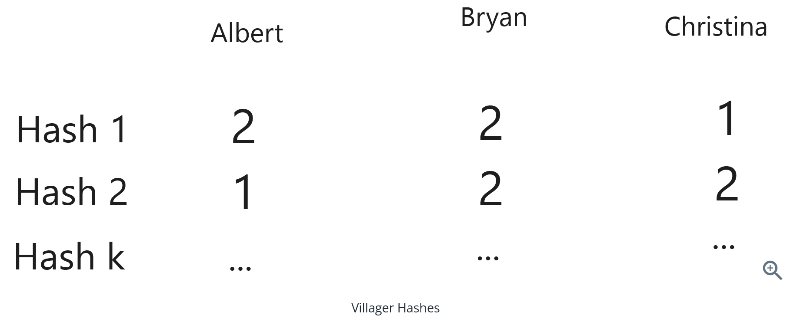
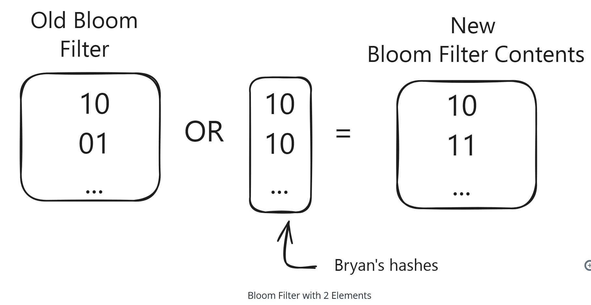
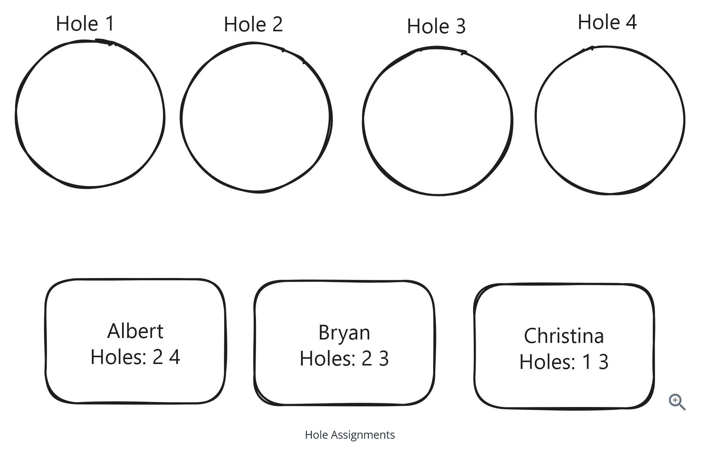
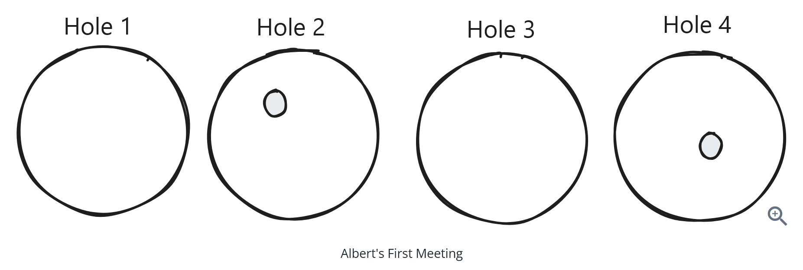
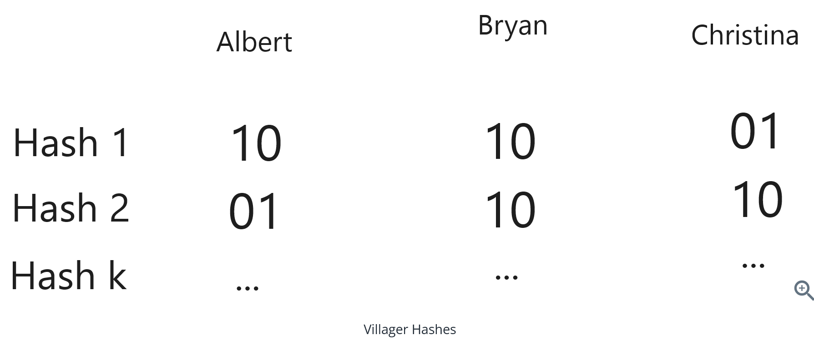
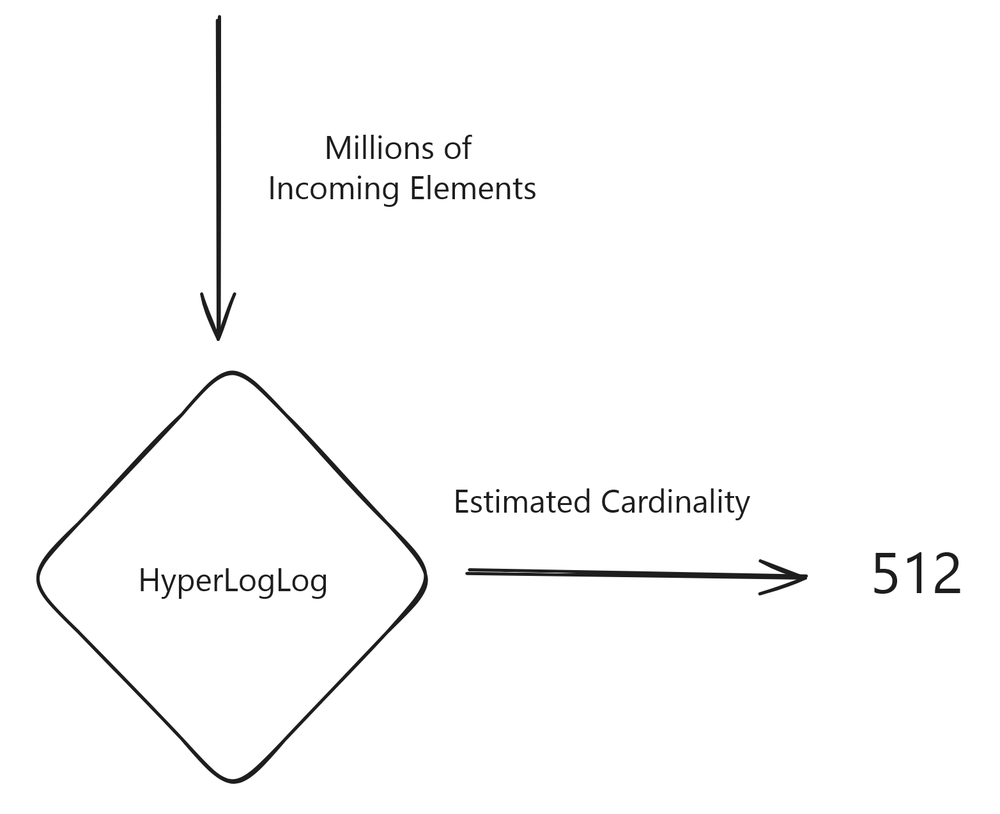

[video](https://www.youtube.com/watch?v=IgyU0iFIoqM)

# Question 1 of 15

###### What is the primary advantage of probabilistic data structures over traditional data structures in big data systems?

1

They are faster to implement

2

They dramatically reduce memory usage while accepting approximate results

3

They work better with distributed systems

4

They provide exact results

Correct!

###### Probabilistic data structures trade accuracy for significant memory savings, making them ideal for big data scenarios where exact precision may not be required but space constraints are critical.

# Question 2 of 15

###### What can a Bloom Filter definitively tell you about an element?

1

The exact count of an element

2

The position of an element in the set

3

Whether an element is definitely NOT in the set

4

Whether an element is definitely in the set

Incorrect.

###### Bloom filters can definitively prove an element is NOT in the set (no false negatives), but can only suggest an element MIGHT be in the set due to possible false positives from hash collisions.

# Question 3 of 15

###### Standard Bloom Filters support removing elements from the set.

1

True

2

False

Correct!

###### Standard Bloom Filters do not support element removal because clearing bits could affect other elements that hash to the same positions. Once a bit is set, it stays set.

# Question 4 of 15

###### In a Bloom Filter, what happens as more elements are added to the filter?

1

The false positive rate increases

2

The hash functions change

3

The filter becomes more accurate

4

The filter automatically expands

Correct!

###### As more elements are added, more bits get set to 1, increasing the chance that random queries will find all their required bits set, leading to higher false positive rates.

# Question 5 of 15

###### What does Count-Min Sketch provide as output when querying for an element?

1

The exact count of occurrences

2

Whether the element exists or not

3

An upper bound estimate of occurrences

4

A lower bound estimate of occurrences

Correct!

###### Count-Min Sketch provides an upper bound on the count by taking the minimum across all hash buckets for an element. Due to collisions, this estimate is never lower than the true count.

# Question 6 of 15

###### Count-Min Sketch can tell you which elements are present in the data stream without prior knowledge of the element keys.

1

True

2

False

Incorrect.

###### Count-Min Sketch requires you to know which elements to query for. It cannot enumerate or discover which elements exist in the data stream - you must provide the key to get its count estimate.

# Question 7 of 15

###### What is the primary purpose of HyperLogLog?

1

Checking set membership

2

Estimating the number of unique elements (cardinality)

3

Storing large datasets

4

Counting exact occurrences of elements

Correct!

###### HyperLogLog is designed specifically for cardinality estimation - approximating how many unique/distinct elements are in a dataset, which is useful for metrics like unique visitors or distinct users.

# Question 8 of 15

###### HyperLogLog achieves its estimates by analyzing what aspect of hashed values?

1

The longest streak of leading zeros in binary representation

2

The frequency of each hash value

3

The distribution of hash buckets

4

The total sum of hash values

Correct!

###### HyperLogLog counts the maximum number of leading zeros seen in hash values. Rare patterns (like many leading zeros) suggest a larger dataset, similar to how rare coin flip patterns suggest more total flips.

# Question 9 of 15

For storing 1 billion elements with 1% false positive rate, a Bloom Filter requires approximately the same memory as a well-optimized hash table.
1
True

2
False

Incorrect.

A Bloom Filter would need about 1GB while a hash table would need about 5GB for this scenario - the Bloom Filter provides roughly 80% memory savings, not the same amount.

# Question 10 of 15

###### Which data structure would be most appropriate for implementing a cache that needs to track access frequency for LFU (Least Frequently Used) eviction?

1

Bloom Filter

2

Standard Hash Table

3

Count-Min Sketch

4

HyperLogLog

Correct!

###### Count-Min Sketch is ideal for tracking access frequencies when you have many cache keys. It provides upper-bound estimates of access counts while using much less memory than tracking exact counts.

# Question 11 of 15

###### In a web crawling system, what would be the best use case for a Bloom Filter?

1

Tracking how many times each URL was visited

2

Storing the content of crawled pages

3

Counting unique domains discovered

4

Checking if a URL has likely been crawled before

Correct!

###### Bloom Filters excel at membership testing. In web crawling, you can use them to quickly check if a URL has probably been seen before, avoiding redundant crawling while using minimal memory.

# Question 12 of 15

###### HyperLogLog can provide accurate cardinality estimates using just a few kilobytes of memory even for datasets with billions of unique elements.

1

True

2

False

Correct!

###### HyperLogLog is remarkably space-efficient: just 1.5KB can provide ~2% error for billions of items, and 6KB provides ~1.2% error. This makes it extremely practical for large-scale cardinality estimation.

# Question 13 of 15

###### When should you NOT use these probabilistic data structures?

1

When you need exact results and have sufficient memory

2

When building analytics systems

3

When implementing caching systems

4

When dealing with billions of items

Correct!

###### If you require exact results and have sufficient memory for traditional data structures, probabilistic structures add unnecessary complexity. Use them only when space constraints make approximate results worthwhile.

# Question 14 of 15

###### For tracking Daily Active Users (DAU) across millions of users, which data structure would be most appropriate?

1

Count-Min Sketch

2

HyperLogLog

3

Bloom Filter

4

Binary Search Tree

Incorrect.

###### DAU requires counting unique users, which is a cardinality estimation problem. HyperLogLog is specifically designed for this use case and can efficiently estimate unique user counts with minimal memory.

# Question 15 of 15

###### The accuracy vs memory tradeoff in these probabilistic data structures means you must choose very large data structures to get reasonable accuracy.

1

True

2

False

Incorrect.

###### These data structures are remarkably efficient. Small increases in memory yield significant accuracy improvements. For example, HyperLogLog achieves great accuracy with just kilobytes, and Bloom Filters provide substantial space savings with acceptable error rates.