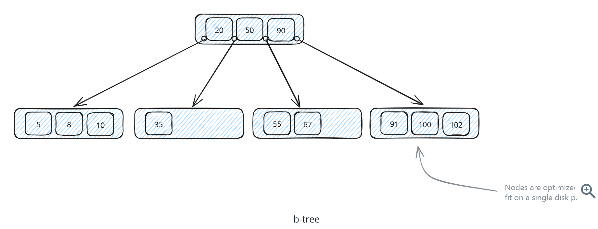
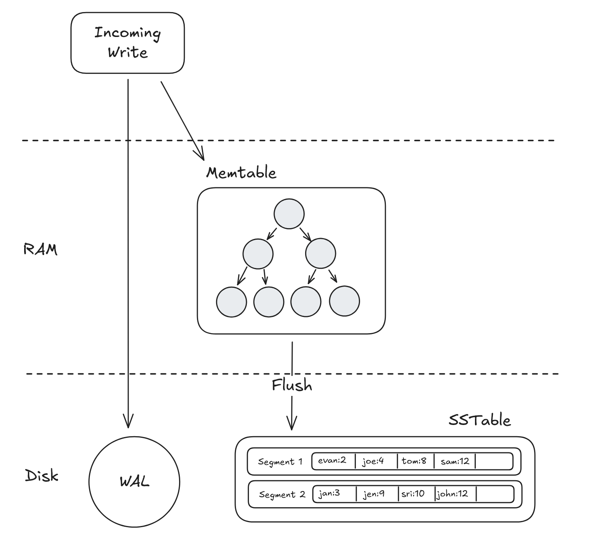
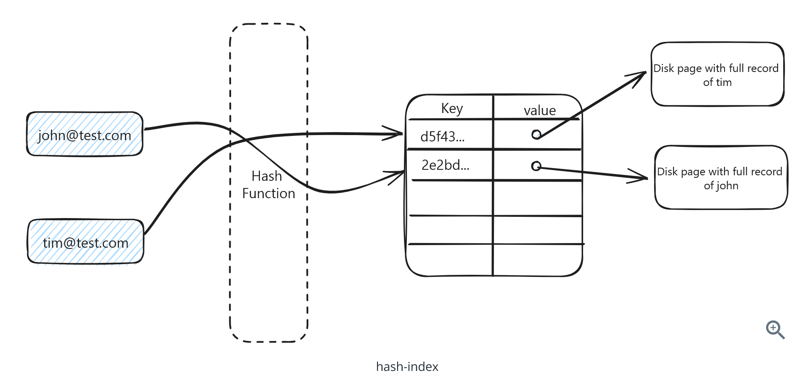
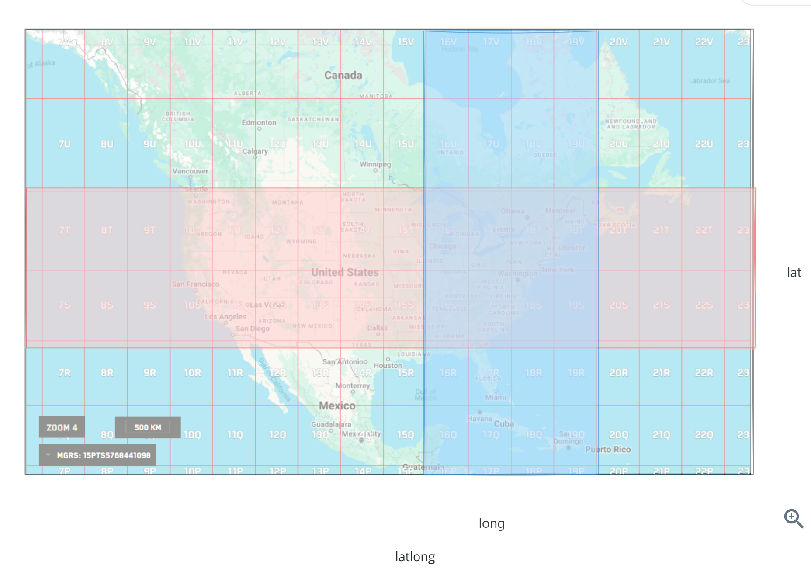
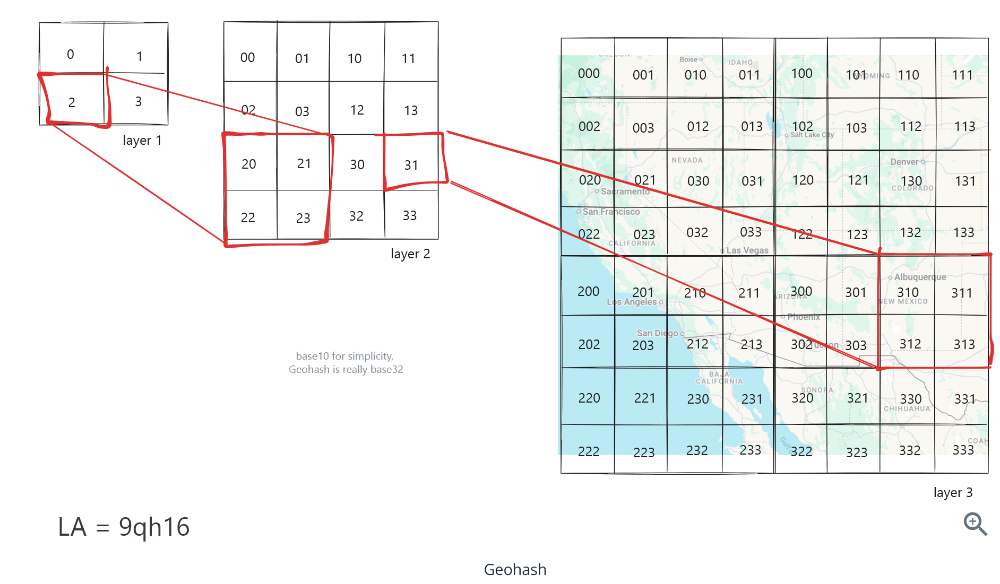
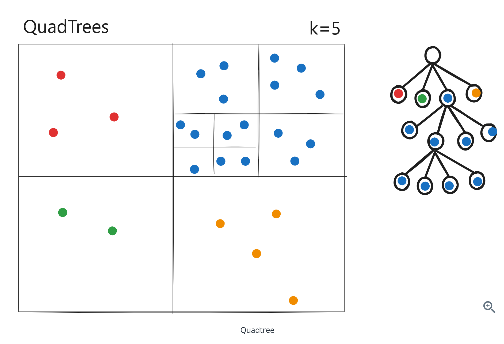
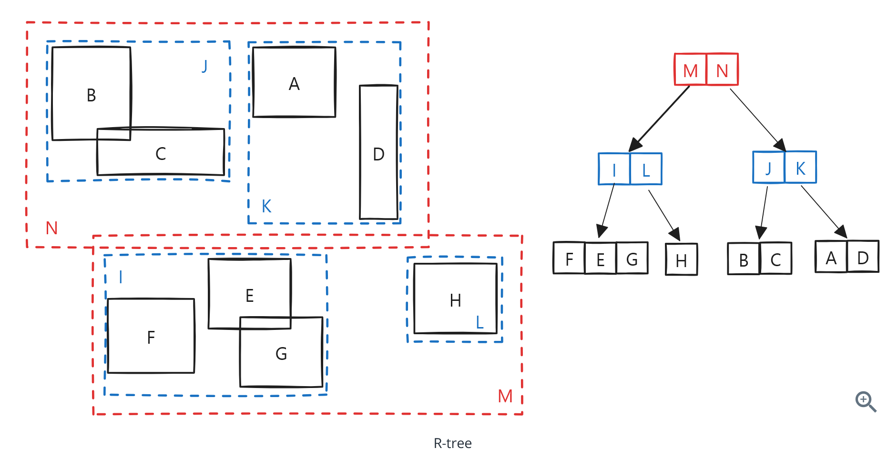
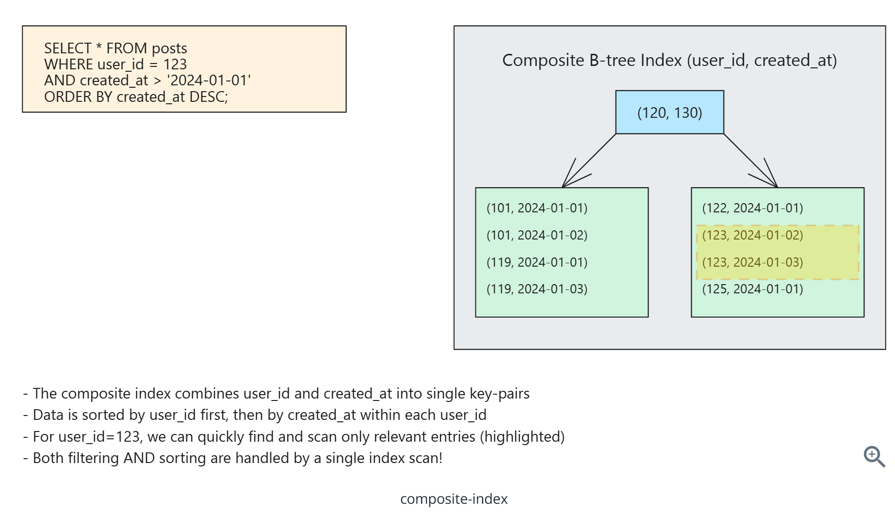
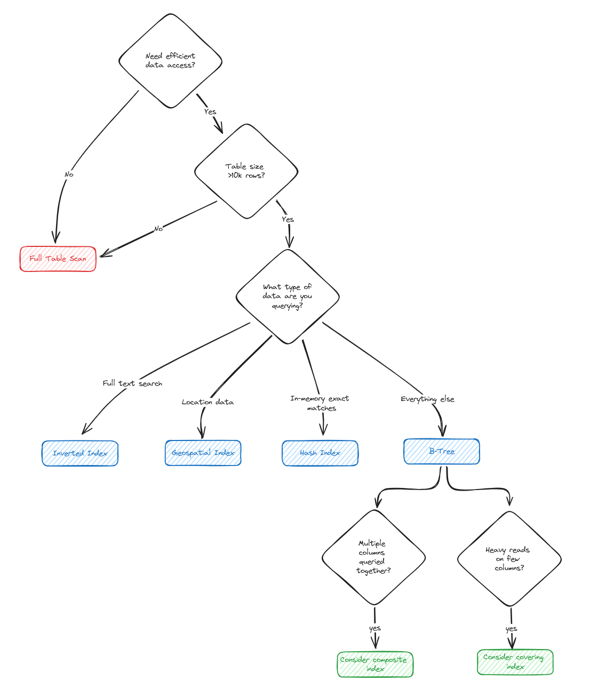

###### Video
https://www.youtube.com/watch?v=BHCSL_ZifI0

# Question 1 of 15

###### Without indexes, databases must scan through every row sequentially to find matching records.

1

True

2

False

Correct!

###### Without indexes, databases perform full table scans, reading every page from disk and checking each row for matches. This is like searching through every page of a book to find a specific word instead of using the table of contents.

# Question 2 of 15

###### What is the main trade-off when adding indexes to a database table?

1

Slower reads but faster writes

2

Higher CPU usage but lower memory usage

3

Faster reads but slower writes

4

Better compression but worse security

Correct!

###### Indexes speed up read queries by providing efficient lookup paths, but they slow down writes because every insert, update, or delete must also update all relevant indexes. Each index requires additional storage and maintenance overhead.

# Question 3 of 15

###### Why are B-trees the most common type of database index?

1

They work only with numeric data

2

They're fastest for exact matches only

3

They handle both equality and range queries efficiently

4

They use the least disk space

Correct!

###### B-trees maintain sorted order and balanced structure, making them efficient for both exact matches (WHERE id = 123) and range queries (WHERE age BETWEEN 25 AND 35). They also support ORDER BY operations naturally since data is already sorted.

# Question 4 of 15

###### LSM trees are optimized for write-heavy workloads at the expense of read performance.

1

True

2

False

Correct!

###### LSM trees batch writes in memory and flush them sequentially to disk, making writes very fast. However, reads must check multiple locations (memtable, immutable memtables, and multiple SSTables), making them slower than B-tree reads.

# Question 5 of 15

###### Which optimization technique do LSM trees use to improve read performance?

1

Caching all data in memory

2

Using hash indexes instead

3

Bloom filters to skip irrelevant files

4

Compressing all data

Correct!

###### Bloom filters are probabilistic data structures that can quickly determine if a key is definitely NOT in an SSTable, allowing LSM trees to skip checking most files during reads. This significantly reduces the number of disk reads required.

# Question 6 of 15

###### Hash indexes can efficiently handle range queries like 'WHERE age BETWEEN 25 AND 35'.

1

True

2

False

Correct!

###### Hash indexes scatter similar values across different buckets intentionally, making them excellent for exact matches but useless for range queries. Only B-trees and similar ordered structures can efficiently handle range queries.

# Question 7 of 15

###### Why don't traditional B-tree indexes work well for geospatial queries?

1

They treat latitude and longitude as independent dimensions

2

They can't store decimal numbers

3

They use too much memory

4

They're too slow for any spatial data

Correct!

###### B-trees on latitude and longitude create two separate 1D indexes, but proximity searches need to understand 2D relationships. A query for 'nearby restaurants' becomes inefficient because you can't easily combine separate latitude and longitude ranges to find points within a circular radius.

# Question 8 of 15

###### What is the key advantage of geohash for spatial indexing?

1

It works only with GPS coordinates

2

It converts 2D coordinates into 1D strings that preserve proximity

3

It uses less storage than other methods

4

It's faster than all other spatial indexes

Correct!

###### Geohash converts latitude/longitude into strings where nearby locations share similar prefixes (like 'dr5ru' for the same city block). This allows using regular B-tree indexes on the geohash strings for efficient proximity searches.

# Question 9 of 15

###### R-trees are more flexible than quadtrees because they use overlapping rectangles instead of fixed grid divisions.

1

True

2

False

Correct!

###### R-trees adapt their bounding rectangles to actual data distribution and can overlap, while quadtrees rigidly divide space into equal quadrants. This flexibility allows R-trees to efficiently index both points and complex shapes in the same structure.

# Question 10 of 15

###### When would you use an inverted index instead of a B-tree?

1

For storing user passwords

2

For full-text search within document content

3

For sorting text alphabetically

4

For exact string matches

Correct!

###### Inverted indexes map words to documents that contain them, making them perfect for full-text search. B-trees can't efficiently handle queries like 'find documents containing the word database' because they can't do middle-of-string pattern matching.

# Question 11 of 15

###### In a composite index on (user\_id, created\_at), which query can use the index most efficiently?

1

WHERE created\_at > '2024-01-01' AND user\_id = 123

2

WHERE user\_id = 123

3

WHERE user\_id = 123 AND created\_at > '2024-01-01'

4

WHERE created\_at > '2024-01-01'

Correct!

###### Composite indexes can only be used efficiently for prefixes of the column list. Since user\_id comes first, the index works best when filtering on user\_id first, then optionally on created\_at. Queries filtering only on created\_at cannot use this index efficiently.

# Question 12 of 15

###### The order of columns in a composite index doesn't matter for query performance.

1

True

2

False

Correct!

###### Column order is crucial in composite indexes. An index on (user\_id, created\_at) can efficiently handle queries filtering on user\_id alone or both columns, but cannot efficiently handle queries filtering only on created\_at. The database can only use the index for left-to-right prefixes.

# Question 13 of 15

###### What is the main benefit of a covering index?

1

It's faster to build than regular indexes

2

It takes less storage space

3

It automatically updates when data changes

4

It includes all columns needed by a query in the index itself

Correct!

###### A covering index includes not just the columns being filtered on, but also the columns being selected. This allows the database to return results entirely from the index without additional table lookups, significantly improving performance for queries that only need a subset of columns.

# Question 14 of 15

###### Cassandra and RocksDB use LSM trees because they handle write-heavy workloads better than B-trees.

1

True

2

False

Correct!

###### Systems like Cassandra (Netflix's viewing events) and RocksDB (Facebook's social interactions) process millions of writes per second. LSM trees excel at this by batching writes in memory and flushing them sequentially, converting many random writes into fewer large sequential writes.

# Question 15 of 15

###### For a social media feed query filtering by user\_id and ordering by created\_at, what's the best index strategy?

1

No index needed

2

Composite index (user\_id, created\_at)

3

Separate indexes on user\_id and created\_at

4

Hash index on user\_id only

Correct!

###### A composite index (user\_id, created\_at) handles both the WHERE clause and ORDER BY in a single index scan. The database can find the user's posts and retrieve them in sorted order without additional sorting, making it much more efficient than separate indexes.
