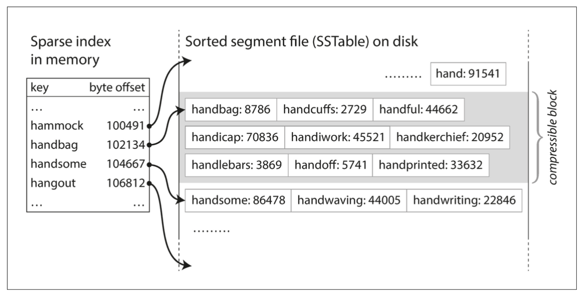
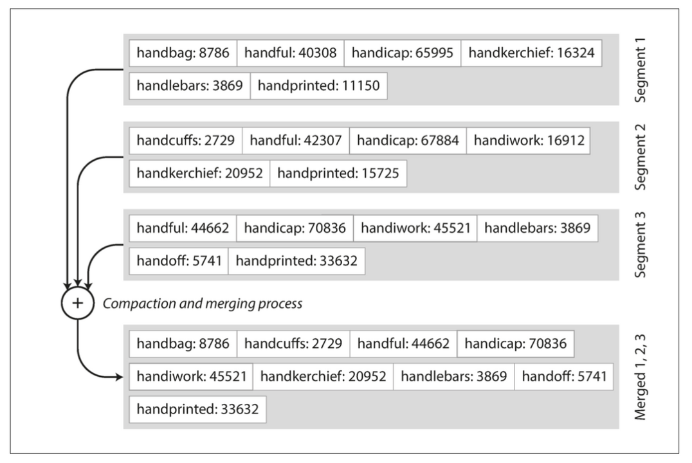

# Log Structured Merge Tree
## In memory tree
## In memory index to segments (key:offset)
## Bloom filter per segment
## Immutable Segments
## Compaction
## Speed

For LSM isn't there a linear time search through all the segment's bloom filters?

Yes, for a point lookup in an LSM tree, the search process generally involves a linear-time traversal through the Bloom filters of the on-disk segments. However, this isn't a performance problem because Bloom filter lookups are extremely fast. 🏎️

Here's a breakdown of how it works:

### The LSM Tree Search Process

1. **In-Memory Search**: A query for a specific key first checks the **memtable**, which is an in-memory, sorted data structure. Since it's in memory, this is very fast. If the key is found, the search is over. ⚡️
    
2. **On-Disk Search**: If the key isn't in the memtable, the system then starts searching the **SSTables** (Sorted String Tables) on disk, typically from the newest to the oldest. This is where Bloom filters come into play.
    
    - **Bloom Filter Check**: Before a disk I/O operation is performed on an SSTable, its associated **Bloom filter** is checked. A Bloom filter is a probabilistic data structure that can tell you with 100% certainty if a key is _not_ in a given SSTable. It can, however, produce a "false positive," meaning it might say a key _could_ be present when it's not.
        
    - **Avoiding Disk I/O**: If the Bloom filter says the key is **definitely not** in the SSTable, the system skips that file entirely and moves on to the next. This is the crucial optimization. It prevents unnecessary, slow disk reads.
        
    - **Proceeding with I/O**: If the Bloom filter indicates the key **might** be present (either it is or it's a false positive), the system then performs the more expensive disk I/O to check the SSTable's index and data.
        
### Why Linear Scan Isn't Slow

While it's true that the system might have to check a Bloom filter for every on-disk segment (SSTable) until the key is found or all segments are checked, this process is still extremely fast for these reasons:

- **In-Memory Operation**: The Bloom filters themselves are typically held in memory. Checking a Bloom filter only requires a few hash function calculations and memory lookups, which are constant-time operations (O(k) where k is the number of hash functions). This is orders of magnitude faster than a disk seek. 🧠
    
- **Reduced Read Amplification**: The main goal of Bloom filters in this context isn't to make the lookups on the filters themselves faster, but to drastically reduce the number of costly **disk I/O operations** (read amplification). By eliminating disk reads for keys that don't exist, the overall search performance for non-existent keys is vastly improved. 🚀
    

Essentially, the "linear time" search is only a linear scan of Bloom filters in memory, which is a minor, negligible cost compared to a single disk access. This clever trade-off is what makes LSM trees so efficient for write-heavy workloads, even with the potential for multiple on-disk segments.

Sources

