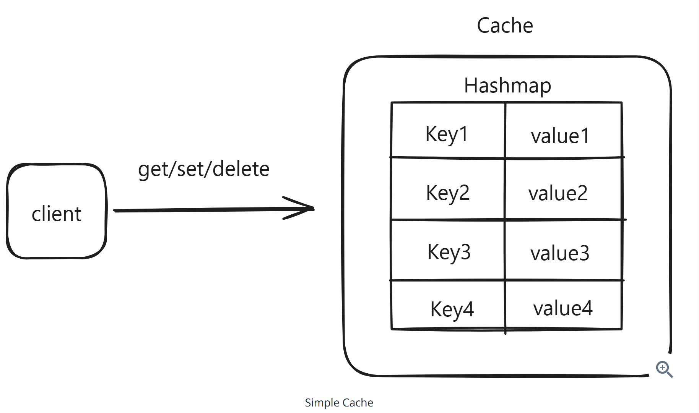
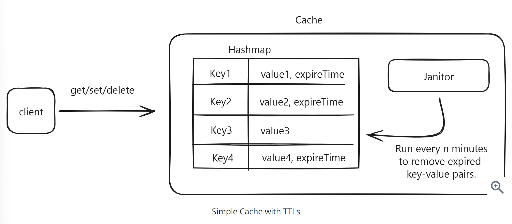
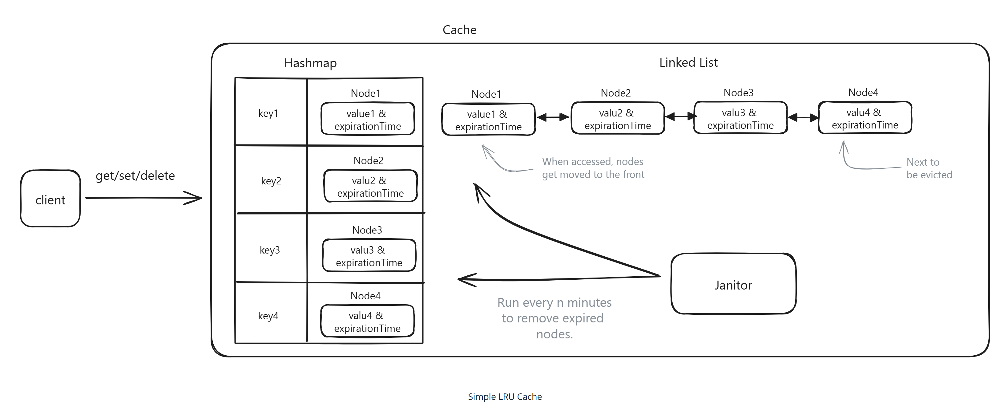
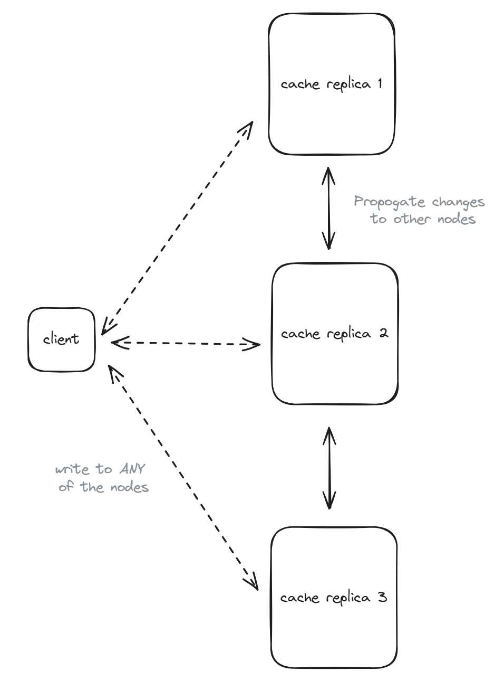
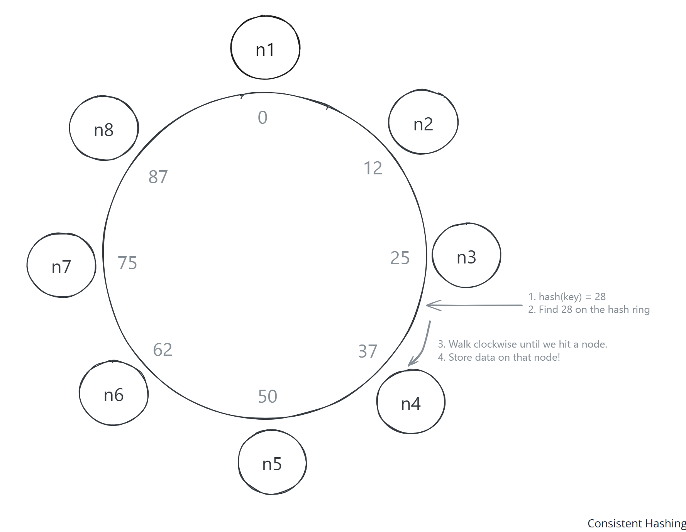
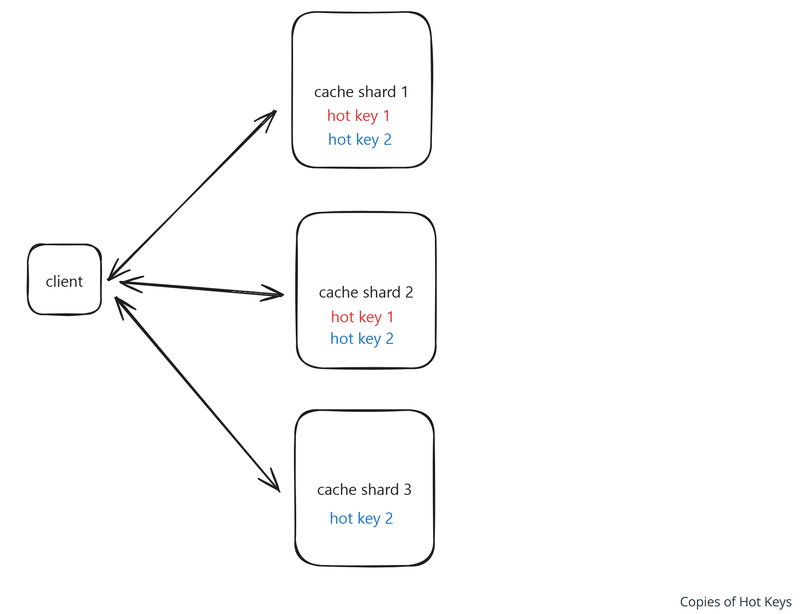
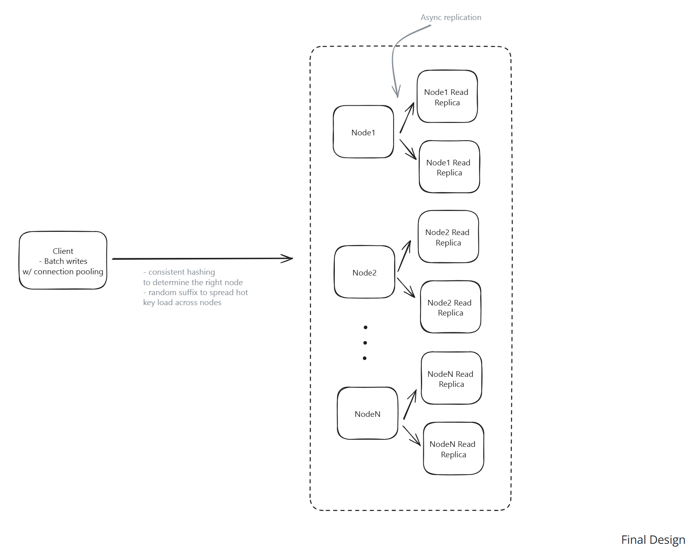

# Question 1 of 15

###### Hash tables provide O(1) average time complexity for lookup operations.

1

True

2

False

Correct!

###### Hash tables achieve O(1) average time complexity for lookups through direct key-to-address mapping. While worst-case performance can degrade to O(n) with poor hash functions or excessive collisions, good hash functions distribute keys evenly across buckets, maintaining constant-time access.

# Question 2 of 15

###### Which data structure combination enables efficient LRU cache implementation?

1

Hash table and doubly linked list

2

Hash table and array

3

Array and stack

4

Binary tree and queue

Correct!

###### Hash tables provide O(1) lookups while doubly linked lists enable O(1) insertion, deletion, and reordering of elements. Together, they support efficient access to any cache item and maintain perfect ordering for LRU eviction without performance degradation.

# Question 3 of 15

###### All of the following improve system performance through TTL mechanisms EXCEPT:

1

Automatic cleanup of stale data

2

Guaranteed data consistency

3

Reduced memory pressure

4

Prevention of indefinite growth

Correct!

###### TTL mechanisms automatically expire and clean up data, reduce memory usage, and prevent unbounded growth. However, they do not guarantee consistency - expired data may still be briefly accessible, and distributed systems can have clock skew affecting expiration timing.

# Question 4 of 15

###### In-memory storage provides faster access than disk-based storage systems.

1

True

2

False

Correct!

###### In-memory storage eliminates disk I/O latency by keeping data in RAM, providing microsecond access times versus millisecond disk access. This fundamental trade-off exchanges durability for speed, making in-memory systems ideal for high-frequency operations.

# Question 5 of 15

###### Which approach BEST handles hot keys receiving excessive read traffic?

1

Create copies of hot keys across nodes

2

Implement stronger consistency

3

Increase hardware on all nodes

4

Switch to synchronous replication

Correct!

###### Creating copies of hot keys distributes read load across multiple nodes without the overhead of replicating entire datasets. This targeted approach scales read capacity for specific keys while minimizing resource waste and operational complexity.

# Question 6 of 15

###### Consistent hashing minimizes key remapping when nodes are added or removed.

1

True

2

False

Correct!

###### Consistent hashing arranges keys and nodes on a circular space, ensuring only keys between the new/removed node and its successor need remapping. This contrasts with simple modulo hashing where adding/removing nodes requires remapping most keys in the system.

# Question 7 of 15

###### When prioritizing availability over consistency in distributed caches, which replication approach works best?

1

Synchronous replication to all replicas

2

Consensus-based replication

3

No replication for simplicity

4

Asynchronous replication from primary

Correct!

###### Asynchronous replication allows writes to complete immediately on the primary without waiting for replica acknowledgment, maximizing availability. While this introduces temporary inconsistency, it aligns with typical cache requirements where availability matters more than perfect consistency.

# Question 8 of 15

###### Connection pooling reduces network latency by eliminating connection establishment overhead.

1

True

2

False

Correct!

###### Connection pooling maintains persistent connections between clients and servers, eliminating the TCP handshake overhead for each request. This reduces both average latency and tail latencies, especially important for high-frequency operations typical in distributed caches.

# Question 9 of 15

###### What does write batching accomplish in high-throughput systems?

1

Improves read consistency

2

Guarantees atomic operations

3

Reduces individual operation overhead

4

Eliminates network partitions

Correct!

###### Write batching combines multiple operations into single requests, reducing per-operation network overhead, connection usage, and processing costs. This technique significantly improves throughput for systems handling many small operations, though it may slightly increase latency.

# Question 10 of 15

###### What happens when a cache node fails in an asynchronously replicated system?

1

All nodes must restart

2

System becomes strongly consistent

3

All writes immediately fail

4

Recent writes may be lost but reads continue

Incorrect.

###### In asynchronous replication, recent writes that haven't propagated to replicas are lost when the primary fails. However, reads can continue from replicas, maintaining availability. This trade-off prioritizes system availability over perfect data durability.

# Question 11 of 15

###### Distributed cache eviction policies must consider memory constraints to prevent system overload and maintain performance.

1

True

2

False

Correct!

###### Eviction policies like LRU are essential in memory-constrained systems to remove less useful data when capacity limits are reached. Without proper eviction, caches would consume all available memory, leading to system failures or severe performance degradation.

# Question 12 of 15

###### For a viral content key receiving millions of reads per second, which strategy provides the most effective load distribution?

1

Creating multiple copies with random suffix selection

2

Implementing write-through caching

3

Vertical scaling of the primary node

4

Using stronger consistency guarantees

Correct!

###### Creating multiple copies of hot keys with randomized access distributes read load across many nodes efficiently. Clients randomly select from available copies, spreading millions of requests across the cluster rather than overwhelming a single node with all traffic.

# Question 13 of 15

###### Which approach BEST handles scaling distributed cache storage to multiple terabytes?

1

In-memory compression only

2

Single large-memory nodes

3

Vertical scaling with SSDs

4

Horizontal sharding across many nodes

Correct!

###### Horizontal sharding distributes data across many commodity nodes, providing cost-effective scaling and fault isolation. This approach allows systems to grow beyond single-node memory limits while maintaining performance through parallel processing and load distribution.

# Question 14 of 15

###### Asynchronous replication improves write availability compared to synchronous replication approaches.

1

True

2

False

Correct!

###### Asynchronous replication allows writes to complete immediately without waiting for replica confirmation, maintaining availability even when replicas are slow or unreachable. Synchronous replication blocks writes until all replicas confirm, reducing availability during network issues.

# Question 15 of 15

###### When should background cleanup processes run to optimize system performance?

1

Only when cache is completely full

2

During low-traffic periods or based on memory pressure

3

Continuously at maximum frequency

4

During peak traffic hours

Correct!

###### Background cleanup should run during low-traffic periods to avoid competing with user requests for CPU and memory resources. It can also be triggered by memory pressure thresholds, balancing cleanup efficiency with system responsiveness to user traffic.