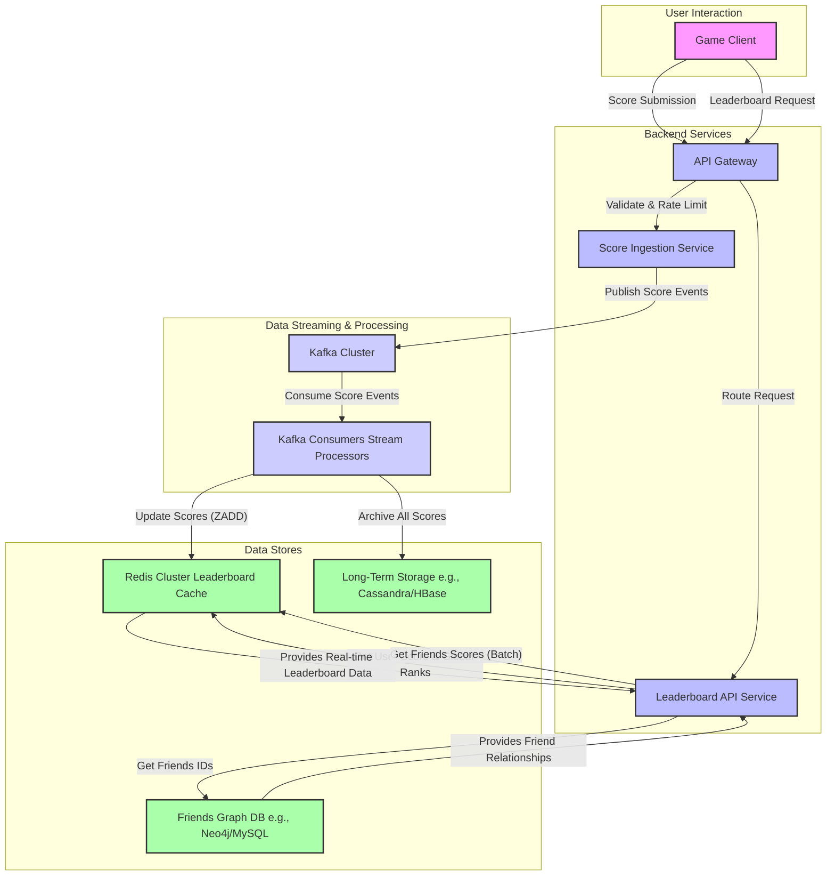

```mermaid
graph TD
    subgraph User Interaction
        GC[Game Client]
    end

    subgraph Backend Services
        AG[API Gateway]
        SIS[Score Ingestion Service]
        LAS[Leaderboard API Service]
    end

    subgraph Data Streaming & Processing
        KC[Kafka Cluster]
        KCP[Kafka Consumers Stream Processors]
    end

    subgraph Data Stores
        RC[Redis Cluster Leaderboard Cache]
        FGDB[Friends Graph DB e.g., Neo4j/MySQL]
        LTS[Long-Term Storage e.g., Cassandra/HBase]
    end

    GC -- Score Submission --> AG
    AG -- Validate & Rate Limit --> SIS
    SIS -- Publish Score Events --> KC
    KC -- Consume Score Events --> KCP

    KCP -- Update Scores (ZADD) --> RC
    KCP -- Archive All Scores --> LTS

    GC -- Leaderboard Request --> AG
    AG -- Route Request --> LAS
    LAS -- Get User Score & Global Ranks --> RC
    LAS -- Get Friends IDs --> FGDB
    LAS -- Get Friends Scores (Batch) --> RC

    RC -- Provides Real-time Leaderboard Data --> LAS
    FGDB -- Provides Friend Relationships --> LAS

    style GC fill:#f9f,stroke:#333,stroke-width:2px
    style AG fill:#bbf,stroke:#333,stroke-width:2px
    style SIS fill:#bbf,stroke:#333,stroke-width:2px
    style LAS fill:#bbf,stroke:#333,stroke-width:2px
    style KC fill:#ccf,stroke:#333,stroke-width:2px
    style KCP fill:#ccf,stroke:#333,stroke-width:2px
    style RC fill:#afa,stroke:#333,stroke-width:2px
    style FGDB fill:#afa,stroke:#333,stroke-width:2px
    style LTS fill:#afa,stroke:#333,stroke-width:2px
```