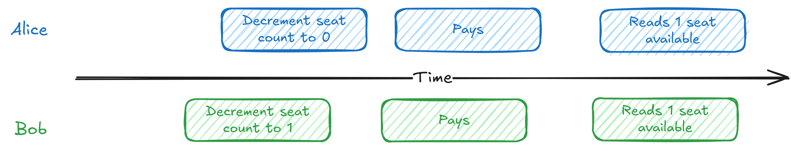

# Question 1 of 15

###### What causes the classic concert ticket race condition problem?

1

Insufficient server capacity

2

Database connectivity issues

3

Reading and writing aren't atomic - both users read the same initial state

4

Network latency

Correct!

###### The race condition occurs because both users read '1 seat available' before either update takes effect, causing both to think they can purchase the seat.

# Question 2 of 15

###### What does atomicity guarantee in database transactions?

1

Data is automatically backed up

2

Multiple users can read the same data simultaneously

3

All operations in a transaction succeed or all fail together

4

Operations complete in the order they were written

Correct!

###### Atomicity means a group of operations either all succeed or all fail - there's no partial completion that could leave the system in an inconsistent state.

# Question 3 of 15

###### What does the SQL 'FOR UPDATE' clause accomplish?

1

Automatically retries failed updates

2

Acquires an exclusive lock on rows before reading them

3

Creates a backup before updating

4

Updates multiple rows at once

Correct!

###### FOR UPDATE acquires an exclusive lock on the selected rows, preventing other transactions from accessing them until the transaction completes.

# Question 4 of 15

###### Pessimistic locking assumes conflicts will happen and prevents them upfront.

1

True

2

False

Correct!

###### Pessimistic locking is 'pessimistic' about conflicts - it assumes they will occur and acquires locks to prevent them from happening.

# Question 5 of 15

###### Which isolation level provides the strongest consistency guarantees?

1

REPEATABLE READ

2

READ UNCOMMITTED

3

SERIALIZABLE

4

READ COMMITTED

Incorrect.

###### SERIALIZABLE is the strongest isolation level, making transactions appear to run one after another, which prevents race conditions but has performance costs.

# Question 6 of 15

###### How does optimistic concurrency control detect conflicts?

1

By using version numbers or checking expected values haven't changed

2

By using higher isolation levels

3

By retrying operations automatically

4

By acquiring locks before reading

Correct!

###### Optimistic concurrency control includes version numbers or expected values in updates, and detects conflicts when the current value doesn't match what was read initially.

# Question 7 of 15

###### Optimistic concurrency control performs better than pessimistic locking when conflicts are frequent.

1

True

2

False

Correct!

###### Optimistic concurrency control works best when conflicts are rare - frequent conflicts mean lots of retries, making pessimistic locking more efficient.

# Question 8 of 15

###### What is the main problem that two-phase commit (2PC) solves?

1

Load balancing between servers

2

Atomicity across multiple databases

3

Database backup coordination

4

Caching consistency

Correct!

###### Two-phase commit ensures that transactions spanning multiple databases either all commit or all abort, maintaining atomicity across distributed systems.

# Question 9 of 15

###### In two-phase commit, transactions can stay open across network calls.

1

True

2

False

Correct!

###### This is actually a dangerous aspect of 2PC - open transactions hold locks during network coordination, which can cause problems if the coordinator crashes.

# Question 10 of 15

###### How does the saga pattern differ from two-phase commit?

1

Sagas break operations into independent steps that can be compensated

2

Sagas use stronger consistency guarantees

3

Sagas only work with single databases

4

Sagas require fewer network calls

Correct!

###### Sagas break distributed operations into independent, committed steps with compensation logic, avoiding the long-running transactions that make 2PC fragile.

# Question 11 of 15

###### What is the standard solution for preventing deadlocks with pessimistic locking?

1

Set shorter lock timeouts

2

Always acquire locks in a consistent order

3

Use optimistic concurrency instead

4

Use higher isolation levels

Correct!

###### Ordered locking prevents circular wait conditions by ensuring all transactions acquire locks in the same deterministic order (e.g., by resource ID).

# Question 12 of 15

###### Which approach works best for handling the 'hot partition' problem where everyone wants the same resource?

1

Implement queue-based serialization

2

Increase server capacity

3

Add more database shards

4

Use read replicas

Incorrect.

###### Queue-based serialization eliminates contention by processing requests for hot resources sequentially through a dedicated queue and worker.

# Question 13 of 15

###### When should you choose pessimistic locking over optimistic concurrency control?

1

When conflicts are frequent and consistency is critical

2

When you need better performance

3

When conflicts are rare

4

When using distributed systems

Correct!

###### Pessimistic locking provides predictable performance and handles high contention scenarios better than optimistic approaches that require retries.

# Question 14 of 15

###### Distributed locks can improve user experience by creating reservation states that prevent contention.

1

True

2

False

Correct!

###### Reservation patterns (like Ticketmaster seat holds) use distributed locks to give users temporary exclusive access, preventing the bad UX of losing resources during checkout.

# Question 15 of 15

###### What is the main advantage of keeping contended data in a single database?

1

Easier to scale horizontally

2

Lower storage costs

3

Better performance

4

Simpler coordination with ACID guarantees

Correct!

###### Single database solutions can use simple pessimistic locking or optimistic concurrency with full ACID guarantees, avoiding the complexity of distributed coordination.