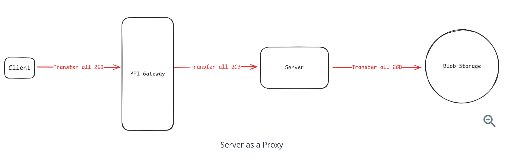
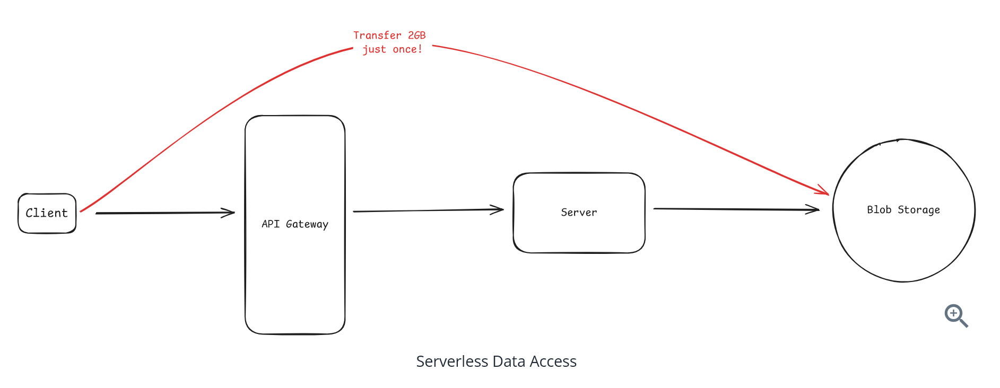
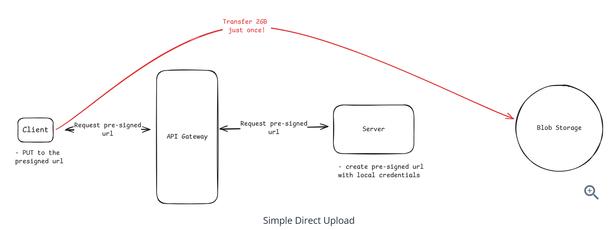
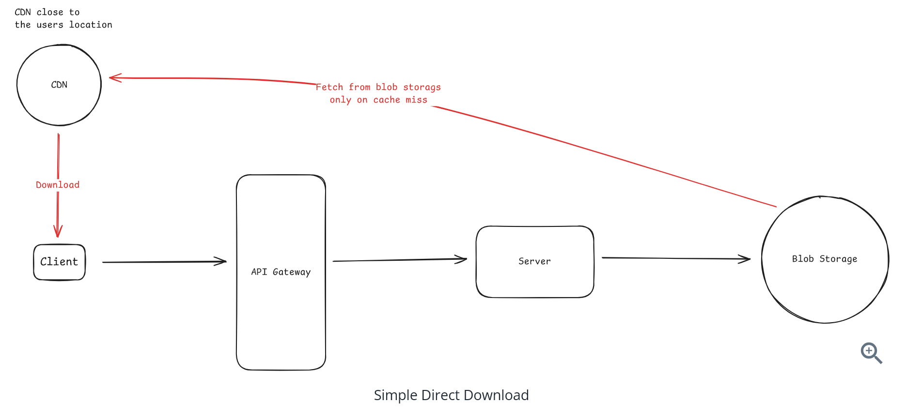
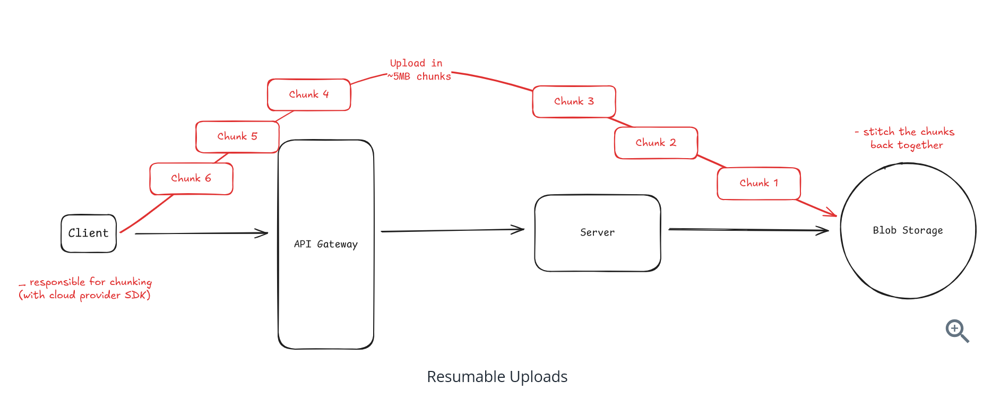
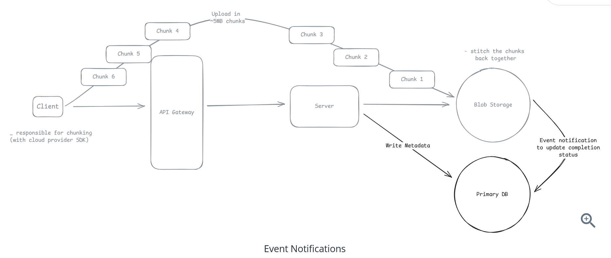
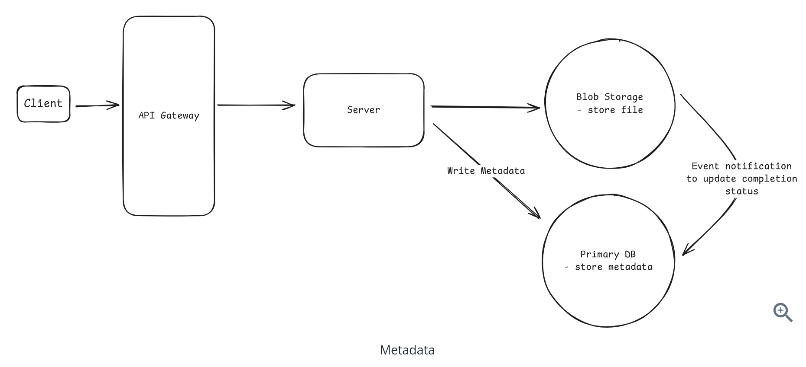

# Question 1 of 15

###### What is the primary problem with proxying large files through application servers?

1

Security vulnerabilities

2

Increased storage costs

3

Application servers become bottlenecks with no added value

4

Database performance degradation

Correct!

###### Application servers add latency and consume resources without adding value to the file transfer, creating unnecessary bottlenecks when files could go directly to blob storage.

# Question 2 of 15

###### What is a presigned URL?

1

A URL that compresses data during transfer

2

A temporary URL with embedded credentials for direct storage access

3

A URL that never expires

4

A URL that requires user authentication

Correct!

###### A presigned URL contains cryptographic signatures and expiry times that grant temporary, scoped access to storage without requiring the client to have cloud credentials.

# Question 3 of 15

###### Generating a presigned URL requires a network call to the blob storage service.

1

True

2

False

Incorrect.

###### Presigned URLs are generated entirely in your application's memory using your cloud credentials - no network call to storage is needed.

# Question 4 of 15

###### What should you include in presigned URLs to prevent abuse?

1

Database transaction ID

2

User's IP address

3

Content-length-range and content-type restrictions

4

CDN cache headers

Correct!

###### Restrictions like content-length-range and content-type are baked into the signature, preventing users from uploading unexpected file sizes or types.

# Question 5 of 15

###### When a 5GB upload fails at 99%, what feature prevents starting over from scratch?

1

Database transactions

2

Chunked/multipart uploads

3

CDN caching

4

Load balancing

Correct!

###### Chunked uploads (S3 multipart, GCS resumable, Azure block blobs) let you resume from failed parts rather than restarting the entire upload.

# Question 6 of 15

###### With chunked uploads, the storage service tracks which parts uploaded successfully.

1

True

2

False

Correct!

###### The storage service maintains state about completed parts using session IDs, allowing clients to query which parts need to be retried.

# Question 7 of 15

###### What is the main challenge with state synchronization in direct uploads?

1

Insufficient storage capacity

2

High network latency

3

Complex authentication requirements

4

Keeping database metadata in sync with blob storage files

Correct!

###### Since uploads bypass your servers, your database metadata can become out of sync with what actually exists in blob storage, requiring event notifications and reconciliation.

# Question 8 of 15

###### How do cloud storage services help with state synchronization?

1

Built-in caching

2

Event notifications when files are uploaded

3

Automatic database updates

4

Real-time replication

Correct!

###### Storage services publish events (S3 to SNS/SQS, GCS to Pub/Sub) when files are uploaded, letting your system update database status reliably.

# Question 9 of 15

###### CDN signatures are validated by the storage service using your cloud credentials.

1

True

2

False

Incorrect.

###### CDN signatures use public/private key cryptography and are validated by CDN edge servers, while storage signatures are validated by the storage service using your secret key.

# Question 10 of 15

###### At what file size should you typically consider using direct uploads instead of proxying through servers?

1

1GB

2

1MB

3

10MB

4

100MB

Incorrect.

###### Around 100MB is where the performance penalty of proxying becomes significant enough to justify the complexity of direct uploads.

# Question 11 of 15

###### After multipart upload completion, the individual chunks still exist as separate objects in storage.

1

True

2

False

Incorrect.

###### Once multipart upload completes, the storage service combines all parts into a single object - the individual chunks no longer exist from the storage perspective.

# Question 12 of 15

###### What is the recommended approach for storing file metadata?

1

Embedded in the file contents

2

As object tags in blob storage

3

In CDN headers

4

In a separate database table

Correct!

###### Rich metadata belongs in your database for efficient querying, with the storage key as the connection point between database records and blob storage objects.

# Question 13 of 15

###### When should you NOT use direct uploads in a system design?

1

Files larger than 1GB

2

Global user distribution

3

Need for real-time content validation during upload

4

High user concurrency

Correct!

###### If you need to validate or inspect file contents as they upload (compliance, security scanning), you must proxy through your servers to see the data.

# Question 14 of 15

###### Range requests enable resumable downloads for large files.

1

True

2

False

Correct!

###### HTTP range requests let clients download specific byte ranges, enabling resumable downloads when connections fail partway through large files.

# Question 15 of 15

###### What is the primary benefit of using CDNs for file downloads?

1

Better security

2

Automatic compression

3

Reduced storage costs

4

Geographic distribution and caching for faster access

Correct!

###### CDNs cache content at edge locations worldwide, reducing latency from hundreds of milliseconds to single digits for users accessing cached content.