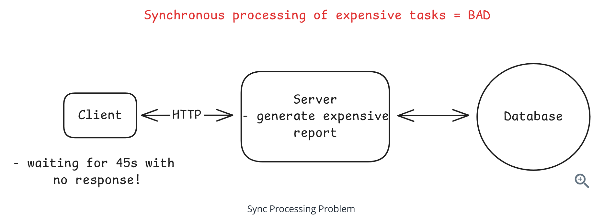
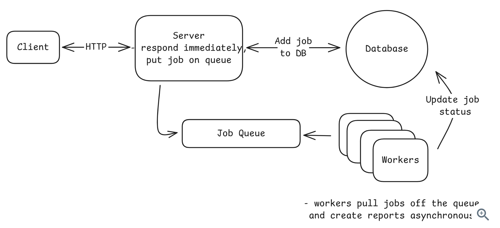
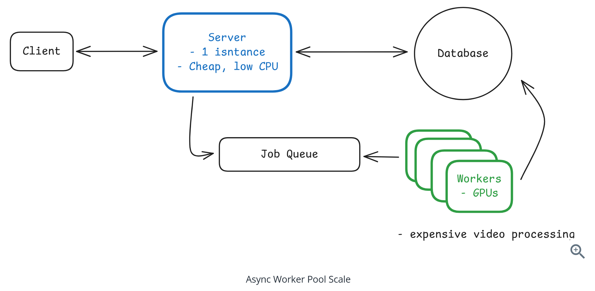
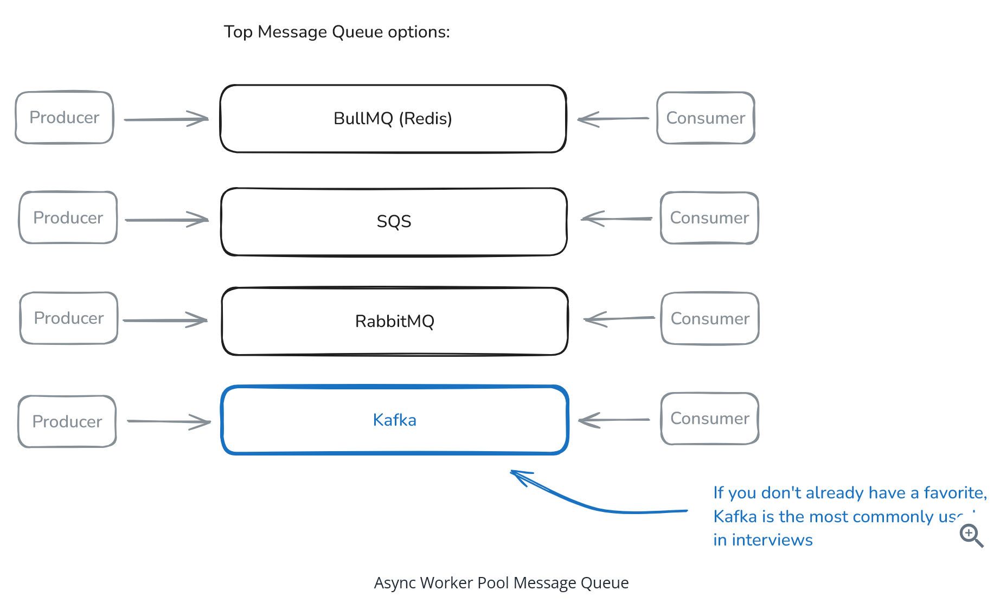
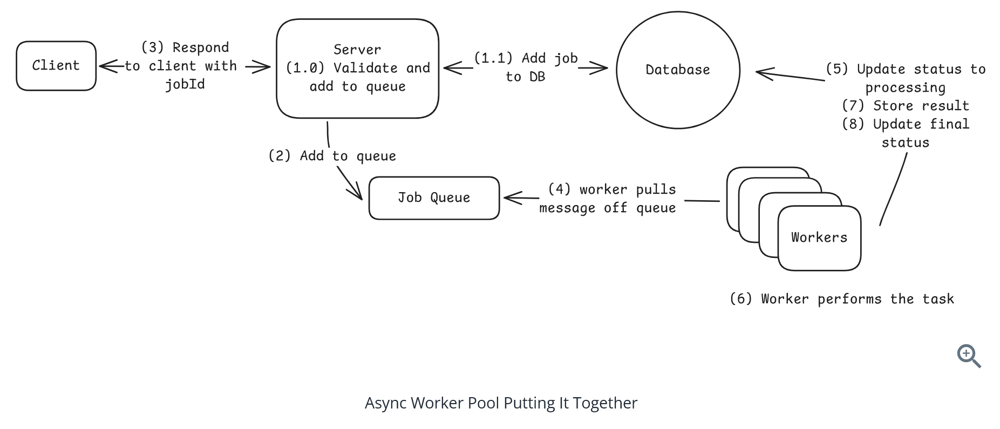
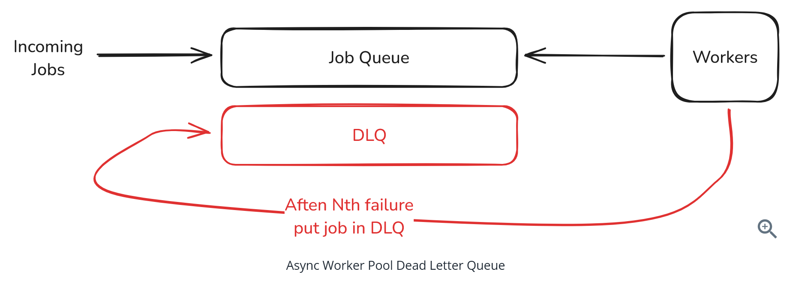
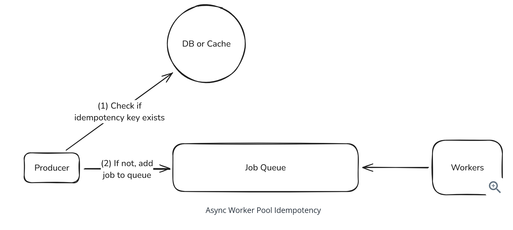
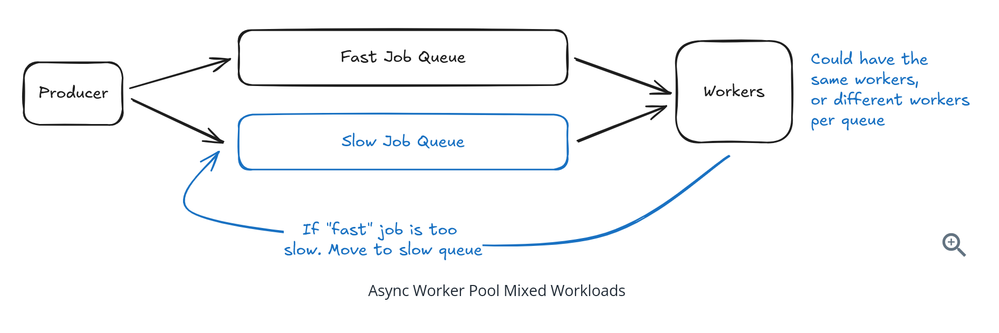
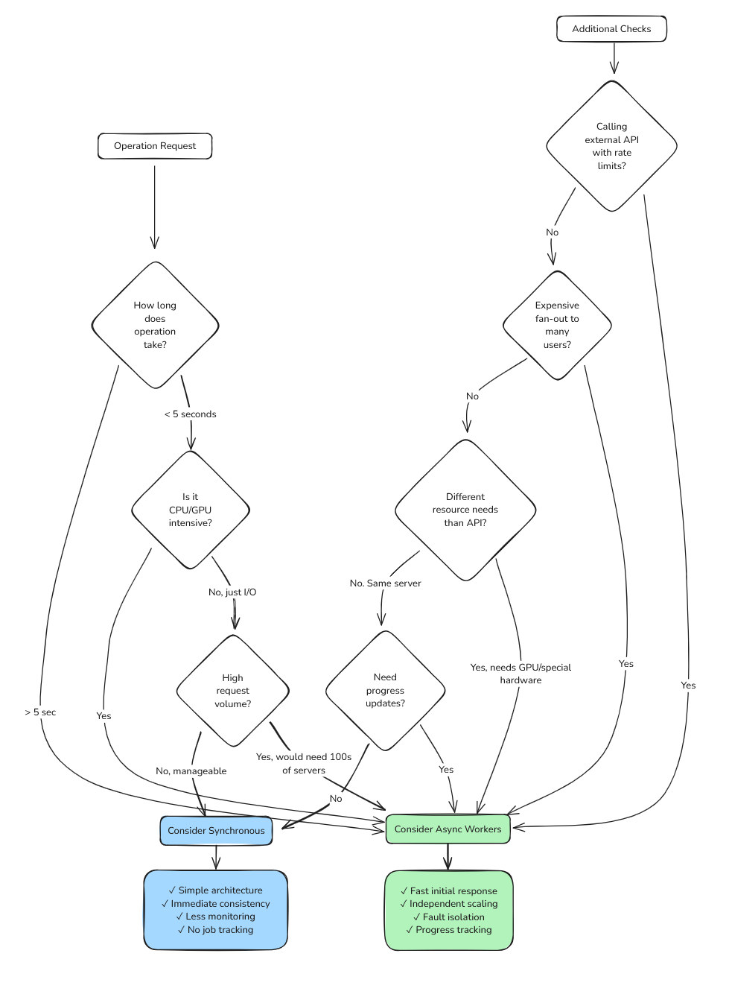
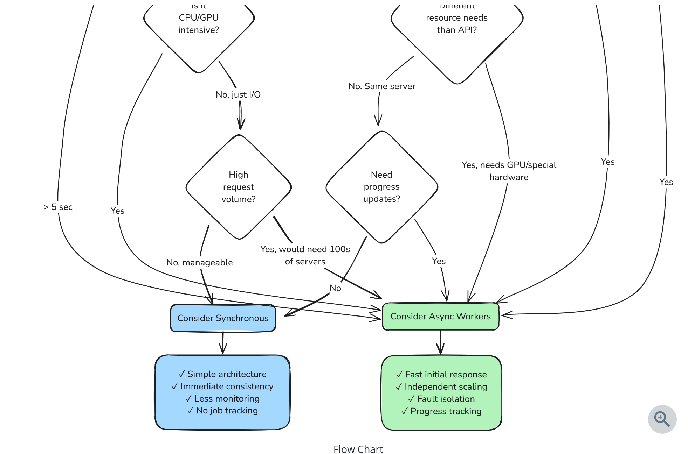
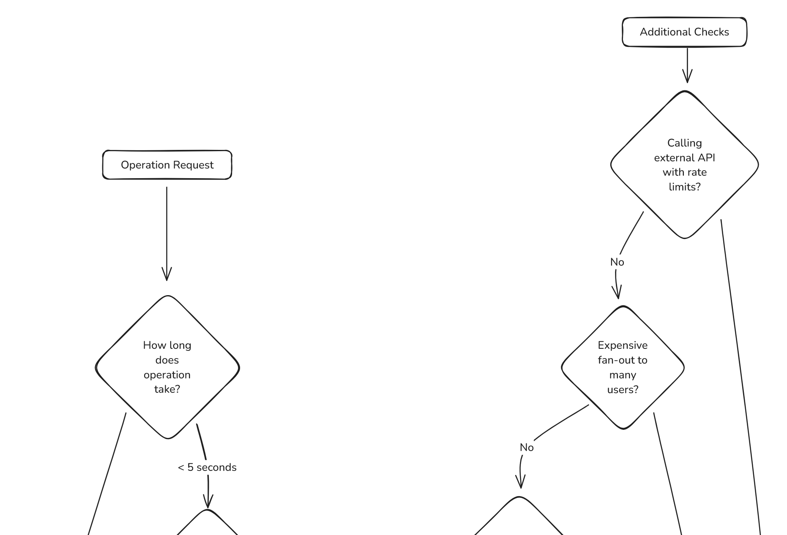

#  Question 1 of 15

###### What is the primary problem with processing a 45-second PDF generation synchronously?

1

Database connection limits

2

Users wait too long and tie up server threads

3

High memory usage

4

Increased storage costs

Correct!

###### Synchronous processing forces users to wait 45 seconds with poor UX, while tying up server threads that could handle other requests, potentially bringing down the entire site.

# Question 2 of 15

###### What are the two main components of the async worker pattern?

1

Message queue and pool of workers

2

Load balancer and web servers

3

Database and cache

4

CDN and blob storage

Correct!

###### The async worker pattern requires a message queue to store jobs durably and a pool of workers to process those jobs independently from the web servers.

# Question 3 of 15

###### In the async worker pattern, the web server's job is to perform the actual heavy processing work.

1

True

2

False

Correct!

###### The web server only validates requests, adds jobs to the queue, and returns job IDs immediately. The actual heavy processing is done by separate worker processes.

# Question 4 of 15

###### Which message queue technology is described as 'go-to for many startups' but memory-first?

1

Apache Kafka

2

Redis with Bull/BullMQ

3

RabbitMQ

4

AWS SQS

Correct!

###### Redis with Bull/BullMQ is simple to set up and works for 90% of use cases, but being memory-first means you can lose jobs in a hard crash.

# Question 5 of 15

###### What is the main advantage of separating web servers from worker processes?

1

Independent scaling based on specific needs

2

Lower latency

3

Reduced storage costs

4

Better security

Correct!

###### Web servers can run on cheap instances while workers use specialized hardware (GPU, high-memory), and each can scale independently based on their specific requirements.

# Question 6 of 15

###### Serverless functions are ideal for processing jobs that take several hours to complete.

1

True

2

False

Incorrect.

###### Serverless functions have execution time limits (typically 15 minutes) and are better suited for shorter jobs, while long-running jobs need regular servers or containers.

# Question 7 of 15

###### What is a Dead Letter Queue (DLQ) used for?

1

Caching frequently accessed data

2

Balancing load across workers

3

Storing completed jobs

4

Isolating jobs that repeatedly fail

Correct!

###### A DLQ isolates jobs that fail repeatedly (after 3-5 retries) to prevent poison messages from crashing workers while allowing healthy work to continue.

# Question 8 of 15

###### How do you prevent duplicate work when a user clicks 'Generate Report' multiple times?

1

Load balancing

2

Rate limiting

3

Caching

4

Idempotency keys

Correct!

###### Idempotency keys (combining user ID + action + timestamp) ensure that identical operations return the existing job ID instead of creating duplicate work.

# Question 9 of 15

###### When implementing backpressure, you should reject new jobs when the queue depth exceeds a threshold.

1

True

2

False

Correct!

###### Backpressure involves rejecting new jobs when workers are overwhelmed rather than accepting work you can't handle, returning a 'system busy' response immediately.

# Question 10 of 15

###### What metric should you monitor for autoscaling workers?

1

Queue depth

2

Memory usage

3

Network bandwidth

4

CPU usage

Correct!

###### Queue depth is the key metric for worker autoscaling - by the time CPU is high, your queue is already backed up. Scale workers based on pending job count.

# Question 11 of 15

###### How should you handle mixed workloads where some jobs take 5 seconds and others take 5 hours?

1

Separate queues by job type or duration

2

Add more workers

3

Increase timeout limits

4

Use faster servers

Correct!

###### Separate queues prevent head-of-line blocking where long jobs block short ones. Use different queues with appropriate worker configurations for each job type.

# Question 12 of 15

###### For complex workflows with job dependencies, what should you consider using?

1

Larger queue sizes

2

In-memory processing

3

More powerful servers

4

Workflow orchestrators like AWS Step Functions or Temporal

Correct!

###### Complex workflows with branching or parallel steps benefit from orchestrators that handle retries per step and provide visibility, though they add complexity.

# Question 13 of 15

###### When should you proactively suggest async workers in a system design interview?

1

For simple CRUD operations

2

When hearing about video transcoding, PDF generation, or bulk operations

3

Only when asked about scaling

4

For any database operation

Correct!

###### Operations that take seconds to minutes (video transcoding, image processing, PDF generation, bulk emails) are clear signals for async processing.

# Question 14 of 15

###### The async worker pattern introduces eventual consistency since work isn't done when the API returns.

1

True

2

False

Correct!

###### This is a key tradeoff - users might see stale data until background processing completes, but they get immediate response and better overall system performance.

# Question 15 of 15

###### What is the main benefit of using Kafka for job queues compared to Redis?

1

Better security

2

Simpler setup

3

Replay capability and strict ordering guarantees

4

Lower latency

Correct!

###### Kafka's append-only log allows message replay, fan-out to multiple consumers, and maintains strict ordering while handling high volumes, though it's more complex.

