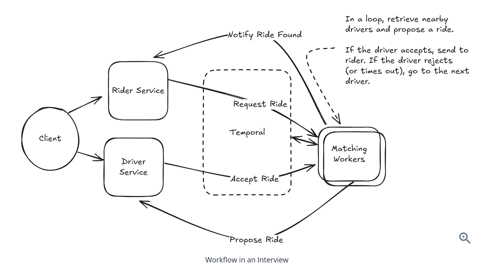

# Question 1 of 15

###### What is the primary challenge that multi-step processes address in distributed systems?

1

Database scaling

2

Network latency

3

High read volume

4

Coordinating multiple services reliably across failures and retries

Correct!

###### Multi-step processes solve the challenge of coordinating dozens or hundreds of different services to complete a user's request while handling failures, retries, and long-running operations that span hours or days.

# Question 2 of 15

###### Single server orchestration is always inadequate for production systems.

1

True

2

False

Correct!

###### Single server orchestration is perfectly fine for simple cases without complex state management or failure handling requirements. It only becomes problematic when you need reliability guarantees and complex coordination.

# Question 3 of 15

###### What is the key principle behind event sourcing?

1

Cache frequently accessed data

2

Store current state in memory

3

Use REST APIs for communication

4

Store a sequence of events that represent what happened

Correct!

###### Event sourcing stores a sequence of events that represent what happened, instead of storing the current state. This provides a complete audit trail and enables system state reconstruction.

# Question 4 of 15

###### In event sourcing architecture, what triggers the next step in a workflow?

1

Workers consuming events from the event store

2

Scheduled cron jobs

3

Manual intervention

4

Direct API calls between services

Correct!

###### In event sourcing, workers consume events from the event store, perform their work, and emit new events. Each worker reacts to relevant events and produces new events for the next steps.

# Question 5 of 15

###### Workflow systems eliminate the need for building custom infrastructure for state management and orchestration.

1

True

2

False

Correct!

###### Workflow systems and durable execution engines provide the benefits of event sourcing and state management without requiring you to build the infrastructure yourself.

# Question 6 of 15

###### What makes durable execution different from regular code execution?

1

It can survive system failures and resume from the last successful step

2

It requires fewer CPU resources

3

It uses less memory

4

It runs faster

Correct!

###### Durable execution can move between machines and survive system failures and restarts, automatically resuming workflows from their last successful step on a new, running host.

# Question 7 of 15

###### In Temporal workflows, what is the key requirement for workflows vs activities?

1

Workflows must be deterministic, activities must be idempotent

2

Both must be idempotent

3

Both must be fast

4

Activities must be deterministic, workflows must be idempotent

Correct!

###### Workflows must be deterministic (same inputs and history produce same decisions) to enable replay-based recovery. Activities must be idempotent (can be called multiple times with same result) but won't be retried once they succeed.

# Question 8 of 15

###### Temporal uses a history database to remember activity results during workflow replay.

1

True

2

False

Correct!

###### Each activity run is recorded in a history database. If a workflow runner crashes, another runner can replay the workflow and use the history to remember what happened with each activity invocation.

# Question 9 of 15

###### How do managed workflow systems like AWS Step Functions differ from durable execution engines like Temporal?

1

They're faster

2

They use declarative definitions (JSON/YAML) instead of code

3

They don't support failure recovery

4

They only work with single services

Correct!

###### Managed workflow systems use declarative approaches with JSON, YAML, or specialized DSLs to define workflows as state machines or DAGs, rather than writing code that looks like regular programming.

# Question 10 of 15

###### Declarative workflow systems provide better visualization capabilities than code-based systems.

1

True

2

False

Correct!

###### The declarative approach brings significant advantages in visualization - workflows can be displayed as diagrams, providing a much nicer UI compared to code-based systems.

# Question 11 of 15

###### What is workflow versioning used for?

1

Handling updates to workflow logic without breaking existing executions

2

Performance optimization

3

Load balancing

4

Data backup

Correct!

###### Workflow versioning allows you to deploy new versions of workflow code separately, so old workflows continue running with the old version while new workflows use the new version.

# Question 12 of 15

###### How do workflow systems handle external events like waiting for user input?

1

Blocking the entire system

2

Continuous polling

3

Timing out immediately

4

Using signals to wait efficiently

Correct!

###### Workflows use signals to wait for external events efficiently. The workflow suspends without consuming resources - no polling, no resource consumption - until the external system sends a signal.

# Question 13 of 15

###### Making activities idempotent prevents issues when workflow engines retry failed activities.

1

True

2

False

Correct!

###### Idempotent activities can be called multiple times with the same inputs and produce the same result, preventing issues like double-charging or duplicate emails when the workflow engine retries activities.

# Question 14 of 15

###### When should you choose workflow systems in system design interviews?

1

Only for batch processing

2

When you have simple request/response APIs

3

For all distributed systems

4

For multi-step processes with failure handling, state management, and orchestration needs

Correct!

###### Workflow systems are ideal for multi-step processes that need failure handling, state persistence across failures, orchestration of multiple services, and long-running processes with complex coordination.

# Question 15 of 15

###### Apache Airflow is better suited for event-driven, long-running user-facing workflows than scheduled batch workflows.

1

True

2

False

Correct!

###### Apache Airflow excels at scheduled batch workflows like ETL and data pipelines, but wasn't designed for event-driven, long-running processes. It's less suitable for user-facing workflows compared to systems like Temporal.