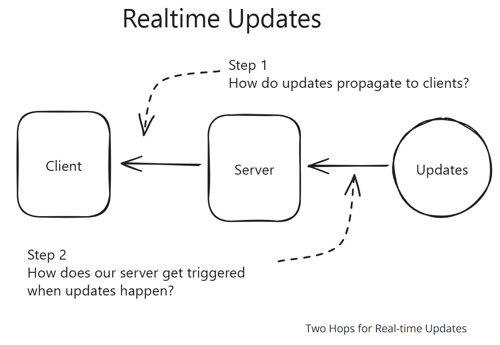
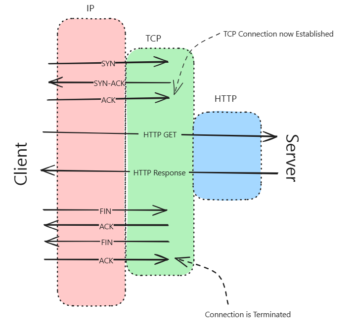
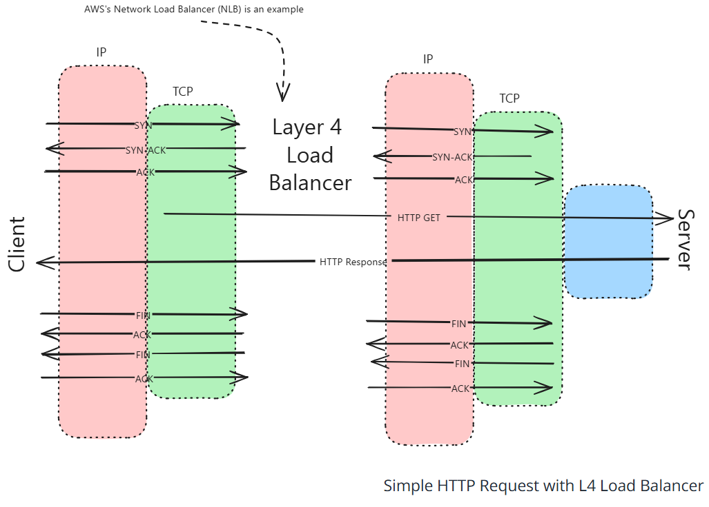

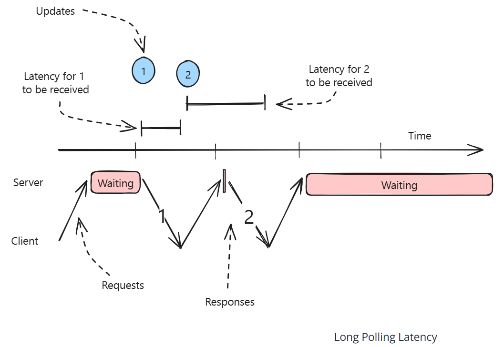
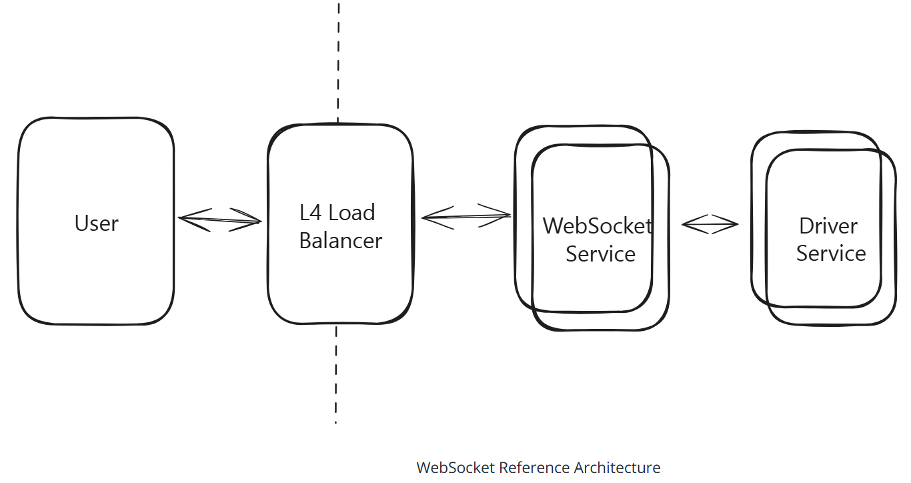
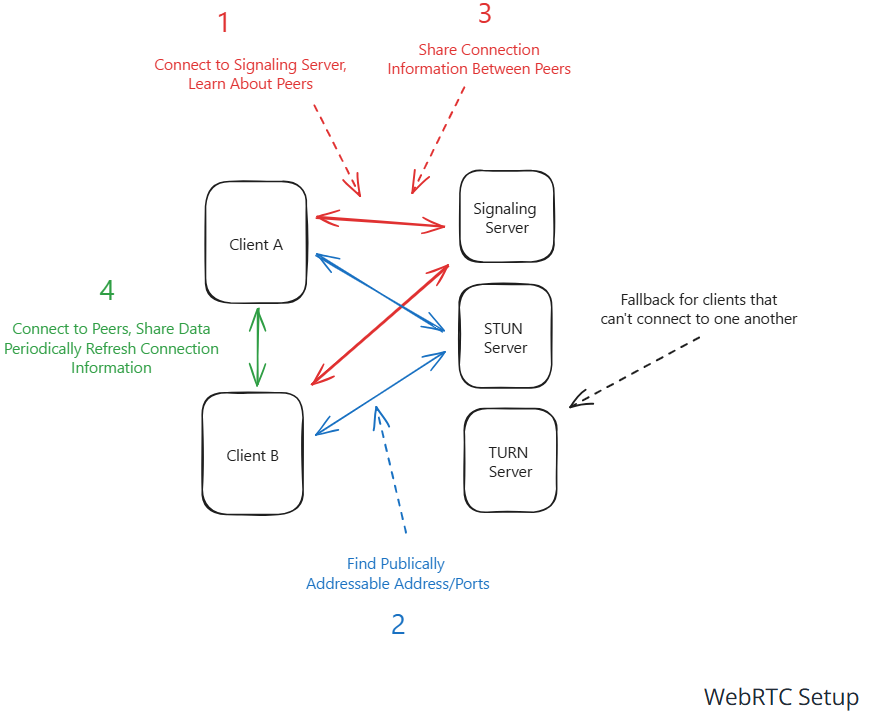
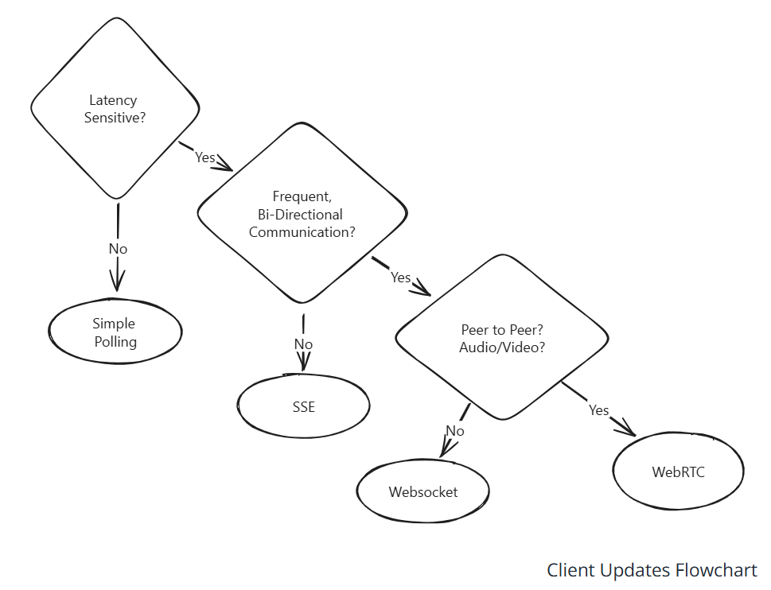
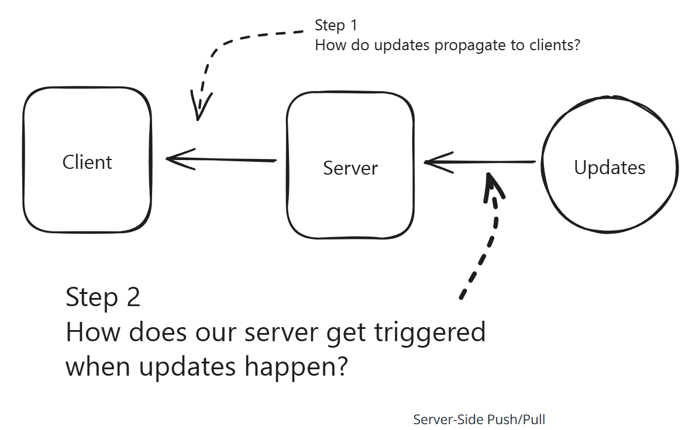
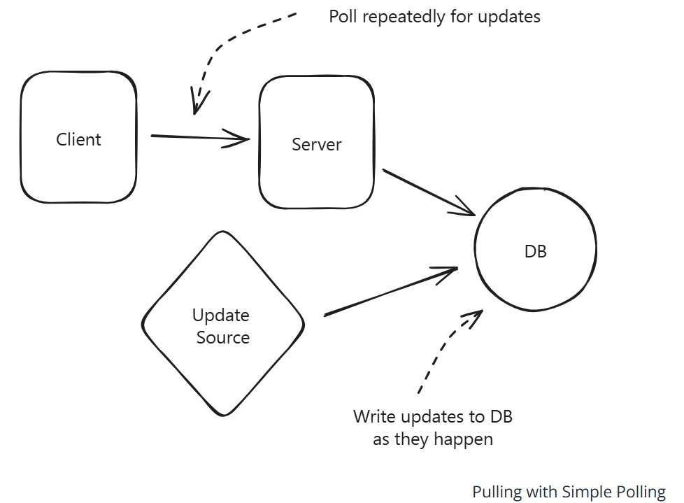
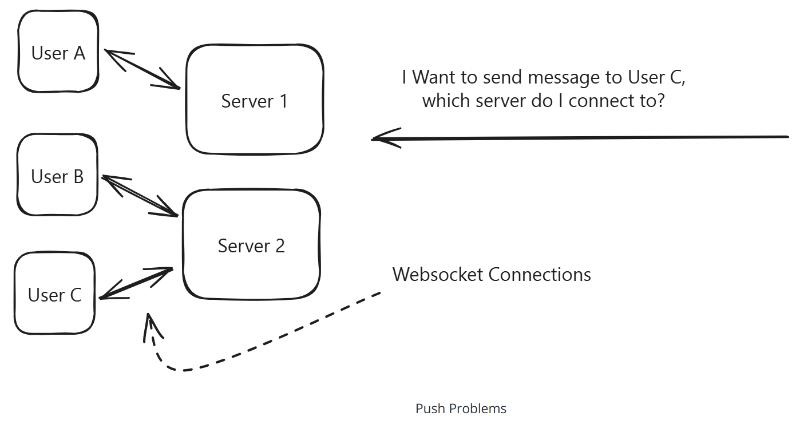
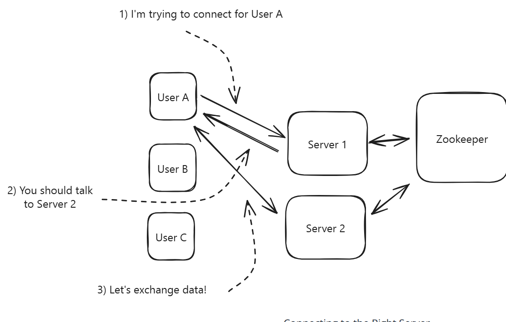
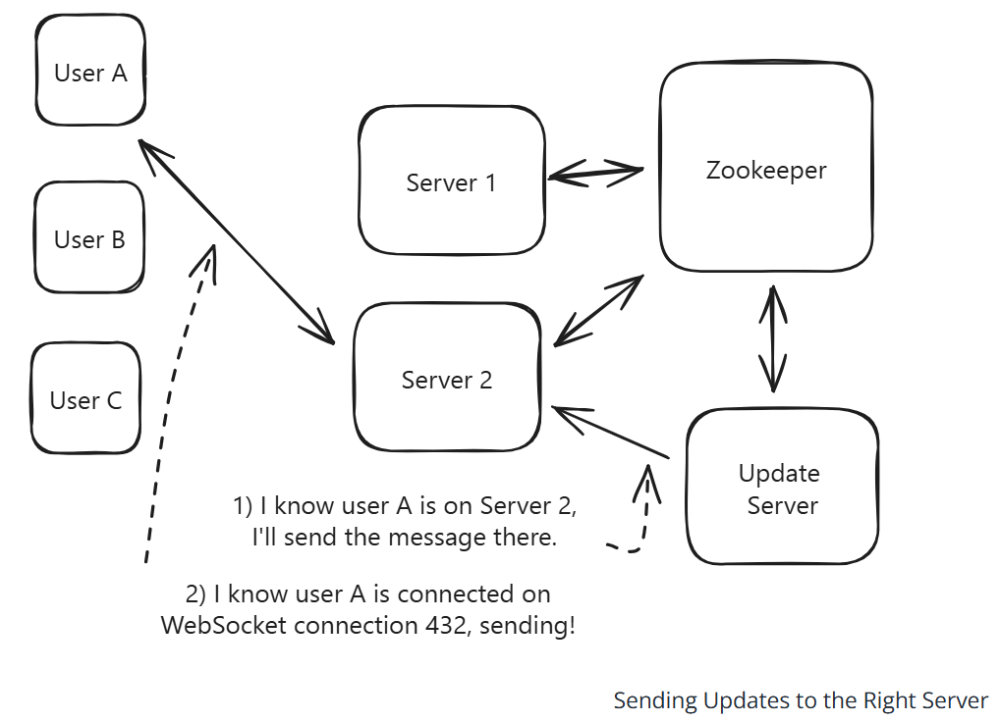
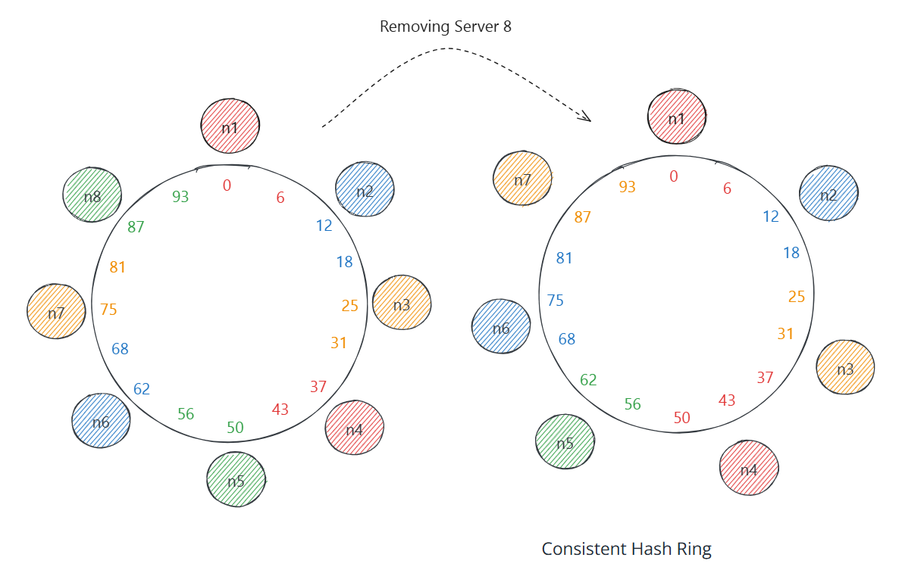
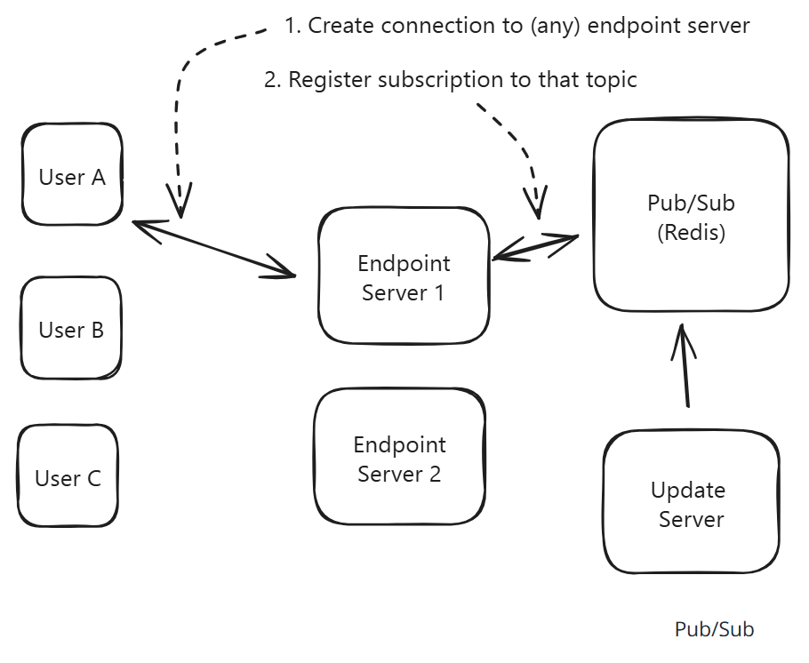
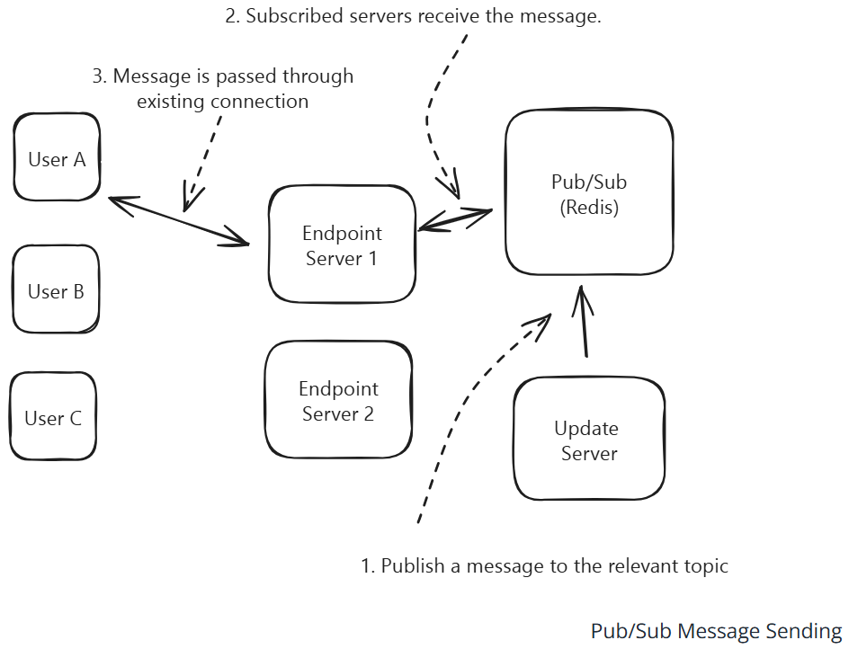
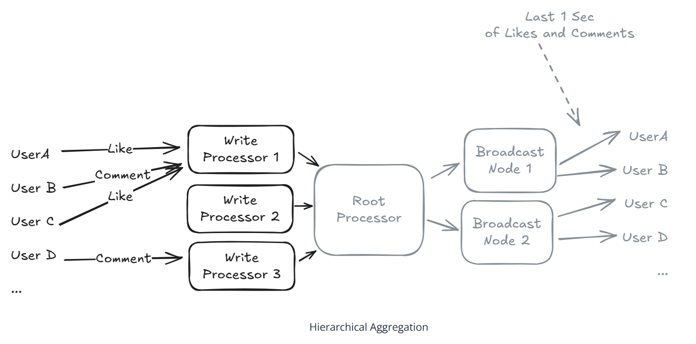

# Question 1 of 16

###### In the context of system design, what do we mean by a "real-time update"?

1

Storing data in a relational database

2

Delivering data to clients within milliseconds after it changes

3

Running batch jobs every night

4

Compressing static assets before deployment

Correct!

###### Real-time updates aim to push data to the client almost immediately (usually sub-second) after a change occurs, rather than waiting for scheduled batch jobs or manual refreshes.

# Question 2 of 16

###### Which technique is the simplest baseline for delivering periodic updates to a client?

1

Server-Sent Events (SSE)

2

Long polling

3

WebSockets

4

Simple polling

Incorrect.

###### Simple polling is the starting point: the client repeatedly asks the server for new data at a fixed interval.

# Question 3 of 16

###### With simple polling, reducing the polling interval always decreases backend load.

1

True

2

False

Incorrect.

###### Shorter polling intervals create more requests, increasing load on the backend.

# Long polling improves on simple polling primarily by…
1
Maintaining the same HTTP request open until data is available

2
Using a dedicated WebRTC channel

3
Encoding responses as Protocol Buffers

4
Switching from HTTP to UDP

Correct!

In long polling the server holds the request until it has data, then responds, cutting down on repeated connection setup overhead.

# Question 5 of 16

Which protocol provides one-way server-to-browser streaming over plain HTTP?
1
Server-Sent Events (SSE)

2
gRPC

3
WebSocket

4
WebRTC

Correct!

SSE uses the text/event-stream MIME type and chunked transfer encoding to stream events from server to client.

# Question 6 of 16

WebSockets require every intermediary (load balancers, proxies) between client and server to support the upgrade handshake.
1
True

2
False

Correct!

If any proxy doesn't understand the Upgrade header the WebSocket handshake fails, so full path support is mandatory.

# Question 7 of 16

###### Why might an architect choose SSE over WebSockets?

1

Less infrastructure complexity and automatic browser reconnection

2

Need for bidirectional messaging

3

Need to bypass firewalls with UDP

4

Requirement for binary transport

Correct!

###### SSE is one-directional, rides plain HTTP ports, and browsers auto-reconnect. If you only need server→client pushes, it's simpler than full WebSockets.

# Question 8 of 16

###### Which load balancer type (per the OSI model) is generally preferred when terminating long-lived WebSocket connections?

1

Layer 4

2

Layer 3

3

Layer 7

4

Layer 2

Correct!

###### L4 balancers operate at the TCP layer and preserve the single underlying connection, avoiding issues some L7 proxies have with WebSocket stickiness.

# Question 9 of 16

Consistent hashing reduces connection churn when scaling endpoint servers up or down.
1
True

2
False

Correct!

Only the keys mapping to the portion of the hash ring owned by added/removed nodes move, so most clients stay put.

# Question 10 of 16

###### In a pub/sub architecture, which component is responsible for routing published messages to all active subscribers?

1

Subscriber

2

Publisher

3

DNS server

4

Message broker (e.g., Redis, Kafka)

Correct!

###### The message broker is the central hub that holds subscription metadata and forwards each published message to every client subscribed to the topic.

# Question 11 of 16

WebRTC always guarantees a direct peer-to-peer path between browsers without relays.
1
True

2
False

Incorrect.

When NAT traversal fails, TURN relays forward traffic, so not all flows are purely peer-to-peer.

# Question 12 of 16

###### Which client update approach involves the HIGHEST connection setup overhead but offers full-duplex messaging?

1

Long polling

2

WebSockets

3

Server-Sent Events

4

Simple polling

Correct!

###### WebSockets require an upgrade handshake and persistent TCP state but then enable bidirectional, low-latency messaging.

# Question 13 of 16

###### Using a "least connections" strategy at the load balancer helps distribute WebSocket clients more evenly across endpoint servers.

1

True

2

False

Correct!

###### Since each connected client holds resources, balancing by current connection count prevents hotspots better than round-robin.

# Question 14 of 16

###### When would you MOST LIKELY choose consistent hashing over a pub/sub approach on the server side?

1

You require stateless endpoint servers

2

You need to broadcast the same stock price to 1M users

3

Each connection holds large in-memory state that is expensive to rebuild

4

You want to minimise dependency count

Correct!

###### If per-client state is heavy, pinning that user to one server (via hashing) avoids expensive state transfer and cache misses.

# Question 15 of 16

SSE streams can be buffered by misconfigured proxies, delaying updates to clients even though the server flushes chunks immediately.
1
True

2
False

Correct!

Proxies that don't support `Transfer-Encoding: chunked` may wait for the full response before forwarding, defeating streaming semantics.

# Question 16 of 16

###### What is the primary drawback of simple polling compared to other real-time techniques discussed?

1

Requires WebSocket support

2

Higher average latency and unnecessary server load from repeated requests

3

Does not work behind firewalls

4

Works only with UDP

Correct!

###### Because the client keeps asking even when nothing changed, simple polling adds latency equal to the polling interval and wastes resources.
