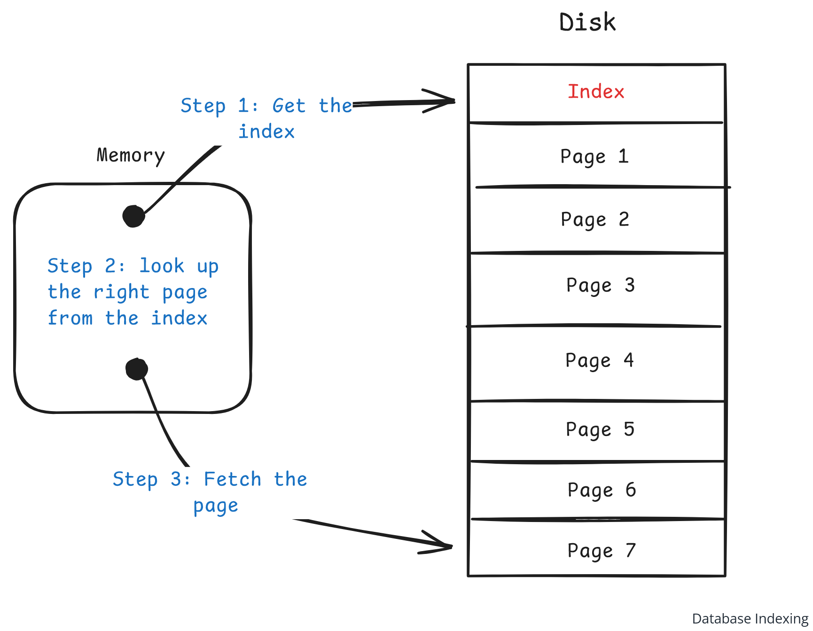
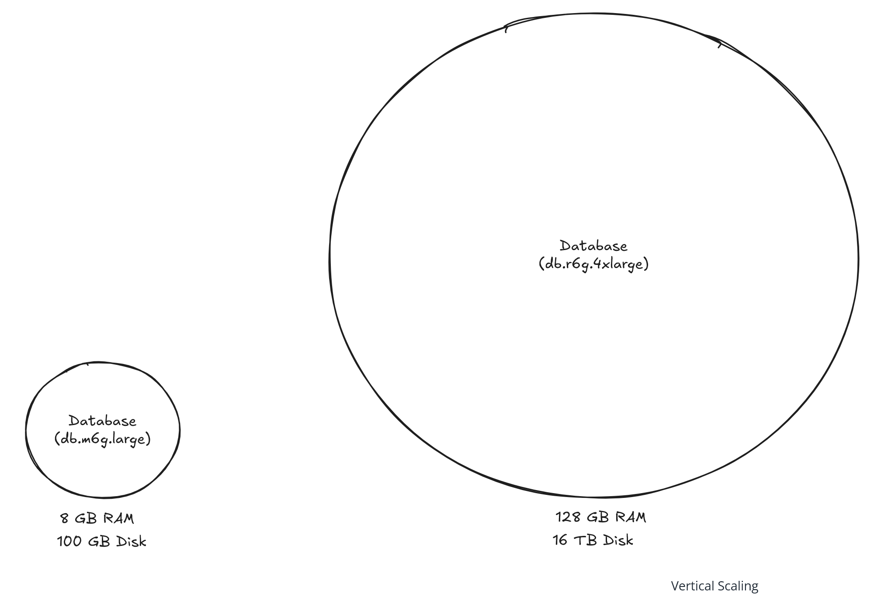
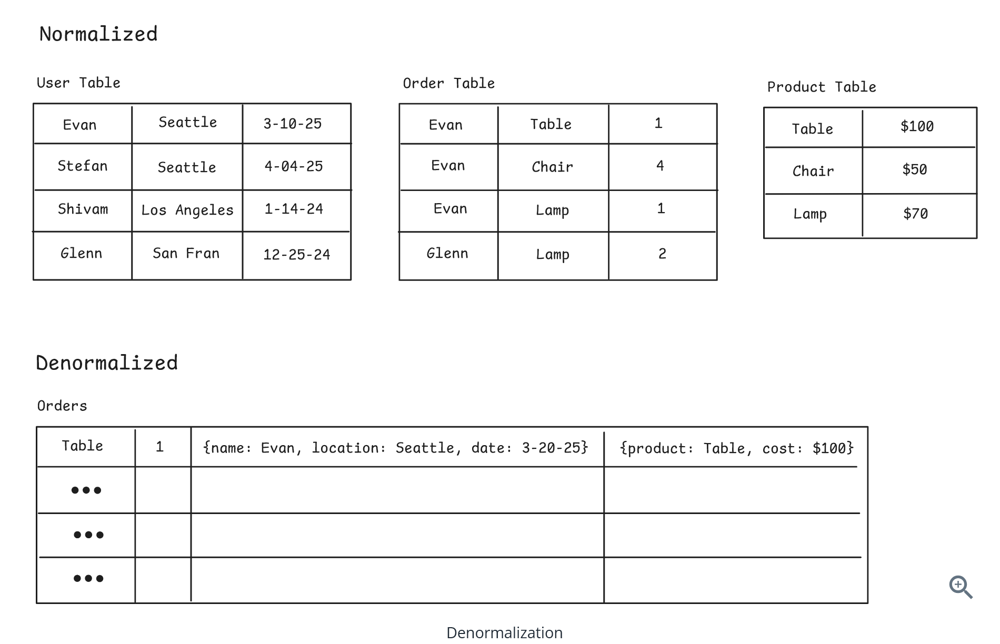
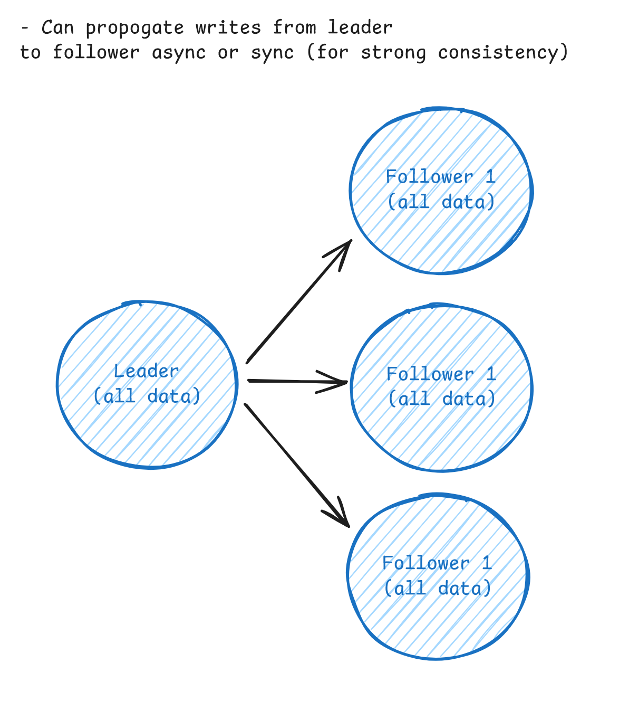
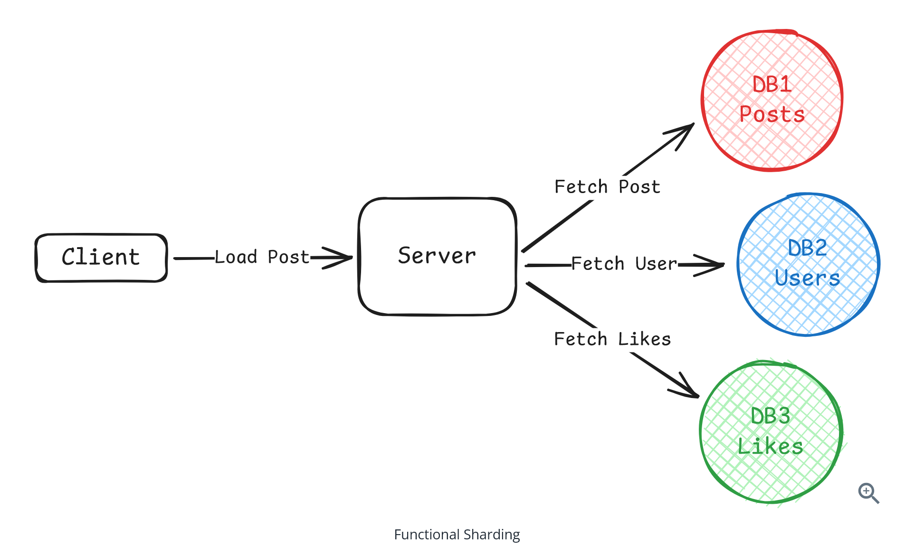
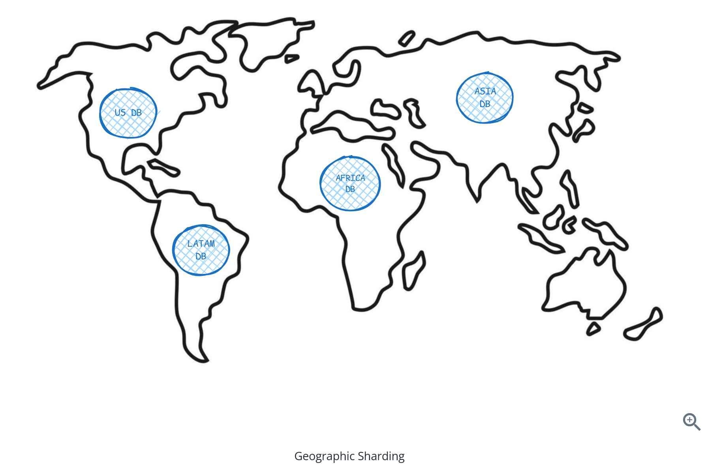
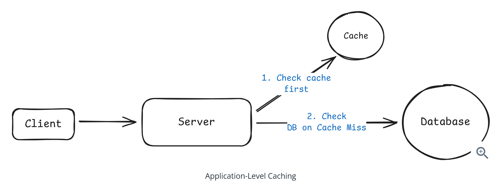
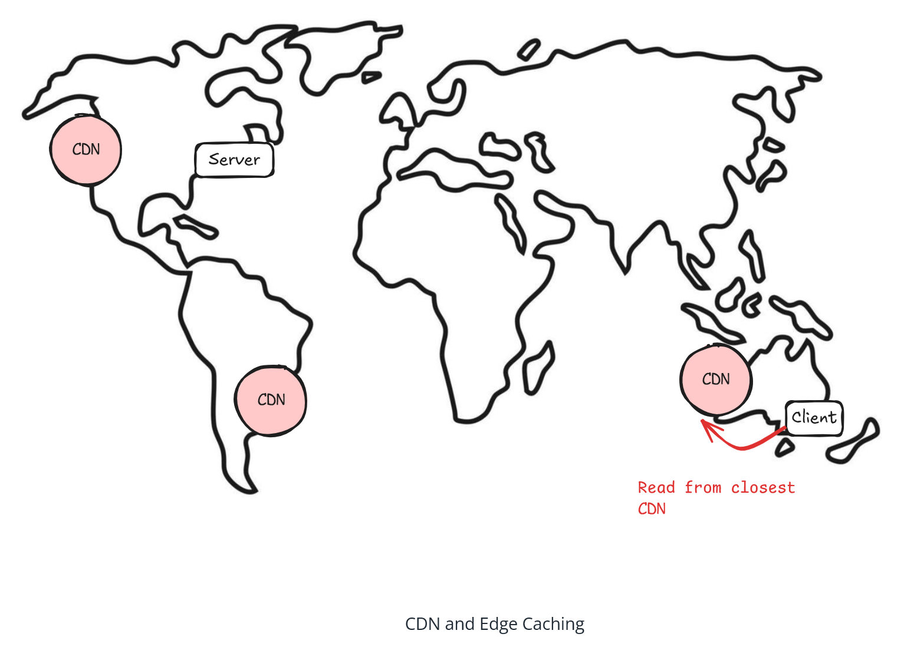

# Question 1 of 15

###### What are the three main approaches to scaling reads in distributed systems?

1

Caching, Load balancing, Microservices

2

Optimize within database, Scale horizontally, Add external caching

3

Indexing, Replication, Partitioning

4

Vertical scaling, Horizontal scaling, Edge computing

Incorrect.

###### The three main read scaling approaches are: 1) Optimize read performance within your database, 2) Scale your database horizontally, and 3) Add external caching layers.

# Question 2 of 15

###### What is the primary benefit of database indexing for read scaling?

1

Reduces storage requirements

2

Improves write performance

3

Transforms O(n) full table scans into O(log n) index lookups

4

Eliminates need for caching

Correct!

###### Indexes create sorted lookup tables that allow jumping directly to relevant rows instead of scanning every row, transforming linear operations into logarithmic ones.

# Question 3 of 15

###### Modern applications should be very concerned with having too many indexes because they significantly slow down writes.

1

True

2

False

Incorrect.

###### While index overhead is real, this fear is dramatically overblown. Modern hardware and database engines handle well-designed indexes efficiently. Under-indexing kills more applications than over-indexing.

# Question 4 of 15

###### What is the main trade-off when using denormalization for read scaling?

1

Increased storage for faster reads

2

Better consistency for slower writes

3

Lower latency for higher CPU usage

4

Simpler queries for more complex schema

Correct!

###### Denormalization trades storage space for read speed by storing redundant data to avoid expensive joins, but this makes writes more complex as you must update multiple locations.

# Question 5 of 15

###### Why are materialized views particularly useful for read scaling?

1

They precompute expensive aggregations to avoid real-time calculations

2

They automatically update when base data changes

3

They reduce database storage requirements

4

They eliminate the need for indexes

Correct!

###### Materialized views precompute complex calculations and aggregations, storing the results so expensive queries like average ratings don't need to be calculated on every page load.

# Question 6 of 15

###### What is the key challenge with read replicas in leader-follower replication?

1

Replication lag causing potentially stale reads

2

Higher storage costs

3

Complex query routing

4

Increased write latency

Correct!

###### Replication lag means users might not see their own changes immediately if reading from a lagging replica, creating a consistency vs performance trade-off.

# Question 7 of 15

###### Synchronous replication ensures consistency but introduces latency, while asynchronous replication is faster but potentially serves stale data.

1

True

2

False

Correct!

###### This represents the fundamental consistency vs performance tension in read replicas - you must choose between strong consistency (slower) or eventual consistency (faster).

# Question 8 of 15

###### When does functional sharding make sense for read scaling?

1

When caching isn't sufficient

2

When you need better write performance

3

When different business domains have different access patterns

4

When you have too much data for one server

Correct!

###### Functional sharding splits data by business domain (users, products, orders) so each database handles a smaller, more focused dataset with its own access patterns.

# Question 9 of 15

###### Why do most applications benefit significantly from caching?

1

Caching reduces database storage costs

2

Access patterns are highly skewed - popular content gets requested repeatedly

3

Caching improves write performance

4

Caching eliminates the need for indexes

Correct!

###### Most applications have skewed access patterns where popular content (viral tweets, popular products) gets requested repeatedly, making caching extremely effective.

# Question 10 of 15

###### CDN caching makes sense for all types of data, including user-specific preferences and private messages.

1

True

2

False

Correct!

###### CDNs only make sense for data accessed by multiple users. User-specific data like preferences or private messages have no cache hit rate benefit since only one user requests them.

# Question 11 of 15

###### How should cache TTL be determined?

1

Based on non-functional requirements around data staleness

2

Use the longest TTL possible for performance

3

Set to the same value across all cached data

4

Always use 5-15 minutes as a safe default

Correct!

###### Cache TTL should be driven by business requirements. If requirements state 'search results should be no more than 30 seconds stale,' that gives you your exact TTL.

# Question 12 of 15

###### What is the key benefit of request coalescing for handling hot keys?

1

Improves cache hit rates

2

Limits backend load from potentially infinite to exactly N (number of servers)

3

Eliminates need for cache invalidation

4

Reduces memory usage in caches

Correct!

###### Request coalescing ensures that even if millions of users want the same data simultaneously, your backend only receives N requests - one per application server doing the coalescing.

# Question 13 of 15

###### What is the 'stale-while-revalidate' pattern for cache stampede prevention?

1

Precomputing all cache entries before expiration

2

Using distributed locks to serialize cache rebuilds

3

Splitting hot keys across multiple cache entries

4

Serving old data while refreshing in the background

Correct!

###### Stale-while-revalidate serves cached data while refreshing it in the background, using probabilistic refresh triggers to spread cache rebuilds over time instead of all at once.

# Question 14 of 15

###### What is a 'deleted items cache' used for?

1

Logging all deletion operations

2

Maintaining a small cache of recently deleted items to filter from large cached structures

3

Storing deleted data for recovery purposes

4

Backing up important data before deletion

Correct!

###### A deleted items cache maintains a small, fast cache of recently deleted post IDs. When serving feeds, you check this cache first to filter out deleted content while taking time to properly invalidate larger cached structures.

# Question 15 of 15

###### Cache versioning avoids invalidation complexity by changing cache keys when data updates, making old entries naturally unreachable.

1

True

2

False

Correct!

###### Cache versioning increments a version number in the database with each update and includes that version in cache keys, avoiding complex invalidation logic and race conditions.
