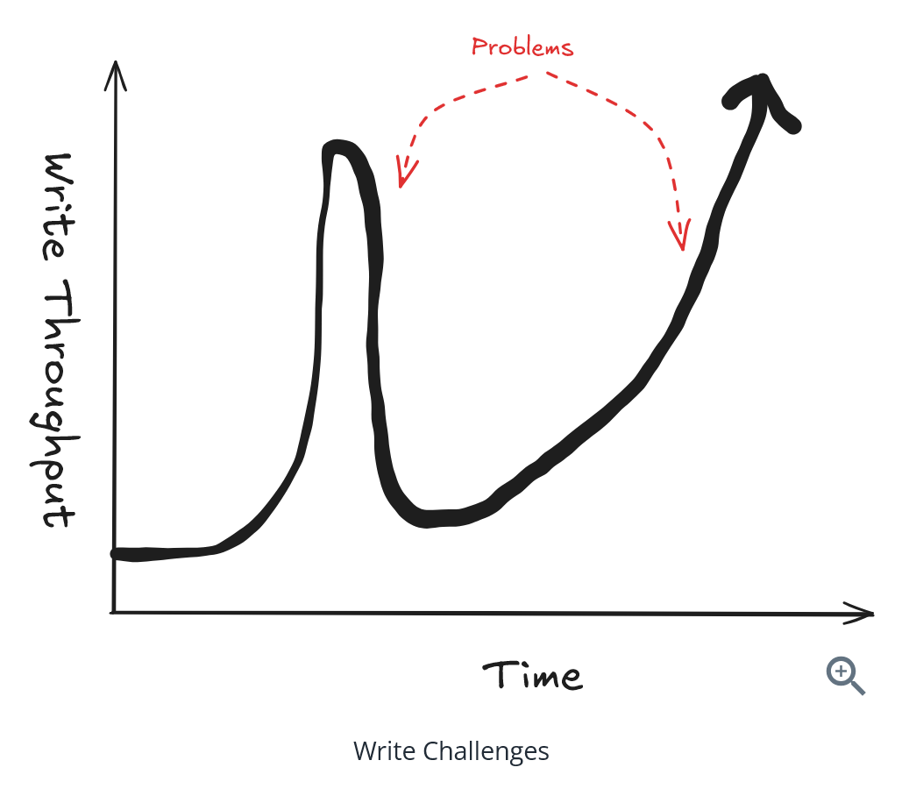
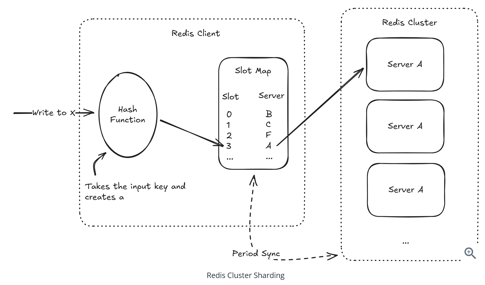
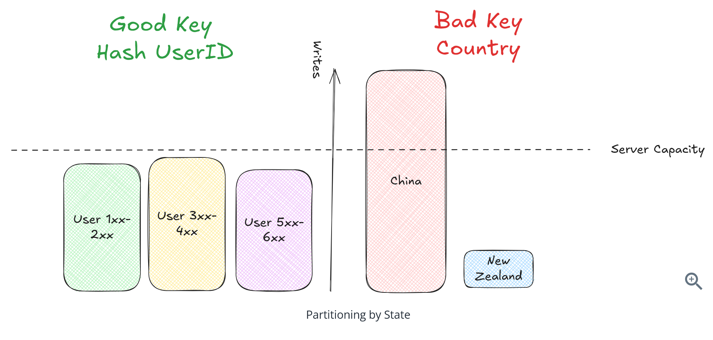
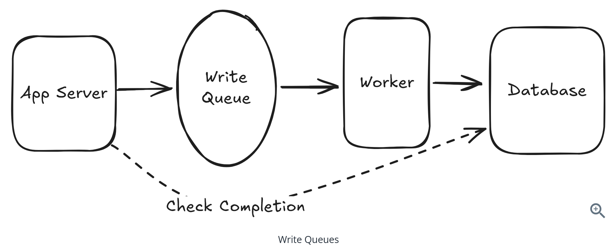
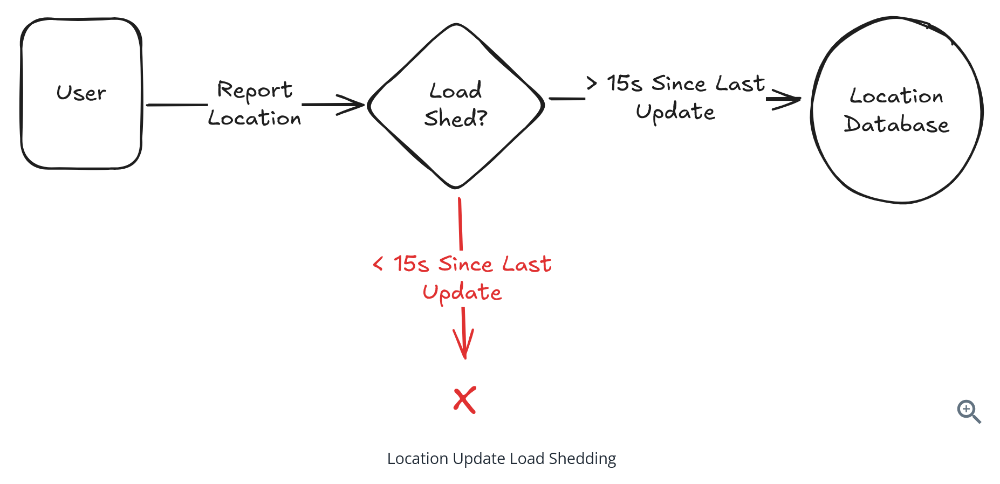
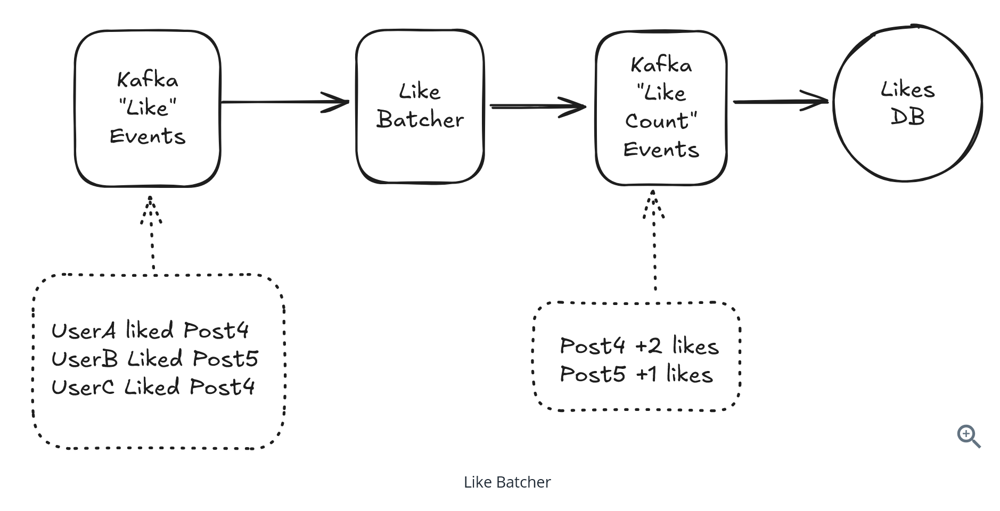
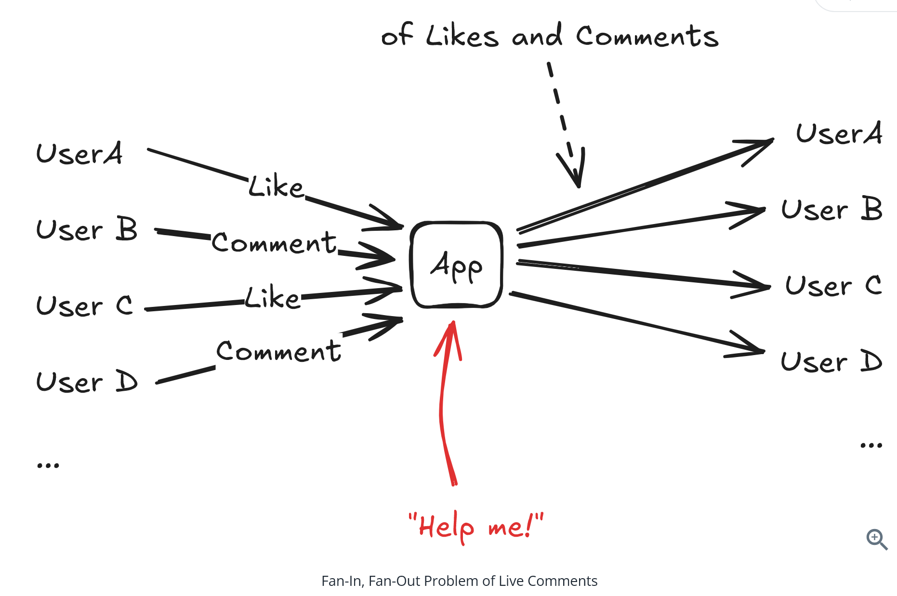
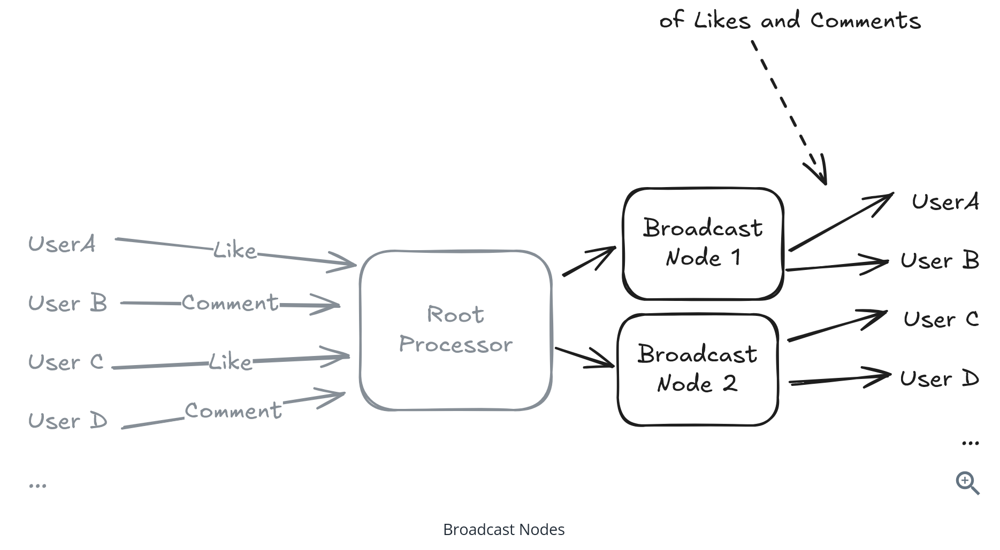
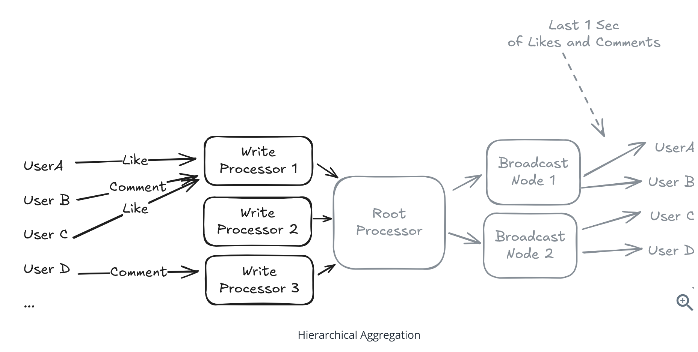
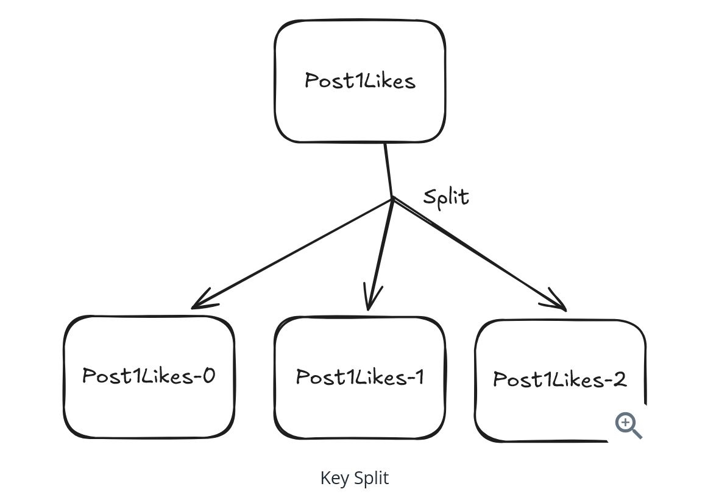

# Question 1 of 15

###### What are the four main strategies for scaling writes in distributed systems?

1

Caching, CDNs, Load balancing, Replication

2

Vertical scaling & database choices, Sharding & partitioning, Queues & load shedding, Batching & hierarchical aggregation

3

Microservices, Containers, Serverless, Edge computing

4

Vertical scaling, Horizontal scaling, Queues, Databases

Correct!

###### The four main write scaling strategies are: 1) Vertical scaling and database choices, 2) Sharding and partitioning, 3) Handling bursts with queues and load shedding, and 4) Batching and hierarchical aggregation.

# Question 2 of 15

###### Cassandra achieves superior write throughput through its append-only commit log architecture.

1

True

2

False

Correct!

###### Cassandra writes everything sequentially to disk using an append-only commit log, avoiding expensive disk seeks required for in-place updates, allowing it to handle 10,000+ writes per second on modest hardware.

# Question 3 of 15

###### When choosing a partitioning key for sharding, what should be the primary goal?

1

Minimize the number of shards

2

Maximize query performance

3

Minimize variance in the number of writes per shard

4

Maximize data locality

Correct!

###### The principle is to select a key that minimizes variance in the number of writes per shard. You want writes distributed evenly across shards - 'flat is good' - often achieved by hashing a primary identifier like userId.

# Question 4 of 15

###### Partitioning by user's country would be a good sharding strategy for a global application.

1

True

2

False

Incorrect.

###### Partitioning by country creates uneven distribution - highly populated countries like China would be overloaded while sparse countries like New Zealand would be underutilized, creating hot spots.

# Question 5 of 15

###### What is the main difference between horizontal and vertical partitioning?

1

Horizontal is faster than vertical

2

Vertical is for reads, horizontal is for writes

3

Horizontal uses more servers than vertical

4

Horizontal splits rows, vertical splits columns

Correct!

###### Horizontal partitioning (sharding) splits rows across different servers, while vertical partitioning splits columns based on different access patterns and scaling requirements.

# Question 6 of 15

###### In the social media post example, why would you separate post\_content, post\_metrics, and post\_analytics into different tables?

1

To improve security

2

Each has different access patterns and scaling requirements

3

To save storage space

4

To reduce code complexity

Correct!

###### Post content is write-once/read-many, post metrics have high-frequency writes, and post analytics are append-only time-series. Each can be optimized for its specific access pattern.

# Question 7 of 15

###### Write queues are always the best solution for handling traffic bursts.

1

True

2

False

Incorrect.

###### Queues are only a temporary solution. If the application continues to write faster than the database can process, you get unbounded queue growth. Use queues for short-lived bursts, not to patch an inadequate database.

# Question 8 of 15

###### When might load shedding be preferable to queuing for handling write bursts?

1

When writes are frequently updated (like location updates)

2

When writes are irreversible

3

When you have unlimited storage

4

When you need perfect consistency

Correct!

###### For frequently updated data like location reports, dropping older writes makes sense since newer writes will arrive shortly. This is better than queuing outdated location data.

# Question 9 of 15

###### Batching at the application layer can lead to data loss if the application crashes before committing the batch.

1

True

2

False

Correct!

###### If the application is the source of truth and crashes before sending batched writes to the database, those writes are lost. This strategy requires the application to handle potential data loss gracefully.

# Question 10 of 15

###### In the Like Batcher example, what is the key benefit of intermediate processing?

1

Aggregating multiple like events into a single count update

2

Reduced database schema complexity

3

Faster individual writes

4

Better error handling

Correct!

###### The Like Batcher can read multiple like events, tabulate the changes to the count for each post, and forward consolidated updates. If a post receives 100 likes in a window, this reduces writes from 100 to 1.

# Question 11 of 15

###### What is the primary purpose of hierarchical aggregation in write scaling?

1

Improve read performance

2

Increase data durability

3

Reduce write volume at each processing stage

4

Simplify application code

Correct!

###### Hierarchical aggregation processes data in stages, reducing volume at each step. It's used for high-volume data where you need aggregated views rather than individual events.

# Question 12 of 15

###### When resharding a database, the dual-write phase ensures no data is lost during migration.

1

True

2

False

Correct!

###### During resharding, you write to both old and new shards but read with preference for the new shard. This allows gradual data migration while maintaining availability and preventing data loss.

# Question 13 of 15

###### How do you handle a 'hot key' that's too popular for even a single shard?

1

Use a faster database

2

Implement caching

3

Split the key into multiple sub-keys

4

Add more indexes

Correct!

###### For viral content causing hot keys, you can split the key into multiple sub-keys (like post1Likes-0, post1Likes-1, etc.) to distribute the write load across multiple shards.

# Question 14 of 15

###### Splitting hot keys dynamically requires both readers and writers to agree on which keys are hot.

1

True

2

False

Correct!

###### If writers spread writes across multiple sub-keys but readers don't check all sub-keys, you have inconsistent data. Both components must coordinate on hot key detection and handling.

# Question 15 of 15

###### What is the fundamental principle behind all write scaling strategies?

1

Minimize network calls

2

Maximize database connections

3

Reduce throughput per component

4

Increase memory usage

Correct!

###### All write scaling strategies aim to reduce throughput per component - whether spreading 10,000 writes across 10 shards, smoothing bursts through queues, or batching them into 100 bulk operations.

