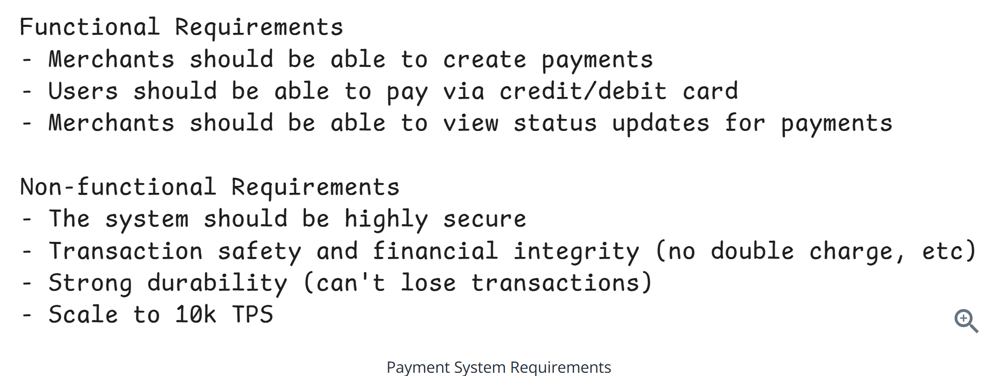
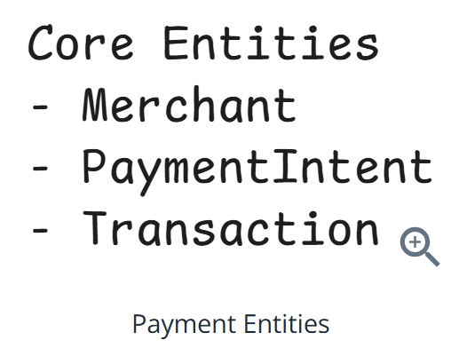
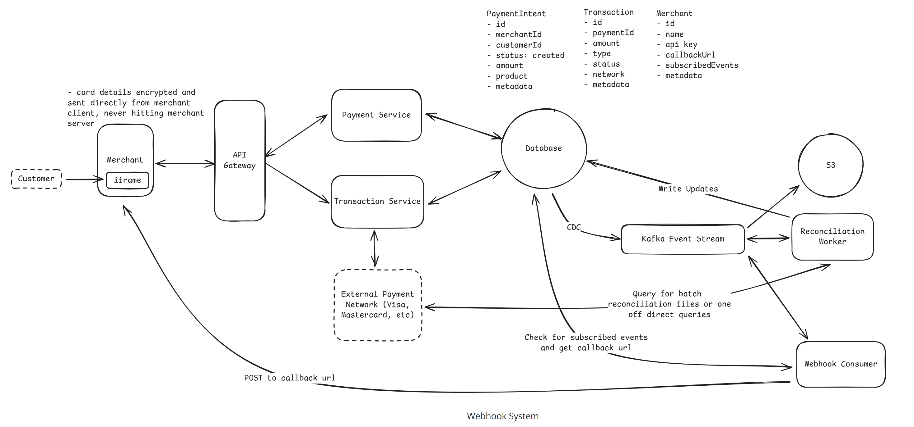

# Question 1 of 15

###### Idempotent operations ensure repeated requests produce the same final state.

1

True

2

False

Correct!

###### An idempotent endpoint returns an identical result no matter how many times a client retries, preventing duplicate side effects such as double charges or duplicate messages.

# Question 2 of 15

###### Which ACID property guarantees that a group of database operations succeeds or fails atomically?

1

Isolation

2

Atomicity

3

Durability

4

Availability

Correct!

###### Atomicity treats a series of operations as a single indivisible unit. If any part of the transaction fails, the entire transaction is rolled back, ensuring all-or-nothing behavior.

# Question 3 of 15

###### Payment systems must handle the inherently asynchronous nature of external payment networks like Visa and Mastercard.

1

True

2

False

Correct!

###### External payment networks operate independently with their own retry mechanisms, queue delays, and batch processing. A timeout doesn't mean failure - the payment might still be processing through banking systems.

# Question 4 of 15

###### Which technique BEST prevents duplicate charges when external service calls may time out?

1

Round-robin load balancing

2

Retrying requests without changes

3

Idempotency keys on client requests

4

Increasing HTTP timeouts

Correct!

###### An idempotency key ties each logical request to a unique identifier. Retries with the same key return the stored result rather than performing the action again, eliminating duplicate charges.

# Question 5 of 15

###### A payment processor must absorb 10,000 transactions per second spikes. Which scaling pattern distributes load horizontally with minimal coordination?

1

Stateless microservices behind a load balancer

2

Primary-secondary database failover

3

Vertical scaling on larger servers

4

Single monolithic application

Correct!

###### Stateless services allow any instance to handle any request, so traffic can spread evenly across many replicas using a simple load balancer without cross-node coordination.

# Question 6 of 15

###### Message queues offering at-least-once delivery can result in duplicate message processing after consumer failures.

1

True

2

False

Correct!

###### If a consumer crashes before acknowledging a message, the broker re-delivers it to another consumer, so downstream services must be idempotent or deduplicate to handle potential duplicates.

# Question 7 of 15

###### Which security technique limits a merchant's PCI DSS scope by never exposing card data to their servers?

1

Plain HTTPS without tokens

2

Server-side form posting

3

Tokenization with client-side encryption

4

Static API keys in headers

Correct!

###### Tokenization replaces sensitive card data with non-reversible tokens; encryption occurs in the user's browser and data travels directly to the processor, keeping merchant systems out of PCI scope.

# Question 8 of 15

###### What happens when a duplicate idempotency key is received for an already successful charge?

1

The payment service crashes

2

The original result is returned without a new charge

3

A second charge is processed

4

The request is rejected as invalid

Correct!

###### Upon detecting a previously used idempotency key, the server returns the stored response, ensuring the external side effect (charging the card) is not performed again.

# Question 9 of 15

###### Marking a transaction as 'pending verification' after a network timeout avoids overcharging customers.

1

True

2

False

Correct!

###### Deferred verification acknowledges uncertainty instead of assuming failure, preventing merchants from retrying prematurely and creating duplicate charges while the processor reconciles the real outcome.

# Question 10 of 15

###### Event sourcing allows rebuilding current payment state by replaying immutable events.

1

True

2

False

Correct!

###### Storing every state-changing event in an append-only log lets systems materialize fresh views at any time, aiding auditing, recovery, and debugging.

# Question 11 of 15

###### In an event-driven payment system with reconciliation, what enables correlating internal attempts with external payment network events?

1

Storing only successful transaction outcomes

2

Implementing synchronous API calls only

3

Using strong consistency across all databases

4

Recording attempt details before calling payment networks

Correct!

###### By recording attempt details (network name, reference ID, what we're trying to accomplish) before making external calls, the reconciliation service can later correlate external events from payment networks with our internal attempts to resolve any discrepancies.

# Question 12 of 15

###### A merchant receives a 'payment.succeeded' webhook. Which property ensures they can safely retry webhook processing after a crash?

1

Idempotent webhook handler on the merchant server

2

Symmetric key encryption

3

Eventual consistency between replicas

4

Long-polling every second

Correct!

###### If the merchant's endpoint treats duplicate webhook deliveries idempotently, retries cause no side effects, guaranteeing at-least-once delivery semantics without duplicating fulfillment actions.

# Question 13 of 15

###### Which approach BEST ensures no payment transaction data is ever lost while maintaining audit compliance?

1

Storing only current state in memory

2

Change Data Capture feeding an immutable event stream

3

Separate audit tables updated by application code

4

Update records in place with daily backups

Correct!

###### CDC automatically captures all database changes at the database level and feeds them to an immutable event stream (like Kafka), guaranteeing no audit data is lost regardless of application bugs. This satisfies compliance requirements with cryptographically verifiable immutability.

# Question 14 of 15

###### When a payment request to an external network times out, what should a payment system do to ensure transaction safety?

1

Assume the payment succeeded

2

Retry the payment request with the same details

3

Immediately mark the payment as failed

4

Mark the payment as 'pending verification' and reconcile later

Correct!

###### Timeouts don't indicate success or failure - they indicate uncertainty. Marking as 'pending verification' acknowledges this uncertainty while a reconciliation service queries the payment network to determine what actually happened, preventing double-charging.

# Question 15 of 15

###### Change Data Capture (CDC) operates at the database level, guaranteeing that application bugs cannot skip audit logging.

1

True

2

False

Correct!

###### CDC monitors the database's write-ahead log or oplog, capturing every committed change automatically. Since it operates below the application layer, it cannot be bypassed by buggy code that forgets to write audit records.

