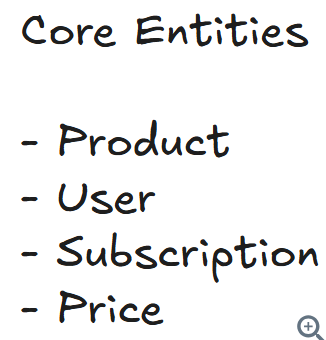
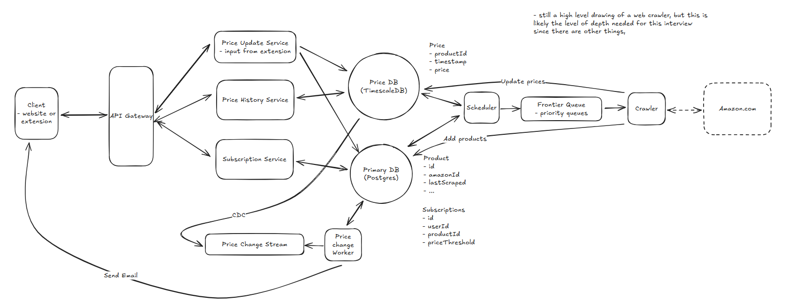
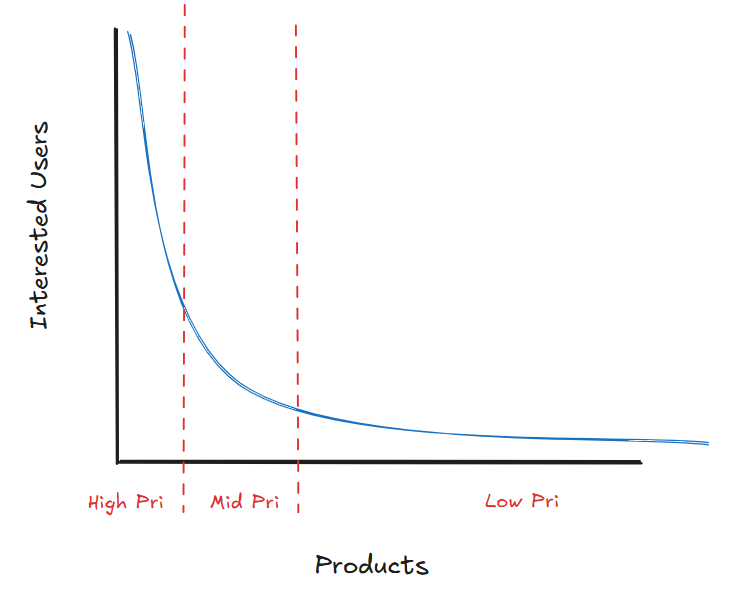
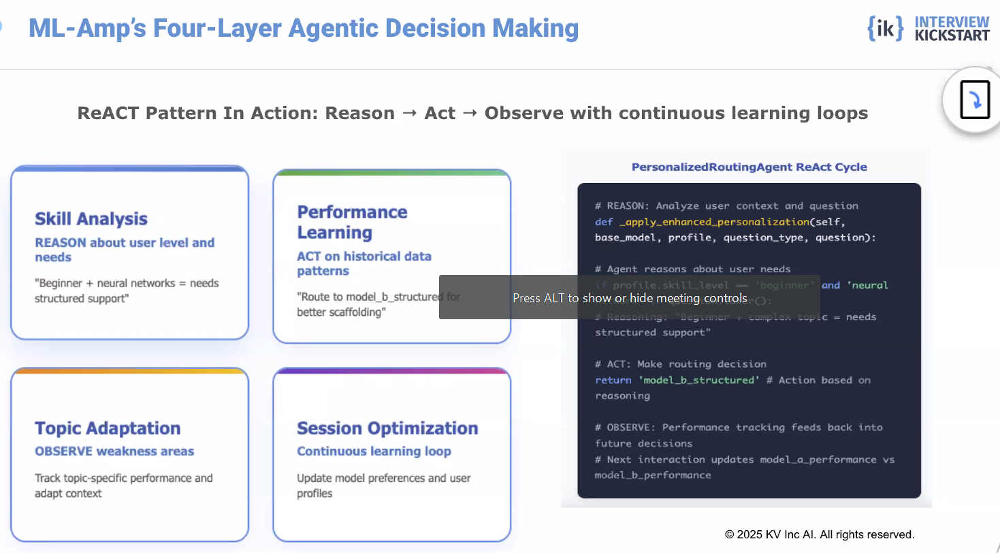

# Question 1 of 15

###### Event-driven architectures can allow for immediate change processing rather than periodic checking.

1

True

2

False

Correct!

###### Event-driven systems react to changes as they occur, enabling immediate processing. This contrasts with polling systems that check for changes at regular intervals, introducing latency but reducing system complexity.

# Question 2 of 15

###### Which database type optimizes time-based data aggregations?

1

Document database

2

Key-value store

3

Time-series database

4

Graph database

Correct!

###### Time-series databases like TimescaleDB and InfluxDB are specifically designed for time-based data with features like automatic partitioning, compression, and optimized aggregation functions that make temporal queries much faster than general-purpose databases.

# Question 3 of 15

###### Which is NOT a limitation of polling-based systems?

1

Poor scalability with frequent checks

2

Increased latency for change detection

3

Simple implementation and debugging

4

Wasted resources checking unchanged data

Correct!

###### Simple implementation is actually an advantage of polling systems, not a limitation. The main limitations are latency (changes aren't detected until next poll), wasted resources (checking when nothing changed), and poor scalability as polling frequency increases.

# Question 4 of 15

###### Priority queues allocate limited resources based on importance scores.

1

True

2

False

Correct!

###### Priority queues process items based on their assigned importance rather than arrival order. This allows systems to handle high-value work first when resources are limited, maximizing overall system effectiveness.

# Question 5 of 15

###### Which consistency model prioritizes availability over strong consistency?

1

Causal consistency

2

Strong consistency

3

Eventual consistency

4

Sequential consistency

Correct!

###### Eventual consistency allows systems to remain available during network partitions by accepting temporary inconsistencies. This follows the CAP theorem trade-off, choosing availability and partition tolerance over immediate consistency.

# Question 6 of 15

###### Consensus-based validation requires multiple independent sources to confirm data accuracy.

1

True

2

False

Correct!

###### Consensus validation works by requiring multiple independent parties to agree on data before accepting it as valid. This approach filters out errors and malicious input while maintaining system reliability even with some unreliable sources.

# Question 7 of 15

###### When crawling resources are limited, which strategy maximizes user value?

1

Crawl all products equally

2

Focus on cheapest products

3

Random selection approach

4

Prioritize by user interest signals

Correct!

###### Prioritizing by user interest signals follows the Pareto principle - focusing limited resources on items that provide the most value to users. This approach maximizes system effectiveness when resources are constrained.

# Question 8 of 15

###### When external APIs impose strict rate limits, which strategy helps systems scale effectively?

1

Use synchronous request processing

2

Add more servers to distribute requests

3

Cache all responses indefinitely

4

Implement intelligent request prioritization

Correct!

###### When external APIs have rate limits (like 1 request per second), adding more servers doesn't help since each server faces the same constraint. Systems must instead prioritize which requests are most valuable, potentially using techniques like user interest signals or crowdsourced data collection to work within the limits.

# Question 9 of 15

###### Crowdsourced data collection scales naturally with user adoption.

1

True

2

False

Correct!

###### Crowdsourced systems leverage user activity as a data collection mechanism, so more users automatically means more data collection capacity. This creates positive scaling effects without additional infrastructure costs.

# Question 10 of 15

###### Which approach balances fast notifications with data accuracy?

1

Block suspicious data permanently

2

Always wait for full consensus

3

Accept all data immediately

4

Trust-but-verify with quick validation

Correct!

###### Trust-but-verify accepts data immediately for fast response times but quickly validates suspicious changes. This approach provides low latency for legitimate data while maintaining accuracy by catching and correcting errors rapidly.

# Question 11 of 15

###### Which is NOT a reason to separate time-series data from operational data?

1

Distinct access patterns

2

Different scaling requirements

3

Reduced system complexity

4

Specialized optimization needs

Correct!

###### Database separation actually increases system complexity, not reduces it. The valid reasons for separation are different scaling needs (time-series data grows much faster), access patterns (analytical vs transactional), and optimization requirements (time-series vs CRUD operations).

# Question 12 of 15

###### Event-driven notification systems eliminate expensive database scans for change detection.

1

True

2

False

Correct!

###### Event-driven systems publish notifications immediately when changes occur, eliminating the need to periodically scan large databases looking for changes. This approach scales much better as data volume grows because processing load is proportional to actual changes, not total data size.

# Question 13 of 15

###### When browser extensions report conflicting prices, which validation approach works best?

1

Ignore all conflicting reports

2

Use crawler to verify

3

Wait for majority consensus

4

Accept the first report received

Correct!

###### Immediate crawler verification provides authoritative resolution of conflicts while maintaining fast response times. This trust-but-verify approach handles conflicting user data by quickly checking the authoritative source rather than waiting or ignoring valuable updates.

# Question 14 of 15

###### TimescaleDB can provide specialized time-series performance while maintaining PostgreSQL compatibility.

1

True

2

False

Correct!

###### TimescaleDB is a time-series extension for PostgreSQL that adds specialized features like automatic partitioning and time-based indexing while preserving full PostgreSQL compatibility. This allows systems to gain time-series optimizations without changing their existing PostgreSQL tooling, drivers, or operational procedures.

# Question 15 of 15

###### For serving historical price charts with sub-500ms latency, which approach performs best?

1

Real-time aggregation queries

2

Cached individual data points

3

Pre-aggregated summary tables

4

Distributed query processing

Correct.

###### Modern time-series databases like TimescaleDB can perform real-time aggregations in milliseconds even with billions of records through specialized indexing and compression. This eliminates the complexity and staleness of pre-aggregation while meeting strict latency requirements.

