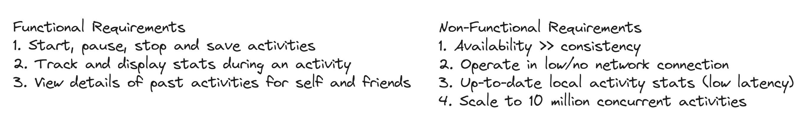
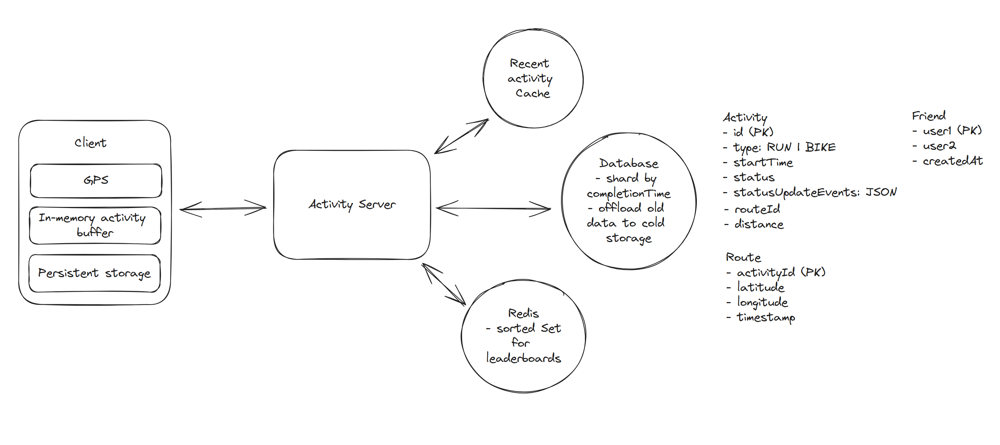

# Question 1 of 15

###### Local device buffering reduces network bandwidth consumption compared to real-time server updates.

1

True

2

False

Correct!

###### Buffering data locally and sending in batches dramatically reduces network calls. Instead of transmitting each GPS coordinate individually, systems can accumulate hundreds of points and send them together, reducing bandwidth usage and server load by orders of magnitude.

# Question 2 of 15

###### Which data structure efficiently handles 2D geographic proximity searches?

1

Linked List

2

Quad-tree

3

Stack

4

Hash Table

Correct!

###### Quad-trees recursively partition 2D space into quadrants, enabling efficient spatial queries for finding nearby locations. Unlike hash tables which provide O(1) lookups for exact matches, quad-trees support range queries essential for proximity searches.

# Question 3 of 15

###### All of the following improve offline functionality EXCEPT:

1

Real-time server validation

2

Background sync mechanisms

3

Periodic data persistence

4

Local data caching

Correct!

###### Real-time server validation requires constant network connectivity, which contradicts offline functionality. Local caching, background sync, and periodic persistence all enable applications to work without network access and synchronize when connectivity returns.

# Question 4 of 15

###### Local buffering reduces the number of network requests to servers.

1

True

2

False

Correct!

###### Buffering accumulates multiple operations before sending them in batches, dramatically reducing network calls. Instead of sending individual updates, systems can buffer hundreds of GPS coordinates and transmit them as a single request, improving efficiency and reducing server load.

# Question 5 of 15

###### Which approach BEST handles millions of high-frequency write operations per second?

1

File-based logging

2

In-memory buffering with batch writes

3

Synchronous API calls

4

Direct database writes

Correct!

###### In-memory buffering with batch writes handles high-frequency operations by temporarily storing writes in fast memory, then periodically flushing batches to persistent storage. This reduces I/O overhead and database contention while maintaining data integrity.

# Question 6 of 15

###### Pre-computed aggregates trade storage space for improved query performance.

1

True

2

False

Correct!

###### Pre-computation is a classic space-time trade-off. Storing calculated results like user totals or rankings requires additional storage but eliminates expensive real-time aggregation queries, providing faster response times at the cost of using more disk space.

# Question 7 of 15

###### When updates occur predictably every few seconds, which communication pattern works best?

1

Server-sent events

2

WebSockets with constant connections

3

Long polling

4

Polling at update intervals

Correct!

###### For predictable updates, polling at the known interval is simpler and more efficient than maintaining persistent connections. WebSockets add complexity for scenarios where update timing is known, and polling can be precisely timed to match the update frequency.

# Question 8 of 15

###### Time-based database sharding optimizes queries for recent data access patterns.

1

True

2

False

Correct!

###### Time-based sharding places recent data on dedicated shards, enabling faster queries when most access patterns target recent records. This matches user behavior where current activities are accessed more frequently than historical data from years ago.

# Question 9 of 15

###### Which storage approach optimizes cost while maintaining performance for aging data?

1

Data tiering with hot/warm/cold levels

2

Compress all data equally

3

Delete old data automatically

4

Keep all data in fast storage

Correct!

###### Data tiering moves less-accessed data to cheaper storage tiers over time. Hot data stays in fast expensive storage, warm data moves to moderate-cost options, and cold data archives to low-cost storage, optimizing the cost-performance balance.

# Question 10 of 15

###### Database read replicas primarily improve which aspect of system performance?

1

Data consistency

2

Storage capacity

3

Write throughput

4

Read throughput

Correct!

###### Read replicas distribute read queries across multiple database instances, significantly improving read throughput. Write operations still go to the primary database, but the read load is spread across replicas, enabling systems to handle much higher query volumes.

# Question 11 of 15

###### Activity tracking applications can function completely offline by storing GPS coordinates locally until network connectivity returns.

1

True

2

False

Incorrect.

###### Modern mobile devices have substantial local storage and GPS capabilities independent of network access. Applications can record location data, calculate distances using algorithms like Haversine formula, and sync accumulated data when connectivity is restored, enabling full offline functionality.

# Question 12 of 15

###### For athlete leaderboards updated frequently, which approach balances real-time updates with system efficiency?

1

Redis sorted sets with incremental updates

2

Hourly batch recalculation

3

Real-time database aggregation

4

In-memory computation only

Correct!

###### Redis sorted sets provide O(log n) insertions and range queries, enabling efficient leaderboard updates. Each activity completion can increment a user's score atomically, maintaining real-time rankings without expensive database aggregations over millions of records.

# Question 13 of 15

###### Which pattern BEST enables friends to track live workout progress with minimal system complexity?

1

Real-time database triggers

2

WebSocket connections to all friends

3

Server-sent events for each GPS point

4

Polling updates at predictable intervals

Correct.

###### For fitness tracking, updates occur predictably every few seconds, making polling efficient. Friends can request updates slightly offset from the athlete's transmission schedule, avoiding the complexity of persistent connections while providing near-real-time experience with acceptable latency. 

# Question 14 of 15

###### Batch processing reduces system resource consumption compared to processing individual operations immediately.

1

True

2

False

Correct!

###### Batch processing amortizes overhead costs across multiple operations. Instead of individual GPS updates requiring separate database transactions, network calls, and I/O operations, batching groups operations together, significantly reducing resource consumption per operation.

# Question 15 of 15

###### Redis sorted sets enable efficient leaderboard operations because they provide which time complexity for rank retrieval?

1

O(log n) logarithmic time

2

O(n) linear time

3

O(1) constant time

4

O(n log n) linearithmic time

Correct.

###### Redis sorted sets use skip lists internally, providing O(log n) time complexity for insertions, deletions, and range queries. This logarithmic performance enables efficient leaderboard operations even with millions of users, unlike O(n) operations that would become prohibitively slow.