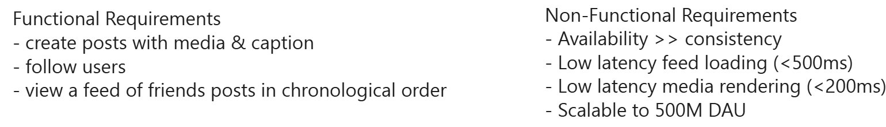
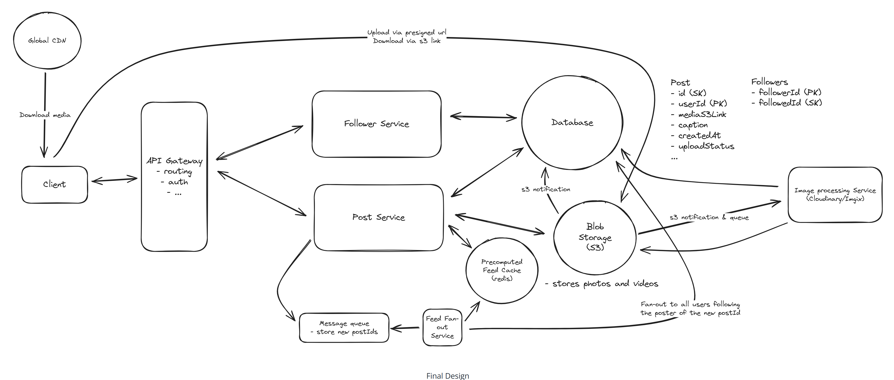

# Question 1 of 15

###### Database indexes eliminate the need for full table scans when querying specific attributes.

1

True

2

False

Correct!

###### Database indexes create data structures (like B-trees) that allow direct lookups based on indexed attributes. Without indexes, queries must scan entire tables, resulting in O(n) complexity. Indexes reduce this to O(log n) or better, essential for maintaining performance as data grows.

# Question 2 of 15

###### Which component caches content at geographic edge locations to reduce latency?

1

Message Queue

2

Database Replica

3

Content Delivery Network

4

Load Balancer

Correct!

###### Content Delivery Networks (CDNs) maintain servers at multiple geographic locations worldwide. When users request content, they're automatically routed to the nearest edge location, dramatically reducing latency compared to fetching from a central origin server.

# Question 3 of 15

Which is NOT a characteristic of in-memory data stores?
1
Persistence by default

2
Microsecond access latency

3
Limited by RAM capacity

4
Higher cost per GB

Correct!

In-memory stores like Redis prioritize speed over durability. While they can be configured for persistence (AOF, snapshots), this isn't their default behavior. They trade durability for microsecond access times, making them ideal for caching but requiring careful consideration of data loss scenarios.

# Question 4 of 15

Fan-out on write precomputes results during write operations to improve read performance.
1
True

2
False

Correct!

Fan-out on write pushes updates to all relevant destinations when data is created or modified. This front-loads computation during writes, enabling simple, fast reads later. The tradeoff is increased write complexity and potential write amplification for highly connected data.

# Question 5 of 15

###### In a hybrid feed generation approach, posts from users with fewer followers are precomputed while posts from celebrities are fetched in real-time.

1

True

2

False

Correct!

###### This is correct. The hybrid approach combines fan-out on write for regular users (precomputing feeds for users with fewer than a threshold like 100,000 followers) with fan-out on read for celebrities (fetching their posts in real-time during feed requests). This balances write amplification concerns with read performance - we avoid millions of writes when celebrities post, while still maintaining fast feed generation for most users through precomputation.

# Question 6 of 15

###### What happens when a user with millions of followers creates new content in a fan-out on write system?

1

Millions of write operations are triggered

2

Only one database write occurs

3

Read operations become slower

4

The write operation completes instantly

Correct.

###### In fan-out on write, creating content triggers updates to every follower's feed. For users with millions of followers, this creates massive write amplification - one logical write becomes millions of physical writes, potentially overwhelming the system and causing significant latency.

# Question 7 of 15

###### Asynchronous processing decouples time-sensitive operations from computationally expensive background tasks.

1

True

2

False

Correct!

###### Asynchronous processing uses queues or event systems to separate immediate user-facing operations from heavy computation. This allows quick responses to users while background workers handle intensive tasks like image processing or bulk updates, improving perceived performance and system stability.

# Question 8 of 15

###### When generating a social media feed from followed accounts, which approach minimizes read latency for most users?

1

Query all followed accounts at read time

2

Cache only popular user content

3

Precompute feeds when content is posted

4

Store all posts in a single table

Correct!

###### Precomputing feeds (fan-out on write) during content creation eliminates the need to aggregate data from multiple sources at read time. While this increases write complexity, it transforms feed retrieval into a simple lookup operation, achieving consistently low read latency.

# Question 9 of 15

###### Chunked multipart uploads enable reliable transfer of files larger than typical HTTP request limits.

1

True

2

False

Correct!

###### HTTP requests typically have size limits (often 2GB or less). Multipart uploads split large files into smaller chunks that can be uploaded independently and reassembled server-side. This enables reliable uploads of multi-gigabyte files while supporting resume capabilities and parallel transfers.

# Question 10 of 15

###### Which caching strategy works BEST for data with a 100:1 read to write ratio?

1

No caching needed

2

Write-through cache

3

Write-back cache

4

Cache-aside with long TTL

Correct.

###### For read-heavy workloads (100:1), cache-aside with long TTL maximizes cache hit rates while minimizing cache maintenance overhead. The infrequent writes don't justify the complexity of write-through or write-back strategies, and the high read ratio makes caching extremely beneficial.

# Question 11 of 15

###### In social platforms, the 'celebrity problem' refers to which scalability challenge?

1

Database queries taking too long

2

Storage costs for celebrity accounts

3

Users with millions of followers creating write amplification

4

Celebrities posting inappropriate content

Correct!

###### The celebrity problem occurs when users with massive follower counts create disproportionate system load. In fan-out on write systems, a single celebrity post triggers millions of feed updates, creating write amplification that can overwhelm infrastructure not designed for such hotspots.

# Question 12 of 15

###### Using different feed generation strategies based on follower count thresholds balances read and write performance.

1

True

2

False

Correct!

###### Hybrid approaches apply different strategies based on data characteristics. For users below a follower threshold, fan-out on write provides fast reads. For high-follower accounts, fan-out on read avoids write amplification. This selective approach optimizes both read and write performance where needed most.

# Question 13 of 15

###### All of the following reduce storage costs for infrequently accessed data EXCEPT:

1

Replicating to more regions

2

Moving data to cold storage

3

Compressing archived data

4

Setting shorter retention periods

Correct!

###### Replicating data to more regions increases storage costs by creating additional copies. Cost reduction strategies include moving to cheaper cold storage (like AWS Glacier), compression to reduce size, and retention policies to delete old data. Multi-region replication improves availability but increases costs.

# Question 14 of 15

###### When designing Instagram's media upload system for files up to 4GB, what is the primary architectural decision that enables both upload reliability and direct client-to-storage efficiency?

1

Storing all media files in a distributed database instead of object storage for faster access

2

Using pre-signed URLs with multipart uploads to allow direct client-to-S3 transfers

3

Implementing server-side file compression before storing in S3 to reduce storage costs

4

Creating a dedicated media processing service that handles all file uploads synchronously

Correct!

###### Pre-signed URLs with multipart uploads solve multiple critical problems for large media files: they enable direct client-to-S3 transfers (bypassing application servers and reducing bandwidth costs), support files larger than HTTP request limits through chunking, improve upload reliability through retry mechanisms for individual chunks, and maintain security through time-limited, scoped access tokens. This approach is essential at Instagram's scale where routing 4GB video uploads through application servers would create massive bottlenecks and infrastructure costs. The multipart upload API automatically handles chunk reassembly, while pre-signed URLs ensure secure direct access without exposing AWS credentials to clients.

# Question 15 of 15

###### Eventual consistency allows temporary inconsistencies between replicas to achieve higher availability and partition tolerance.

1

True

2

False

Correct!

###### Eventual consistency relaxes the requirement for immediate synchronization across all replicas. By allowing temporary divergence, systems can continue operating during network partitions and achieve higher availability. The tradeoff is that different replicas may briefly return different values until synchronization completes.