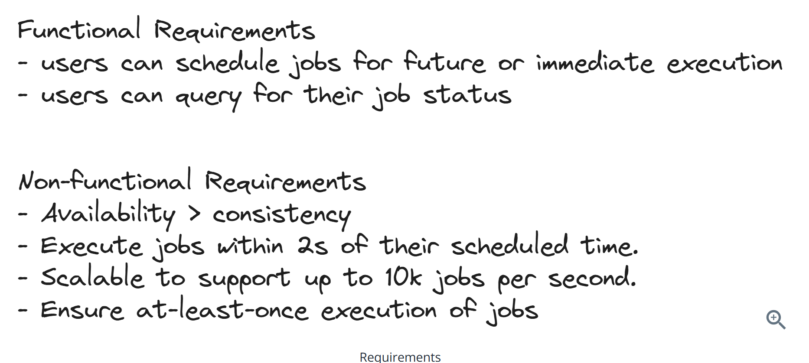
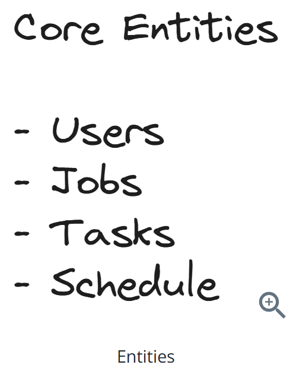
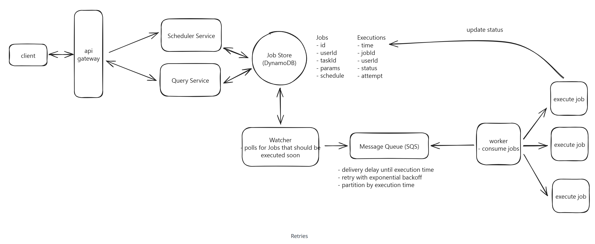

# Question 1 of 15

###### Worker failure detection systems must balance detection speed against false positive rates.

1

True

2

False

Correct!

###### Fast failure detection (short timeouts) can trigger false positives due to network delays or temporary overload, while slow detection (long timeouts) delays recovery. Systems must balance these trade-offs based on their tolerance for duplicate work versus recovery speed.

# Question 2 of 15

###### What is the primary purpose of visibility timeouts in message queues?

1

Encrypting messages for security

2

Compressing messages for storage

3

Detecting worker failures automatically

4

Routing messages to specific workers

Correct!

###### Visibility timeouts make messages invisible to other workers when consumed, then automatically make them visible again if not deleted within the timeout period. This mechanism detects worker failures without requiring explicit health checks or coordination.

# Question 3 of 15

###### Which property makes message queues suitable for handling traffic spikes in distributed systems?

1

Persistent storage capabilities

2

Buffering and decoupling producers from consumers

3

Built-in authentication mechanisms

4

Automatic data compression

Correct!

###### Message queues buffer incoming requests and decouple producers from consumers, allowing producers to continue sending messages even when consumers are temporarily overwhelmed. This buffering smooths out traffic spikes and prevents cascading failures.

# Question 4 of 15

###### Separating job definitions from execution instances enables efficient recurring task management.

1

True

2

False

Correct!

###### This separation allows one job definition to generate multiple execution instances over time. For recurring tasks, the template stays constant while new execution records are created for each occurrence, avoiding data duplication and enabling efficient querying.

# Question 5 of 15

###### Which architecture BEST achieves sub-second job execution precision at scale?

1

Real-time database triggers

2

Single database polling every second

3

Distributed locks with heartbeats

4

Two-phase: periodic querying plus priority queue

Correct!

###### Two-phase architecture combines durable storage with fast in-memory queuing. Periodic database queries (every few minutes) load upcoming jobs into a priority queue, which can then execute jobs with sub-second precision without overwhelming the database.

# Question 6 of 15

###### Time-based database partitioning optimizes queries for recently scheduled jobs.

1

True

2

False

Correct!

###### Time-based partitioning places jobs scheduled around the same time in the same partition. Since job schedulers primarily query for upcoming jobs, this strategy ensures most queries hit only 1-2 partitions rather than scanning the entire dataset.

# Question 7 of 15

###### When a worker processing a 5-minute job crashes after 30 seconds, what determines retry timing?

1

The worker's heartbeat interval

2

The database transaction timeout

3

The message queue's visibility timeout

4

The job's original schedule time

Incorrect.

###### Visibility timeout controls when failed jobs become available for retry. If set to 60 seconds, other workers can pick up the job within 60 seconds of the original worker's failure, regardless of the job's complexity or duration.

# Question 8 of 15

###### In an at-least-once execution model, job operations should be idempotent to avoid duplicate side-effects.

1

True

2

False

Correct!

###### At-least-once delivery means jobs may execute more than once due to retries or failures. While the delivery guarantee doesn't automatically make operations idempotent, developers should design job operations to be idempotent to safely handle the potential duplicate executions. This prevents issues like double-billing or inconsistent state when jobs are retried. Exactly-once systems avoid this issue entirely, but at-least-once systems require careful idempotent design.

# Question 9 of 15

###### What does exponential backoff prevent in job retry systems?

1

Database connection pooling issues

2

Jobs from being executed twice

3

Message queue memory overflow

4

Worker resource exhaustion from rapid retries

Correct!

###### Exponential backoff increases delay between retries (1s, 2s, 4s, 8s...), preventing failing jobs from overwhelming system resources. Without it, rapidly retrying jobs could consume all worker capacity and prevent successful jobs from executing.

# Question 10 of 15

###### What happens when a worker fails to renew its job lease before expiration?

1

The lease is automatically extended

2

The job completes successfully

3

The job is marked as failed

4

Other workers can claim the job

Correct!

###### Lease-based coordination prevents multiple workers from processing the same job simultaneously. When a lease expires, the job becomes available for other workers to claim, enabling automatic recovery from worker failures without requiring explicit coordination.

# Question 11 of 15

###### Job scheduling systems requiring 2-second execution precision should not rely solely on database polling mechanisms.

1

True

2

False

Correct!

###### Database polling every 2 seconds at scale would be inefficient and imprecise due to query latency, processing time, and network delays. High-precision systems need in-memory priority queues or message queues with built-in delay capabilities to achieve sub-second timing.

# Question 12 of 15

###### What is the primary advantage of separating recurring job definitions from their execution instances?

1

Provides stronger consistency guarantees

2

Enables efficient querying of upcoming jobs

3

Reduces storage requirements significantly

4

Eliminates the need for scheduling logic

Correct!

###### Separating definitions from instances allows efficient time-based querying of execution instances without evaluating complex CRON expressions. The system can quickly find jobs due in the next few minutes by querying execution instances rather than processing all job definitions.

# Question 13 of 15

###### Which approach BEST handles scaling job processing to 10,000 jobs per second?

1

Manual worker deployment and monitoring

2

Container-based async worker pool with auto-scaling groups

3

Vertical scaling with larger database instances

4

Single-threaded processing for consistency

Correct!

###### Container-based workers with auto-scaling groups provide elastic scaling based on queue depth, cost efficiency with resource sharing, and operational simplicity. This approach can dynamically adjust capacity to handle varying job loads while maintaining cost effectiveness.

# Question 14 of 15

###### Two-phase scheduling architectures trade database query frequency for execution timing precision.

1

True

2

False

Correct!

###### Two-phase systems query the durable database infrequently (every few minutes) but use fast in-memory queues for precise timing. This trades less frequent database load for better execution precision, optimizing both performance and timing accuracy.

# Question 15 of 15

###### When background job sync operations consume excessive database resources, which optimization works best?

1

Increase sync frequency for smaller batches

2

Switch to event-driven architecture

3

Implement connection pooling optimization

4

Add read replicas for sync queries

Incorrect.

###### Read replicas allow sync operations to query separate database instances without impacting primary database performance. This distributes the read load while maintaining data consistency, enabling more frequent sync operations without affecting main application performance.