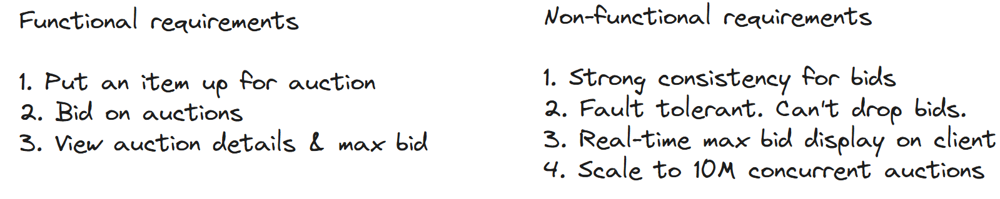
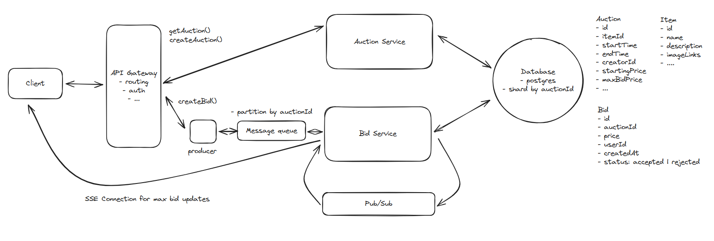

# Question 1 of 15

###### Message queues ensure durability by persisting messages to disk storage.

1

True

2

False

Correct!

###### Durable message queues write messages to disk before acknowledging receipt. This ensures messages survive system failures, trading some latency for guaranteed delivery.

# Question 2 of 15

###### Which concurrency control method avoids holding database locks?

1

Pessimistic locking

2

Optimistic concurrency control

3

Table-level locking

4

Exclusive locking

Correct!

###### Optimistic concurrency control reads data without locks, then validates no changes occurred during updates. This avoids lock contention at the cost of potential retries.

# Question 3 of 15

###### Overwriting records destroys audit trails and historical information.

1

True

2

False

Correct!

###### Preserving historical data by appending rather than updating enables debugging, auditing, and dispute resolution. Always consider immutable append-only designs for critical data.

# Question 4 of 15

###### Which is NOT a real-time server-to-client communication pattern?

1

Server-Sent Events

2

Long polling

3

Database triggers

4

WebSocket connections

Correct!

###### Database triggers execute server-side logic but don't communicate with clients. SSE, WebSockets, and long polling all enable real-time client updates through different mechanisms.

# Question 5 of 15

###### Atomic compare-and-swap operations prevent lost updates in concurrent systems.

1

True

2

False

Correct!

###### Compare-and-swap atomically checks a value hasn't changed before updating it. This primitive operation underlies many lock-free algorithms and prevents race conditions.

# Question 6 of 15

###### What occurs when optimistic concurrency control detects conflicting updates?

1

Database locks permanently

2

Transaction retries with fresh data

3

Updates merge automatically

4

System applies both changes

Correct!

###### Optimistic concurrency control aborts transactions when conflicts are detected, requiring the application to retry with current data. This trades occasional retries for better concurrency.

# Question 7 of 15

###### Which architectural pattern BEST handles sudden traffic spikes?

1

Client-side caching

2

Synchronous processing

3

Message queue buffering

4

Database connection pooling

Correct!

###### Message queues decouple request acceptance from processing, allowing systems to absorb traffic spikes without dropping requests. Work is processed at sustainable rates.

# Question 8 of 15

###### Message queues like Kafka guarantee that bids will never be lost even if the bidding service crashes during processing.

1

True

2

False

Correct!

###### Message queues provide durability by persisting messages to disk and can be configured for replication. When a bid is written to Kafka, it's safely stored even if the Bid Service crashes. The service can resume processing from where it left off once it recovers, ensuring no bids are lost. This is why message queues are essential for fault-tolerant auction systems where dropping bids would be catastrophic.

# Question 9 of 15

###### Why are Server-Sent Events preferred over polling for one-way updates?

1

Better error handling

2

Bidirectional communication support

3

Lower server resource usage

4

Simpler client implementation

Correct!

###### SSE maintains one persistent connection per client instead of repeated polling requests, dramatically reducing server load and network traffic for one-way updates.

# Question 10 of 15

###### Storing the maximum bid amount directly in the auction table eliminates the need for distributed transactions when updating bid data.

1

True

2

False

Correct!

###### By storing the computed maximum bid value in the auction table alongside the source data, we can update both the bid record and maximum bid within a single database transaction. This eliminates the complexity of distributed transactions that would be required if the maximum bid were stored in a separate system like Redis cache.

# Question 11 of 15

###### Systems need real-time updates across distributed servers. Which pattern scales best?

1

Shared database polling

2

Direct server-to-server HTTP calls

3

Publish-subscribe messaging

4

Synchronized cron jobs

Correct!

###### Pub/sub decouples publishers from subscribers, allowing each server to broadcast updates without knowing about other servers. This scales horizontally without coordination overhead.

# Question 12 of 15

###### Partitioning message queues by auction ID ensures all bids for the same auction are processed in order while allowing parallel processing across different auctions.

1

True

2

False

Correct!

###### When message queues are partitioned by auction ID, all bids for a specific auction go to the same partition, guaranteeing ordered processing within that auction. Meanwhile, bids for different auctions can be processed in parallel across different partitions, providing both consistency and scalability.

# Question 13 of 15

###### When designing a bidding system that needs to handle concurrent bid submissions, which approach provides the BEST balance of consistency and performance?

1

Store the maximum bid directly in the auction table with optimistic concurrency control

2

Lock all bid rows for the auction using SELECT ... FOR UPDATE

3

Use eventual consistency and resolve conflicts asynchronously

4

Store the maximum bid in Redis cache with atomic operations

Correct.

###### Storing the maximum bid in the auction table with optimistic concurrency control provides strong consistency while minimizing lock contention. It avoids the performance issues of locking many rows, eliminates distributed transaction complexity between cache and database, and maintains immediate consistency unlike eventual consistency approaches.

# Question 14 of 15

###### In an auction system using Server-Sent Events (SSE) to broadcast real-time bid updates, what happens when a new bid is processed by Server A but users watching the same auction are connected to Server B?

1

Users connected to Server B will not receive the update unless additional coordination infrastructure is implemented

2

Server A automatically forwards the update to Server B through built-in SSE load balancing

3

Server B will automatically poll Server A every few seconds to synchronize bid updates

4

The SSE protocol handles cross-server communication natively, so all users receive updates regardless of which server they're connected to

Correct.

Answer is 1.

###### SSE connections are maintained between individual clients and specific servers. When users watching the same auction are connected to different servers, there's no built-in mechanism for servers to coordinate with each other. If a bid update is processed by Server A, only clients connected to Server A will receive the real-time update through their SSE connections. Users connected to Server B will miss the update because Server B has no knowledge of the bid processed by Server A. This scaling challenge requires additional infrastructure like Redis Pub/Sub or message queues to coordinate bid updates across multiple servers, allowing each server to broadcast updates to its own connected clients.

# Question 15 of 15

###### Using an external cache like Redis to store maximum bid amounts requires distributed transactions to maintain consistency between the cache and database.

1

True

2

False

Correct!

###### This is true. When caching the maximum bid in an external system like Redis, you create a consistency problem between two separate systems - the cache and the database. As the article explains: 'We solved the issue with locking a lot of rows for a long time by moving the max bid to a cache, but that introduced a new issue with consistency between the cache and the database.' To ensure both systems remain synchronized, you need distributed transactions (like two-phase commit) or accept eventual consistency trade-offs. This is why the article recommends storing the max bid directly in the database instead: it avoids the complexity of coordinating updates across multiple systems while maintaining strong consistency within a single database transaction.