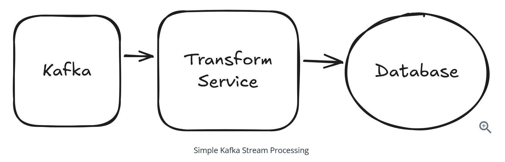
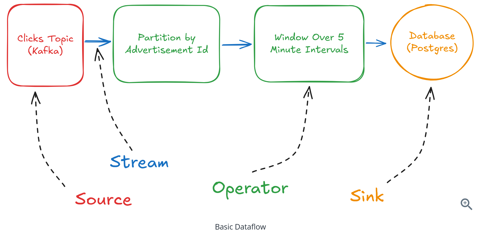
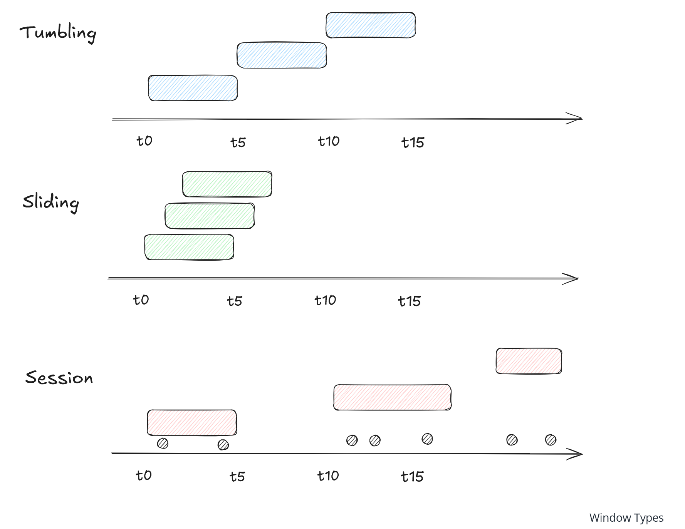
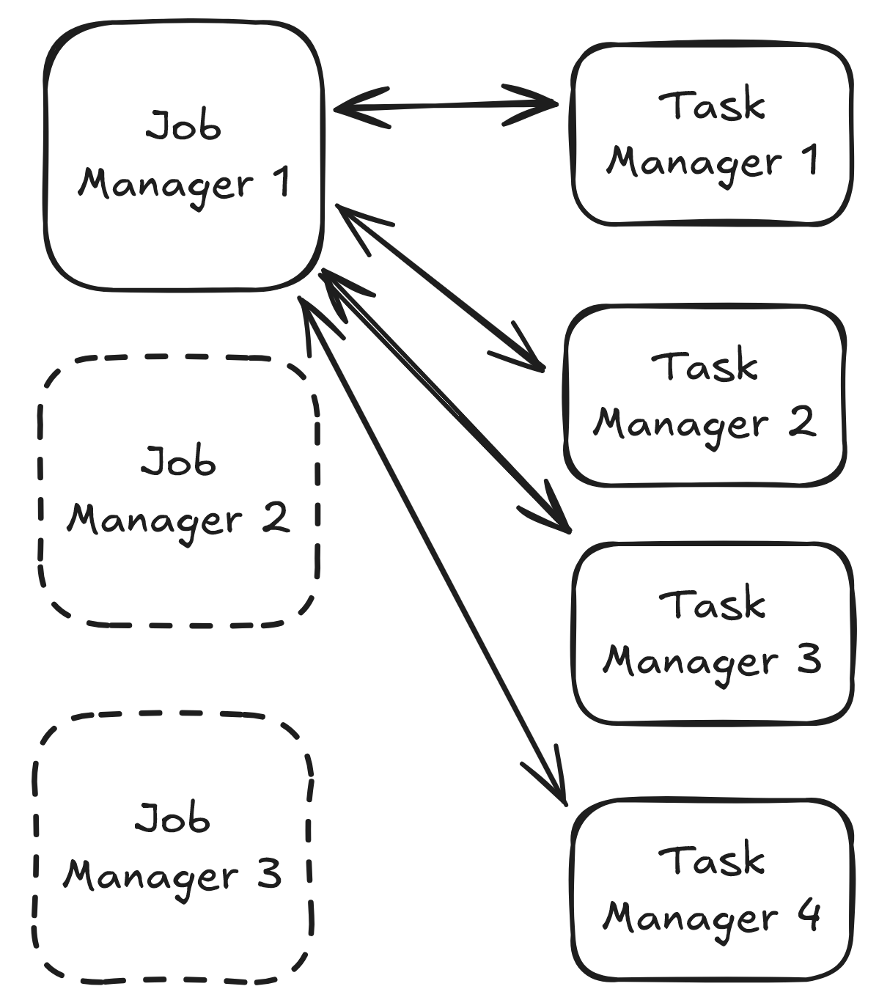
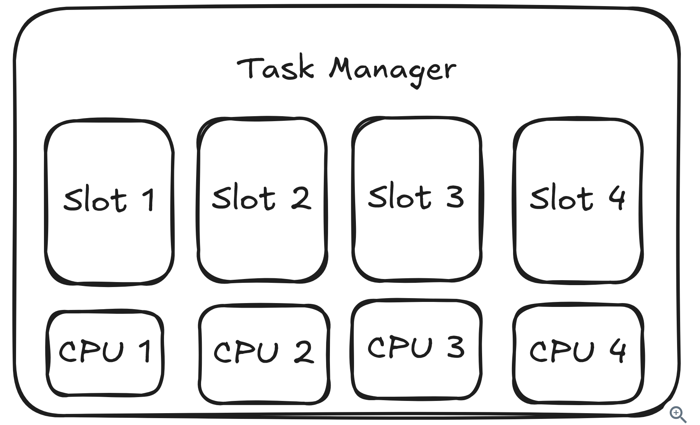

# Question 1 of 15

###### What is Apache Flink primarily designed for?

1

Static web content serving

2

Batch processing large datasets

3

Stateful stream processing of continuous data

4

Database transaction management

Correct!

###### Flink is a dataflow engine specifically built for stateful stream processing, allowing you to process continuous streams of data while maintaining state across events.

# Question 2 of 15

###### In Flink's dataflow graph, what are the nodes called?

1

Streams

2

Partitions

3

Operators

4

Channels

Correct!

###### In Flink's dataflow graph, nodes are called operators and represent the computations performed on data, while edges are called streams and represent the data flowing between operators.

# Question 3 of 15

###### Flink operators can maintain internal state across multiple events to enable complex stream processing operations.

1

True

2

False

Correct!

###### Stateful operators are crucial for non-trivial stream processing. They allow Flink to maintain information across events, such as counting clicks in a time window or tracking user sessions.

# Question 4 of 15

###### What is the purpose of watermarks in Flink?

1

To handle out-of-order and late-arriving events

2

To compress data streams

3

To encrypt streaming data

4

To balance load across task managers

Correct!

###### Watermarks are timestamps that flow through the system declaring 'all events with timestamps before this watermark have arrived,' enabling Flink to handle out-of-order events and decide when to trigger window computations.

# Question 5 of 15

###### Which type of window would you use for non-overlapping 5-minute intervals?

1

Sliding windows

2

Global windows

3

Session windows

4

Tumbling windows

Correct!

###### Tumbling windows are fixed-size, non-overlapping windows. A 5-minute tumbling window would create distinct intervals like \[0-5min\], \[5-10min\], \[10-15min\], etc.

# Question 6 of 15

###### Flink's checkpointing mechanism enables exactly-once processing guarantees even when task failures occur.

1

True

2

False

Correct!

###### Flink uses checkpointing based on the Chandy-Lamport algorithm to create consistent snapshots of the entire job state, allowing recovery to the exact point before failure occurred.

# Question 7 of 15

###### In Flink's cluster architecture, what is the primary role of the Job Manager?

1

Manage network connections

2

Store application state

3

Execute data processing tasks

4

Coordinate scheduling, checkpoints, and handle failures

Correct!

###### The Job Manager serves as the coordinator of the Flink cluster, responsible for scheduling tasks, coordinating checkpoints, handling failures, and managing the overall execution of jobs.

# Question 8 of 15

###### Task slots in Flink represent the basic unit of resource scheduling and parallelism.

1

True

2

False

Correct!

###### Task slots are the fundamental unit of resource allocation in Flink, typically corresponding to CPU cores and determining how many parallel tasks can run on a Task Manager.

# Question 9 of 15

###### Which state backend would be most appropriate for applications with state larger than available memory?

1

FS State Backend

2

RocksDB State Backend

3

Memory State Backend

4

Network State Backend

Correct!

###### RocksDB State Backend can handle state larger than memory by storing working state on disk with efficient caching, making it suitable for applications with large state requirements. While FS State Backend can store checkpoints to disk, it keeps all working state in memory, so applications are still limited by available heap memory. Memory State Backend also keeps everything in memory, and Network State Backend is not a real Flink option.

# Question 10 of 15

###### When a Flink task fails, only the failed task needs to be restarted while other tasks continue processing.

1

True

2

False

Incorrect.

###### When a failure occurs, Flink stops the entire job, restores from the latest checkpoint, and restarts all tasks to maintain exactly-once processing guarantees and consistent state.

# Question 11 of 15

###### What happens to Kafka consumer offsets during Flink's failure recovery process?

1

They continue from where they left off

2

They are reset to the beginning

3

They are randomly assigned

4

They rewind to the checkpoint position

Correct!

###### During recovery, Flink sources rewind to their checkpoint positions. For Kafka consumers, this means going back to the offset stored in the checkpoint to ensure exactly-once processing.

# Question 12 of 15

###### Flink's exactly-once guarantees automatically extend to all external systems like databases and APIs.

1

True

2

False

Incorrect.

###### Flink guarantees exactly-once semantics for internal state operations, but external systems may still see duplicate writes during failure recovery. You need idempotent operations or transactional behavior for end-to-end exactly-once processing.

# Question 13 of 15

###### Which windowing strategy would be best for detecting user activity patterns where you want overlapping 10-minute windows updated every 2 minutes?

1

Session windows with 10-minute timeout

2

Sliding windows of 10 minutes with 2-minute slide

3

Tumbling windows of 10 minutes

4

Global windows with custom triggers

Correct!

###### Sliding windows with a 10-minute window size and 2-minute slide interval create overlapping windows that update every 2 minutes, perfect for detecting patterns that require temporal overlap.

# Question 14 of 15

###### Flink is always the best choice for any stream processing problem, regardless of complexity.

1

True

2

False

Correct!

###### Flink adds significant operational overhead and complexity. For simple stream transformations, a basic Kafka consumer service might be sufficient. Flink is best suited for complex stateful processing that requires its advanced features.

# Question 15 of 15

###### What is the main challenge that watermarks solve in distributed stream processing?

1

Memory management

2

Determining when all events for a time window have arrived

3

Network latency between sources and sinks

4

Load balancing across task managers

Correct!

###### Watermarks solve the fundamental problem of knowing when to trigger window computations by providing a mechanism to declare that all events with timestamps before a certain point have been processed, even when events arrive out of order.