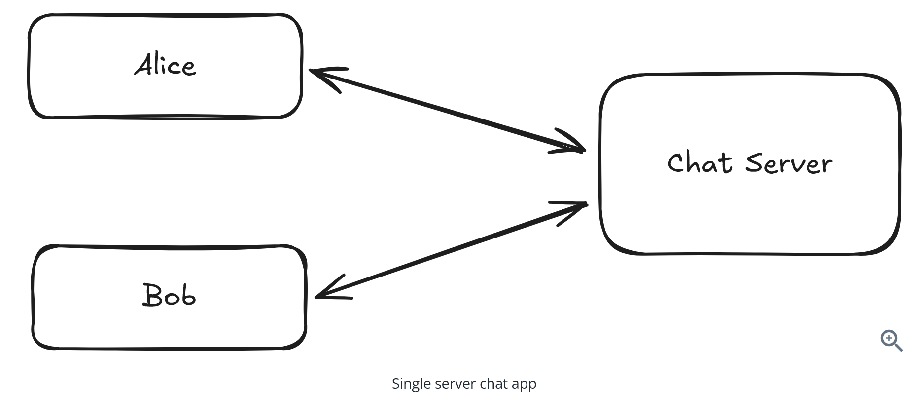
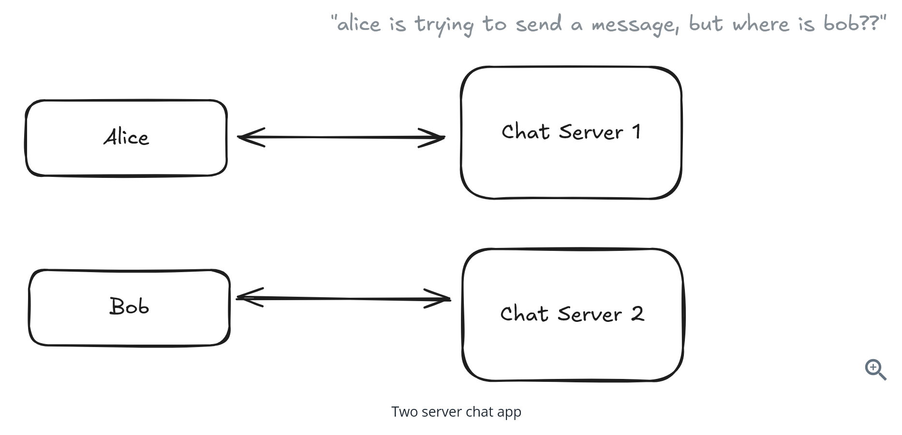
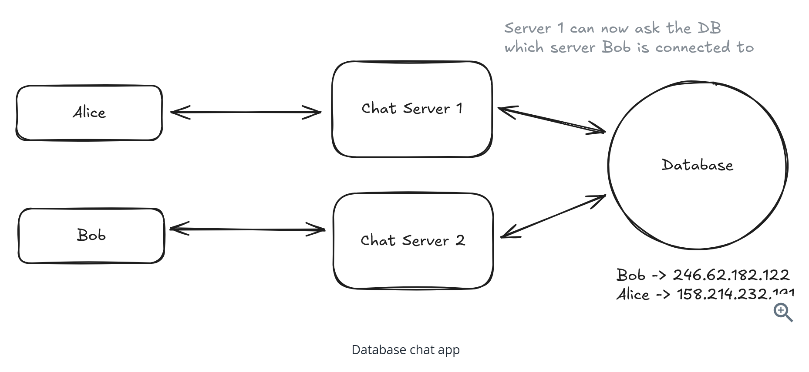
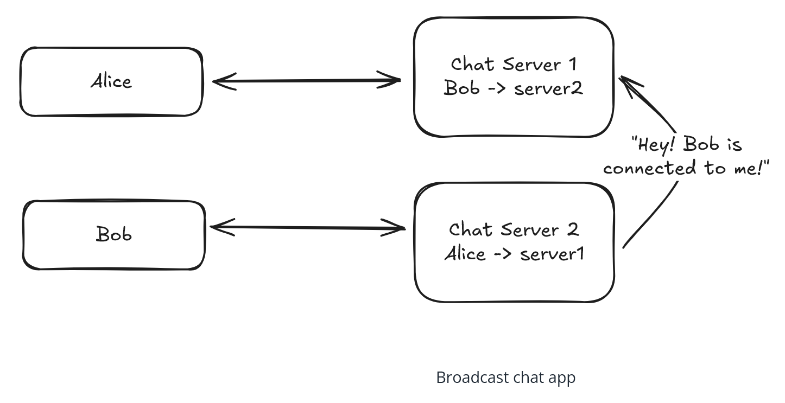
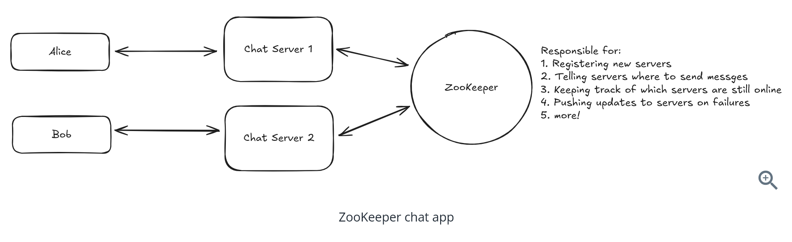
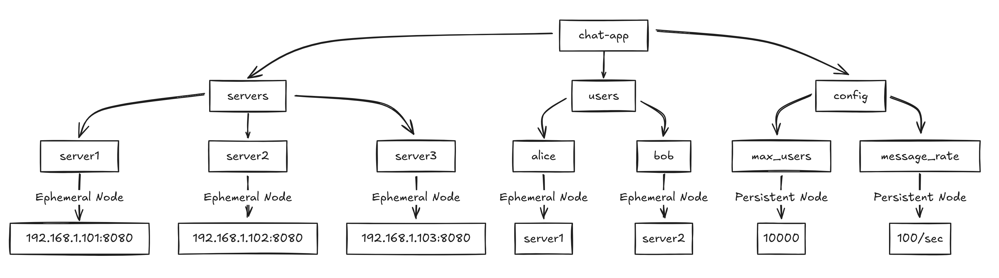
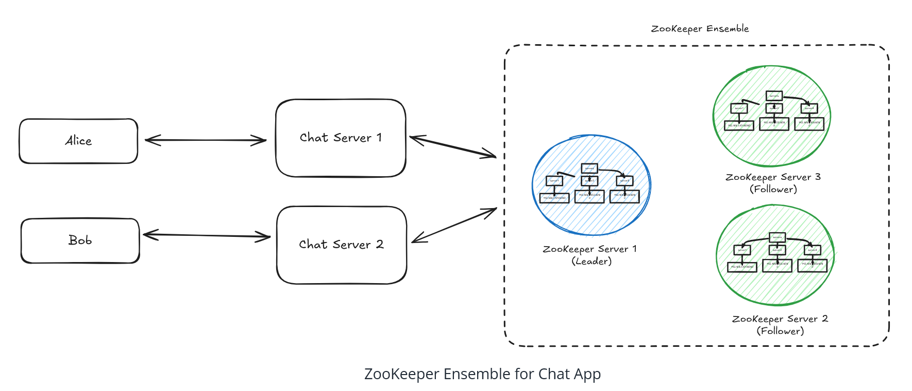
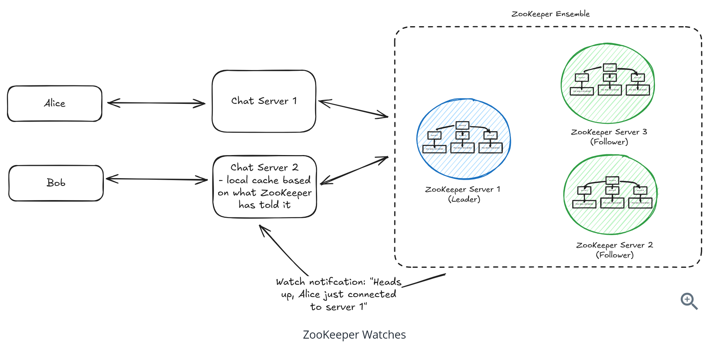
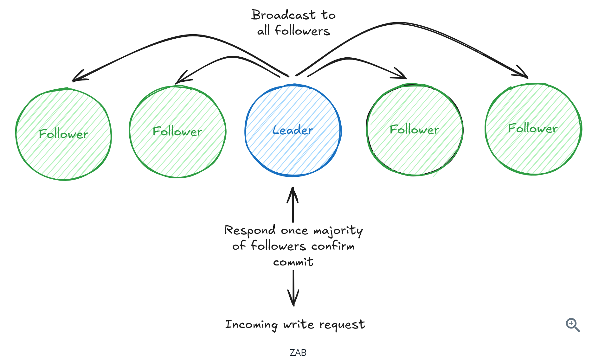
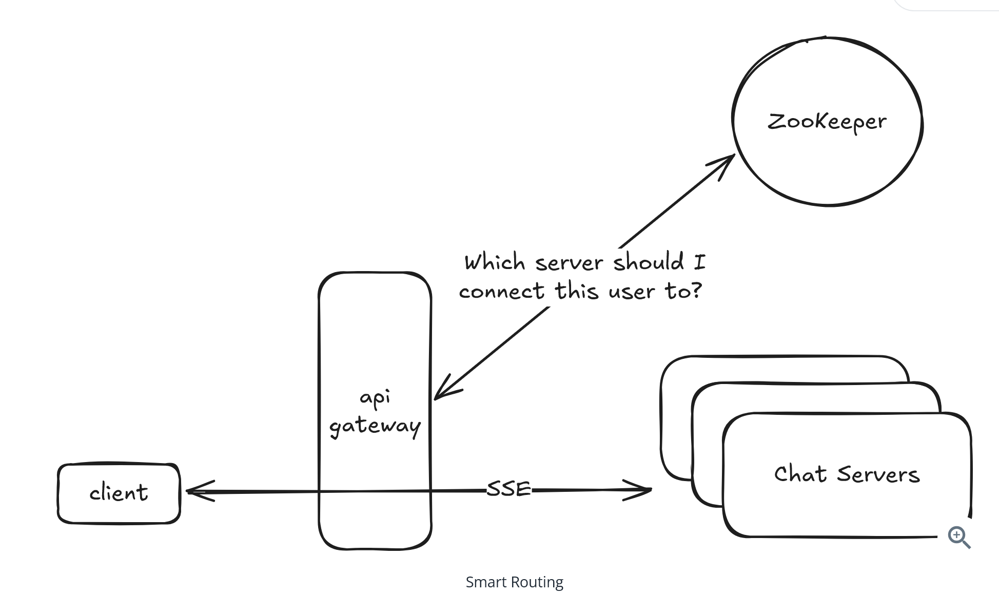
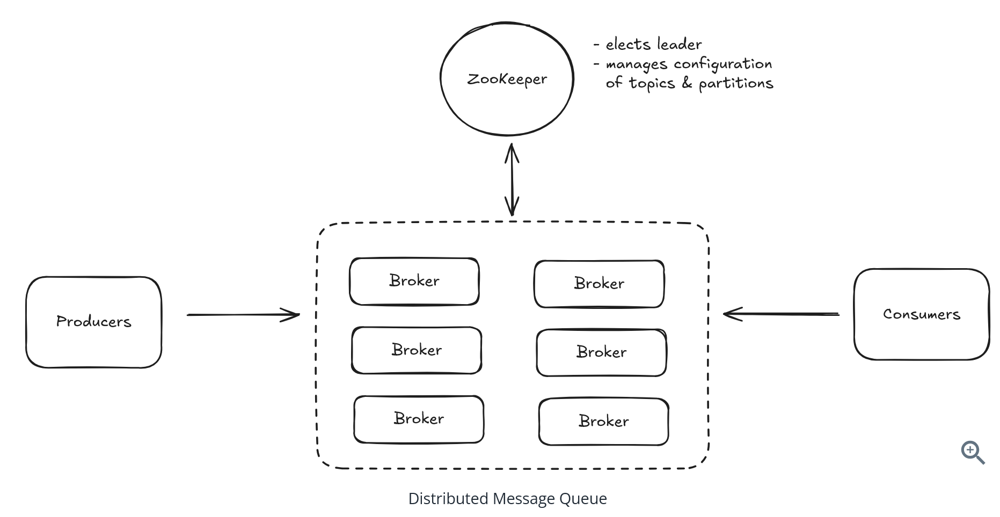

# Question 1 of 16

###### What is ZooKeeper primarily used for in distributed systems?

1

Distributed coordination and metadata management

2

Machine learning model training

3

Real-time video streaming

4

High-volume data storage and analytics

Correct!

###### ZooKeeper is a distributed coordination service designed to help manage configuration, naming, synchronization, and group services for distributed applications. It's not meant for bulk data storage but rather for coordinating distributed systems through small metadata operations.

# Question 2 of 16

###### What is a ZNode in ZooKeeper?

1

A backup copy of ZooKeeper's transaction log

2

A physical server in the ZooKeeper cluster

3

A data node in ZooKeeper's hierarchical namespace that can store data and metadata

4

A network connection between ZooKeeper servers

Correct!

###### ZNodes are the fundamental data units in ZooKeeper's tree-like namespace. Each ZNode can store small amounts of data (typically under 1MB) along with metadata, and they're organized in a hierarchical structure similar to a file system but where each 'folder' can also contain data.

# Question 3 of 16

###### Ephemeral ZNodes are automatically deleted when the client session that created them expires or disconnects.

1

True

2

False

Correct!

###### Ephemeral ZNodes are tied to client sessions and provide automatic cleanup when clients fail. This is crucial for detecting server failures and maintaining accurate service discovery information without manual intervention.

# Question 4 of 16

###### Which type of ZNode would be most appropriate for implementing a message queue where order matters?

1

Ephemeral ZNodes

2

Watch ZNodes

3

Sequential ZNodes

4

Persistent ZNodes

Incorrect.

###### Sequential ZNodes automatically append a monotonically increasing counter, making them perfect for ordered operations like message queues. The sequence numbers ensure messages are processed in the correct order across distributed systems.

# Question 5 of 16

###### ZooKeeper ZNodes should be kept under 1MB in size and the entire dataset should fit in memory.

1

True

2

False

Correct!

###### ZooKeeper is optimized for small coordination data, not bulk storage. ZNodes are limited to 1MB and the entire dataset is kept in memory for fast access. This design supports high-performance coordination but limits data volume.

# Question 6 of 16

###### ZooKeeper watches are persistent and continue to fire notifications for all subsequent changes to a ZNode.

1

True

2

False

Incorrect.

###### ZooKeeper watches are one-time notifications. After a watch fires, it must be re-registered to receive future notifications. This design prevents overwhelming clients with notifications and gives them control over when to re-establish watches.

# Question 7 of 16

###### In a ZooKeeper ensemble, what role does the leader server play?

1

Stores backup copies of data

2

Monitors follower health

3

Processes all write requests and coordinates updates

4

Only serves read requests

Incorrect.

###### The leader is responsible for processing all write requests and coordinating updates across the ensemble using the ZAB protocol. This centralized approach ensures consistency and ordering of all state changes.

# Question 8 of 16

###### In ZooKeeper, read operations can be served by any server in the ensemble, while write operations must go through the leader.

1

True

2

False

Correct!

###### This design optimizes for read-heavy workloads. Reads are served locally by any server for high throughput, while writes go through the leader to ensure consistency and proper ordering through the ZAB protocol.

# Question 9 of 16

###### In ZooKeeper's leader election pattern using sequential ephemeral nodes, how is the leader determined?

1

The node with the lowest sequence number

2

The node that was created first chronologically

3

A random node among all candidates

4

The node with the highest sequence number

Incorrect.

###### The node with the lowest sequence number becomes the leader. This ensures a deterministic election process and natural failover - when the current leader fails, the node with the next lowest sequence number automatically becomes the new leader.

# Question 10 of 16

###### ZooKeeper's distributed locks can handle high-frequency locking scenarios with hundreds of lock acquisitions per second.

1

True

2

False

Incorrect.

###### ZooKeeper locks are not designed for high-frequency scenarios. Each lock operation involves creating ZNodes and coordinating across the ensemble, making them better suited for longer-held locks. For high-frequency locking, Redis-based locks are more appropriate.

# Question 11 of 16

###### In a chat application using ZooKeeper for service discovery, how would servers discover which server a user is connected to?

1

Read the user's ephemeral ZNode containing server information

2

Broadcast messages to all servers

3

Use consistent hashing algorithms

4

Query a database for user location

Correct!

###### Each user's connection creates an ephemeral ZNode storing their server location. Other servers can read this ZNode to route messages correctly. When users disconnect, their ephemeral nodes automatically disappear, keeping the routing information current.

# Question 12 of 16

###### What is the primary purpose of the ZAB (ZooKeeper Atomic Broadcast) protocol?

1

To load balance client requests

2

To encrypt communications between servers

3

To achieve consensus and maintain consistency across the ensemble

4

To compress data efficiently

Correct!

###### ZAB is ZooKeeper's consensus protocol that ensures all servers agree on the state of the system. It handles leader election and atomic broadcast of updates, maintaining consistency even when servers fail or network issues occur.

# Question 13 of 16

###### Which consistency guarantee does ZooKeeper provide to ensure clients see updates in the correct order?

1

Strong consistency

2

Eventual consistency

3

Sequential consistency

4

Causal consistency

Correct!

###### ZooKeeper provides sequential consistency, meaning updates from a client are applied in the order they were sent. If a client updates node A then node B, all servers will see the update to A before the update to B.

# Question 14 of 16

###### If a ZooKeeper ensemble loses its majority quorum due to network partition, it will continue processing write requests to maintain availability.

1

True

2

False

Correct!

###### ZooKeeper prioritizes consistency over availability. Without a majority quorum, it stops processing writes to prevent split-brain scenarios where different partitions might make conflicting decisions. This ensures data consistency when the partition is resolved.

# Question 15 of 16

###### Setting ZooKeeper session timeouts too short can cause unnecessary failovers during temporary network issues.

1

True

2

False

Correct!

###### Session timeout configuration is critical. Too short timeouts cause false failures during brief network hiccups, while too long timeouts delay detection of actual failures. The typical range is 10-30 seconds to balance responsiveness with stability.

# Question 16 of 16

###### Which alternative to ZooKeeper is most commonly used in cloud-native Kubernetes environments?

1

Redis

2

Cassandra

3

MongoDB

4

etcd

Correct!

###### etcd is the coordination service that powers Kubernetes and is popular in cloud-native environments. Like ZooKeeper, it provides distributed key-value storage with strong consistency, but offers modern HTTP/JSON and gRPC APIs that integrate well with cloud-native tooling.

