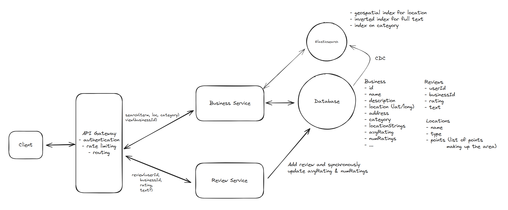

Functional Requirements
- search for businesses
- view bi=usinesses & reviews
- review a business

Non-functional Requirements
- availability >> consistency
- low latency search (<500ms)
- scalable to 100M DAU & 10M businesses

Core Entities
- Users
- Businesses
- Reviews

# Question 1 of 15

###### Pre-computing business average ratings trades storage space for improved search query performance.

1

True

2

False

Correct!

###### Pre-computing average ratings stores calculated results (like average star ratings) in the business table to avoid expensive JOIN operations and aggregate calculations during search queries. This fundamental trade-off exchanges disk space for CPU time and reduced latency, which is crucial for Yelp's search performance requirements.

# Question 2 of 15

###### Which data structure enables efficient full-text search?

1

Binary heap

2

B-tree index

3

Hash table

4

Inverted index

Correct!

###### Inverted indexes map terms to document locations, enabling O(1) lookup for text searches. This structure powers search engines and full-text databases.

# Question 3 of 15

###### Database constraints provide stronger data integrity than application-level checks.

1

True

2

False

Correct!

###### Database constraints enforce rules at the lowest level, preventing any process from violating them. Application checks can be bypassed by direct database access.

# Question 4 of 15

###### Which is NOT suitable for geographic proximity searches?

1

R-tree

2

B-tree

3

Quadtree

4

Geohash

Correct!

###### B-trees excel at one-dimensional data but cannot efficiently index two-dimensional geographic coordinates. Quadtrees, R-trees, and geohashes are designed for spatial data.

# Question 5 of 15

###### Eventual consistency is acceptable for Yelp's business rating system because users can tolerate slightly outdated average ratings.

1

True

2

False

Correct!

###### True. The article explicitly states that eventual consistency is fine for Yelp's requirements. Users searching for businesses can tolerate average ratings that are slightly behind real-time updates, as the core user experience doesn't require immediate consistency when new reviews are added. This trade-off allows for better system performance and scalability.

# Question 6 of 15

###### What occurs when optimistic locking detects concurrent modifications?

1

Database locks permanently

2

Transaction commits successfully

3

Update merges automatically

4

Transaction rolls back

Correct!

###### Optimistic locking checks version numbers before committing. When conflicts are detected, the transaction rolls back, requiring the client to retry with fresh data.

# Question 7 of 15

###### When implementing a constraint that users can only leave one review per business, which approach provides the strongest data integrity guarantee?

1

Store review counts in a separate cache layer

2

Implement a distributed lock across multiple services

3

Use a unique database constraint on (user\_id, business\_id)

4

Check for existing reviews in the application layer before inserting

Correct!

###### Database constraints enforce data integrity at the persistence layer, making it impossible to violate the constraint regardless of which service or process attempts to insert data. This prevents race conditions and ensures consistency even when multiple services interact with the database, unlike application-layer checks which can be bypassed or fail under concurrent access.

# Question 8 of 15

###### B-tree indexes efficiently handle two-dimensional geographic range queries.

1

True

2

False

Correct!

###### B-trees are optimized for one-dimensional data. Geographic queries need spatial indexes like R-trees or quadtrees that understand two-dimensional relationships.

# Question 9 of 15

###### When designing a system that needs to handle location-based searches, text searches, and category filtering simultaneously, what is the primary limitation of using traditional B-tree indexes?

1

B-tree indexes require too much storage space for geographic coordinates

2

B-tree indexes are optimized for single-dimension queries but struggle with multi-dimensional spatial data

3

B-tree indexes cannot be created on multiple columns simultaneously

4

B-tree indexes cannot handle string data types efficiently

Correct!

###### B-tree indexes are excellent for single-dimension range queries but are not well-suited for multi-dimensional spatial queries like geographic searches. They treat latitude and longitude as independent values rather than understanding their 2D spatial relationship, making them inefficient for location-based searches that require range queries on both dimensions simultaneously.

# Question 10 of 15

###### Using a cron job to periodically update business average ratings provides real-time accuracy for users viewing search results.

1

True

2

False

Correct!

###### Periodic updates via cron jobs do not provide real-time accuracy. When a user leaves a new review, the average rating won't be updated until the next scheduled cron job runs (which could be hours or days later). This leads to stale data where users see outdated average ratings that don't reflect recent reviews. For real-time accuracy, synchronous updates or near-real-time processing would be required.

# Question 11 of 15

###### A system processes 1000 reads per write. Which architecture pattern fits best?

1

Read replicas with caching

2

Synchronous message queue

3

Single powerful server

4

Write-optimized database

Correct!

###### Read-heavy workloads benefit from horizontal scaling through replicas and aggressive caching. This pattern efficiently handles the 1000:1 read/write ratio.

# Question 12 of 15

###### Using a message queue to handle review submissions is necessary when the system processes 100,000 review writes per day.

1

True

2

False

Correct.

###### 100,000 writes per day equals approximately 1 write per second, which is a very low write volume that modern databases can easily handle without requiring a message queue. Message queues add complexity and are typically needed for much higher write volumes (thousands of writes per second) or when you need to decouple services for other architectural reasons. For this low volume, a simple synchronous approach with proper database constraints would be more appropriate and demonstrates understanding of when not to over-engineer a solution.

# Question 13 of 15

###### All these techniques prevent inconsistent aggregate calculations EXCEPT:

1

Periodic batch updates

2

Database transactions

3

Atomic operations

4

Optimistic locking

Correct.

###### Periodic batch updates can lead to stale aggregates between runs. Optimistic locking, transactions, and atomic operations ensure consistency during concurrent updates. 

# Question 14 of 15

###### When queries filter by text, location, and category simultaneously, what works best?

1

Single B-tree index

2

Multiple specialized indexes

3

Full table scan

4

Hash-based partitioning

Correct!

###### Different query dimensions require different index types: inverted indexes for text, spatial indexes for location, and B-trees for categories.

# Question 15 of 15

###### PostGIS extension allows PostgreSQL to efficiently handle geospatial queries without requiring a separate search service like Elasticsearch.

1

True

2

False

Correct!

###### PostGIS is a PostgreSQL extension that adds geospatial indexing capabilities, enabling efficient location-based queries directly within PostgreSQL. This eliminates the need for a separate search service and avoids data consistency issues between multiple systems, making it a simpler solution for geospatial search requirements.