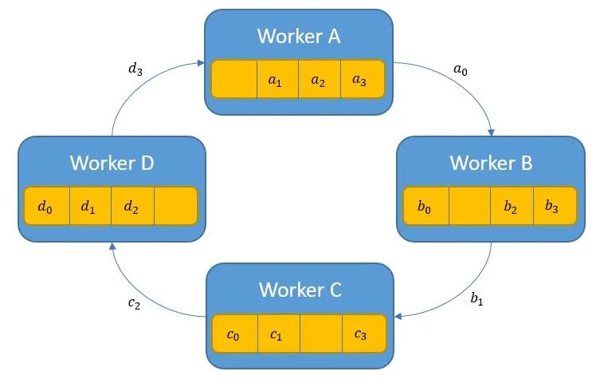

# Ring-all-reduce

In distributed deep learning, "scatter-gather gradients passing" refers to a
communication pattern that is highly optimized for performance and memory
efficiency. It is most prominently used in Fully Sharded Data Parallel (FSDP)
and ring-all-reduce algorithms. [1, 2, 3, 4, 5]  

Instead of using a simple  to aggregate gradients, which requires each device
to hold the complete set of all gradients, this two-phase approach partitions
the workload to reduce both communication volume and memory overhead. [2, 6, 7]  

# The two-phase process

1. Reduce-Scatter (The "scatter" phase) 

• Each of  devices
(e.g., GPUs) first calculates its own set of gradients. 

• It then logically divides its full gradient tensor into  chunks. 

• In a series of steps, each device sends one of its chunks to another device, while also receiving a chunk from another device. 

• Crucially, as a device receives chunks, it reduces (e.g., sums or averages) the incoming chunk with the corresponding local chunk. 

• After  communication steps, each device holds one complete, aggregated chunk of the total gradient. At this point, the total gradient is "sharded" across the devices. [4, 8, 9, 10, 11]  

2. All-Gather (The "gather" phase) 

• Once the reduce-scatter is complete, each device has its final, aggregated chunk. 

• In the second phase, every device needs to receive the aggregated chunks from all other devices. 

• Each device again sends and receives chunks in a round-robin fashion around the ring. 

• After  more communication steps, every device will have gathered all the necessary chunks to reconstruct the full, aggregated gradient tensor. [9, 12, 13, 14]  
# Key advantages 

• Optimal Communication Volume: The scatter-gather approach is
bandwidth-optimal, meaning it minimizes the amount of data that needs to be
moved between devices. For a total gradient of size , this approach requires
only  data movement, while a naive all-reduce might require more. 

• High Performance: By parallelizing the reduction and communication steps,
this pattern leverages the full bandwidth of the network interconnect, avoiding
bottlenecks. 

• Reduced Memory Usage: This method is critical for training large models with
techniques like FSDP. Since gradients are sharded across devices during the
reduction phase, a device only needs to store its portion of the aggregated
gradient, not the entire aggregated gradient. [4, 8, 15, 16, 17]  

Example: ring-all-reduce The ring-all-reduce algorithm, implemented in
high-performance libraries like NVIDIA's NCCL, uses the scatter-gather pattern
to efficiently pass gradients. By arranging devices in a virtual ring topology,
it ensures that each device only needs to communicate with its immediate
neighbors. [4, 6, 18, 19, 20]  

# Applications 

• Fully Sharded Data Parallelism (FSDP): In PyTorch's FSDP, the scatter-gather
pattern is used to pass sharded gradients, model parameters, and optimizer
states, allowing for training of models that are too large to fit on a single
GPU. 

• Ring-All-Reduce: As the foundation of this communication primitive,
scatter-gather is the primary mechanism for efficient gradient synchronization. 

• Horovod: This distributed training framework uses an  operation, which is
conceptually a scatter-gather operation, to distribute and collect data between
processes. [3, 17, 21, 22, 23]  

AI responses may include mistakes.

[1] https://ieeexplore.ieee.org/document/10177384/

[2] https://engineering.fb.com/2021/07/15/open-source/fsdp/attachment/fsdp-graph-2a/

[3] https://dev.to/lewis_won/from-scatter-to-all-reduce-a-plain-english-guide-to-collective-operations-1695

[4] https://massedcompute.com/faq-answers/?question=How+does+NCCL+handle+all-reduce+and+ring-allreduce+operations?

[5] https://dl.acm.org/doi/10.1145/3711818

[6] https://engineering.fb.com/2021/07/15/open-source/fsdp/attachment/fsdp-graph-2a/

[7] https://uvadlc-notebooks.readthedocs.io/en/latest/tutorial_notebooks/scaling/JAX/data_parallel_intro.html

[8] https://www.enterpriseintegrationpatterns.com/patterns/messaging/BroadcastAggregate.html

[9] https://andrew.gibiansky.com/blog/machine-learning/baidu-allreduce/

[10] https://medium.com/cloudvillains/data-parallelism-in-machine-learning-training-686ed9ab05fb

[11] https://medium.com/mitdistributedsys/distributed-training-overview-scaling-pytorch-across-multiple-gpus-b698bc22c81a

[12] https://docs.aws.amazon.com/prescriptive-guidance/latest/cloud-design-patterns/scatter-gather.html

[13] https://marek.ai/allreduce-the-basis-of-multi-device-communication-for-neural-network-training.html

[14] https://github.com/facebookresearch/fairring/blob/main/README.md

[15] https://www.gaurgaurav.com/patterns/scatter-gather/

[16] https://github.com/deepspeedai/DeepSpeed/discussions/6594

[17] https://arxiv.org/html/2311.00257v2

[18] http://proceedings.mlr.press/v108/neglia20a/neglia20a.pdf

[19] https://github.com/NVIDIA/nccl/issues/1670[

20] https://dl.acm.org/doi/10.1145/3711818

[21] https://docs.pytorch.org/docs/stable/fsdp.html

[22] https://horovod.readthedocs.io/en/stable/api.html

[23] https://horovod.readthedocs.io/en/latest/api.html

